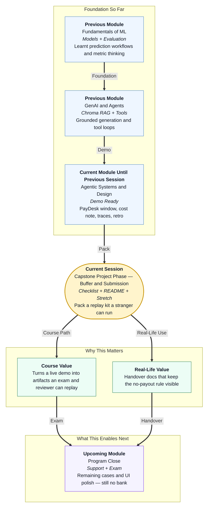

# Pre-read: Capstone Project Phase — Buffer & Submission

## Context of This Session in the Course

---

## The Demo Worked. Can Anyone Else Run It?

In the **previous** session you put **Nimbus PayDesk** behind a window, wrote a cost sticky, told a short story with traces, and captured a honest retro.

A good show still fails if a reviewer cannot replay it **without you hovering**. Keys in the zip, a missing seed step, an exam that only you know how to type — those are not polish problems. They are **handover** problems.

This session answers:

> **What must sit in the tray so a stranger can install, seed the register and the meaning shelf, sit the three papers, and see the same stop on a high-value bill — and when is one extra door allowed?**

That tray is **buffer and submission**. Then you swap laptops. Then you stop adding logos.

---

## What If the Zip Was Only the Pretty Window?

**What if you submitted a single screen file, no handbook, no Chroma seed, no exam paper, a live secret key, and a “pay vendor” helper “just for completeness”?**

The reviewer cannot seed the register. The meaning shelf stays empty, so even a clean bill fail-closes — or worse, a teammate comments the empty-shelf rule out so the demo “works.” The key leaks. The helper is a bank you promised not to build. The window is a poster.

You already practised **environment variables**, **eval gates**, and **README-shaped** operator notes on smaller hatches. Submission is those habits aimed at PayDesk: what it is, what it refuses, how to eval, where the diary lives, and that seed must fill **both** the ticket register and the **Chroma** shelf.

---

## Think of It Like a Passport File, Not a Shopping Bag

A useful picture is the **file they accept at the counter** — not a plastic bag of unmarked photocopies.

- **The form on top** — README: one-sentence job, **no NEFT** in the first lines, copyable setup, expected exam outcomes named.
- **The photo and old booklet** — graph, versioned clerk script, golden paper, sample diary lines with no PAN, handbook source plus the seed that indexes it into Chroma.
- **The visitor guide on the glass** — empty secret template committed; filled secrets never committed.
- **One optional stamp** — stretch only if the three papers already pass. Allowed extras use skills you already have: a **messy-prose extract** through the rented clerk brain, a **pause and human stamp** that resumes the graph, or a **cache on GST lookup**. Never a cache on “ready to pay.” Never a new web framework in the core path. Never two stretches that become a new product.
- **Monday’s new clerk** — cross-team review. The partner follows only the guide. You may speak after they finish the dead-GSTIN paper.

Support hours after this meeting are for remaining exam cards and a clearer screen. They are not for inventing UPI the night before the course exam.

The question you should defend in two sentences is not “which library.” It is **why the desk must not send money**, **why an empty Chroma shelf fails closed**, and **why the window and the paper share one brain**.

A stranger should need three moves after they open the folder: install, seed the two dummy vendors **and** the handbook shelf, sit the three papers. The window is the fourth move. If the three papers need a paid key, the lab path is not actually labelled — say so in the guide, or fix it.

If the high-value paper is still the wrong colour, choose **no stretch**. A fancy extract on a desk that waves ₹90,000 through is a worse handover than a boring terminal that stops.

---

## In this pre-read, you'll discover:

- **Why** a checklist of artifacts beats a mystery tour zip
- **How** a README becomes a visitor guide a partner can follow in silence
- **What** one allowed stretch looks like — and when you must choose **none**
- **How** a cross-team run is the real integration test

---

## After This Session, You Will Be Able To

- **Tick** code, prompts, golden set, sample traces, cost and retro notes
- **Write** setup, env, seed (sqlite **and** Chroma), and eval commands a stranger can paste
- **Add** at most one stretch, then re-sit the three papers
- **Survive** a partner review from the README only
- **Say** the course wrap in one breath: faster filing, no skipped GST or high-value stamp, traces, no bank

Upcoming support time extends PayDesk. It does not reopen the vault.

---

## Interesting Questions We'll Solve Together

Bring your curiosity to these live challenges:

1. **The Extra File** — A teammate adds a payout helper “only in the zip.” How do you refuse it in four sentences a CFO would accept?

2. **The Silent Partner** — They cannot sit the high-value paper from your guide, or Chroma comes back empty after seed. Is that their skill issue, or your handover issue?

3. **The Stretch Temptation** — G02 is still green for the wrong reason, but a messy-prose extract looks impressive. What do you ship, and what do you write in the retro?

Pack the tray like a seva file: job on top, exam inside, bank key left at home. Then stop. Extra logos after a clean handover usually hide a gate you were afraid to show.
