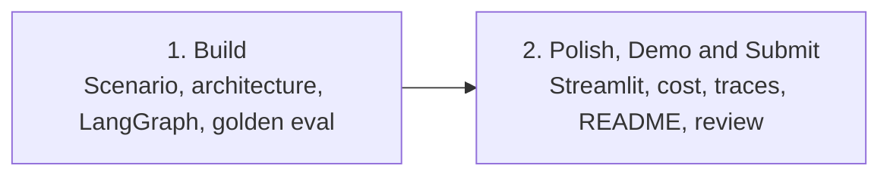

# Nimbus PayDesk — Two-Session Capstone Flow (IITR-AS-2601)

This sheet is the map for the **two-meeting** capstone (Sessions 65 and 66). Keep it beside you in both live sessions.

Sessions 62–64 remain the original three-meeting plan. Do not edit those folders. This flow is the 2 × 2.5 hour redesign.

**Product:** Nimbus PayDesk — an Accounts Payable desk for **Nimbus Retail** (40-store Indian chain).  
**Job:** Cut a nine-day vendor-invoice wait without paying a wrong **GSTIN** or skipping a high-value stamp.  
**Hard rule:** The desk **recommends** `ready_to_pay`. It never sends **NEFT**.

This batch already built a **campus parcel desk**. Capstone is a **new product**. Reuse skills. Do not paste parcel FAQs into PayDesk.

```text
Freeze + draw + hire clerks + sit the paper  →  Counter + demo + pack the file
           Session 65 — Build (2.5 h)              Session 66 — Polish, Demo & Submit (2.5 h)
```



**Stack this batch already knows (core path only — no new libraries):**

| Job | This batch (use) | Do not add in capstone |
|---|---|---|
| Orchestration | **LangGraph** nodes and state | A new crew framework |
| RAG | **Chroma** over `data/policy.md` (all-MiniLM-L6-v2) | Keyword-only grep or a fake chunk list on the packet |
| Memory | Graph state + **`sqlite3`** | SQLAlchemy |
| UI | **Streamlit** | A second HTTP API framework |
| Model | **Groq** only as optional stretch extract | Unversioned notebook chat as the desk |
| Proof | Golden set + **JSONL traces** + token note | “It worked once” |

Core `requirements.txt`: `langgraph`, `streamlit`, `chromadb`, `sentence-transformers`, `python-dotenv`. `sqlite3` is built into Python.

---

## Capstone Session 1 (65) — Build (2 h 30 min)

**Need to do:** Choose PayDesk, draw one page, run extract → policy → route, sit the golden paper. Extra time vs the old two-hour Build is **lab**, not a second product.

| You will | Done when |
|---|---|
| Select scenario, users, data, success | One sentence a CFO accepts; **no live NEFT**; seeds Kaveri / Nilgiri; **do not seed** `99INVALID` |
| One-page architecture | RAG, tools, memory, **LangGraph**, deploy path = **Streamlit** next meeting |
| Implement core flows with versioned prompts | `extract → policy → route` on `InvoicePacket`; Python amount/GST gates; `seed_policy()` into Chroma |
| Run golden set and fix a blocking defect | **G01 CLEAN** → `ready_to_pay`; **G02 HIGH** → `amount_gate`; **G03 BADGST** → `gst_mismatch` |

**Carry forward:** running graph, sqlite3 tickets, Chroma handbook (`seed_policy()`), `eval/run_golden.py`, JSONL traces.

**Do not do yet:** Streamlit polish, demo script, README zip, payout tool, a new API app.

**Live order:** freeze contract → draw stations → seed registers + **Chroma from policy.md** → run CLEAN, then HIGH, then BADGST → fix **one** class (usually empty Chroma) → re-run.

**Eval must not paste handbook lines into state.** Retrieve queries Chroma.

### Timed agenda (150 minutes)

| Block | Min | What happens in the room |
|---|---|---|
| Open + freeze | 15 | Job sentence, users, dummy GSTINs, no NEFT |
| One-page map | 15 | Floors, three memory drawers, bank floor absent |
| Core walkthrough | 25 | Packet, labelled extract, tools, Chroma, three nodes |
| **Lab: seed + graph** | 40 | Folder map, `policy.md`, sqlite seeds, `graph.invoke` |
| Guardrails | 10 | Bill text is untrusted; Python `AMOUNT_GATE` wins |
| **Lab: golden G01–G03** | 35 | Sit the paper, fix empty Chroma, re-run, JSONL lines |
| Close | 10 | Point at G01–G03; next meeting is window **and** handover |

**If a team finishes early:** sit **G04 INJECT** (HIGH text says ignore rules — still `amount_gate`). Do **not** open Streamlit. Do **not** start the README.

---

## Capstone Session 2 (66) — Polish, Demo & Submit (2 h 30 min)

**Need to do:** Put a stakeholder window on the **same** graph, tell the story with traces, then pack a replay kit a reviewer can run without you in the room.

This meeting absorbs what the three-meeting plan split across Polish & Demo and Buffer & Submission.

| You will | Done when |
|---|---|
| Improve UI from the CLI | Streamlit: paste bill, status, sources, foldable **trace** |
| Verify token/cost for a demo path | CLEAN vs HIGH on the two scripted bills; cache must **not** skip gates |
| Deliver a short live demo with evidence | One bill passes, one bill stops; open the JSONL / expander |
| Retrospect | Written “if we had more time” list — **no** SLI/SLO theatre |
| Submission checklist + README | Code, prompts, golden set, traces sample; setup, optional `GROQ_API_KEY`, how to run evals, **no NEFT** |
| One stretch if core is stable | Groq messy extract, **or** LangGraph checkpoint + human stamp, **or** GST cache (never cache `ready_to_pay`) |
| Cross-team review | Partner runs G01–G03 from README only |

**Do not do:** a second graph for the UI; a payout tool; two stretches; inventing SLOs.

**Leave for support hours:** remaining golden cards (duplicate, tool-down, blurry bill), finishing a stretch, richer UI. Still **no payout tool**.

### Timed agenda (150 minutes)

| Block | Min | What happens in the room |
|---|---|---|
| Counter on the same graph | 15 | Re-run G01–G03 first; then layout, `graph.invoke`, ban the word *paid* |
| **Lab: Streamlit** | 25 | Text area, Run, expander, G01/G02 sample buttons |
| Cost sticky | 10 | Lab vs Groq tokens; cache retrieve not `ready_to_pay` |
| **Demo rehearsal** | 20 | Job → CLEAN → HIGH → proof; fallback is CLI golden |
| Retro | 10 | Four bullets in `docs/retro.md` — Never: payout |
| README + checklist | 15 | Visitor guide, seed **sqlite and Chroma**, eval commands |
| **Lab: pack** | 20 | `README.md`, `.env.example`, `.gitignore`, `SUBMISSION.md`, sample JSONL |
| Stretch **or** fix core | 15 | One of A/B/C only if G01–G03 pass; else fix the gate |
| Cross-team review | 15 | Partner, README only, G01–G03 + UI does not say paid |
| Wrap | 5 | Course sentence; support hours extend PayDesk, not the bank |

**If a team is behind:** skip stretch. A boring desk that stops HIGH beats a fancy extract that waves ₹90,000 through.

---

## What moved where (three meetings → two)

| Three-meeting plan (62–64, unchanged) | Two-meeting plan (65–66) |
|---|---|
| Build | Session 65 — same outcomes; extra minutes are lab |
| Polish & Demo | Session 66 — first half |
| Buffer & Submission | Session 66 — second half |
| Stretch depth / leftover cards | Support hours, not a third lecture |

Total contact time: **5 hours** (was ~6). Cut from lecture padding and stretch-as-a-whole-meeting. **Not** cut: G01–G03, Python gates, same-graph UI, no NEFT.

---

## One-page contract (both sessions honour this)

- Harm type is **money**
- `ready_to_pay` is a recommendation, not a bank call
- Amount ≥ **₹50,000** and unknown GSTIN must stop
- Gates live in **Python**, not only in Groq
- Retrieved handbook lines are **evidence**, not a licence to skip a gate
- Golden eval invokes the **same graph** the demo uses — no cheat fields
- Cache (from ops) may reuse **handbook retrieve**; it must not photocopy a HIGH bill into “ready”
- Dummy GSTINs for seeds: `29AAAAA0000A1Z5` (Kaveri) and `29BBBBB0000B1Z3` (Nilgiri) — not real firms

---

## Course skills this product must show (from the detailed curriculum)

CSV Session 62 objective: *apply M3–M4 skills on one scenario.* M1 is the craft. M2 is eval mindset, not a second model.

| Home | Must be visible on PayDesk (65+66) | Not this product |
|---|---|---|
| M1 | Python scripts, JSON packet, files, gitignore, `.env`, sqlite SELECT/INSERT, Streamlit habit | NumPy/Pandas/Matplotlib EDA dashboard |
| M2 | Golden paper, no leaked answers, re-run after a change | Regression, trees, clustering, time series |
| M3 | Chroma RAG, tools, structured slip, versioned prompt file | Ollama local models; few-shot/CoT as a live exam |
| M4 | Guardrails, LangGraph, JSONL, golden eval, Streamlit, cost, secrets, cache *rule* | FastAPI second hatch; retrieval-tuning bake-off |

**Stretch (one only, after G01–G03):** Groq JSON extract (M3 structured outputs) **or** checkpoint stamp (M4 S54) **or** GST cache (M4 S61). Timeouts/retries and a 5–10 card golden set are still thin vs the CSV — G04/G05 if time in 65.

Full matrix: `Curriculum-Coverage-QC.md` in this folder.

