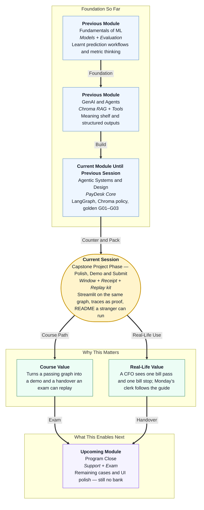

# Pre-read: Capstone Project Phase — Polish, Demo & Submit

## Context of This Session in the Course

---

## A Passing Graph Is Still a Back Office — And a Demo Is Not a Handover

In the **previous** session you froze **Nimbus PayDesk** and ran the stations: extract, policy, route. A clean Kaveri bill reached **ready to pay**. A high-value bill and a dead GSTIN stopped with **named** reasons. Policy asked **Chroma** for handbook lines. A diary of JSON lines proved the runs existed.

Faculty, a finance partner, or a tired reviewer will not grep that diary to “feel” the product. They want a **counter**: paste a bill, read a status, optionally open the file jacket. They also want a **file** they can replay **without you hovering**.

Walk in ready to **re-sit the three papers** before you draw widgets. If the high-value bill is the wrong colour, you are still in the build.

This session answers both:

> **Can we put a calm window on the same brain the exam already uses, tell a short honest story with traces, and pack a tray so a stranger can install, seed, and sit the three papers — without pretending we measured uptime we never measured?**

That is **polish, demo, and submit** in one meeting. Pretty is not the goal. **Sameness** is the goal: the button, the exam paper, the diary, and the README must agree.

---

## What If the Green Banner Meant Paid — And the Zip Was Only the Window?

**What if the window said “Paid successfully” because green feels complete, while the graph only recommended, and the high-value sample was quietly edited down so the demo would never look negative?**

You would train stakeholders to trust a lie. The chartered accountant would think money moved. The next intern would add a real payout to “finish the banner.”

A second lie is quieter. **What if you submitted a single screen file, no handbook, no Chroma seed, no exam paper, and a live secret key?** The reviewer cannot seed the register. The meaning shelf stays empty. The key leaks. The window is a poster.

You already built a **Streamlit** front for the campus parcel desk. You already wrote **token receipts**, **cache** rules, and **README-shaped** operator notes. PayDesk reuses those habits. Cache must never photocopy a high-value bill into “ready.” Seed must fill **both** the ticket register and the **Chroma** shelf.

---

## Think of It Like a Courier Counter, Then a Passport File

A useful picture has two layers.

**The glass (the demo):**

- One form, one button, one status a non-engineer can read
- A foldable tracking strip: extract, policy, route
- Two files you rehearse — one clean delivery, one that must stop at the hub
- A receipt for this visit in tokens, with the date of the rate you used — not a fake “99.9% happy customers” poster

**The file they accept (the handover):**

- README on top: one-sentence job, **no NEFT** in the first lines, copyable setup, expected exam outcomes named
- Graph, versioned clerk script, golden paper, sample diary lines with no PAN
- Empty secret template committed; filled secrets never committed
- One optional stamp — stretch only if the three papers already pass
- Monday’s new clerk — cross-team review. The partner follows only the guide

The hard rule stays on the glass: this counter **recommends**. The cashier still signs **NEFT** down the road.

If the browser dies, the exam paper in the terminal is still a valid fallback. If the high-value paper is still the wrong colour, choose **no stretch**. A fancy extract on a desk that waves ₹90,000 through is a worse handover than a boring terminal that stops.

---

## In this pre-read, you'll discover:

- **Why** a stakeholder window must call the **same** graph as the golden paper
- **How** a foldable **trace**, a **cost sticky**, and a **README** turn a click into evidence a stranger can replay
- **What** words must never appear on a success banner
- **When** one allowed stretch is permitted — and when you must choose **none**

---

## After This Session, You Will Be Able To

- **Paste** a bill in Streamlit and show ready vs needs-human without saying paid
- **Open** proof: stations, Chroma handbook lines, diary line
- **Write** demo-path cost assumptions and a four-bullet retro with **never: payout**
- **Run** a short live story: one bill through, one bill stopped
- **Tick** code, prompts, golden set, sample traces
- **Write** setup, env, seed (sqlite **and** Chroma), and eval commands a stranger can paste
- **Survive** a partner review from the README only

Upcoming support time extends PayDesk. It does not reopen the vault.

---

## Interesting Questions We'll Solve Together

Bring your curiosity to these live challenges:

1. **Two Brains** — The window says stop. The exam script says ready. Which product will you demo, and what is the one-line fix?

2. **The Silent Partner** — They cannot sit the high-value paper from your guide, or Chroma comes back empty after seed. Is that their skill issue, or your handover issue?

3. **The Stretch Temptation** — G02 is still green for the wrong reason, but a messy-prose extract looks impressive. What do you ship, and what do you write in the retro?

Walk in with the clean slip and the high-value slip in your head. We will put both on the glass, pack the file, and keep the cheque book in finance.
