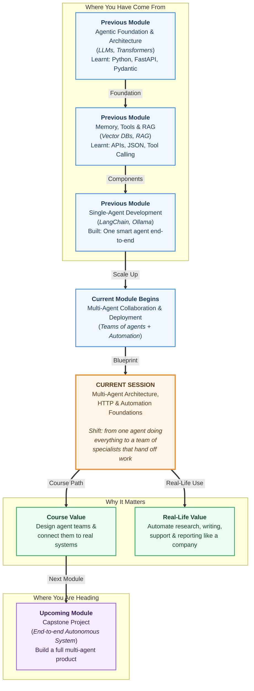

# Pre-read: Multi-Agent Architecture, HTTP & Automation Foundations

## Context of This Session in the Course

---

## When One Brilliant Person Is Not Enough

Imagine you are opening a small restaurant. On day one, you do everything yourself, take the order, cook the food, serve it, collect the bill, and clean the table. It works when two customers walk in. But the moment **fifty** people arrive on a Saturday night, you collapse. The food gets cold, orders get mixed up, and customers leave angry.

So what do successful restaurants actually do? They build a **team**. One person takes orders, a chef cooks, a waiter serves, and a cashier handles money. Nobody is doing everything, but together they handle a crowd smoothly. Each person is a **specialist**, and the magic is in how their work flows from one to the next.

This is exactly the journey we are taking with AI agents. Until now, you have built one capable agent that handles a task on its own. That is powerful, but just like the one-person restaurant, a single agent struggles when the job becomes big, layered, and demanding.

## The Problem: A Big Job Is Too Much for One Agent

Picture this challenge: *"Write a well-researched, fact-checked, polished article on electric cars in India, ready to publish."*

If you hand this entire job to one agent, things get messy. It tries to research, write, and proofread all at once, and the quality drops. It may forget facts while polishing the language, or write beautifully but get the numbers wrong. One mind juggling too many different skills rarely does any of them well.

The real question is: **What if we could split this big job into smaller jobs and give each one to an expert agent?** That single idea changes everything, and it is the heart of this session.

## The Solution: A Team of Agents That Work Together

The hero of this session is the **multi-agent system**, a setup where several agents, each with a clear role, collaborate to finish a complex goal. Instead of one overworked agent, you design a small, focused team.

A classic example is the **researcher–writer–editor pipeline**:

- The **researcher** agent gathers facts and trustworthy information.
- The **writer** agent turns those facts into a clear, engaging draft.
- The **editor** agent polishes the language, fixes mistakes, and finalises it.

The output of one agent becomes the input of the next, just like an order moving from the waiter to the chef. This is called a **sequential workflow**, work that flows step by step in a fixed order. Sometimes agents instead work side by side, sharing and discussing, which is a **collaborative workflow**. You will learn when to choose each style.

There is also a second hero in this session: the **wiring** that lets these agents talk to the outside world and to each other.

## The Simple Analogy: Think of a Postal System

To understand how agents and automation tools communicate, think of a **postal system**.

When you want to send something, you follow simple, agreed-upon rules, write the address, put a stamp, and drop it in a box. The postal network understands these rules and delivers your letter anywhere. Everyone uses the **same set of rules**, so the system just works.

On the internet, these agreed-upon rules are called **HTTP**, which is simply the language software uses to *request* information and *send* information to one another. Just as a postcard, a parcel, and a registered letter serve different purposes, HTTP has different **methods**, polite, standard ways to say "give me this," "save this new thing," "update this," or "remove this."

Now imagine a doorbell. You do not stand outside someone's house knocking every minute to check if they are home; instead, when a visitor arrives, the bell *rings on its own* and alerts the owner. In automation, this "ring when something happens" idea is called a **trigger**, and the automatic message it sends is called a **webhook**. Triggers and webhooks are how one action (a new email, a form submission, a payment) can automatically *start* an agent's work without anyone pressing a button.

## In This Pre-read, You'll Discover

- **Understand** why a team of specialist agents often beats one all-rounder agent.
- **Discover** how a big, messy goal is broken into clean sub-tasks with clear ownership.
- **Learn** the simple idea behind HTTP, the shared "language" that lets software talk.
- **Understand** how triggers and webhooks let automation start and chain itself, hands-free.

## Bringing It All Together

So here is the full picture forming in your mind. A **multi-agent system** is a team of focused agents. **Task decomposition** is how we split a big goal among them. **Roles** define who does what, and **workflows** (sequential or collaborative) define how the work flows between them. Finally, **HTTP, triggers, and webhooks** are the plumbing that connects these agents to real systems and to each other so the whole thing runs like a well-staffed organisation rather than a single exhausted worker.

This is the mental shift from *"I built an agent"* to *"I designed a system of agents."* It is the same shift that turns a one-person stall into a real business.

## Curiosity Gap: Questions We'll Crack in the Live Session

Come to the session ready to explore these together:

1. If you had to build an AI team to **plan a full vacation**, booking flights, hotels, and activities, how many agents would you create, and who would do what? You will learn a clear method to decide this every time.
2. A researcher agent finishes its work. **How exactly does its output reach the writer agent** without a human copy-pasting it in between? The handoff is more elegant than you'd expect.
3. Imagine an agent that automatically writes a summary **the instant a new report lands in your inbox**, no clicking, no waiting. What invisible "ring the doorbell" mechanism makes this possible?

## What You'll Be Able to Talk About After This Session

- Explain, in plain words, the difference between a single-agent and a multi-agent system, and when each one makes sense.
- Break a complicated real-world goal into smaller tasks and assign the right role to each.
- Describe how sequential and collaborative agent teams differ, using the researcher–writer–editor example.
- Confidently explain how HTTP, triggers, and webhooks let agents and automation tools connect, start, and chain their work.

Come curious. By the end, you will stop thinking like a solo builder and start thinking like the **architect of an intelligent team**.
