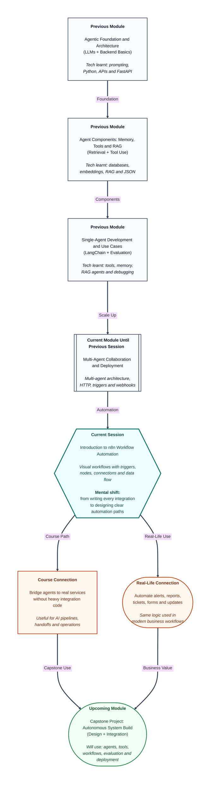

```mermaid
%%{init: {"diagramPadding": 24, "flowchart": {"htmlLabels": true, "nodeSpacing": 90, "rankSpacing": 110, "curve": "basis", "padding": 20}, "theme": "base", "themeVariables": {"fontFamily": "Arial", "fontSize": "15px", "lineColor": "#334155"}}}%%
flowchart TB
    subgraph FOUNDATION[" "]
        direction LR
        M1["&nbsp;&nbsp;<b>Previous Module</b>&nbsp;&nbsp;<br/><br/>Agentic Foundation and Architecture<br/>(LLMs + Backend Basics)<br/><br/><i>Tech learnt: prompting,<br/>Python, APIs and FastAPI</i>"]
        M2["&nbsp;&nbsp;<b>Previous Module</b>&nbsp;&nbsp;<br/><br/>Agent Components: Memory, Tools and RAG<br/>(Retrieval + Tool Use)<br/><br/><i>Tech learnt: databases,<br/>embeddings, RAG and JSON</i>"]
        M3["&nbsp;&nbsp;<b>Previous Module</b>&nbsp;&nbsp;<br/><br/>Single-Agent Development and Use Cases<br/>(LangChain + Evaluation)<br/><br/><i>Tech learnt: tools, memory,<br/>RAG agents and debugging</i>"]
    end

    CM[["&nbsp;&nbsp;<b>Current Module Until Previous Session</b>&nbsp;&nbsp;<br/><br/>Multi-Agent Collaboration and Deployment<br/><br/><i>Multi-agent architecture,<br/>HTTP, triggers and webhooks</i>"]]

    CURRENT{{"&nbsp;&nbsp;<b>Current Session</b>&nbsp;&nbsp;<br/><br/>Introduction to n8n Workflow Automation<br/><br/><i>Visual workflows with triggers,<br/>nodes, connections and data flow</i><br/><br/><b>Mental shift:</b><br/>from writing every integration<br/>to designing clear automation paths"}}

    subgraph VALUE[" "]
        direction LR
        COURSE["&nbsp;&nbsp;<b>Course Connection</b>&nbsp;&nbsp;<br/><br/>Bridge agents to real services<br/>without heavy integration code<br/><br/><i>Useful for AI pipelines,<br/>handoffs and operations</i>"]
        REAL(["&nbsp;&nbsp;<b>Real-Life Connection</b>&nbsp;&nbsp;<br/><br/>Automate alerts, reports,<br/>tickets, forms and updates<br/><br/><i>Same logic used in<br/>modern business workflows</i>"])
    end

    subgraph FUTURE[" "]
        direction LR
        M5(["&nbsp;&nbsp;<b>Upcoming Module</b>&nbsp;&nbsp;<br/><br/>Capstone Project: Autonomous System Build<br/>(Design + Integration)<br/><br/><i>Will use: agents, tools,<br/>workflows, evaluation and deployment</i>"])
    end

    M1 ==>|&nbsp;Foundation&nbsp;| M2
    M2 ==>|&nbsp;Components&nbsp;| M3
    M3 ==>|&nbsp;Scale&nbsp;Up&nbsp;| CM
    CM ==>|&nbsp;Automation&nbsp;| CURRENT
    CURRENT ==>|&nbsp;Course&nbsp;Path&nbsp;| COURSE
    CURRENT ==>|&nbsp;Real-Life&nbsp;Use&nbsp;| REAL
    COURSE ==>|&nbsp;Capstone&nbsp;Use&nbsp;| M5
    REAL ==>|&nbsp;Business&nbsp;Value&nbsp;| M5

    classDef previous fill:#f8fafc,stroke:#475569,stroke-width:2px,color:#0f172a
    classDef current fill:#ecfeff,stroke:#0f766e,stroke-width:3px,color:#134e4a
    classDef value fill:#fff7ed,stroke:#c2410c,stroke-width:2px,color:#7c2d12
    classDef future fill:#f0fdf4,stroke:#15803d,stroke-width:2px,color:#14532d

    class M1,M2,M3,CM previous
    class CURRENT current
    class COURSE,REAL value
    class M5 future

    style FOUNDATION fill:transparent,stroke:transparent
    style VALUE fill:transparent,stroke:transparent
    style FUTURE fill:transparent,stroke:transparent
    linkStyle default stroke:#334155,stroke-width:3px
```
