# Pre-read: Introduction to n8n Workflow Automation

## Context of This Session in the Course

```mermaid
%%{init: {"diagramPadding": 24, "flowchart": {"htmlLabels": true, "nodeSpacing": 90, "rankSpacing": 110, "curve": "basis", "padding": 20}, "theme": "base", "themeVariables": {"fontFamily": "Arial", "fontSize": "15px", "lineColor": "#334155"}}}%%
flowchart TB
    subgraph FOUNDATION[" "]
        direction LR
        M1["&nbsp;&nbsp;<b>Previous Module</b>&nbsp;&nbsp;<br/><br/>Agentic Foundation and Architecture<br/>(LLMs + Backend Basics)<br/><br/><i>Tech learnt: prompting,<br/>Python, APIs and FastAPI</i>"]
        M2["&nbsp;&nbsp;<b>Previous Module</b>&nbsp;&nbsp;<br/><br/>Agent Components: Memory, Tools and RAG<br/>(Retrieval + Tool Use)<br/><br/><i>Tech learnt: databases,<br/>embeddings, RAG and JSON</i>"]
        M3["&nbsp;&nbsp;<b>Previous Module</b>&nbsp;&nbsp;<br/><br/>Single-Agent Development and Use Cases<br/>(LangChain + Evaluation)<br/><br/><i>Tech learnt: tools, memory,<br/>RAG agents and debugging</i>"]
    end

    CM[["&nbsp;&nbsp;<b>Current Module Until Previous Session</b>&nbsp;&nbsp;<br/><br/>Multi-Agent Collaboration and Deployment<br/><br/><i>Multi-agent architecture,<br/>HTTP, triggers and webhooks</i>"]]

    CURRENT{{"&nbsp;&nbsp;<b>Current Session</b>&nbsp;&nbsp;<br/><br/>Introduction to n8n Workflow Automation<br/><br/><i>Visual workflows with triggers,<br/>nodes, connections and data flow</i><br/><br/><b>Mental shift:</b><br/>from writing every integration<br/>to designing clear automation paths"}}

    subgraph VALUE[" "]
        direction LR
        COURSE["&nbsp;&nbsp;<b>Course Connection</b>&nbsp;&nbsp;<br/><br/>Bridge agents to real services<br/>without heavy integration code<br/><br/><i>Useful for AI pipelines,<br/>handoffs and operations</i>"]
        REAL(["&nbsp;&nbsp;<b>Real-Life Connection</b>&nbsp;&nbsp;<br/><br/>Automate alerts, reports,<br/>tickets, forms and updates<br/><br/><i>Same logic used in<br/>modern business workflows</i>"])
    end

    subgraph FUTURE[" "]
        direction LR
        M5(["&nbsp;&nbsp;<b>Upcoming Module</b>&nbsp;&nbsp;<br/><br/>Capstone Project: Autonomous System Build<br/>(Design + Integration)<br/><br/><i>Will use: agents, tools,<br/>workflows, evaluation and deployment</i>"])
    end

    M1 ==>|&nbsp;Foundation&nbsp;| M2
    M2 ==>|&nbsp;Components&nbsp;| M3
    M3 ==>|&nbsp;Scale&nbsp;Up&nbsp;| CM
    CM ==>|&nbsp;Automation&nbsp;| CURRENT
    CURRENT ==>|&nbsp;Course&nbsp;Path&nbsp;| COURSE
    CURRENT ==>|&nbsp;Real-Life&nbsp;Use&nbsp;| REAL
    COURSE ==>|&nbsp;Capstone&nbsp;Use&nbsp;| M5
    REAL ==>|&nbsp;Business&nbsp;Value&nbsp;| M5

    classDef previous fill:#f8fafc,stroke:#475569,stroke-width:2px,color:#0f172a
    classDef current fill:#ecfeff,stroke:#0f766e,stroke-width:3px,color:#134e4a
    classDef value fill:#fff7ed,stroke:#c2410c,stroke-width:2px,color:#7c2d12
    classDef future fill:#f0fdf4,stroke:#15803d,stroke-width:2px,color:#14532d

    class M1,M2,M3,CM previous
    class CURRENT current
    class COURSE,REAL value
    class M5 future

    style FOUNDATION fill:transparent,stroke:transparent
    style VALUE fill:transparent,stroke:transparent
    style FUTURE fill:transparent,stroke:transparent
    linkStyle default stroke:#334155,stroke-width:3px
```

---

## When Small Repeated Tasks Start Eating the Whole Day

Imagine a college placement team handling student applications. A student fills a form. Someone has to check the details, copy the information into a spreadsheet, send a confirmation email, notify the trainer, and maybe create a follow-up task. If ten students apply, this is manageable. If hundreds apply, the same simple process becomes a headache.

Nobody wants to spend the whole day copying data from one place to another. Still, many real companies do exactly this across emails, forms, spreadsheets, CRMs, Slack messages, support tickets, payment tools, and dashboards. The work is not difficult, but it is repetitive, error-prone, and boring.

Now think about the bigger question: **What if every routine step could start automatically at the right time, pass the correct data to the next step, and show us exactly what happened at each stage?**

That question is the reason workflow automation matters.

## The Challenge: Many Tools, One Business Process

Most modern work does not happen inside one single app. A customer may submit a form on a website, payment details may sit in another system, a support team may work in a ticketing tool, and managers may track updates in a spreadsheet. Each tool has useful information, but the process becomes slow when humans have to manually move that information around.

For example, suppose a company wants this simple flow:

- When a new lead comes from a form, save it in a sheet.
- Send a welcome email.
- Notify the sales team.
- If the lead is from a high-value company, create an urgent follow-up task.

This sounds simple when we say it in English. But manually doing it every time is tiring. Writing custom code for every small business flow can also become heavy, especially when the goal is to connect existing tools quickly.

This is where **n8n** enters the picture. n8n is a **visual automation platform**, which means you can design workflows by connecting blocks on a canvas instead of writing every integration from scratch. It helps you say, "When this happens, do these steps, pass this data, and show me the result."

## Think of It Like a Train Route

A simple way to understand n8n is to imagine a train route.

The **trigger** is the station where the journey starts. Maybe a form was submitted, a schedule reached a certain time, or an app sent a webhook. A webhook is simply a way for one system to inform another system that something happened.

The **nodes** are the stations on the route. One node may read data, another may clean it, another may send it to an app, and another may decide what should happen next. A node is one action or step in the workflow.

The **connections** are the tracks between stations. They decide how information moves from one node to the next. If the track is wrong, the data goes to the wrong place. If the connection is clear, the workflow becomes easy to follow.

The **data flow** is the luggage travelling through the train route. The information collected at the start moves through each node, gets changed or used, and finally reaches the destination.

This mental model is powerful because it makes automation visible. Instead of wondering what your system is doing in the background, you can inspect each step and see the input and output clearly.

## Why n8n Is Important for Agentic Systems

In the previous part of the course, you saw how agents can reason, use tools, remember context, retrieve documents, and complete tasks. But real agent systems do not live alone in a notebook or demo script. They must interact with the outside world.

An agent may need to read a new support ticket, fetch customer details, call an LLM, summarize a document, update a database, and send a message to a team. Each of these is a step in a larger workflow. n8n gives us a practical way to arrange these steps, connect services, and observe the movement of data.

For beginners, this is especially useful because it lowers the fear of integration. You do not need to memorise every API detail on day one. You first learn the shape of the process: what starts it, what steps happen, what data moves, where credentials are needed, and how to confirm that the workflow worked.

**Credentials** are another important idea. A credential is the secure access key that lets n8n talk to another service, such as an email provider, database, or third-party app. In real companies, credentials must be handled carefully because they protect private systems and customer data.

## In this pre-read, you'll discover:

- **Understand** how n8n works as a visual platform for connecting apps and services.
- **Discover** how triggers start workflows automatically when an event happens.
- **Learn** how nodes, connections, and data flow come together to form a complete automation.
- **Understand** why credentials and inspection are important for secure, reliable workflows.

## What You Will Be Able to Talk About After This Session

After this session, you should feel comfortable looking at a basic n8n canvas and explaining the journey of data from start to finish. You will be able to describe which part starts the workflow, which node performs which action, and how one output becomes the next input.

You will also start thinking like an automation designer. Instead of seeing a task as one big confusing job, you will break it into smaller steps: start condition, action, transformation, decision, and final result. This is the same thinking used in business automation, AI workflow design, and later capstone-style systems.

Most importantly, you will see that automation is not only about speed. It is also about **clarity**, **repeatability**, and **trust**. A good workflow should not feel like magic. It should be inspectable, so you can understand what happened, fix mistakes, and improve the process.

## Interesting Questions for the Live Session

- If a form submission starts a workflow, how does n8n know what data came from the form and where to send it next?
- What happens when one node produces an output that the next node does not understand?
- How can we connect a third-party service safely without exposing passwords or secret keys?
- When a workflow fails, how can we inspect the input and output at each step to find the exact problem?

By the end, n8n should feel less like a new tool and more like a visual language for work. You will be able to look at a business process and ask, **"What is the trigger, what are the steps, what data is moving, and how do we know it worked?"**
