# Pre-read: n8n LLM Integration and AI Workflow Nodes

## Context of This Session in the Course

```mermaid
%%{init: {"diagramPadding": 24, "flowchart": {"htmlLabels": true, "nodeSpacing": 90, "rankSpacing": 110, "curve": "basis", "padding": 20}, "theme": "base", "themeVariables": {"fontFamily": "Arial", "fontSize": "15px", "lineColor": "#334155"}}}%%
flowchart TB
    subgraph FOUNDATION[" "]
        direction LR
        M1["&nbsp;&nbsp;<b>Previous Module</b>&nbsp;&nbsp;<br/><br/>Agentic Foundation and Architecture<br/>(LLMs + Backend Basics)<br/><br/><i>Tech learnt: prompting,<br/>Python, APIs and FastAPI</i>"]
        M2["&nbsp;&nbsp;<b>Previous Module</b>&nbsp;&nbsp;<br/><br/>Agent Components: Memory, Tools and RAG<br/>(Retrieval + Tool Use)<br/><br/><i>Tech learnt: databases,<br/>embeddings, RAG and JSON</i>"]
        M3["&nbsp;&nbsp;<b>Previous Module</b>&nbsp;&nbsp;<br/><br/>Single-Agent Development and Use Cases<br/>(LangChain + Evaluation)<br/><br/><i>Tech learnt: tools, memory,<br/>RAG agents and debugging</i>"]
    end

    CM[["&nbsp;&nbsp;<b>Current Module Until Previous Session</b>&nbsp;&nbsp;<br/><br/>Multi-Agent Collaboration and Deployment<br/><br/><i>Multi-agent architecture, HTTP,<br/>triggers, webhooks and n8n basics</i>"]]

    CURRENT{{"&nbsp;&nbsp;<b>Current Session</b>&nbsp;&nbsp;<br/><br/>n8n LLM Integration and AI Workflow Nodes<br/><br/><i>LLM nodes, prompt setup,<br/>chaining AI steps and error branches</i><br/><br/><b>Mental shift:</b><br/>from moving data between apps<br/>to adding AI reasoning inside workflows"}}

    subgraph VALUE[" "]
        direction LR
        COURSE["&nbsp;&nbsp;<b>Course Connection</b>&nbsp;&nbsp;<br/><br/>Connect LLM intelligence to<br/>real automation pipelines<br/><br/><i>Bridges agent skills with<br/>no-code workflow design</i>"]
        REAL(["&nbsp;&nbsp;<b>Real-Life Connection</b>&nbsp;&nbsp;<br/><br/>Auto-summarize tickets, classify<br/>messages, route requests and<br/>validate AI output before delivery<br/><br/><i>Used in support, HR,<br/>sales and operations teams</i>"])
    end

    subgraph FUTURE[" "]
        direction LR
        M5(["&nbsp;&nbsp;<b>Upcoming Module</b>&nbsp;&nbsp;<br/><br/>Capstone Project: Autonomous System Build<br/>(Design + Integration)<br/><br/><i>Will use: agents, tools,<br/>workflows, evaluation and deployment</i>"])
    end

    M1 ==>|&nbsp;Foundation&nbsp;| M2
    M2 ==>|&nbsp;Components&nbsp;| M3
    M3 ==>|&nbsp;Scale&nbsp;Up&nbsp;| CM
    CM ==>|&nbsp;Add&nbsp;AI&nbsp;Steps&nbsp;| CURRENT
    CURRENT ==>|&nbsp;Course&nbsp;Path&nbsp;| COURSE
    CURRENT ==>|&nbsp;Real-Life&nbsp;Use&nbsp;| REAL
    COURSE ==>|&nbsp;Capstone&nbsp;Use&nbsp;| M5
    REAL ==>|&nbsp;Business&nbsp;Value&nbsp;| M5

    classDef previous fill:#f8fafc,stroke:#475569,stroke-width:2px,color:#0f172a
    classDef current fill:#ecfeff,stroke:#0f766e,stroke-width:3px,color:#134e4a
    classDef value fill:#fff7ed,stroke:#c2410c,stroke-width:2px,color:#7c2d12
    classDef future fill:#f0fdf4,stroke:#15803d,stroke-width:2px,color:#14532d

    class M1,M2,M3,CM previous
    class CURRENT current
    class COURSE,REAL value
    class M5 future

    style FOUNDATION fill:transparent,stroke:transparent
    style VALUE fill:transparent,stroke:transparent
    style FUTURE fill:transparent,stroke:transparent
    linkStyle default stroke:#334155,stroke-width:3px
```

---

## When Automation Needs a Brain, Not Just a Conveyor Belt

Picture a busy customer support desk at an e-commerce company. Every hour, dozens of messages arrive — some are simple order-status queries, some are angry refund complaints, and some are long, confusing paragraphs where the customer has mixed three different problems into one message.

A junior executive cannot read, understand, classify, and respond to every message within minutes. Even if the team tries, mistakes happen. A refund request may get treated like a delivery delay. A polite customer may receive a generic reply that does not match their actual issue. The manager wants speed, but also accuracy and consistency.

Now imagine the same desk with a smart system behind it. When a new message arrives, the system reads it, understands the intent, creates a short summary for the human team, assigns a priority label, and only then passes the cleaned information to the next step — maybe updating a spreadsheet, notifying the right team on Slack, or drafting a first response for review.

This is the kind of work modern businesses want from **AI-assisted automation**. Not just moving data from Form A to Sheet B, but adding a step where the machine **understands** content before the rest of the workflow acts on it.

## The Challenge: Smart Steps Inside a Reliable Pipeline

In the previous part of this module, you learned how **n8n** helps connect apps and services through visual workflows. You saw how a **trigger** starts a process, how **nodes** perform actions, and how data flows from one step to the next like luggage moving through a train route.

That foundation is powerful for routine automation. But many real business problems are not fully routine. They involve language, judgment, and context.

For example, suppose a company wants this flow:

- When a new support ticket arrives, read the full message.
- Decide whether it is about billing, delivery, or product quality.
- Write a one-line summary for the support lead.
- If the tone looks urgent or angry, mark it as high priority.
- Send the summary and label to the right team channel.
- Only then update the ticket system and notify the assigned agent.

You could ask a human to do all of this every time. You could also try to write fixed rules like "if message contains the word refund, mark as billing." But real customer language is messy. People do not always use the exact words you expect. That is why businesses want to place an **LLM** — a **Large Language Model**, which is an AI system trained to read and generate human language — inside the workflow at the right point.

The challenge is not only asking the AI a good question. The challenge is making the AI step work **inside** a dependable automation pipeline. What if the AI returns empty output? What if it gives the wrong category? What if the API call fails? What if the next node expects data in a specific format, but the AI response is messy?

This is exactly where **n8n LLM integration** becomes important. Instead of treating AI as a separate chat window on the side, we bring it directly into the workflow as a step that other steps can trust, inspect, and react to.

## From Data Movement to Intelligent Handoffs

An **LLM node** in n8n is a workflow step that sends carefully written instructions — called a **prompt** — to an AI provider and receives a response that can be used by later nodes. A **prompt** is simply the message you give the AI telling it what role to play, what information to use, and what kind of answer you want back.

But connecting an AI provider is only the first part. The real skill is designing the full chain:

1. **Collect structured input** from an earlier node, such as a form field, email body, or ticket description.
2. **Configure the prompt** so the AI knows exactly what to extract, summarize, classify, or rewrite.
3. **Pass the AI output forward** so the next automation step can update a database, send a notification, or create a task.
4. **Check the quality** of the AI response before sending anything to a customer or manager.
5. **Handle failure gracefully** with retry paths or fallback branches when the AI step does not work as expected.

This turns n8n from a simple connector into an **AI workflow engine**. You are no longer only saying, "When this happens, copy this data there." You are saying, "When this happens, let AI understand the content, then let automation act on that understanding."

Sometimes you will also use an **HTTP Request node**, which is a workflow step that talks directly to an external service through a web address. This gives flexibility when you need to connect to an AI provider or custom service in a specific way.

## Think of It Like a Smart Quality-Check Desk at a Courier Hub

A helpful way to understand this session is to imagine a courier sorting hub.

Packages arrive continuously. Most of the hub runs like a normal conveyor system — scan, move, route, dispatch. But at one special desk, a trained inspector opens selected packages, reads the label and contents carefully, and writes a short note: **"Fragile — handle with care"**, **"Priority delivery"**, or **"Return to sender — address incomplete."**

The conveyor belt does not stop because a human is thinking. The system is designed so that after the inspector's note is added, the next part of the process knows exactly what to do. If the inspector is unavailable, there is a backup rule. If the note is unclear, the package goes to a review lane instead of the wrong truck.

That is how AI steps should work inside n8n. The **LLM node** is the inspector. The **prompt** is the instruction sheet telling the inspector what to look for. The **next nodes** are the conveyor routes that act on the inspector's decision. The **error branch** is the backup lane when something goes wrong. The **quality check** is the rule that says, "Do not send this forward unless the summary is clear enough."

When you think this way, AI is not magic sitting outside the business process. It becomes a reliable checkpoint within the process.

## In this pre-read, you'll discover:

- **Understand** how an LLM provider connects to n8n and how prompts can be shaped for structured workflow inputs.
- **Discover** how to chain multiple nodes so AI output becomes useful input for downstream automation actions.
- **Learn** why error branches, retries, and fallback paths matter when AI steps fail or behave unexpectedly.
- **Understand** how to evaluate AI responses against simple quality checks before sending results to people or external systems.

## What You Will Be Able to Talk About After This Session

After this session, you should be able to look at a business scenario and identify where AI thinking belongs inside an automation flow — and where normal rule-based steps are enough.

You will be able to explain how a ticket, email, or form response enters a workflow, gets processed by an AI step, and then triggers the correct business action. You will also be able to discuss why **prompt design** matters just as much as tool connection. A weak prompt creates weak automation, even if the workflow looks correct on the canvas.

Most importantly, you will start thinking like someone who builds **trustworthy AI pipelines**. A good workflow does not blindly forward every AI answer. It inspects, validates, branches, and recovers. That mindset is essential for support systems, HR screening flows, sales lead routing, content moderation, and many other real-world use cases you will encounter in the upcoming parts of the course.

## Interesting Questions for the Live Session

- When a customer message enters an n8n workflow, how should the prompt be written so the AI returns a clean category and summary that the next node can use directly?
- If the LLM step fails or returns incomplete output, how can the workflow automatically retry or send the item to a fallback path instead of breaking the whole pipeline?
- How do you decide whether a task needs an LLM node, a normal rule-based node, or an HTTP Request node to an external service?
- Before a summary or classification is sent to a team channel or customer-facing system, what simple quality checks can a workflow apply to catch weak AI responses early?

By the end, n8n should feel like more than a connector of apps. It should feel like a place where **automation and intelligence work together** — where data moves efficiently, AI adds understanding at the right moment, and the full pipeline remains visible, testable, and safe to rely on.
