# Pre-read: Building End-to-End AI Automation Pipelines with n8n

## Context of This Session in the Course

```mermaid
%%{init: {"diagramPadding": 24, "flowchart": {"htmlLabels": true, "nodeSpacing": 90, "rankSpacing": 110, "curve": "basis", "padding": 20}, "theme": "base", "themeVariables": {"fontFamily": "Arial", "fontSize": "15px", "lineColor": "#334155"}}}%%
flowchart TB
    subgraph FOUNDATION[" "]
        direction LR
        M1["&nbsp;&nbsp;<b>Previous Module</b>&nbsp;&nbsp;<br/><br/>Agentic Foundation and Architecture<br/>(LLMs + Backend Basics)<br/><br/><i>Tech learnt: prompting,<br/>Python, APIs and FastAPI</i>"]
        M2["&nbsp;&nbsp;<b>Previous Module</b>&nbsp;&nbsp;<br/><br/>Agent Components: Memory, Tools and RAG<br/>(Retrieval + Tool Use)<br/><br/><i>Tech learnt: databases,<br/>embeddings, RAG and JSON</i>"]
        M3["&nbsp;&nbsp;<b>Previous Module</b>&nbsp;&nbsp;<br/><br/>Single-Agent Development and Use Cases<br/>(LangChain + Evaluation)<br/><br/><i>Tech learnt: tools, memory,<br/>RAG agents and debugging</i>"]
    end

    CM[["&nbsp;&nbsp;<b>Current Module Until Previous Session</b>&nbsp;&nbsp;<br/><br/>Multi-Agent Collaboration and Deployment<br/><br/><i>n8n basics, LLM nodes,<br/>prompt setup and error branches</i>"]]

    CURRENT{{"&nbsp;&nbsp;<b>Current Session</b>&nbsp;&nbsp;<br/><br/>Building End-to-End AI Automation Pipelines with n8n<br/><br/><i>Ingestion, summarization, routing,<br/>notifications and pipeline testing</i><br/><br/><b>Mental shift:</b><br/>from single AI steps<br/>to complete working pipelines"}}

    subgraph VALUE[" "]
        direction LR
        COURSE["&nbsp;&nbsp;<b>Course Connection</b>&nbsp;&nbsp;<br/><br/>Turn workflow pieces into<br/>deployable AI automation systems<br/><br/><i>Prepares for multi-agent<br/>frameworks and capstone work</i>"]
        REAL(["&nbsp;&nbsp;<b>Real-Life Connection</b>&nbsp;&nbsp;<br/><br/>Process incoming documents,<br/>deliver summaries, notify teams<br/>and store results reliably<br/><br/><i>Used in ops, research,<br/>compliance and reporting</i>"])
    end

    subgraph FUTURE[" "]
        direction LR
        M5(["&nbsp;&nbsp;<b>Upcoming Module</b>&nbsp;&nbsp;<br/><br/>Capstone Project: Autonomous System Build<br/>(Design + Integration)<br/><br/><i>Will use: agents, tools,<br/>workflows, evaluation and deployment</i>"])
    end

    M1 ==>|&nbsp;Foundation&nbsp;| M2
    M2 ==>|&nbsp;Components&nbsp;| M3
    M3 ==>|&nbsp;Scale&nbsp;Up&nbsp;| CM
    CM ==>|&nbsp;Full&nbsp;Pipeline&nbsp;| CURRENT
    CURRENT ==>|&nbsp;Course&nbsp;Path&nbsp;| COURSE
    CURRENT ==>|&nbsp;Real-Life&nbsp;Use&nbsp;| REAL
    COURSE ==>|&nbsp;Capstone&nbsp;Use&nbsp;| M5
    REAL ==>|&nbsp;Business&nbsp;Value&nbsp;| M5

    classDef previous fill:#f8fafc,stroke:#475569,stroke-width:2px,color:#0f172a
    classDef current fill:#ecfeff,stroke:#0f766e,stroke-width:3px,color:#134e4a
    classDef value fill:#fff7ed,stroke:#c2410c,stroke-width:2px,color:#7c2d12
    classDef future fill:#f0fdf4,stroke:#15803d,stroke-width:2px,color:#14532d

    class M1,M2,M3,CM previous
    class CURRENT current
    class COURSE,REAL value
    class M5 future

    style FOUNDATION fill:transparent,stroke:transparent
    style VALUE fill:transparent,stroke:transparent
    style FUTURE fill:transparent,stroke:transparent
    linkStyle default stroke:#334155,stroke-width:3px
```

---

## When One Smart Step Is Not Enough

Imagine a research team at a consulting firm. Every morning, long reports, policy PDFs, and client briefs land in a shared folder. The manager wants a short summary sent to the team on Slack, the key points saved in a tracking sheet, and an email alert if the document mentions a legal or compliance risk.

One team member tries to handle this manually. They open each file, read it, write a summary, copy it into Slack, update the sheet, and decide whether anyone else needs to be notified. By lunchtime, they are still on the third document. The rest of the team is waiting. Important updates are delayed.

This is a very common real-world problem. The work is not hard for a human who understands the content. But it becomes slow, repetitive, and easy to forget when the volume grows. A company does not want one clever step in isolation. It wants a **complete pipeline** — something that starts when new content arrives, processes it with AI, sends the result to the right people, stores it in the right place, and keeps working even when one part fails.

That is the focus of this session.

## The Challenge: From Pieces to a Full Working System

In the previous part of this module, you learned how to connect apps in **n8n**, how to add **LLM nodes** for AI-assisted steps, how to write useful **prompts**, and how to handle failures with **error branches** and fallback paths. Those skills are like learning how to install strong pipes, valves, and sensors in a factory.

But a factory is not useful because one machine works. It is useful because raw material enters at one end, passes through the right stations, and finished output comes out at the other end — with quality checks, alerts, and records along the way.

Now ask a bigger question: **What if you had to design one full automation that takes in documents or messages, summarizes them with AI, routes the result to the correct destination, and proves that the whole system works before handing it to a team?**

That is much harder than building one isolated AI step. You must think about:

- **Where does the content come from?** A form, email, uploaded file, or webhook?
- **What should the AI produce?** A short summary, key bullet points, or a category label?
- **Where should the output go?** Slack, email, a database, or all three?
- **What happens when something breaks?** Empty file, failed API call, or unclear AI response?
- **How will another person run and maintain this later?** Credentials, dependencies, and assumptions must be clear.

This session is about turning those questions into one dependable **end-to-end AI automation pipeline**.

## What a Complete Pipeline Looks Like

An **end-to-end pipeline** means the workflow covers the full journey — from input to final delivery — not just the middle AI portion.

A typical pipeline in n8n may look like this in plain terms:

1. **Ingestion** — New content arrives. This could be a document upload, an incoming message, or data pulled from another app. **Ingestion** simply means bringing outside information into the workflow.
2. **AI processing** — The content is sent through an LLM summarization or extraction step. The AI reads the material and returns a structured result the next nodes can use.
3. **Routing** — The workflow decides where the result should go based on rules or AI output. For example, compliance-related content may go to one channel, while general updates go elsewhere.
4. **Delivery** — The pipeline sends notifications through **email**, **Slack**, or updates a **database** so the information is stored and visible to the team.
5. **Testing and handoff** — Before calling the pipeline "ready," you test it with normal inputs, at least one failure case, and one unusual edge case. You also document what the workflow needs to run safely in real use.

Each part depends on the previous one. If ingestion sends messy data, the AI step struggles. If the AI step returns vague output, routing becomes unreliable. If delivery is not tested, the team may think the system worked when nothing actually reached them.

That is why this session emphasizes **pipeline thinking** rather than node-by-node tinkering alone.

## Think of It Like a Newspaper Printing Press

A helpful analogy is a newspaper printing press.

Reporters do not hand each finished article directly to every reader. The full system has a clear flow. News comes in from different sources. Editors shorten and clean the content. The production desk decides which story goes to which section — front page, business, or sports. The press prints the papers. Delivery teams send them to vendors and subscribers. If the printing machine fails, there is a backup process so the whole operation does not silently stop.

Your n8n pipeline works the same way.

The **incoming document or message** is the raw news report. The **LLM summarization step** is the editor who makes it readable and concise. **Routing** is the production desk deciding where the story belongs. **Notifications and database updates** are printing and delivery. **Testing** is the quality check before the paper hits the street. **Documentation** is the operations manual so the next person knows how to run the press without calling the original builder every day.

When you see the workflow this way, you stop thinking, "I added one AI node," and start thinking, "I built a system that takes input, creates value, and reaches the right people."

## Why This Matters for Your Career and the Course

Businesses rarely pay for demos that work once. They pay for systems that run repeatedly with clear outcomes. A hiring manager may not ask whether you know one tool. They may ask whether you can design a workflow that reads incoming content, applies AI, and delivers reliable results to a team.

In this course, you have already worked with prompts, agents, tools, memory, and retrieval. n8n gives you a practical way to connect those ideas to everyday business tools without building everything from scratch. This session is where those pieces come together into something that feels closer to a real operational system.

You will also practice something professionals do every day: **testing like a user, not like a builder**. A builder knows which button they clicked. A user just drops a file and expects the summary in Slack. Testing with normal, failed, and edge-case inputs helps you catch problems before someone else depends on the pipeline.

Finally, **workflow export and documentation** matter because automation is never truly "finished." Teams change, credentials expire, and new people take over. A well-documented pipeline can be handed off, reviewed, and improved — just like any production system.

## In this pre-read, you'll discover:

- **Understand** how to design an end-to-end automation that ingests documents or messages and routes them through an AI summarization step.
- **Discover** how to connect delivery outcomes such as email, Slack messages, and database updates after AI processing is complete.
- **Learn** why pipeline testing with normal, failure, and edge-case inputs is essential before calling a workflow production-ready.
- **Understand** what should be documented for handoff, including credentials, dependencies, and operational assumptions.

## What You Will Be Able to Talk About After This Session

After this session, you should be able to describe a complete AI automation flow from first trigger to final delivery without getting lost in the middle steps. You will be able to explain what enters the pipeline, what the AI step produces, where the output is sent, and how the team knows the process succeeded.

You will also be able to discuss **routing logic** in simple terms — why some content should go to one channel and other content to another. You will understand that a pipeline is only as strong as its weakest stage, so ingestion quality, prompt design, delivery setup, and error handling all matter together.

Most importantly, you will start thinking like someone who builds systems others can actually use. That includes testing failure paths on purpose, writing down assumptions clearly, and preparing workflows that can be exported and maintained beyond the live demo.

## Interesting Questions for the Live Session

- When a new document arrives in the pipeline, how do you decide what format the AI summary should take so the next nodes can use it without manual cleanup?
- If the LLM step succeeds but the Slack notification fails, how should the workflow behave so the team still knows something went wrong?
- What is a good edge-case input to test — for example, an empty file, a very long document, or a message with mixed languages — and what should the pipeline do in each case?
- Before handing a workflow to another team member, what credentials, dependencies, and operational notes must be documented so they can run it confidently?

By the end, n8n should feel less like a canvas of disconnected blocks and more like a **complete delivery system** — one that takes in real-world content, applies AI where it adds value, sends results to the right destinations, and earns trust because it was tested and documented properly.
