# Pre-read: CrewAI: Roles Tasks and First Multi-Agent Crew

## Context of This Session in the Course

```mermaid
%%{init: {"diagramPadding": 24, "flowchart": {"htmlLabels": true, "nodeSpacing": 90, "rankSpacing": 110, "curve": "basis", "padding": 20}, "theme": "base", "themeVariables": {"fontFamily": "Arial", "fontSize": "15px", "lineColor": "#334155"}}}%%
flowchart TB
    subgraph FOUNDATION[" "]
        direction LR
        M1["&nbsp;&nbsp;<b>Previous Module</b>&nbsp;&nbsp;<br/><br/>Agentic Foundation and Architecture<br/>(LLMs + Backend Basics)<br/><br/><i>Tech learnt: prompting,<br/>Python, APIs and FastAPI</i>"]
        M2["&nbsp;&nbsp;<b>Previous Module</b>&nbsp;&nbsp;<br/><br/>Agent Components: Memory, Tools and RAG<br/>(Retrieval + Tool Use)<br/><br/><i>Tech learnt: databases,<br/>embeddings, RAG and JSON</i>"]
        M3["&nbsp;&nbsp;<b>Previous Module</b>&nbsp;&nbsp;<br/><br/>Single-Agent Development and Use Cases<br/>(LangChain + Evaluation)<br/><br/><i>Tech learnt: tools, memory,<br/>RAG agents and debugging</i>"]
    end

    CM[["&nbsp;&nbsp;<b>Current Module Until Previous Session</b>&nbsp;&nbsp;<br/><br/>Multi-Agent Collaboration and Deployment<br/><br/><i>Multi-agent foundations,<br/>n8n pipelines and AI automation</i>"]]

    CURRENT{{"&nbsp;&nbsp;<b>Current Session</b>&nbsp;&nbsp;<br/><br/>CrewAI: Roles Tasks and First Multi-Agent Crew<br/><br/><i>Agents, tasks, crew, process,<br/>kickoff and output artifacts</i><br/><br/><b>Mental shift:</b><br/>from one automation flow<br/>to a collaborating AI crew"}}

    subgraph VALUE[" "]
        direction LR
        COURSE["&nbsp;&nbsp;<b>Course Connection</b>&nbsp;&nbsp;<br/><br/>Move from pipelines to<br/>role-based multi-agent teams<br/><br/><i>Prepares for richer crews,<br/>AutoGen and capstone design</i>"]
        REAL(["&nbsp;&nbsp;<b>Real-Life Connection</b>&nbsp;&nbsp;<br/><br/>Assign research, writing and<br/>review to specialist AI roles<br/><br/><i>Used in content, research,<br/>ops and business workflows</i>"])
    end

    subgraph FUTURE[" "]
        direction LR
        M5(["&nbsp;&nbsp;<b>Upcoming Module</b>&nbsp;&nbsp;<br/><br/>Capstone Project: Autonomous System Build<br/>(Design + Integration)<br/><br/><i>Will use: agents, tools,<br/>workflows, evaluation and deployment</i>"])
    end

    M1 ==>|&nbsp;Foundation&nbsp;| M2
    M2 ==>|&nbsp;Components&nbsp;| M3
    M3 ==>|&nbsp;Scale&nbsp;Up&nbsp;| CM
    CM ==>|&nbsp;First&nbsp;Crew&nbsp;| CURRENT
    CURRENT ==>|&nbsp;Course&nbsp;Path&nbsp;| COURSE
    CURRENT ==>|&nbsp;Real-Life&nbsp;Use&nbsp;| REAL
    COURSE ==>|&nbsp;Capstone&nbsp;Use&nbsp;| M5
    REAL ==>|&nbsp;Business&nbsp;Value&nbsp;| M5

    classDef previous fill:#f8fafc,stroke:#475569,stroke-width:2px,color:#0f172a
    classDef current fill:#ecfeff,stroke:#0f766e,stroke-width:3px,color:#134e4a
    classDef value fill:#fff7ed,stroke:#c2410c,stroke-width:2px,color:#7c2d12
    classDef future fill:#f0fdf4,stroke:#15803d,stroke-width:2px,color:#14532d

    class M1,M2,M3,CM previous
    class CURRENT current
    class COURSE,REAL value
    class M5 future

    style FOUNDATION fill:transparent,stroke:transparent
    style VALUE fill:transparent,stroke:transparent
    style FUTURE fill:transparent,stroke:transparent
    linkStyle default stroke:#334155,stroke-width:3px
```

---

## When One Person Cannot Do Every Job Well

Picture a small product team preparing a market brief for leadership. The brief needs three kinds of work. Someone must gather facts from reports and websites. Someone else must turn those facts into a clear written summary. A third person must check the draft for missing evidence, weak claims, and messy structure.

If one junior analyst tries to do all three jobs alone, the result usually suffers. Research becomes shallow. Writing becomes rushed. Review is skipped because the same person is already tired. The final brief may look finished, but leadership cannot trust which parts are solid and which parts were guessed.

This is a familiar workplace problem. Many important tasks are not one skill. They are a **team of skills** working in sequence or in collaboration. Companies already solve this with human teams — researchers, writers, reviewers, operators. The same idea is now becoming important for AI systems.

That is the focus of this session.

## The Challenge: From One Helper to a Working Team

In the previous part of this module, you learned how multi-agent ideas differ from single-agent setups, and how automation tools like **n8n** can move information through a pipeline — intake, AI processing, routing, and delivery. Those skills help when the work looks like a factory line: one step after another, with clear handoffs between apps.

But some problems need more than a pipeline of steps. They need **specialists**.

Ask yourself: **What if you had to produce a research-backed brief where one AI role finds information, another writes the draft, and another reviews quality — and you could see which role produced which part of the final result?**

Doing that by hand with three separate chats is messy. You copy text from one place to another. You forget what each helper was supposed to do. You cannot easily prove which stage introduced a weak paragraph. The process feels like managing people without job titles, task lists, or a team lead.

This session introduces **CrewAI** as a practical way to define that team clearly and run it as one collaborative unit.

## Meet the Building Blocks: Agent, Task, Crew, and Process

**CrewAI** is a framework for building multi-agent teams. In simple Indian English, think of it as a way to hire AI teammates, give each one a job description, assign work items, and start the team together.

Four ideas sit at the centre:

1. **Agent** — An AI teammate with a clear **role**, a **goal**, and a short **backstory**. The role is the job title. The goal is what success looks like. The backstory is the experience and style that guide how the agent behaves. Together, these keep the agent focused inside a bounded scenario instead of trying to do everything.
2. **Task** — A concrete piece of work with an **expected output**. A good task does not say "help with research." It says what must be delivered, in what form, and how it connects to other tasks. Tasks can also have **dependencies**, meaning one agent may wait for another agent's result before starting.
3. **Crew** — The full team formed by agents plus their tasks. The crew is the unit you run. When the crew starts, members collaborate according to the design you gave them.
4. **Process** — The working style of the crew. It decides how work moves between agents — for example, step-by-step in a fixed order, or with more manager-style coordination. Choosing a process is like choosing whether your human team works in a strict assembly line or with a lead who assigns and reviews.

Around these sit two practical pieces you will also see in the live session:

- **Tools per agent** — Extra abilities given only to the agents that need them, such as search or calculation. Not every teammate needs every tool.
- **Crew kickoff** — The moment you start the whole team run and then inspect the **output artifacts**, meaning the visible results each stage produced.

This combination is often called the **role-task-crew model**. Roles define who does the work. Tasks define what must be produced. The crew defines how the team runs together.

## Think of It Like a Film Production Crew

A useful analogy is a film shoot.

A movie is rarely made by one person holding the camera, writing dialogue, arranging lights, and editing the final cut in the same breath. Instead, there is a cast and crew with clear jobs. The researcher gathers location facts. The writer prepares the script. The editor tightens the final cut. The director decides the overall process and when each person contributes.

If roles are vague, chaos follows. If the writer starts before research exists, the script invents details. If the editor never sees the expected format, the final cut looks inconsistent. If nobody can tell who produced which scene, fixing mistakes becomes guesswork.

**CrewAI** maps to the same logic:

| Film crew idea | CrewAI idea |
|---|---|
| Job title and experience | Agent role, goal, and backstory |
| Scene assignment with delivery format | Task with expected output |
| Full production unit | Crew |
| How the shoot is organised | Process |
| Camera, lights, or editing software | Tools per agent |
| "Action!" on set | Crew kickoff |
| Rough cuts and final reel | Output artifacts |

Once you see agents as teammates with bounded jobs, multi-agent work stops feeling mysterious. It starts feeling like project management for AI.

## Why Role Clarity and Task Clarity Matter

Beginners often write one giant instruction and hope the system somehow "acts like a team." That usually fails for the same reason a vague office brief fails.

- If two agents share overlapping roles, they may repeat work or contradict each other.
- If a task has no expected output, later agents receive fuzzy input and quality drops.
- If dependencies are unclear, a writer may invent facts because research never arrived in a usable form.
- If you cannot map each part of the final answer back to a role or task, you cannot improve the system intelligently.

So this session is not only about starting a crew. It is about reading the result like a team lead. Which segment came from research? Which came from writing? Which came from review? That habit prepares you for stronger multi-agent workflows in the upcoming part of the course.

## In this pre-read, you'll discover:

- **Understand** why complex work often needs specialist AI roles instead of one general helper.
- **Discover** how agents are shaped by roles, goals, and backstories inside a bounded scenario.
- **Learn** how tasks use expected outputs and dependencies so one agent's work can feed another.
- **Understand** how a crew, process model, kickoff, and output artifacts turn separate agents into one collaborative run.

## What You Will Be Able to Talk About After This Session

After this session, you should be able to explain a multi-agent setup in plain language. You will be able to say who each agent is, what each task must deliver, how the crew is organised, and what happened when the team was started.

You will also be able to discuss **output quality** more carefully. Instead of saying "the AI was wrong," you will ask which role or task produced the weak segment. That is a professional debugging habit for multi-agent systems.

Most importantly, you will move from thinking about one clever assistant to thinking about a **designed team** — with clear jobs, clear deliverables, and a visible collaboration trail.

## Interesting Questions for the Live Session

- If you design a researcher, a writer, and a reviewer, how specific should each **role**, **goal**, and **backstory** be so the agents do not step on each other's work?
- What makes a **task expected output** good enough that the next agent can use it without guessing?
- When you choose a **process** for the crew, what changes in the final result if work must move strictly in order versus with more coordinated oversight?
- After the first **crew kickoff**, how do you inspect the **output artifacts** and decide whether a weak paragraph came from research, writing, or review?

By the end, CrewAI should feel less like a mysterious framework name and more like a practical way to staff an AI team, assign real work, start the collaboration, and read the result with the same clarity you would expect from a well-run human crew.
