# Pre-read: CrewAI: End-to-End Multi-Agent Workflow

## Context of This Session in the Course

```mermaid
%%{init: {"diagramPadding": 24, "flowchart": {"htmlLabels": true, "nodeSpacing": 90, "rankSpacing": 110, "curve": "basis", "padding": 20}, "theme": "base", "themeVariables": {"fontFamily": "Arial", "fontSize": "15px", "lineColor": "#334155"}}}%%
flowchart TB
    subgraph FOUNDATION[" "]
        direction LR
        M1["&nbsp;&nbsp;<b>Previous Module</b>&nbsp;&nbsp;<br/><br/>Agentic Foundation and Architecture<br/>(LLMs + Backend Basics)<br/><br/><i>Tech learnt: prompting,<br/>Python, APIs and FastAPI</i>"]
        M2["&nbsp;&nbsp;<b>Previous Module</b>&nbsp;&nbsp;<br/><br/>Agent Components: Memory, Tools and RAG<br/>(Retrieval + Tool Use)<br/><br/><i>Tech learnt: databases,<br/>embeddings, RAG and JSON</i>"]
        M3["&nbsp;&nbsp;<b>Previous Module</b>&nbsp;&nbsp;<br/><br/>Single-Agent Development and Use Cases<br/>(LangChain + Evaluation)<br/><br/><i>Tech learnt: tools, memory,<br/>RAG agents and debugging</i>"]
    end

    CM[["&nbsp;&nbsp;<b>Current Module Until Previous Session</b>&nbsp;&nbsp;<br/><br/>Multi-Agent Collaboration and Deployment<br/><br/><i>n8n pipelines and first<br/>CrewAI roles, tasks and crew</i>"]]

    CURRENT{{"&nbsp;&nbsp;<b>Current Session</b>&nbsp;&nbsp;<br/><br/>CrewAI: End-to-End Multi-Agent Workflow<br/><br/><i>Custom tools, process choice,<br/>validation and iteration</i><br/><br/><b>Mental shift:</b><br/>from a first crew demo<br/>to a production-style workflow"}}

    subgraph VALUE[" "]
        direction LR
        COURSE["&nbsp;&nbsp;<b>Course Connection</b>&nbsp;&nbsp;<br/><br/>Strengthen multi-agent design<br/>with tools, checks and refinement<br/><br/><i>Prepares for AutoGen,<br/>ops practices and capstone</i>"]
        REAL(["&nbsp;&nbsp;<b>Real-Life Connection</b>&nbsp;&nbsp;<br/><br/>Run research or content crews<br/>with tools, review and success rules<br/><br/><i>Used in content ops,<br/>research and business briefs</i>"])
    end

    subgraph FUTURE[" "]
        direction LR
        M5(["&nbsp;&nbsp;<b>Upcoming Module</b>&nbsp;&nbsp;<br/><br/>Capstone Project: Autonomous System Build<br/>(Design + Integration)<br/><br/><i>Will use: agents, tools,<br/>workflows, evaluation and deployment</i>"])
    end

    M1 ==>|&nbsp;Foundation&nbsp;| M2
    M2 ==>|&nbsp;Components&nbsp;| M3
    M3 ==>|&nbsp;Scale&nbsp;Up&nbsp;| CM
    CM ==>|&nbsp;Production&nbsp;Crew&nbsp;| CURRENT
    CURRENT ==>|&nbsp;Course&nbsp;Path&nbsp;| COURSE
    CURRENT ==>|&nbsp;Real-Life&nbsp;Use&nbsp;| REAL
    COURSE ==>|&nbsp;Capstone&nbsp;Use&nbsp;| M5
    REAL ==>|&nbsp;Business&nbsp;Value&nbsp;| M5

    classDef previous fill:#f8fafc,stroke:#475569,stroke-width:2px,color:#0f172a
    classDef current fill:#ecfeff,stroke:#0f766e,stroke-width:3px,color:#134e4a
    classDef value fill:#fff7ed,stroke:#c2410c,stroke-width:2px,color:#7c2d12
    classDef future fill:#f0fdf4,stroke:#15803d,stroke-width:2px,color:#14532d

    class M1,M2,M3,CM previous
    class CURRENT current
    class COURSE,REAL value
    class M5 future

    style FOUNDATION fill:transparent,stroke:transparent
    style VALUE fill:transparent,stroke:transparent
    style FUTURE fill:transparent,stroke:transparent
    linkStyle default stroke:#334155,stroke-width:3px
```

---

## When a First Draft Team Is Not Enough

Imagine a content operations lead at a growing company. Every week, leadership wants a short research brief on one competitor: what the competitor launched, what customers are saying, and a clean summary the marketing team can reuse.

Last week, the team tried a simple three-person setup. One person researched. One person wrote. One person reviewed. The first run looked promising. Then reality arrived. The researcher guessed prices because they had no reliable lookup method. The writer produced a nice paragraph with no sources. The reviewer said "looks fine" without a checklist. By Friday, the brief was polished — and still wrong in two places.

The problem was not effort. The problem was that the team had **roles**, but not a **production-ready workflow**. They needed tools for the right people, a clear working style, a definition of "good enough," and a habit of fixing the weak step instead of blaming the whole team.

That is the focus of this session.

## The Challenge: From First Crew to a Dependable Workflow

In the previous session, you learned the **role-task-crew model** in CrewAI: define agents with roles, goals, and backstories; assign tasks with expected outputs; assemble a crew; choose a process; and run a first collaborative kickoff. That is like forming a film unit and completing one short practice scene.

Now the harder question appears: **What if you had to turn that first crew into an end-to-end research or content workflow that uses tools, follows a clear process, and can be checked against success criteria before anyone trusts the final brief?**

A demo crew can look impressive once. A production-style workflow must survive repetition. It must give agents the abilities they need. It must choose how work moves between them. It must validate the result. And when something fails, it must show which role or task prompt needs refinement.

This session is about building that stronger CrewAI workflow.

## What Makes a Workflow "Production-Style"

In simple Indian English, **production-style** means the workflow is designed to be used seriously — not only demonstrated once. It has clearer jobs, better handoffs, and a way to judge success.

This session focuses on five practical upgrades:

1. **Custom tools for tool-enabled agents** — Tools are extra abilities, such as searching, fetching notes, or formatting results. In a research or content scenario, the researcher may need a lookup tool, while the writer may not. Giving every agent every tool creates noise. Giving the right agent the right tool creates focus.
2. **Sequential process** — Work moves in a fixed order, like a relay race. Research finishes, then writing starts, then review starts. This is strong when later stages truly depend on earlier outputs.
3. **Hierarchical process** — A manager-style flow where a lead agent coordinates or oversees specialist work. This is useful when the scenario needs more direction than a simple straight line.
4. **Output validation** — Before celebrating the final answer, you check it against a small evaluation checklist covering **accuracy**, **completeness**, and **format**. Accuracy asks whether claims look supported. Completeness asks whether required sections are present. Format asks whether the deliverable matches the expected shape.
5. **Iteration** — When a crew-level failure appears, you do not rebuild everything blindly. You refine the role description or task prompt that caused the weak segment, then run again.

**Memory** may also appear as an optional helper — a way for the crew to retain useful context across steps when the scenario benefits from it. It is not always required for a first strong workflow, but it becomes valuable when repeated context matters.

## Think of It Like a Newsroom Going Live

A helpful analogy is a newsroom on deadline day.

A practice newsroom can assign a reporter, a desk writer, and an editor, then produce one sample story. A live newsroom needs more. The reporter gets access to verified sources and research tools. The desk decides whether stories move in a strict pipeline or under an assignment editor. Before publication, the story passes a checklist: facts correct, all required angles covered, headline and structure in the right format. If the published piece fails, the editor does not shout "the newsroom is broken." They ask whether the reporter brief was vague, the writer instructions were weak, or the review checklist missed a rule — then they fix that one failure mode.

Your CrewAI workflow follows the same professional logic:

| Newsroom practice | CrewAI upgrade |
|---|---|
| Reporter with research access | Tool-enabled research agent |
| Straight desk pipeline | Sequential process |
| Assignment editor coordination | Hierarchical process |
| Pre-publish checklist | Output validation |
| Rewrite the weak brief | Iteration on roles or task prompts |
| Retained desk notes when useful | Optional memory |

Once you see the crew this way, "end-to-end" stops meaning "many agents." It means a complete path from specialist work to a result you can defend.

## Choosing Sequential vs Hierarchical Process

Process choice is a design decision, not a fashion choice.

Use a **sequential process** when the scenario is naturally step-by-step. Example: gather competitor facts, then draft the brief, then review for missing evidence. Each stage needs the previous stage's output.

Use a **hierarchical process** when the work needs oversight, reassignment, or stronger coordination. Example: a lead agent decides what specialists should deepen, or reviews partial results before final assembly.

If you choose the wrong process, symptoms appear quickly. A sequential crew may produce clean handoffs but miss opportunities to redirect weak research early. A hierarchical crew may add coordination power but also create confusion if the manager role is vague. The live session will help you match process semantics to the scenario design instead of guessing.

## Why Validation and Iteration Separate Demos from Systems

Many beginners stop at "the crew ran." Professionals ask, "Did the crew meet the success criteria?"

A small checklist is enough to start:

- **Accuracy** — Are key claims supported by the research stage, or invented by the writer?
- **Completeness** — Did the final brief include every required section?
- **Format** — Is the output in the expected structure for the next human or system to use?

When one check fails, **iteration** begins. Maybe the researcher role never said "include sources." Maybe the writer task never required a comparison table. Maybe the reviewer had no instruction to reject unsupported claims. Fixing one identified crew-level failure mode is more powerful than rewriting the whole system in panic.

That habit — diagnose, refine, re-run — is the bridge from a first multi-agent demo to a workflow you can improve over time.

## In this pre-read, you'll discover:

- **Understand** why a first crew must grow into a tool-enabled, checkable workflow for research or content work.
- **Discover** how sequential and hierarchical processes change the way agents collaborate.
- **Learn** how output validation uses accuracy, completeness, and format as practical success criteria.
- **Understand** how iteration on role descriptions or task prompts corrects one clear crew-level failure mode.

## What You Will Be Able to Talk About After This Session

After this session, you should be able to describe an end-to-end CrewAI workflow in plain language. You will be able to explain which agents get tools, why a sequential or hierarchical process fits the scenario, and how you judge whether the final output is good enough.

You will also be able to talk about failure like a systems thinker. Instead of saying "the AI team failed," you will point to a weak role, a vague task prompt, a missing checklist item, or a process mismatch — and suggest one targeted refinement.

Most importantly, you will start treating multi-agent design as an improvement loop: build the crew, run it, validate the artifacts, fix the weakest link, and run again.

## Interesting Questions for the Live Session

- In a research-to-content crew, which agent should receive **custom tools**, and what goes wrong if every agent gets the same tools?
- For your scenario, when is a **sequential process** safer than a **hierarchical process**, and when does hierarchy become necessary?
- What three checklist items would you use to validate accuracy, completeness, and format in the final brief?
- If the final output sounds fluent but misses sources, which role description or task prompt would you refine first — and how would you confirm the fix on the next run?

By the end, CrewAI should feel less like a one-time team demo and more like a **production-style multi-agent workflow** — one that uses tools wisely, chooses process with intent, checks success criteria, and improves through focused iteration.
