# Pre-read: AutoGen: Conversable Agents and Tool Use

## Context of This Session in the Course

```mermaid
%%{init: {"diagramPadding": 24, "flowchart": {"htmlLabels": true, "nodeSpacing": 90, "rankSpacing": 110, "curve": "basis", "padding": 20}, "theme": "base", "themeVariables": {"fontFamily": "Arial", "fontSize": "15px", "lineColor": "#334155"}}}%%
flowchart TB
    subgraph FOUNDATION[" "]
        direction LR
        M1["&nbsp;&nbsp;<b>Previous Module</b>&nbsp;&nbsp;<br/><br/>Agentic Foundation and Architecture<br/>(LLMs + Backend Basics)<br/><br/><i>Tech learnt: prompting,<br/>Python, APIs and FastAPI</i>"]
        M2["&nbsp;&nbsp;<b>Previous Module</b>&nbsp;&nbsp;<br/><br/>Agent Components: Memory, Tools and RAG<br/>(Retrieval + Tool Use)<br/><br/><i>Tech learnt: databases,<br/>embeddings, RAG and JSON</i>"]
        M3["&nbsp;&nbsp;<b>Previous Module</b>&nbsp;&nbsp;<br/><br/>Single-Agent Development and Use Cases<br/>(LangChain + Evaluation)<br/><br/><i>Tech learnt: tools, memory,<br/>RAG agents and debugging</i>"]
    end

    CM[["&nbsp;&nbsp;<b>Current Module Until Previous Session</b>&nbsp;&nbsp;<br/><br/>Multi-Agent Collaboration and Deployment<br/><br/><i>n8n pipelines, CrewAI roles<br/>and production-style crews</i>"]]

    CURRENT{{"&nbsp;&nbsp;<b>Current Session</b>&nbsp;&nbsp;<br/><br/>AutoGen: Conversable Agents and Tool Use<br/><br/><i>AssistantAgent, UserProxyAgent,<br/>tools and termination rules</i><br/><br/><b>Mental shift:</b><br/>from fixed crew tasks<br/>to dialogue-driven delegation"}}

    subgraph VALUE[" "]
        direction LR
        COURSE["&nbsp;&nbsp;<b>Course Connection</b>&nbsp;&nbsp;<br/><br/>Add a conversation-first<br/>multi-agent pattern with tools<br/><br/><i>Prepares for group chat<br/>orchestration and capstone</i>"]
        REAL(["&nbsp;&nbsp;<b>Real-Life Connection</b>&nbsp;&nbsp;<br/><br/>Delegate research or analysis<br/>through agent pairs that talk<br/><br/><i>Used in ops support,<br/>research and coding helpers</i>"])
    end

    subgraph FUTURE[" "]
        direction LR
        M5(["&nbsp;&nbsp;<b>Upcoming Module</b>&nbsp;&nbsp;<br/><br/>Capstone Project: Autonomous System Build<br/>(Design + Integration)<br/><br/><i>Will use: agents, tools,<br/>workflows, evaluation and deployment</i>"])
    end

    M1 ==>|&nbsp;Foundation&nbsp;| M2
    M2 ==>|&nbsp;Components&nbsp;| M3
    M3 ==>|&nbsp;Scale&nbsp;Up&nbsp;| CM
    CM ==>|&nbsp;Conversable&nbsp;Pair&nbsp;| CURRENT
    CURRENT ==>|&nbsp;Course&nbsp;Path&nbsp;| COURSE
    CURRENT ==>|&nbsp;Real-Life&nbsp;Use&nbsp;| REAL
    COURSE ==>|&nbsp;Capstone&nbsp;Use&nbsp;| M5
    REAL ==>|&nbsp;Business&nbsp;Value&nbsp;| M5

    classDef previous fill:#f8fafc,stroke:#475569,stroke-width:2px,color:#0f172a
    classDef current fill:#ecfeff,stroke:#0f766e,stroke-width:3px,color:#134e4a
    classDef value fill:#fff7ed,stroke:#c2410c,stroke-width:2px,color:#7c2d12
    classDef future fill:#f0fdf4,stroke:#15803d,stroke-width:2px,color:#14532d

    class M1,M2,M3,CM previous
    class CURRENT current
    class COURSE,REAL value
    class M5 future

    style FOUNDATION fill:transparent,stroke:transparent
    style VALUE fill:transparent,stroke:transparent
    style FUTURE fill:transparent,stroke:transparent
    linkStyle default stroke:#334155,stroke-width:3px
```

---

## When a Fixed Team Brief Is Not Enough

Imagine an operations manager at a logistics company. Every morning, they need a short stock-and-dispatch summary: which warehouses are low on key items, what orders are delayed, and one clear recommendation for the day.

Last month, the team tried a structured three-role setup. Research agent, summary agent, review agent. It worked for a fixed weekly report. But daily operations are messier. Some days the manager wants to ask follow-up questions. Some days a warehouse lookup fails and the system must retry with a different tool. Some days the manager wants the conversation to stop the moment a reliable answer appears — not after every role completes a pre-written task.

The manager does not need another rigid pipeline every time. They need a **working conversation** between two focused partners: one who understands the business request, and one who can think, use tools, and respond until the job is truly done.

That is where **AutoGen** enters the picture — not as a replacement for every multi-agent pattern you have seen, but as a powerful way to build **conversable agent pairs** that delegate work through dialogue.

## The Challenge: How Do Two Agents Finish a Job Together?

In the previous session, you strengthened **CrewAI** workflows with custom tools, process choice, validation, and iteration. That model is like assigning fixed roles on a production line: researcher, writer, reviewer — each with a defined task and expected output.

Now a different challenge appears:

**What if you had to hand one delegated task to a specialist agent, let it use approved tools during a back-and-forth conversation, and stop cleanly only when explicit success rules are met — without the conversation running forever or guessing when to finish?**

This is harder than it sounds. A single chatbot can talk fluently and still invent facts. A rigid crew can feel heavy for a small delegated job. A dialogue between two agents can become endless if nobody defines **who does what** and **when to stop**.

This session focuses on that exact design problem using AutoGen's **conversable-agent model**.

## Two Agents, One Delegated Workflow

AutoGen treats agents as **participants in a conversation**, not only as static role cards on a task board.

Two agent types matter most in this session:

| Agent type | Simple role | What it typically does |
|---|---|---|
| **AssistantAgent** | The specialist | Plans, reasons, replies, and can call registered tools when extra ability is needed |
| **UserProxyAgent** | The delegate or human stand-in | Starts the request, can guide the exchange, optionally runs code on behalf of the user, and helps control when the run ends |

In simple Indian English, a **conversable agent** is an AI participant that can send messages, receive replies, and continue the exchange until the workflow reaches a defined stop point. The word **conversable** simply means "able to hold a structured conversation."

The power comes from pairing them with clear boundaries:

1. **System messages** — Initial instructions that define tone, limits, and responsibility. Example: the assistant must use lookup tools for prices, not guess.
2. **Registered tools** — Approved helper functions the assistant may invoke during the run. This is safer than giving an agent open-ended freedom.
3. **Termination conditions** — Explicit rules that say when the conversation should end. Example: a final keyword, a success phrase, or a maximum number of turns.
4. **Optional code execution** — In some setups, the user-side agent can run code when the scenario needs it. This is powerful, so it is used with care and clear constraints.

Together, these pieces turn "two agents chatting" into a **delegated task workflow** you can inspect and trust.

## Think of It Like a Manager and Analyst on a Work Chat

A useful analogy is a team lead and a business analyst working on an internal chat thread.

The **team lead** posts the request: "Give me today's delayed orders and suggest one action." The **analyst** replies with a plan, calls internal systems to fetch live data, shares interim findings, and asks a clarifying question if a warehouse code is unclear. The lead may say, "Also check the Pune hub." The analyst uses the approved lookup tool again, updates the answer, and sends a final summary. The thread ends when the lead sees a clear completion signal — not because the chat randomly stopped.

Your AutoGen pair follows the same professional logic:

| Work chat behaviour | AutoGen idea |
|---|---|
| Team lead states the job | UserProxyAgent initiates the delegated task |
| Analyst thinks and fetches data | AssistantAgent reasons and uses registered tools |
| Approved internal systems only | Safe tool registration with execution constraints |
| "Done — please review" message | Termination condition |
| Saved chat for audit | Conversation trace for quality checking |

Once you see it this way, AutoGen is not "more chat for chat's sake." It is a **controlled dialogue loop** where responsibility, tool access, and stopping rules are designed on purpose.

## Why Tool Registration and Termination Matter

Giving an agent tools is like giving a new employee access cards. If everyone gets every card, confusion and risk increase. If the right person gets the right access, work becomes focused and safer.

In AutoGen, **registering a function** means officially connecting a helper capability — such as fetching inventory, formatting a table, or checking a status API — so the assistant can call it during the conversation under defined rules. The agent does not silently invent tool results. The trace should show **when** a tool was called and **what** came back.

**Termination conditions** solve the second common failure: endless loops. Without them, two agents can keep agreeing, rephrasing, or chasing minor details. With them, the workflow knows when success has been reached. That might be a keyword in the final message, a structured completion phrase, or a round limit combined with a quality check.

Professionals do not only ask, "Did it answer?" They ask, "Did it use the right tools, stop at the right time, and leave a trace I can verify?"

## Reading the Conversation Trace Like a Quality Reviewer

After a run finishes, the **conversation trace** becomes your evidence file. It is the full record of messages, tool calls, intermediate reasoning, and the final response.

A strong trace helps you answer questions such as:

- Did the assistant **use a tool** when live data was needed, or did it guess?
- Did the user-side agent **stay within its boundary**, or did roles blur?
- Did the exchange **stop for the right reason**, or too early, or too late?
- Is the **final answer** supported by the tool outputs shown in the trace?

This habit connects directly to the evaluation mindset you built earlier in the course. Multi-agent systems become trustworthy when their behaviour is **observable**, not mysterious.

## How This Fits With What You Already Know

You are not starting from zero. You already understand tools, multi-agent thinking, and workflow validation from earlier work with LangChain and CrewAI.

The new skill here is designing a **two-agent conversation loop** where:

- Responsibilities are separated through system messages
- Tool use is explicit and registered
- Completion is controlled through termination rules
- Quality is checked through the conversation trace

CrewAI remains strong when roles, tasks, and process order are the main design unit. AutoGen conversable pairs shine when the task benefits from **interactive delegation** — ask, tool-use, follow-up, refine, finish.

In the upcoming part of this module, you will extend this idea from pairs to **group conversations** with multiple specialists. For now, mastering the pair model gives you a clean foundation.

## In this pre-read, you'll discover:

- **Understand** how conversable agent pairs delegate a task through dialogue instead of only fixed task lists.
- **Discover** why **AssistantAgent** and **UserProxyAgent** need clear system messages and responsibility boundaries.
- **Learn** how registered tools give safe, inspectable abilities during an agent-to-agent run.
- **Understand** why termination conditions and conversation traces separate a useful workflow from an endless or unreliable chat loop.

## What You Will Be Able to Talk About After This Session

After this session, you should be able to explain an AutoGen delegated workflow in everyday language. You will be able to describe which agent plans and uses tools, which agent represents the user side of the exchange, and why both need explicit instructions.

You will also be able to discuss **safe tool access** — which functions are registered, why constraints matter, and when optional code execution is appropriate. You will be able to explain **termination design** in practical terms: what signal tells the system the job is complete, and what happens if that signal never appears.

Most importantly, you will be able to review a **conversation trace** like a professional. Instead of trusting a polished final paragraph, you will check whether tools were used correctly, roles stayed clear, and the workflow stopped for the right reason.

## Interesting Questions for the Live Session

- For a daily operations summary task, how would you divide responsibility between the **assistant-side agent** and the **user-side agent** so roles do not overlap or conflict?
- Which **tools** should be registered for a stock lookup workflow, and what could go wrong if the assistant is allowed to call unregistered or unsafe functions?
- What **termination condition** would you choose for a delegated research task — a keyword, a structured final message, a round limit, or a combination — and why?
- If the final answer looks correct but the **conversation trace** shows no tool calls for live data, what would you change first in the system message, tool registration, or termination setup?

By the end, AutoGen should feel less like "two chatbots talking" and more like a **designed delegation system** — one where conversable agents, registered tools, and controlled termination turn dialogue into dependable work.
