# Pre-read: AutoGen: Group Chat and Multi-Agent Orchestration

## Context of This Session in the Course

```mermaid
%%{init: {"diagramPadding": 24, "flowchart": {"htmlLabels": true, "nodeSpacing": 90, "rankSpacing": 110, "curve": "basis", "padding": 20}, "theme": "base", "themeVariables": {"fontFamily": "Arial", "fontSize": "15px", "lineColor": "#334155"}}}%%
flowchart TB
    subgraph FOUNDATION[" "]
        direction LR
        M1["&nbsp;&nbsp;<b>Previous Module</b>&nbsp;&nbsp;<br/><br/>Agentic Foundation and Architecture<br/>(LLMs + Backend Basics)<br/><br/><i>Tech learnt: prompting,<br/>Python, APIs and FastAPI</i>"]
        M2["&nbsp;&nbsp;<b>Previous Module</b>&nbsp;&nbsp;<br/><br/>Agent Components: Memory, Tools and RAG<br/>(Retrieval + Tool Use)<br/><br/><i>Tech learnt: databases,<br/>embeddings, RAG and JSON</i>"]
        M3["&nbsp;&nbsp;<b>Previous Module</b>&nbsp;&nbsp;<br/><br/>Single-Agent Development and Use Cases<br/>(LangChain + Evaluation)<br/><br/><i>Tech learnt: tools, memory,<br/>RAG agents and debugging</i>"]
    end

    CM[["&nbsp;&nbsp;<b>Current Module Until Previous Session</b>&nbsp;&nbsp;<br/><br/>Multi-Agent Collaboration and Deployment<br/><br/><i>CrewAI workflows and AutoGen<br/>conversable agent pairs with tools</i>"]]

    CURRENT{{"&nbsp;&nbsp;<b>Current Session</b>&nbsp;&nbsp;<br/><br/>AutoGen: Group Chat and Multi-Agent Orchestration<br/><br/><i>GroupChat, speaker selection,<br/>round limits and handoffs</i><br/><br/><b>Mental shift:</b><br/>from agent pairs<br/>to orchestrated group dialogue"}}

    subgraph VALUE[" "]
        direction LR
        COURSE["&nbsp;&nbsp;<b>Course Connection</b>&nbsp;&nbsp;<br/><br/>Scale AutoGen from pairs<br/>to controlled group collaboration<br/><br/><i>Prepares for deployment,<br/>ops practices and capstone</i>"]
        REAL(["&nbsp;&nbsp;<b>Real-Life Connection</b>&nbsp;&nbsp;<br/><br/>Coordinate specialist agents<br/>on one complex business task<br/><br/><i>Used in launch planning,<br/>research pods and reviews</i>"])
    end

    subgraph FUTURE[" "]
        direction LR
        M5(["&nbsp;&nbsp;<b>Upcoming Module</b>&nbsp;&nbsp;<br/><br/>Capstone Project: Autonomous System Build<br/>(Design + Integration)<br/><br/><i>Will use: agents, tools,<br/>workflows, evaluation and deployment</i>"])
    end

    M1 ==>|&nbsp;Foundation&nbsp;| M2
    M2 ==>|&nbsp;Components&nbsp;| M3
    M3 ==>|&nbsp;Scale&nbsp;Up&nbsp;| CM
    CM ==>|&nbsp;Group&nbsp;Orchestration&nbsp;| CURRENT
    CURRENT ==>|&nbsp;Course&nbsp;Path&nbsp;| COURSE
    CURRENT ==>|&nbsp;Real-Life&nbsp;Use&nbsp;| REAL
    COURSE ==>|&nbsp;Capstone&nbsp;Use&nbsp;| M5
    REAL ==>|&nbsp;Business&nbsp;Value&nbsp;| M5

    classDef previous fill:#f8fafc,stroke:#475569,stroke-width:2px,color:#0f172a
    classDef current fill:#ecfeff,stroke:#0f766e,stroke-width:3px,color:#134e4a
    classDef value fill:#fff7ed,stroke:#c2410c,stroke-width:2px,color:#7c2d12
    classDef future fill:#f0fdf4,stroke:#15803d,stroke-width:2px,color:#14532d

    class M1,M2,M3,CM previous
    class CURRENT current
    class COURSE,REAL value
    class M5 future

    style FOUNDATION fill:transparent,stroke:transparent
    style VALUE fill:transparent,stroke:transparent
    style FUTURE fill:transparent,stroke:transparent
    linkStyle default stroke:#334155,stroke-width:3px
```

---

## When One Specialist Is Not Enough

Picture a product manager preparing a new feature launch. The work needs more than one kind of expert. Someone must study competitor moves and user feedback. Someone else must check policy and compliance risks. A third person must turn the findings into customer-facing messaging. All three contributions must come together in one coherent outcome — not three separate documents that nobody reconciled.

A two-person delegation works well for many jobs. But launch planning, due diligence, incident response, and complex research often need **three or more specialists in the same working conversation**. Each agent should contribute a distinct piece. The group should hand work to the right specialist at the right moment. And the whole exchange must finish without turning into an endless group chat where everyone talks and nothing gets done.

That is the natural next step after learning AutoGen conversable pairs. This session moves from **two agents finishing one delegated task** to **a coordinated group of agents completing a complex task together**.

## The Challenge: Who Speaks Next — and When Does It Stop?

In the previous session, you built AutoGen **conversable agent pairs** with clear system messages, registered tools, and termination conditions. That model is powerful when one specialist and one delegate can solve the job through focused back-and-forth dialogue.

Now the difficulty scales:

**What if you had to bring three or more specialized AutoGen agents into one shared conversation, let each contribute a different sub-result, control who speaks next, prevent the dialogue from looping forever, and still finish with one trustworthy combined outcome?**

This is where many multi-agent demos break down. Without orchestration, agents repeat the same points. The wrong specialist answers a question meant for someone else. The conversation keeps going because nobody knows when the task is truly complete. A group that looks intelligent on paper can behave like a noisy meeting with no chairperson.

This session focuses on **group chat orchestration** — the design layer that turns many conversable agents into a working team.

## From Pairs to a Managed Group Conversation

AutoGen extends the conversable-agent idea into a **group chat** — a shared message space where multiple agents participate in the same task thread.

Three ideas matter most:

| Concept | Simple meaning | Why it matters |
|---|---|---|
| **GroupChat** | The shared room where agents exchange messages | Keeps all specialist contributions in one traceable conversation |
| **GroupChatManager** | The coordinator that runs the group exchange | Decides flow, applies rules, and keeps the dialogue structured |
| **Speaker selection** | Rules for who should speak next | Prevents random or wrong agents from taking over the thread |

In simple Indian English, **orchestration** means managing the order and control of a multi-participant workflow so the group stays purposeful instead of chaotic.

A well-designed group chat also includes:

1. **Max rounds** — A limit on how many speaking turns the group can take, so the conversation cannot run without end.
2. **Multi-agent handoffs** — Clear movement of work from one specialist to another when their part of the job is needed.
3. **Optional human input** — A path for a human to guide or approve at key points when the scenario requires oversight.

Together, these controls turn "many agents in one chat" into **collaborative task completion** with observable structure.

## Think of It Like a chaired round-table meeting

A strong analogy is a cross-functional review meeting with a **chairperson**.

The product manager opens with the goal: "Prepare a launch brief covering market signals, compliance checks, and customer messaging." The **market researcher** speaks first with competitor and user insights. The chair then invites the **compliance reviewer** to flag risks in those claims. Next, the **messaging specialist** converts approved findings into launch copy. If the group starts repeating the same debate, the chair redirects. If one person answers outside their domain, the chair passes the floor to the correct expert. When the brief is complete — or the meeting hits its time limit — the chair closes the session.

Your AutoGen group chat follows the same logic:

| Meeting behaviour | AutoGen idea |
|---|---|
| Shared discussion room | GroupChat |
| Chairperson managing flow | GroupChatManager |
| Calling the right expert next | Speaker selection |
| Meeting cannot continue forever | Max rounds |
| Work moves between specialists | Multi-agent handoffs |
| Manager can intervene when needed | Optional human input |

Once you see the group this way, orchestration is not an extra feature. It is what makes multi-agent collaboration **usable** instead of noisy.

## Designing Three or More Specialists for One Complex Task

A group chat works best when each agent has a **clear specialty** and a **bounded contribution**.

For a launch-planning scenario, the division might look like this:

- **Research specialist** — gathers external signals, competitor moves, and user sentiment
- **Risk specialist** — checks claims, policy boundaries, and sensitive wording
- **Content specialist** — turns approved inputs into the final customer-facing message

Each agent should produce a **distinct sub-result** that the group can build on. The research agent should not silently write final marketing copy. The content agent should not invent market facts. The risk agent should not rewrite the whole brief without cause.

Good group design answers practical questions before the run starts:

- Which agent owns which slice of the task?
- At what point should work move from research to review to writing?
- What signal shows that the combined task is complete?
- What happens if one agent's output is weak or incomplete?

The live session will help you connect these design choices to AutoGen's group configuration rather than treating the group as "everyone talks freely."

## Why Speaker Selection and Round Limits Prevent Failure

The two most common group-chat failures are **wrong speaker** and **runaway dialogue**.

**Wrong speaker** happens when the coordinator picks an agent that is not suited to the current need. Example: the messaging agent starts answering a compliance question because it spoke last and the selection policy is too loose. The fix usually lives in **speaker selection rules** — policies that favour the agent whose role matches the current stage of work.

**Runaway dialogue** happens when agents keep responding without reaching closure. Sometimes they repeat similar points in a **repetition deadlock**. Sometimes they politely agree with each other in circles. **Max rounds** gives the system a hard stop, forcing designers to think about completion signals and efficient handoffs instead of unlimited conversation.

Professionals treat these settings as safety rails, not optional extras. A group chat without orchestration rules is like a meeting with ten experts and no agenda.

## Diagnosing Failure and Applying a Configuration Fix

Strong builders do not only celebrate successful runs. They inspect failed or messy runs and ask what configuration caused the behaviour.

Common failure modes you should learn to recognize:

| Failure mode | What it looks like | Likely configuration angle |
|---|---|---|
| **Repetition deadlock** | Agents restate the same ideas without progress | Tighter speaker selection, clearer role boundaries, or lower round limits with better completion signals |
| **Wrong speaker** | An agent responds outside its specialty | Speaker selection policy tied to task stage or role relevance |
| **Incomplete handoff** | One sub-result never reaches the next specialist | Clearer agent instructions on when to pass work forward |
| **Endless loop** | Conversation continues without a final outcome | Max rounds plus explicit termination or completion criteria |

The goal is not to fear failure. The goal is to treat the **conversation trace** as a debugging document — the same professional habit you built with tool use, crew validation, and pair-based delegation.

When the trace shows repetition, ask whether the next speaker rule is too random. When the wrong agent keeps talking, ask whether role boundaries or selection policy need tightening. When the group never finishes, ask whether round limits and completion signals are defined clearly enough.

## How This Builds on What You Already Know

You are extending a path, not restarting it.

From **CrewAI**, you learned role-based teams with tasks, process choice, and validation. From the **previous AutoGen session**, you learned conversable pairs with tools, termination, and trace review. This session combines those instincts at group scale: multiple specialists, one shared conversation, explicit orchestration.

The mental shift is important. A pair solves delegated work through direct dialogue. A group solves **complex collaborative work** where different experts must contribute in sequence or in response to each other's outputs — under management.

That skill matters beyond AutoGen itself. Any real multi-agent business workflow eventually needs rules for coordination, turn-taking, and closure. Learning group orchestration now prepares you for richer system design later in the module and in the capstone.

## In this pre-read, you'll discover:

- **Understand** why some complex tasks need three or more specialized AutoGen agents in one shared group conversation.
- **Discover** how **GroupChat** and **GroupChatManager** create a structured space with a coordinator instead of a free-for-all chat.
- **Learn** why **speaker selection** and **max rounds** are essential to prevent wrong-speaker mistakes and runaway dialogue.
- **Understand** how to diagnose failures like repetition deadlock and apply a targeted configuration fix using the conversation trace.

## What You Will Be Able to Talk About After This Session

After this session, you should be able to explain a multi-agent group design in plain language. You will be able to describe which specialists belong in the group, what distinct sub-result each should contribute, and how work moves between them through handoffs.

You will also be able to discuss **orchestration choices** with confidence. Which speaker selection approach fits the scenario? Why is a round limit necessary? When might optional human input be appropriate? These are design questions, not only technical settings.

Most importantly, you will be able to review a group conversation like a systems thinker. Instead of saying "the group failed," you will identify a likely failure mode — repetition, wrong speaker, weak handoff, or missing stop condition — and suggest one focused configuration improvement.

## Interesting Questions for the Live Session

- For a launch-planning group with research, risk, and content specialists, how would you define **speaker selection** so the right agent responds at each stage?
- What **max rounds** would you set for a complex task, and what completion signal would tell the group it is safe to stop before hitting that limit?
- If the conversation trace shows the same market insight repeated four times with no progress, which failure mode is likely — and what configuration change would you try first?
- When should **optional human input** be included in a group chat, and how can it improve trust without slowing every step?

By the end, AutoGen group chat should feel less like "many chatbots in one room" and more like a ** chaired specialist meeting** — one where orchestration, handoffs, and round control turn multi-agent dialogue into dependable collaborative work.
