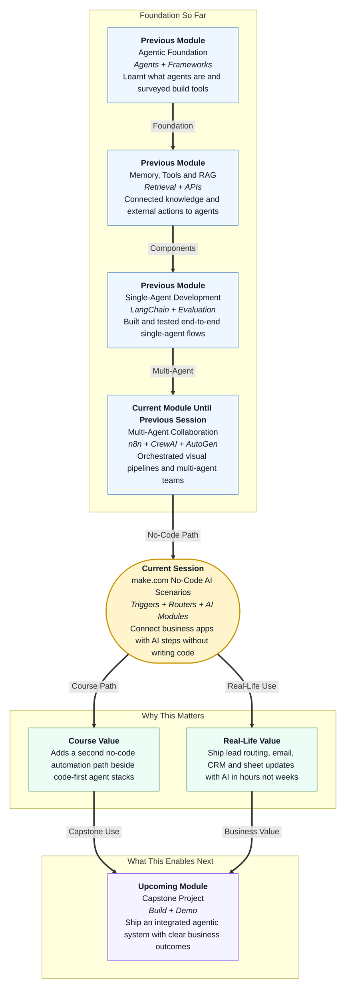

# Pre-read: make.com — No-Code AI Automation Scenarios

## Context of This Session in the Course

---

## Every Morning, Someone Is Copy-Pasting

Think of a small Indian business — a coaching centre, a D2C brand, or a local SaaS startup.

Every morning, the same ritual repeats. A new enquiry lands in a Google Form or Instagram DM. Someone copies the name into a spreadsheet. Someone else writes a polite email. A third person updates the CRM. If the lead looks “hot,” a manager gets a WhatsApp ping. If the message is incomplete, it sits in limbo until someone notices.

Nothing here is “AI magic.” It is **repetitive handwork** — the kind that burns hours, creates typos, and makes good leads wait while average ones get lucky replies first.

Now ask a sharper question:

**What if every new enquiry could be sorted, summarised by AI, emailed, and logged into the right tools — without anyone writing a Python script?**

That is the career-relevant skill this session unlocks. Businesses do not only hire people who *build* agents in code. They also hire people who can **wire AI into the apps the team already uses** — email, sheets, CRM, calendars — quickly and safely.

## The Challenge: One Enquiry, Many Paths, Zero Patience

Imagine you receive 200 enquiries in a week. Each enquiry needs different treatment:

| Enquiry type | What should happen |
|---|---|
| Pricing question | AI drafts a short answer → email goes out → sheet row updates |
| Demo request | AI extracts contact details → CRM deal is created → sales owner is notified |
| Spam / incomplete | Route to a holding list → no sales ping → optional polite auto-reply |
| Angry complaint | Escalate to human → skip auto-email → log severity |

Doing this by hand is exhausting. Doing this with custom code is powerful — but slow for non-engineering teams, and heavy when the only goal is “connect Form → AI → Gmail → Sheet.”

You already practised **visual automation** with n8n, and **multi-agent collaboration** with CrewAI and AutoGen. Those skills teach orchestration thinking: *who does what, in what order, with what handoff*.

This session asks a different practical question:

> How do you design the same integration goal — trigger → decide → transform with AI → act on business tools — using **make.com**, a popular no-code scenario builder used widely in ops and growth teams?

## Enter make.com: Your Visual “Business Assembly Line”

**make.com** (earlier known as Integromat) lets you build **scenarios** — visual workflows where apps talk to each other.

A **scenario** is like a factory floor plan for work: something starts the line, stations do small jobs, and finished goods leave through different exits.

Key building blocks you will meet:

- **Modules** — each app step on the canvas (watch a form, call AI, send email, update a sheet). Think of them as workers at stations.
- **Triggers** — the starting gun. “When a new row appears…” or “When a webhook fires…” or “Every weekday at 9 AM…”
- **Routers** — the decision junction. “If demo request, go left; if complaint, go right.”
- **AI / HTTP modules** — the smart station. An **OpenAI** (or similar) module rewrites, classifies, or extracts fields; an **HTTP** module talks to any API when a ready-made connector is missing.
- **Data stores** — a small memory cupboard inside make.com for lookup values, counters, or temporary records.
- **Scheduling** — run on a clock, not only on an event.
- **Error handling** — what happens when Gmail fails, AI times out, or a required field is empty.

Code-first automation and make.com scenarios chase the **same goal**: reliable integration. The difference is *how* you build and who can maintain it. In make.com, you assemble the flow visually and test paths without compiling an app. In code-first stacks, you own deeper control, custom logic, and engineering process. Good practitioners know **when each style fits**.

## A Simple Analogy: The Railway Station Junction

Picture a busy railway junction in India.

1. A train **arrives** (trigger).
2. The station master checks the **route board** (router): Express? Passenger? Goods?
3. A clerk **writes a clean summary** of the cargo or passenger list (AI transformation).
4. Then the system **updates** platforms, announcements, and logs (email / CRM / spreadsheet actions).
5. If a track is blocked, the station does not freeze forever — it follows a **recovery plan** (error handling).

make.com works the same way. Your scenario is the junction. Modules are stations. The router is the route board. AI is the clerk who turns messy human language into structured next steps. Business apps are the platforms where work actually lands.

Once you see automation as a **junction with clear routes**, the canvas stops feeling mysterious.

## In This Pre-read, You'll Discover:

- **Discover** why no-code scenarios matter for real business operations — not only for developers.
- **Understand** how a **trigger**, **router**, and **AI module** work together like a station junction.
- **Learn** what **data stores**, **scheduling**, and **error handling** contribute to a trustworthy automation.
- **See** how make.com compares with code-first automation while serving similar integration goals.

## What a Practical Scenario Looks Like (Conceptually)

Here is a mental sketch of the kind of flow you will assemble in the live session — described in plain language, not as code:

1. **Start** — A new lead arrives (form submission, sheet row, or scheduled pull).
2. **Decide** — A router checks keywords or AI labels: *pricing / demo / spam / complaint*.
3. **Transform** — An AI module cleans the message, extracts name and intent, and drafts a short reply or CRM note.
4. **Act** — Success path updates a spreadsheet, creates or updates a CRM record, and sends an email.
5. **Recover** — If the email module fails, the scenario logs the failure, retries where safe, or routes to a “needs human” list instead of silently dying.

That last step is career gold. Anyone can demo a happy path. Professionals also document a **recoverable error path** — what breaks, how you notice, and how the system continues safely.

You will also discuss **testing**: run one clean success enquiry and one broken case (missing email, API timeout, bad AI output format). Then write short notes so a teammate can hand off the scenario tomorrow without guessing.

## Why This Sits Perfectly in Your Journey

So far in this module, you have:

- Connected services visually with **n8n**
- Coordinated specialised agents with **CrewAI**
- Orchestrated group collaboration with **AutoGen**

make.com extends the same *systems thinking* into another widely used no-code platform. After this, you will be ready to evaluate **hosted agent builders** in the upcoming session — products where AI agents live inside vendor platforms with knowledge, actions, and guardrails.

The bigger course story is simple: **agents are not only chat windows**. They are pipelines that sense events, decide routes, transform information, and act on business tools — with reliability built in.

## Interesting Questions We'll Solve Together

Come to the live session ready to explore these challenges:

1. **The Hot Lead Junction** — A form receives both “Please share pricing” and “Book a demo tomorrow.” How do you design one scenario with a router so each path gets a different AI prompt and a different business action?
2. **The Silent Failure** — Email sending fails at 11 PM. What should the scenario do so the lead is not lost, and how do you document that recoverable error path for your team?
3. **No Native App Button** — The tool you need is not listed as a ready module. When do you reach for an **HTTP** module, and what must you verify before trusting that connection in production-style testing?

## What's Next After This Session

After the live lecture, you will be able to:

- Explain how **make.com scenarios** relate to code-first automation without confusing the two
- Assemble a scenario with a **trigger**, **router**, and at least one **AI-powered** transformation
- Connect outputs to everyday business tools such as **email**, **CRM**, or **spreadsheet** updates
- Test and document **one success path** and **one recoverable error path**
- Talk confidently about **modules**, **data stores**, **scheduling**, and **error handling** in interviews or workplace demos

Bring your curiosity — and one messy business process from your own life that currently depends on copy-paste. We will turn that kind of problem into a clean, testable scenario.
