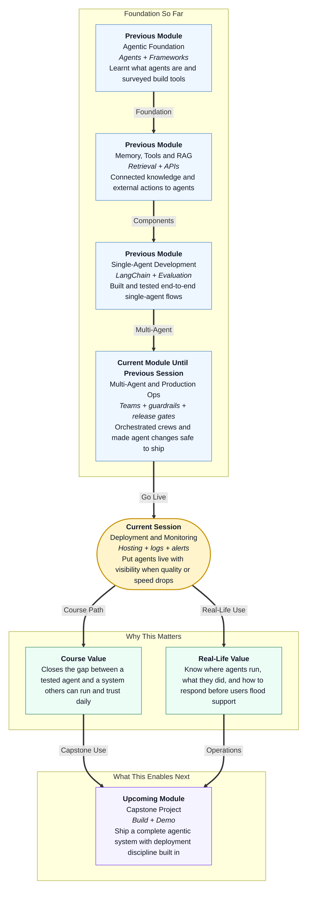

```mermaid
%%{init: {'flowchart': {'nodeSpacing': 55, 'rankSpacing': 70, 'diagramPadding': 20}} }%%
flowchart TB
    subgraph Foundation["Foundation So Far"]
        M1["<b>Previous Module</b><br/>Agentic Foundation<br/><i>Agents + Frameworks</i><br/>Learnt what agents are and surveyed build tools"]
        M2["<b>Previous Module</b><br/>Memory, Tools and RAG<br/><i>Retrieval + APIs</i><br/>Connected knowledge and external actions to agents"]
        M3["<b>Previous Module</b><br/>Single-Agent Development<br/><i>LangChain + Evaluation</i><br/>Built and tested end-to-end single-agent flows"]
        CM["<b>Current Module Until Previous Session</b><br/>Multi-Agent and Production Ops<br/><i>Teams + guardrails + release gates</i><br/>Orchestrated crews and made agent changes safe to ship"]
    end

    CS(["<b>Current Session</b><br/>Deployment and Monitoring<br/><i>Hosting + logs + alerts</i><br/>Put agents live with visibility when quality or speed drops"])

    subgraph Value["Why This Matters"]
        CV["<b>Course Value</b><br/>Closes the gap between a tested agent and a system others can run and trust daily"]
        RV["<b>Real-Life Value</b><br/>Know where agents run, what they did, and how to respond before users flood support"]
    end

    subgraph Future["What This Enables Next"]
        U1["<b>Upcoming Module</b><br/>Capstone Project<br/><i>Build + Demo</i><br/>Ship a complete agentic system with deployment discipline built in"]
    end

    M1 ==>|&nbsp;Foundation&nbsp;| M2
    M2 ==>|&nbsp;Components&nbsp;| M3
    M3 ==>|&nbsp;Multi-Agent&nbsp;| CM
    CM ==>|&nbsp;Go Live&nbsp;| CS
    CS ==>|&nbsp;Course&nbsp;Path&nbsp;| CV
    CS ==>|&nbsp;Real-Life&nbsp;Use&nbsp;| RV
    CV ==>|&nbsp;Capstone&nbsp;Use&nbsp;| U1
    RV ==>|&nbsp;Operations&nbsp;| U1

    classDef previous fill:#eef6ff,stroke:#4b83c4,color:#111827;
    classDef current fill:#fff4cc,stroke:#c79200,color:#111827,stroke-width:2px;
    classDef value fill:#ecfdf5,stroke:#2f855a,color:#111827;
    classDef future fill:#f5f3ff,stroke:#7c3aed,color:#111827;

    class M1,M2,M3,CM previous;
    class CS current;
    class CV,RV value;
    class U1 future;
    linkStyle default stroke-width:3px;
```
