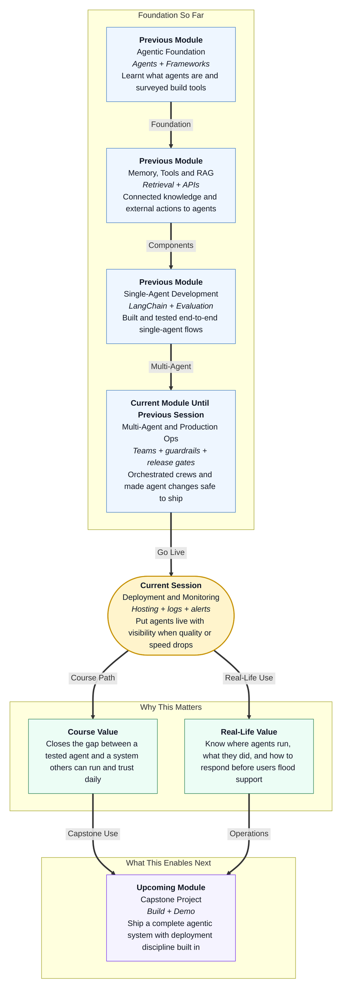

# Pre-read: Deployment and Monitoring for Agent Systems

## Context of This Session in the Course

---

## When the Agent Goes Live and Nobody Can Explain What Happened

Picture a growing Indian fintech startup. On Friday evening, the team launches a **customer support agent** that reads policy documents, calls internal tools, and replies on WhatsApp. The demo was perfect. Leadership celebrates.

By Monday morning:

- Users report **wrong refund amounts** — confident answers, but not matching official policy.
- Average reply time jumps from **4 seconds to 45 seconds** during peak hours.
- One support lead asks: *"Did the agent even search the right document, or did it guess?"*
- The engineer who built it is on leave. The only clue is a vague error message and a screenshot.

Everyone is guessing. Was it the model? The retrieval step? A tool that timed out? A bad deployment on Sunday night? Without a clear picture of **where the agent runs**, **what it logged**, and **what to watch**, every incident becomes a panic call — not a fix.

In the previous session, you learned how to **version** agent changes, run **release gates**, protect **secrets**, and apply **guardrails** so unsafe inputs and outputs do not reach users. That discipline answers: *"Is this change safe enough to release?"*

This session answers the next question:

> **After release, how do we keep the agent visible, measurable, and fixable when real users depend on it every day?**

That is **deployment and monitoring** — not glamorous demo work, but the difference between a science project and a system your manager will trust.

---

## The Challenge: A Live Agent with No Operational Eyes

**What if your agent is already serving hundreds of users — but when quality drops or responses slow down, your team cannot tell whether the problem is deployment, retrieval, a tool, or the model itself?**

An agent is not one button that returns one answer. A single user question may trigger:

1. **Input checks** — guardrails and policy filters  
2. **Retrieval** — fetching chunks from a knowledge base  
3. **Reasoning** — the model deciding what to do next  
4. **Tool calls** — hitting APIs, databases, or ticketing systems  
5. **Final output** — the answer the user actually sees  

If step 3 succeeds but step 4 fails silently, the user still gets a broken experience. If step 2 pulls outdated documents because production points to the wrong environment, every answer looks polished — and wrong.

Manual debugging by re-running random test questions does not scale. You need:

- A deliberate **deployment strategy** — where the agent runs, in which **environment**, on what **hosting and runtime**  
- An **observability plan** — what to **measure**, **trace**, and **alert** on across agent, tool, and retrieval steps  
- A **logging strategy** — records that capture inputs, decisions, tool traffic, retrieval context, errors, and outcomes for **audit** and debugging  
- **Monitoring workflows** — how the team responds when **latency** rises or **answer quality** falls in production  

Without these, you are flying a plane at night with the cockpit lights off.

---

## Where Agents Live: Deployment Choices That Shape Everything

**Deployment**, in simple words, means deciding how and where your agent system runs so real users can reach it reliably.

Teams typically choose among several paths — each with trade-offs:

| Approach | What it means | When it fits |
|---|---|---|
| **Self-hosted on a server or VM** | You manage the machine, updates, and scaling | Full control, custom tools, strict data residency |
| **Container-based hosting** | Agent packaged in a container and run on a platform | Repeatable environments, easier handoffs between dev and production |
| **Serverless / managed functions** | Code runs on demand without you managing servers | Spiky traffic, simpler ops, but cold starts and limits matter |
| **Platform-hosted agents** | Vendor runs much of the stack (like hosted builders you explored earlier) | Fast launch, less infra work, less low-level control |
| **Hybrid** | Some parts self-hosted, some on vendor platforms | Common in enterprises with mixed compliance needs |

**Runtime choices** — the software layer that actually executes your agent — matter too. A LangChain service behind FastAPI, an n8n workflow with LLM nodes, and a CrewAI script on a scheduled job are all "deployments," but they need different monitoring hooks.

**Environments** separate risk. At minimum, teams use:

- **Development** — where engineers experiment freely  
- **Staging** — where release candidates run with production-like settings  
- **Production** — where real users interact  

A classic failure: retrieval in staging uses fresh policy PDFs, but production still points to last month's index. The agent "works" in testing and fails for customers. Good deployment strategy includes **where** each environment lives and **how** configs stay aligned.

Choosing deployment is not about picking the fanciest cloud name. It is about matching **control, cost, compliance, and team skill** to the business scenario — and knowing what you will need to observe once users arrive.

---

## Think of It Like an Airport Control Tower

A useful daily-life picture is a busy **airport**.

- **Runways and terminals (deployment)** — Planes do not park randomly on public roads. Each flight has an assigned gate, route, and ground crew. Your agent needs a defined place to run, with clear entry and exit paths for user requests.
- **Radar and flight boards (observability)** — Controllers do not guess where planes are. They watch position, altitude, and scheduled vs actual times. For agents, observability means seeing each step — retrieve, reason, act — not only the final reply.
- **Black box and voice logs (logging and audit)** — After an incident, investigators replay recordings: who said what, when, and which checklist was skipped. Agent logs must capture **decisions**, **tool traffic**, **retrieval context**, **errors**, and **outcomes** so you can reconstruct a bad run without blaming everyone in the room.
- **Weather alerts (monitoring and alerts)** — When wind speed crosses a limit, alarms sound before a crash. Production monitoring watches **latency**, **error rates**, **token spend**, and **quality signals** — then alerts the on-call engineer before users flood social media.
- **Emergency playbook (incident response)** — Towers do not improvise during fog. They follow steps: divert, hold, inspect, resume. When agent quality degrades, teams need a workflow — who checks logs first, when to roll back a release, when to disable a tool, when to escalate to a human.

The mental shift: **treat a live agent like managed air traffic**, not a magic chat box that only shows the last sentence.

---

## Observability: What to Measure, Trace, and Alert On

**Observability** means you can understand what happened inside the system from the signals it leaves behind — logs, traces, and metrics — without guessing from the final answer alone.

For agent systems, a practical observability plan answers three questions:

1. **What should we measure?**  
   - End-to-end **latency** per user request  
   - Success vs failure rates at each step  
   - **Token usage** and cost per workflow  
   - Retrieval hit rate — did we find relevant documents?  
   - Tool call success — did external APIs respond correctly?  

2. **What should we trace?**  
   A **trace** is the full journey of one agent run, linked by a shared id — like a courier tracking number on every scan. Trace and **audit fields** might include:

   | Field | Why it matters |
   |---|---|
   | Run id / trace id | Connect every log line from one user question |
   | Timestamp | Spot delays and wrong ordering |
   | Step name | Know whether failure was retrieve, reason, or act |
   | Model version / prompt version | Tie behaviour to a specific release |
   | Retrieval query and top chunks | Prove what context the model saw |
   | Tool name and arguments | See which external action ran |
   | Decision summary | Record why the agent chose a tool or path |
   | Error flag and message | Surface failures without hiding them |
   | Final outcome | Compare what the user received vs internal steps |

3. **What should trigger alerts?**  
   Not every log line should wake someone at 2 a.m. Alerts should fire on patterns that hurt users or budget: error spikes, latency above a threshold, sudden cost jumps, or quality scores dropping on a sampled eval set.

Observability is how you move from *"Something feels off"* to *"Retrieval returned zero chunks for policy queries starting at 09:14."*

---

## Logging Agent Decisions: The Audit Trail Professionals Expect

**Logging**, in this context, is the habit of writing structured records at each important moment — not scattered print statements, but consistent entries your team can search during an incident.

A strong logging strategy for agents captures:

- **Inputs** — sanitized user query, user role, session context (without leaking secrets or PII into plain logs)  
- **Decisions** — which path the agent chose: answer directly, retrieve first, call a tool, escalate to human  
- **Tool traffic** — which tool fired, request summary, response status, duration  
- **Retrieval context** — which documents or chunks were fetched, and how many  
- **Errors** — timeouts, API failures, guardrail blocks, with enough detail to reproduce  
- **Outcomes** — final response status, user-visible message category, satisfaction signal if available  

Structured logs — often one readable record per event with named fields — beat long paragraphs. They let you filter: *show all failed tool calls in the last hour*, or *show every run where retrieval returned empty*.

This audit trail supports two audiences:

- **Engineers** debugging a broken workflow tonight  
- **Managers and compliance teams** asking *"Can you prove what the agent did on 3 August?"* tomorrow  

Logging is not optional decoration. It is how responsible teams earn trust after go-live.

---

## Monitoring Workflows and Incident Response

**Monitoring** is the ongoing practice of watching production signals and acting when they cross safe limits.

Healthy teams define **monitoring workflows** — repeatable steps, not heroics:

| Signal | Possible meaning | First response |
|---|---|---|
| Latency up 3× | Model overload, slow tool, or bad retrieval index | Check traces for slowest step; scale or rollback |
| Error rate spike | Bad deployment, expired credential, tool outage | Compare timing with last release; inspect error logs |
| Cost surge | Runaway loop, larger model, or huge retrieval payloads | Identify high-token runs; tune limits or caching |
| Quality drop on eval sample | Prompt drift, stale knowledge, wrong environment | Run regression set; compare staging vs production configs |
| Guardrail blocks rising | Attack attempts or misconfigured policy | Review blocked inputs; adjust rules if false positives |

**Incident response planning** means deciding in advance:

- Who is **on call** when alerts fire  
- When to **roll back** a release vs patch forward  
- When to **disable a tool** temporarily  
- When to switch to **human fallback** for high-stakes queries  
- How incidents are **documented** so the same failure does not repeat blindly  

Performance tracking ties directly to these workflows. You are not monitoring for pretty dashboards alone — you are monitoring so the right person takes the right action before a small glitch becomes a reputational crisis.

---

## In this pre-read, you'll discover:

- **Why** choosing **hosting, runtime, and environments** affects every production incident — not only launch day  
- **How** an **observability plan** defines what to measure, trace, and alert on across retrieval, reasoning, and tool steps  
- **What** a production-grade **logging strategy** must capture for audit, debugging, and compliance  
- **How** **monitoring workflows** and **incident response** connect latency and quality signals to concrete operational actions  

---

## After This Session, You Will Be Able To

- **Compare deployment options** for agent-backed services and justify a hosting and runtime strategy for a given business scenario  
- **Design an observability plan** that specifies metrics, traces, alerts, and audit fields across agent, tool, and retrieval steps  
- **Specify a logging strategy** that records inputs, decisions, tool traffic, retrieval context, errors, and outcomes — without drowning in noise  
- **Relate monitoring signals** to operational response when agent quality or latency degrades in production  
- **Outline an incident response workflow** your team could follow during a real degradation — roll back, isolate, fix, verify  

Upcoming lessons extend this into **governance, ethical scaling, and cost control** — the policies and oversight that keep agent fleets accountable at organisation level. Deployment and monitoring give you the operational eyes; governance gives you the rules those eyes must serve.

---

## Interesting Questions We'll Solve Together

Bring your curiosity to these live challenges:

1. **The Sunday Night Switch** — A support agent worked fine in staging. Production was updated Sunday night with a new retrieval index path, but the environment variable still points to the old index. Users get fluent wrong answers. Which **deployment and environment** checks should have caught this — and what **log field** would prove retrieval pulled stale chunks?

2. **The 45-Second Reply** — Latency alerts fire at 10 a.m. Traces show retrieval completes in 200 ms, but one tool step averages 40 seconds. Should the team scale servers, fix the tool, add a timeout, or all three? Walk through the **monitoring workflow** step by step.

3. **The Audit Request** — Compliance asks: *"Show exactly what the agent did for ticket #8842 — including which policy section it retrieved and which tool it called."* Which **trace and audit fields** must exist in your logging design to answer that without hand-waving?

Think of one agent your organisation might deploy — who uses it, what could go wrong at 2 a.m., and what three signals you would watch on day one. We will turn those instincts into a deployment and monitoring plan you can defend in front of engineers, managers, and auditors alike.
