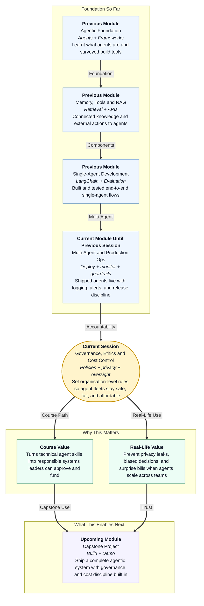

# Pre-read: Governance, Ethical Scaling and Cost Control for Agent Systems

## Context of This Session in the Course

---

## When Success Creates a Bigger Problem Than Failure

Imagine a large Indian retail company. Over six months, different teams quietly launch their own **AI agents**:

- **Customer support** answers refund queries on WhatsApp.
- **HR** screens job applications and ranks candidates.
- **Finance** summarises vendor invoices and flags anomalies.
- **Marketing** generates personalised campaign messages from customer purchase history.

Each team celebrates faster work. Leadership sees productivity rising. Then, in one week, three crises hit at once:

- A support agent **quotes a customer's full address and order history** in a group chat visible to other users — a **privacy** breach that triggers a regulatory complaint.
- HR leadership discovers the hiring agent **consistently ranks candidates from certain colleges lower**, even when qualifications match — a **bias** problem no one tested for before go-live.
- Finance receives a cloud bill **three times the forecast** because five teams each deployed agents on the most expensive model, with no **budget limits** or shared **usage monitoring**.

The technical teams did nothing "wrong" in isolation. Each agent worked in a demo. But nobody asked: *Who approved these workflows? Who audits what data they touch? Who watches total spend across the fleet?*

In the previous session, you learned how to **deploy** agents, design **observability**, build **logging** for audit, and respond when **quality or latency** drops in production. That discipline answers: *"Can we see what the agent did after it went live?"*

This session answers the organisation-level question:

> **When dozens of agents run across departments, how do we keep them private, fair, safe, and financially sustainable — not just individually working, but collectively trustworthy?**

That is **governance, ethical scaling, and cost control** — the layer that separates a clever pilot from a system your CEO, legal team, and finance head will actually fund at scale.

---

## The Challenge: A Fleet of Agents with No Rules of the Road

**What if your company already has fifteen agents touching customer data, employee records, and payment systems — but there is no shared policy on who can launch one, what data they may read, or how much they are allowed to spend per month?**

A single agent is like one driver on an empty road. An **agent fleet** is like a city full of vehicles — support vans, delivery trucks, school buses — all sharing the same streets, fuel budget, and traffic laws. Without rules, even skilled drivers cause collisions.

Each autonomous agent workflow may:

1. **Read sensitive data** — customer phone numbers, salary details, medical notes in internal documents  
2. **Make consequential decisions** — approve a refund, reject a loan application, escalate a fraud alert  
3. **Call expensive models repeatedly** — looping through retrieval, reasoning, and tool steps on every user message  
4. **Act without a human in the loop** — sending emails, updating records, or posting replies before anyone reviews  

Manual trust — *"Ravi built it, so it must be fine"* — does not scale when Ravi is one of twenty engineers and the agents run 24/7.

You need:

- **Governance principles** — clear steps for **approving**, **monitoring**, and **auditing** agent workflows before and after launch  
- **Privacy controls** — rules for what internal and customer data agents may access, store, and expose in logs  
- **Bias and safety guardrails** — checks so high-impact decisions do not silently harm certain groups or violate company policy  
- **Human oversight** — defined moments when a person must review, override, or take over  
- **Cost-control strategies** — **model selection**, **caching**, **limits**, **budgets**, and **usage monitoring** across the entire fleet  

Without these, scaling agents does not multiply productivity — it multiplies risk.

---

## Governance: Who Approves, Who Watches, Who Audits

**Governance**, in simple words, means the set of rules and processes that decide *who is allowed to do what*, *how decisions are recorded*, and *how mistakes are caught* before they become headlines.

In mature organisations, autonomous agent workflows pass through a lifecycle:

| Stage | What governance asks |
|---|---|
| **Proposal** | What problem does this agent solve? What data and tools does it need? |
| **Approval** | Has legal, security, and the business owner signed off? |
| **Launch** | Are guardrails, logging, and monitoring in place? |
| **Operation** | Is behaviour still within policy? Are costs within budget? |
| **Audit** | Can we prove what the agent did six months ago for a specific customer? |

**Audit trails** — structured records of inputs, decisions, tool actions, and outcomes — are not optional paperwork. They are how teams answer regulators, angry customers, and internal investigations without guessing.

Governance also defines **policies**: written standards such as *"Agents must not store raw Aadhaar numbers in logs"*, *"Refund agents above ₹10,000 require human approval"*, or *"No new production agent without a regression test on the eval set."*

The mental shift: **treat every agent workflow like a regulated business process**, not a side project that happens to use AI.

---

## Privacy and Data Handling: When Agents See Too Much

**Data privacy** means protecting personal and sensitive information so it is collected, used, and stored only in ways people expect and the law allows.

Agents create privacy risks that traditional software often avoids, because they **read natural language** — emails, tickets, HR forms, chat transcripts — and may **repeat fragments** in replies or logs.

Common risk patterns:

- An agent retrieves a document chunk containing **customer phone numbers** and includes them in a support reply meant for a different user  
- **Internal salary data** sits in a knowledge base the marketing agent can search because folders were not separated  
- Debug logs store **full user queries** with names and account details, visible to every engineer with log access  
- A vendor-hosted model processes **confidential contracts** without a data-processing agreement  

Strong privacy controls include:

- **Data classification** — labelling what is public, internal, confidential, or restricted  
- **Access boundaries** — each agent sees only the knowledge and tools its role requires  
- **Minimisation** — agents fetch the smallest data slice needed, not entire databases  
- **Log redaction** — stripping or masking personal identifiers before records are stored  
- **Retention rules** — deleting or archiving agent logs after a defined period  

Privacy is not only a legal checkbox. It is how customers and employees keep trusting you after agents become the front door of your service.

---

## Bias, Safety, and Human Oversight for High-Impact Decisions

**Bias**, in this context, means systematic unfairness — when an agent treats similar people differently based on patterns that should not matter, such as region, gender, college name, or language style.

**Safety** means preventing harm: wrong medical advice, incorrect legal guidance, fraudulent approvals, or outputs that violate company values.

Agents learn patterns from historical data and model behaviour. If past hiring favoured one profile, an HR screening agent may **repeat that bias** at scale — faster and with more confidence than any human recruiter.

High-impact decisions — loans, terminations, medical triage, legal summaries, child-related content — need extra care:

| Control | Purpose |
|---|---|
| **Pre-deployment testing** | Run the agent on diverse scenarios before real users depend on it |
| **Bias checks** | Compare outcomes across groups; flag skewed ranking or refusal rates |
| **Safety filters** | Block harmful, illegal, or out-of-scope requests and responses |
| **Human-in-the-loop** | Require a person to approve, edit, or reject before action is taken |
| **Escalation paths** | Route uncertain or sensitive cases to a human expert |
| **Kill switch** | Ability to disable an agent quickly when policy is violated |

**Human oversight** does not mean humans review every message — that would defeat the purpose. It means humans are in the loop **where the stakes justify it**, with clear accountability for who owns the final decision.

Ethical scaling is not about slowing innovation. It is about making sure speed does not outrun fairness and safety.

---

## Think of It Like a Hospital with Many Specialists

A useful daily-life picture is a busy **hospital**.

- **Admission desk (governance approval)** — Not every visitor walks straight into the operating theatre. Each case is registered, triaged, and assigned to the right department with documented consent.
- **Patient records room (privacy)** — Doctors see only the files their speciality requires. Nurses do not open psychiatric notes unless needed. Copies are controlled; names are protected.
- **Medical ethics board (bias and safety)** — New procedures are reviewed for harm before wide rollout. Outcomes are monitored across patient groups. Dangerous shortcuts are blocked.
- **Senior consultant sign-off (human oversight)** — A junior doctor may draft a plan, but certain surgeries need the consultant's approval before the knife moves.
- **Pharmacy budget and inventory (cost control)** — The hospital tracks medicine usage department by department. Expensive drugs require justification. Stock is not ordered blindly every hour.

The mental shift: **scaling agents is like scaling a hospital network** — expertise matters, but without shared standards on records, ethics, approval, and budget, every new ward adds chaos instead of care.

---

## Cost Control: Keeping Agent Fleets Financially Sustainable

**Cost control** means designing agent systems so they deliver value without surprise bills — especially when usage grows from hundreds to millions of requests.

Agent costs come from many directions:

- **Model choice** — a large, capable model costs more per request than a smaller one tuned for a narrow task  
- **Token usage** — long prompts, big retrieved documents, and multi-step reasoning all add up  
- **Tool calls** — external APIs, database queries, and repeated retries inflate spend  
- **Runaway loops** — an agent that keeps calling tools without stopping can burn budget in minutes  
- **Fleet duplication** — ten teams each running similar agents on premium models instead of sharing one governed service  

Practical **cost-control strategies** include:

| Strategy | What it does |
|---|---|
| **Model selection** | Match model size to task difficulty — simple routing on a cheap model, complex reasoning only when needed |
| **Caching** | Reuse answers or embeddings for repeated questions instead of recomputing every time |
| **Rate and token limits** | Cap requests per user, per team, or per workflow |
| **Budgets and alerts** | Set monthly spend thresholds; notify owners before limits are breached |
| **Usage monitoring** | Dashboards showing cost by agent, team, model, and tool — so finance sees trends, not shocks |
| **Shared platforms** | Centralise common agents instead of every team rebuilding the same pipeline |

Cost control is not penny-pinching. It is how leadership keeps funding agents long after the first demo excitement fades.

---

## In this pre-read, you'll discover:

- **Why** **governance** — approval, monitoring, and audit — is the backbone of trustworthy agent fleets in real organisations  
- **How** **privacy and data-handling** risks appear when agents read internal and customer information — and what controls reduce them  
- **What** **bias**, **safety**, and **human oversight** mean for high-impact agent decisions that affect people's lives and livelihoods  
- **How** **cost-control strategies** — model choice, caching, limits, budgets, and fleet-wide monitoring — keep scaling agents financially sustainable  

---

## After This Session, You Will Be Able To

- **Explain governance principles** for approving, monitoring, and auditing autonomous agent workflows in an organisation  
- **Identify privacy and data-handling risks** when agents access internal documents or customer information  
- **Propose bias, safety, and human-oversight controls** for agent decisions where mistakes carry serious consequences  
- **Design a cost-control plan** covering model selection, caching, usage limits, budgets, and monitoring for an agent fleet  
- **Connect policies and audit trails** to the logging and monitoring practices you built in earlier production-focused work  

Upcoming lessons extend this into **designing a complete multi-agent business workflow** — roles, handoffs, tools, and success metrics you can take into the capstone build. Governance gives you the rules; business design gives you the blueprint those rules protect.

---

## Interesting Questions We'll Solve Together

Bring your curiosity to these live challenges:

1. **The HR Screening Shock** — An agent ranks five hundred applicants overnight. HR notices graduates from certain states consistently score lower despite similar qualifications. Which **bias checks** should have run before launch, and what **human oversight** gate should exist before any rejection email is sent?

2. **The Log That Leaked Too Much** — Compliance asks whether customer PAN numbers ever appeared in agent logs. Support swears the agent "only answers policy questions." Which **privacy controls**, **data boundaries**, and **audit trail** fields would let you answer that question with evidence — not assumptions?

3. **The Million-Rupee Month** — Finance discovers agent spend jumped 400% after three new teams launched workflows on the largest model with no caching. How would you design **budgets**, **usage monitoring**, and **model selection rules** so teams innovate without bankrupting the AI line item?

Think of one agent your organisation might deploy at scale — who it affects, what sensitive data it touches, and what could go wrong if nobody governs it. We will turn those instincts into a governance and cost-control framework you can present to engineers, managers, legal teams, and finance with confidence.
