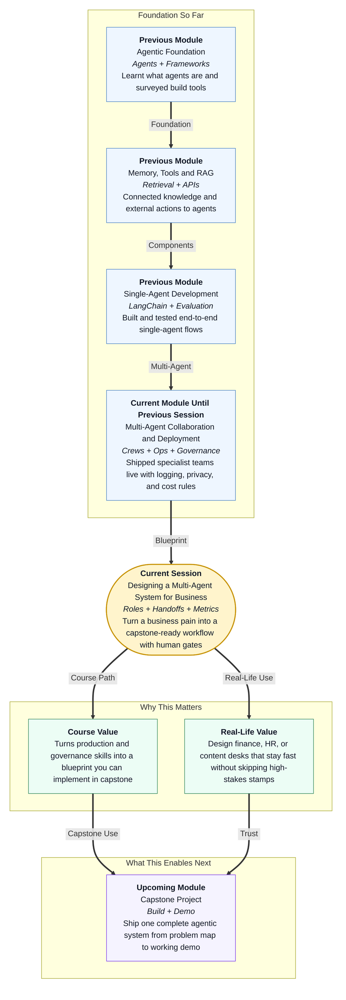

# Pre-read: Designing a Multi-Agent System for Business

## Context of This Session in the Course

---

## When Speed and Control Sit in the Same Inbox

Picture the accounts office of a 40-store Indian retail chain the week before a festival sale. Vendor bills land in one shared mailbox. A few are clean. Many have a wrong **GST** number, a missing purchase order, or an amount a junior clerk should never stamp alone.

Vendors call store managers. Store managers call Accounts Payable. The **CFO** wants bills cleared faster than nine days. The chartered accountant wants zero surprise payments. Both are right — and the pile keeps growing.

This is not a “clever chatbot” problem. It is a **desk design** problem: who reads the bill, who checks the rules, who stops a risky case, and how leadership knows the desk is actually better.

In the **previous** session you set **governance** — privacy, fairness, human oversight, and cost control — so a fleet of agents does not leak data or burn budget. Those rules answer *who may run an agent, on which information, and at what spend*.

This session answers the next question:

> **If a real business process must get faster without losing control of money, hiring, or public claims — how do you draw the workflow so both a CFO and an engineer can approve it before anyone picks a build tool?**

That drawing is **designing a multi-agent system for business**. It is the blueprint you carry into **upcoming** capstone planning.

---

## What If One Person Wore Every Hat?

**What if you had to clear hundreds of vendor invoices, onboard new joiners, or publish a campaign pack — and you asked one intern to extract numbers, judge policy, alert the right manager, and report to the CFO, all from memory?**

That intern will mix jobs. When GST is wrong or a high-value bill sails through, nobody can tell whether the bill was misread, the rule was skipped, or a stamp was never required. When leadership asks “are we faster?”, there is a feeling, not a number.

The same failure shows up in **HR** (laptop and ID created before an identity check) and in **content** (a campaign published before legal sees a medical or celebrity claim).

You already know how to *build* specialist agents, *deploy* them, *watch* them, and *govern* them. Capstone work still fails when teams jump to a framework screenshot before they can explain the **business flow** on a whiteboard.

The way through is a **multi-agent business design**: a documented plan that names the pain, the specialist **roles**, the packets they pass, the systems they touch, the **human approval gates**, and the **success metrics**. In simple words — before you hire a team of clerks, you draw who sits where.

---

## Think of It Like a Passport Seva Counter

A useful daily-life picture is a **passport seva** office — not a magic window that “just issues passports.”

- **Token and file (intake)** — Every application becomes a numbered case. Nobody judges eligibility at the photocopier.
- **Document desk (extract)** — One counter reads the form and fills a structured slip: name, address, old passport number. They do not decide whether you get the booklet.
- **Verification desk (policy)** — Another counter compares the slip with rules and records. They do not invent a missing police report.
- **Supervisor stamp (human gate)** — Odd or high-risk files stop for a named officer. Clean, low-risk files should not wait in the same queue for hours.
- **Notice board (metrics)** — Leadership cares about waiting time *and* about zero booklets issued on a failed police check. Those are different scores.

The mental shift: **a business multi-agent system is a seva counter with labelled desks**, not one super-intern with five hats. Missing the supervisor desk is how a “fast” office prints the wrong passport — or pays the wrong vendor.

A **wedding planner’s sheet** is the same idea on one page: guest count, hall, catering, rain backup, budget. Empty “rain backup” is how a lawn wedding fails in July. Empty **gates** or **metrics** is how an agent demo fails in production.

---

## Six Boxes Before Any Tool Logo

Use the same six boxes for finance, HR, or content. If a box is empty, the design is not ready for capstone.

| Box | Question it answers |
|---|---|
| **Problem** | What pain, for whom, if we do nothing? What is **in scope** and honestly **out**? |
| **Roles** | Which specialists exist — and what is each **non-goal** (the job they must not do)? |
| **Handoffs** | At which **handoff point** does one desk’s output become the next desk’s input, on a labelled slip? |
| **Tools and data** | Where does truth live (mailbox, company ledger, GST lookup, policy binder), and is each access **read** or **write**? |
| **Human gates** | When must a person stamp — amount, mismatch, low confidence — and who owns the queue? |
| **Risks and metrics** | What can go wrong (wrong pay, leaked PAN, skipped stamp), and which numbers prove it is better? |

A **role**, in simple words, is a named specialist with one job. Intake creates a ticket; it does not judge GST. Extract fills fields; it does not change policy. Policy compares; it does not invent a missing purchase order. A **reporter** counts for the CFO; it does not approve payment.

A **handoff** is the moment the next clerk should not re-read the whole PDF unless confidence is low. Think of a **pathology lab** sending a structured report to a doctor — patient id, test, value — not a WhatsApp voice note. Across desks, a labelled packet (vendor, GSTIN, amount, confidence, status) beats a hallway conversation.

A **human approval gate** is not “a manager looks at everything.” That recreates the nine-day pile. **UPI** lets a small payment through with less friction; a large bank transfer asks for extra confirmation. Write the rupee threshold and the “always stamp” conditions as policy, not as a vibe.

**Scope** matters as much as speed. The invoice desk can recommend “ready to pay.” Actually releasing **NEFT** stays with a human. A hospital lab *reports* a blood test; the doctor *prescribes*. Mixing those jobs is unsafe — the same is true of money, hiring access, and public publish.

---

## One Picture, Two Stories

Engineers need branches and field names. Business heads need outcomes and controls. Produce **both**.

A **workflow diagram** is the railway line: email bill → intake → extract → policy → ready-queue *or* exception desk → human stamp → (human still pays). A **stakeholder narrative** is the same line told at two altitudes.

- **CFO version:** Every bill becomes a ticket. Specialists read and check. Small clean bills reach the pay queue the same day. Big or broken bills stop for a named person with a reason. No chatbot sends money. Every week you get counts, not surprises.
- **Engineer version:** A straight-line flow with two conditional human stops, a shared packet of fields, read-only lookups, an append-only log, and payment out of scope.

**IRCTC** is the everyday twin: passengers see PNR and seat; operations see waitlists and charting. Both views must describe the same train.

Then name **risks** and **limitations** honestly. Extract will fail on stamps covering numbers. If a GST lookup is down, the desk should **fail closed** — send to a human — not assume the number is valid.

Measure **speed** and **safety** separately:

| Kind | Example | Why it is not the other kind |
|---|---|---|
| Speed | **Cycle time** from email to ready-or-reject; **first-pass rate** (share that never hit a human) | A slow-but-safe desk can still miss the CFO’s nine-to-two-day goal |
| Safety | **Missed-gate rate** of high-amount or GST-fail tickets that skipped a stamp — target **zero** | “Almost accurate” is how a lookalike GSTIN gets paid |

The same six boxes reuse for **HR onboarding** (time-to-laptop vs zero accounts if ID fails) and a **content campaign pack** (draft speed vs zero unapproved publish). Finance taught **money gates**. HR adds fairness and privacy. Content adds brand and legal. Your capstone should name which harm type is in play.

---

## In this pre-read, you'll discover:

- **Why** a business agent project starts with a **desk map** — problem, roles, and handoffs — not a tool logo
- **How** **data sources**, **tools**, and **human approval gates** keep speed without giving an agent the cheque book
- **What** a **workflow diagram** plus two **narratives** (business vs technical) must contain so both groups can sign off
- **How** **risks**, **limitations**, and **success metrics** turn “the AI is good” into numbers a CFO can fund

---

## After This Session, You Will Be Able To

- **Map** one business problem onto a multi-agent workflow with explicit roles, tasks, and handoff points
- **Specify** data sources, tools, and named human gates for a trustworthy path
- **Produce** a workflow diagram and a narrative that both technical and non-technical stakeholders can follow
- **Identify** risks, honest limitations, and evaluation metrics — including at least one safety number that must stay at zero
- **Reuse** the same canvas for a **finance**, **HR**, or **content** capstone idea without inventing a new method

Upcoming work is the **capstone**: you will pick a problem and build. This session is the last chance in this module to freeze the blueprint those builds must honour.

---

## Interesting Questions We'll Solve Together

Bring your curiosity to these live challenges:

1. **The Kirana vs the Invoice Pile** — A neighbourhood shop wants a helper that answers “Are you open on Sunday?” from a review. Nimbus-style retail wants bills cleared without wrong GST payments. Which one needs **several specialist roles**, and which one should stay a **single** helper? What fit test did you use?

2. **The Missing Stamp** — A student design has only an extractor and a reporter. GST mismatches go straight to “ready to pay.” Which roles are missing, and what **handoff packet** would you demand before the next desk is allowed to act?

3. **The Scoreboard Fight** — Finance celebrates a high first-pass rate while a ₹90,000 bill with a dead GSTIN skipped the supervisor. Which **metric** was the team optimising, which **safety** number did they ignore, and how would you explain that to a CFO in four sentences?

Think of one process you might take into capstone — vendor bills, joiner access, or a campaign pack. Who gets hurt if the wrong desk is skipped? We will turn that instinct into a workflow diagram, a tool-and-data map, and a metrics list you can defend in front of engineers *and* business heads.
