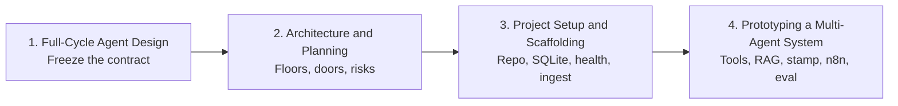

# Nimbus PayDesk — Four-Session Capstone Flow

This sheet is the map for the whole capstone. Keep it beside you in every live session.

**Product:** Nimbus PayDesk — an Accounts Payable desk for Nimbus Retail.  
**Job:** Cut a nine-day vendor-invoice wait without paying a wrong GSTIN or skipping a high-value stamp.  
**Hard rule:** The desk **recommends** `ready_to_pay`. It never sends **NEFT**.

```text
Design the job  →  Draw the building  →  Open an empty office  →  Hire clerks and sit the exam
   (contract)           (architecture)         (SQL + API, no model)      (agents + RAG + n8n)
```



---

## Capstone Session 1 — Full-Cycle Agent Design

**Need to do:** Freeze *what* PayDesk is, before anyone opens a repository.

| You will | Done when |
|---|---|
| Define the business problem and scope | One sentence a CFO and an engineer both accept; **no live NEFT** |
| Create a plan for multi-agent roles and handoffs | Intake, Extractor, Policy, Router, Reporter each have a **non-goal**; `InvoicePacket` JSON is locked |
| Specify tools and data sources | GST check, PO lookup, policy RAG, logging, human stamp listed; **bank is not a tool** |
| Design memory | Three stores named: ticket packet, Chroma handbook, SQLite ticket log |
| Write success criteria and an eval pack | Eight cases exist; live slice is **CLEAN / HIGH / BADGST**; missed-gate rate = **0** |

**Carry forward:** problem sentence, packet fields, tool list, memory map, `eval/cases.json` (even if only on paper today).

**Do not do yet:** FastAPI routes, folder tree, LangChain, n8n screenshots.

---

## Capstone Session 2 — Architecture and Planning

**Need to do:** Freeze *which software object* does each job.

| You will | Done when |
|---|---|
| Draw the end-to-end multi-agent architecture | Four floors: interface, orchestration, tools, data; **no bank floor** |
| Select components | FastAPI, SQLite, Chroma, sequential LangChain, n8n webhook — with a written why-not |
| Plan integrations | n8n posts `POST /ingest`; tools **fail closed** to `needs_human`; stamp is **human-only** |
| Produce a risk register | Wrong GSTIN, skipped ₹50,000 gate, PAN leak, n8n double ingest each have a control |
| Freeze folder map and API contracts | Doors: `/health`, `/ingest`, `/tickets/{id}`, `/tickets/{id}/stamp`, `/report` |

**Carry forward:** `architecture_contracts.py` (gates + doors), folder tree, risk page.

**Do not do yet:** `pip install`, creating `paydesk.db`, calling Ollama.

---

## Capstone Session 3 — Project Setup and Scaffolding

**Need to do:** Open an empty office that already **keeps files**.

| You will | Done when |
|---|---|
| Initialise repo, venv, secrets | `nimbus_paydesk` venv; `.env` gitignored; no keys in git |
| Scaffold folders and sample data | `app/`, `data/policy.md`, labelled invoices, `eval/cases.json` |
| Connect SQL and persist records | Tables: tickets, events, vendors, purchase_orders; seed Kaveri / `PO-7781`; **do not seed** `99INVALID` |
| Expose API stubs | `GET /health` → ok; `POST /ingest` stores status `ingested` |
| Prove create and fetch without a model | Restart uvicorn; the ticket is still in `paydesk.db` |

**Carry forward:** running API, seeded SQLite, handbook file, three sample slips.

**Do not do yet:** extract/policy agents, Chroma query, n8n. Keep startup **offline**.

---

## Capstone Session 4 — Prototyping a Multi-Agent System

**Need to do:** Hire the specialists, sit three exams, then attach the courier.

| You will | Done when |
|---|---|
| Implement tools | GST check, PO lookup, policy retrieve, append-only ticket logging |
| Build a sequential multi-agent pipeline | LangChain `extract → policy → route` on `InvoicePacket` |
| Connect SQL as memory | Ticket row **after** pipeline; `find_duplicate` on vendor + amount + date |
| Connect RAG with Chroma | Seed `data/policy.md`; empty store **fail closed** |
| Attach a human-approval path | `POST /tickets/{id}/stamp`; router **must not** approve |
| Evaluate and iterate | **INV-CLEAN** → `ready_to_pay`; **INV-HIGH** → `amount_gate`; **INV-BADGST** → `gst_mismatch`; one targeted fix |
| Create an n8n workflow and attach it | HTTP Request to `POST /ingest`; alert on `needs_human`; **no** amount-gate node inside n8n |

**Carry forward:** a demo a CFO can watch — one bill passes, one bill stops, nobody here sends money.

**Leave for support week:** remaining eval cases (DUP, BLUR, TOOLDOWN, OUTOFSCOPE), richer UI, OCR. Still **no payout tool**.

---

## Suggested live order in Session 4

1. Seed SQLite + Chroma on boot  
2. Run CLEAN, then HIGH, then BADGST through `/ingest`  
3. Stamp HIGH as a human (reject or approve)  
4. Run the three-case eval runner (same doors, not a private function)  
5. Fix **one** failure class and re-run  
6. Attach n8n last — courier to a desk that already works  

---

## One-page contract (all four sessions honour this)

- Harm type is **money**
- `ready_to_pay` is a recommendation, not a bank call
- Amount ≥ **₹50,000** and unknown GSTIN must stop
- Gates live in **Python**, not only in a prompt
- n8n may **start** work; it may not **judge** GST or amount
- Eval hits `POST /ingest`, not a back door
