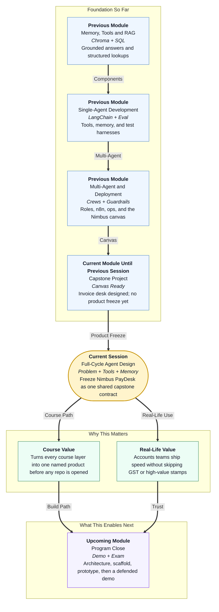

```mermaid
%%{init: {'flowchart': {'nodeSpacing': 55, 'rankSpacing': 70, 'diagramPadding': 20}} }%%
flowchart TB
    subgraph Foundation["Foundation So Far"]
        M2["<b>Previous Module</b><br/>Memory, Tools and RAG<br/><i>Chroma + SQL</i><br/>Grounded answers and structured lookups"]
        M3["<b>Previous Module</b><br/>Single-Agent Development<br/><i>LangChain + Eval</i><br/>Tools, memory, and test harnesses"]
        M4["<b>Previous Module</b><br/>Multi-Agent and Deployment<br/><i>Crews + Guardrails</i><br/>Roles, n8n, ops, and the Nimbus canvas"]
        CM["<b>Current Module Until Previous Session</b><br/>Capstone Project<br/><i>Canvas Ready</i><br/>Invoice desk designed; no product freeze yet"]
    end

    CS(["<b>Current Session</b><br/>Full-Cycle Agent Design<br/><i>Problem + Tools + Memory</i><br/>Freeze Nimbus PayDesk as one shared capstone contract"])

    subgraph Value["Why This Matters"]
        CV["<b>Course Value</b><br/>Turns every course layer into one named product before any repo is opened"]
        RV["<b>Real-Life Value</b><br/>Accounts teams ship speed without skipping GST or high-value stamps"]
    end

    subgraph Future["What This Enables Next"]
        U1["<b>Upcoming Module</b><br/>Program Close<br/><i>Demo + Exam</i><br/>Architecture, scaffold, prototype, then a defended demo"]
    end

    M2 ==>|&nbsp;Components&nbsp;| M3
    M3 ==>|&nbsp;Multi-Agent&nbsp;| M4
    M4 ==>|&nbsp;Canvas&nbsp;| CM
    CM ==>|&nbsp;Product&nbsp;Freeze&nbsp;| CS
    CS ==>|&nbsp;Course&nbsp;Path&nbsp;| CV
    CS ==>|&nbsp;Real-Life&nbsp;Use&nbsp;| RV
    CV ==>|&nbsp;Build&nbsp;Path&nbsp;| U1
    RV ==>|&nbsp;Trust&nbsp;| U1

    classDef previous fill:#eef6ff,stroke:#4b83c4,color:#111827;
    classDef current fill:#fff4cc,stroke:#c79200,color:#111827,stroke-width:2px;
    classDef value fill:#ecfdf5,stroke:#2f855a,color:#111827;
    classDef future fill:#f5f3ff,stroke:#7c3aed,color:#111827;

    class M2,M3,M4,CM previous;
    class CS current;
    class CV,RV value;
    class U1 future;
    linkStyle default stroke-width:3px;
```
