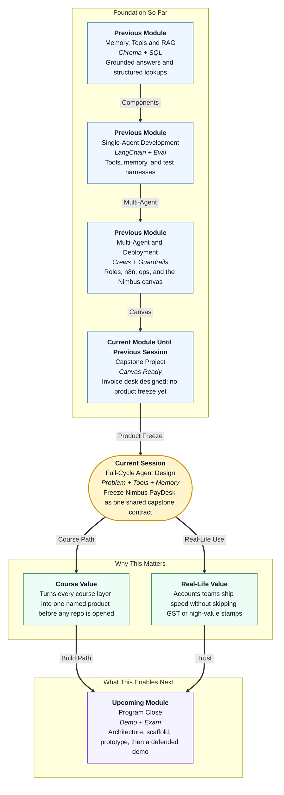

# Pre-read: Full-Cycle Agent Design

## Context of This Session in the Course

---

## The Week the Mailbox Wins

Picture Accounts Payable at **Nimbus Retail** the week before a festival sale. Forty stores. One shared inbox. A few vendor bills are clean. Many have a wrong **GST** number, a missing purchase order, or an amount a junior clerk should never stamp alone.

Vendors call store managers. Store managers call AP. The **CFO** wants the nine-day wait to die. The chartered accountant wants zero surprise payments. Both are right. The pile still grows.

In the **previous** session you drew the **desk**: specialist roles, labelled slips, human gates, and a scoreboard that splits speed from safety. That drawing is a blueprint. It is not yet a product you can demo to a CFO.

This session answers the next question:

> **If we are going to build one real invoice desk in the capstone — not a chatbot that talks about invoices — what must we freeze about the problem, the tools, the memory, and the exam papers before anyone opens a repository?**

That freeze is **full-cycle agent design**. The product name is **Nimbus PayDesk**.

---

## What If You Hired Clerks With No Job Cards?

**What if you told a new team, “Just use an agent framework on the mailbox,” and you never wrote which bills they may touch, which registers they may open, what they must remember, and which test they must fail on purpose?**

They will mix jobs. When a ₹90,000 bill with a dead GSTIN reaches “ready to pay,” nobody can tell whether the bill was misread, the rule was skipped, or a stamp was never required. When leadership asks “are we faster?”, there is a feeling, not a number.

You already know how to *build* agents, *retrieve* policy, *call* tools, *evaluate* traces, and *govern* money paths. Capstone work still fails when the first commit happens before the **contract** exists.

The way through is a full cycle written down: **observe** the bill, **think** with specialists, **act** without moving money, **remember** in the right register, and **prove** it with cases. In simple words — before you hire clerks, you write the job cards, the almirah keys, and the exam.

---

## Think of It Like a Passport Seva File, Not a Printer

A useful picture is still a **passport seva** office — but today we zoom into the **file**, not only the windows.

- **The problem on the token** — “This person needs a booklet without a fake police check.” Not “we will install a new printer brand.”
- **What the file may contain** — Photograph, form, old passport number. Not the applicant’s entire life story stuffed into one WhatsApp chat.
- **Which cupboard holds what** — Today’s token is on the counter. The rule book is on the shelf. Yesterday’s issued list is in the steel almirah. Mixing all three into one drawer is how stations — and GST numbers — get missed.
- **The exam before opening day** — A clean file must pass. A high-risk file must stop. A “please print the booklet now” request must be refused.

**Nimbus PayDesk** is that office for vendor bills. **Intake** creates a ticket. **Extractor** fills a structured slip. **Policy** compares GST, PO, and handbook. **Router** stops a named human when amount, GST, confidence, or a duplicate looks wrong. Nobody at this desk sends **NEFT**.

Memory is the part students skip. Think of three drawers:

| Drawer | Everyday twin | PayDesk twin |
|---|---|---|
| This bill | Whiteboard for the current file | Short-term **ticket packet** |
| Rule book | Binder of “always / never” | Long-term **policy** in a meaning search |
| History register | “Did we already issue this?” | **Ticket log** for duplicates and audit |

A **tool** is a key to a cupboard, not a personality. Policy may *read* the vendor register. It may not *write* the bank. If the GST lookup is down, the desk **fails closed** — send to a human — rather than assume the number is fine.

---

## In this pre-read, you'll discover:

- **Why** a capstone starts by freezing **problem**, **scope**, and **harm type** (here: money) before folders exist
- **How** specialist **agents**, **tools**, and **handoff packets** turn a mailbox into a desk
- **What** **memory architecture** means when policy, this ticket, and last week’s bills must not share one prompt
- **How** **success criteria** and an **evaluation pack** keep speed and safety on separate dials

---

## After This Session, You Will Be Able To

- **State** the PayDesk problem in one sentence a CFO and an engineer both accept
- **Draw** a hard line between prototype scope and live payout
- **List** the tools each specialist may call, including the bank drawer they must not open
- **Place** each fact in short-term, semantic, or episodic memory
- **Write** exam cases the prototype must pass — including at least one case that must **stop**

Upcoming work is **architecture**: which floors the building has (API, agents, databases) once this contract is signed. Do not skip the signature.

---

## Interesting Questions We'll Solve Together

Bring your curiosity to these live challenges:

1. **The CrewAI Screenshot** — A teammate arrives with a framework diagram and no problem sentence. What four things must you demand before that screenshot is allowed to become a folder?

2. **The Three Drawers** — Someone asks, “Did we already pay Kaveri’s ₹18,600 bill last Tuesday?” Which memory drawer answers that, and why is the policy binder the wrong cupboard?

3. **The Festival Bill** — A clean ₹18,600 invoice and a ₹90,000 invoice with a dead GSTIN land in the same hour. What should “success” look like for each, and which number must stay **zero** even if the desk gets faster?

Think of PayDesk as a seva counter that prepares files. The cashier still signs. We will freeze the job cards, the keys, and the exam papers so the next session can draw the building.
