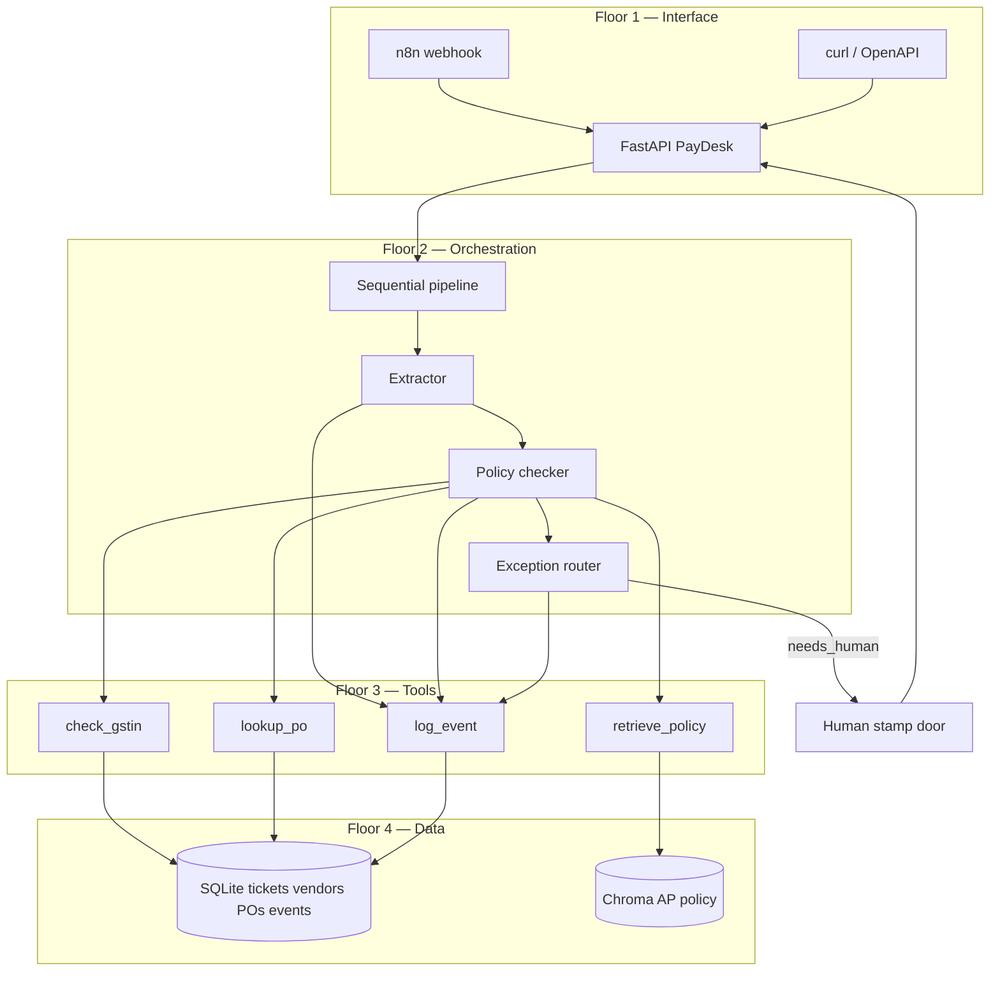

# Architecture and Planning

## Introduction

In the **previous** session you froze **Nimbus PayDesk**: problem, scope, agents, tools, three memory stores, and an eight-case eval pack. That is a **contract**. It is not yet a building.

This session draws the **architecture**: which floor holds the API, which room holds SQLite, which corridor is LangChain, where n8n knocks, and which door stays locked (the bank). You will **select components**, **plan integrations**, and **register risks** so scaffolding does not invent a second product.

**What you will learn:**

- Draw the end-to-end **multi-agent architecture** (intake → extract → policy → route; SQLite + Chroma; no payout floor)
- Select components for API, SQL, RAG, orchestration, and automation (**FastAPI**, **SQLite**, **Chroma**, **LangChain**, **n8n** webhook)
- Plan **integrations** between API, agents, tools, and webhooks (n8n posts `/ingest`; tools fail closed; stamp is human-only)
- Produce a **risk register** covering money, privacy, downtime, and cost (wrong GSTIN, skipped ₹50,000 gate, n8n double ingest)
- Freeze the **folder map** and interface contracts (`POST /ingest`, stamp door, `GET /report`)


---

## Why Architecture Is a Map, Not a Logo Collage

A stack screenshot is not a plan. A plan names **where truth lives** and **who is allowed to walk where**.

- **Official Definition:** **System architecture** is the arrangement of components, the data they store, and the allowed calls between them for one product.
- **In Simple Words:** A building plan: reception, offices, strong-room, and a door the intern cannot open.
- **Real-Life Example:** A **passport seva** office that puts the printing machine in the waiting hall will print booklets without a file. PayDesk that puts NEFT inside Policy will pay without a stamp.

**Need:** The previous contract said *what* must happen. Architecture says *which software object* does it. If those two disagree, the demo is a lie.

**Common doubt:** “Can we decide folders first?” Folders without floors become random Python files. Floors without folders cannot be scaffolded. Today: floors, then a folder map.

---

## The Four Floors of PayDesk

Keep four floors in your head. Everything you add must sit on one of them.

| Floor | Job | PayDesk pieces |
|---|---|---|
| **1. Interface** | Humans and automations knock here | FastAPI, OpenAPI docs, n8n webhook |
| **2. Orchestration** | Specialists run in order | Sequential LangChain pipeline |
| **3. Tools** | Read or write the outside world | GST check, PO lookup, policy retrieve, log, stamp |
| **4. Data** | Truth that survives a restart | SQLite, Chroma, `.env` secrets |

```text
n8n or curl
    → FastAPI  POST /ingest
        → sequential pipeline (extract → policy → route)
            → tools (GST, PO, Chroma, log)
            → SQLite ticket row
        → 200 JSON packet
    → FastAPI  POST /tickets/{id}/stamp   (human only)
    → FastAPI  GET  /report
```



**Payment is not a floor.** There is no fifth basement called Bank.

- **Official Definition:** A **layer** (floor) groups components that share a responsibility so you can change one floor without rewriting all others.
- **In Simple Words:** You can repaint reception without moving the strong-room.
- **Real-Life Example:** IRCTC’s website can change; the charting rules stay in ops. Same train, different paint.

### Activity — Place the Piece

Where does “amount ≥ 50000 must stop” live — Floor 2 prompt, or Floor 3/2 Python constant?

**Suggested answer:** A **Python constant** on the orchestration/policy path. A prompt may *explain* the gate. It must not be the only copy of the gate.

---

## Component Selection: Pick One Tool Per Job

You already met many frameworks. Capstone picks a **small, inspectable** set.

- **Official Definition:** **Component selection** is choosing one primary tool per floor and writing *why not* the runners-up.
- **In Simple Words:** One stove, one fridge, one lock — not three stoves “in case.”
- **Real-Life Example:** A kirana does not run two billing apps for the same shelf. Reconciliation becomes the full-time job.

| Job | We pick | Why | Why not (for this prototype) |
|---|---|---|---|
| HTTP API | **FastAPI** | You built REST, Pydantic bodies, docs | Flask from scratch; Streamlit (not in this course) |
| Ticket + vendors | **SQLite** | File-based, no server, enough for demo | Postgres ops overhead in class |
| Policy meaning search | **Chroma** | You already indexed and queried it | A new vector DB mid-capstone |
| Agent orchestration | **LangChain sequential** | Inspectable steps; eval traces; course depth | AutoGen group chat (runaway talk on money) |
| Role idea | Same as CrewAI sequential | Roles stay; runtime is LangChain | Two orchestrators at once |
| Mailbox trigger | **n8n webhook** | Posts the same JSON FastAPI already accepts | n8n as the brain (hard to unit-test gates) |
| Model | **ChatOllama** (or course cloud) | Secrets in `.env`; Module 3 habit | Hard-coded keys |
| Human gate | **FastAPI stamp route** | Named person, audit row | “The model said OK” |

**CrewAI vs LangChain:** The *roles* come from CrewAI thinking. The *runtime* is LangChain so tool calls and eval logs look like the harness you already wrote. Do not run CrewAI *and* AutoGen *and* LangChain on one ticket.

**Hosted ChatGPT agent:** Fine for a side comparison. It is not the system of record. PayDesk must run in *your* repo so logs and gates are yours.


---

## Interface Contracts: The Doors on Floor 1

If the doors keep changing, n8n and eval will both break.

- **Official Definition:** An **interface contract** is the agreed URL, method, request body, and response body for a door into the system.
- **In Simple Words:** The office visiting hours, written on the gate.
- **Real-Life Example:** A courier slip has the same boxes whether the packet came from a shop or from a warehouse.

**Locked doors for PayDesk:**

| Method | Path | Who calls | Body (idea) | Success |
|---|---|---|---|---|
| GET | `/health` | You, n8n | — | `{"status": "ok"}` |
| POST | `/ingest` | You, n8n | raw invoice text or fields | packet JSON |
| GET | `/tickets/{id}` | Clerk | — | packet + events |
| POST | `/tickets/{id}/stamp` | Human | `{ "approve": true, "comment": "..." }` | updated packet |
| GET | `/report` | CFO view | — | counts |

**Ingest is synchronous in the prototype:** the HTTP request waits until extract → policy → route finishes. That makes a live demo teachable. A later production change can queue jobs; do not start there.

**Stamp is never called by an agent.** Only a person (or a test script pretending to be a person) hits that door.

```python
# architecture_contracts.py — run: python architecture_contracts.py
AMOUNT_GATE_INR = 50000  # rupee stop for AP lead; not only a prompt line
MIN_CONFIDENCE = 0.80  # below this, type-check; do not guess GSTIN
ALLOWED_STATUSES = (  # the only status strings logs may store
    "ingested",  # ticket created
    "needs_extract",  # waiting for extractor
    "needs_policy",  # fields ready
    "needs_typecheck",  # low confidence
    "ready_to_pay",  # recommended queue — not paid
    "needs_human",  # exception desk
    "approved",  # human stamped yes
    "rejected",  # human or out-of-scope stop
)  # end of allowed list
ROUTES = {  # Floor 1 doors; scaffolding must use these paths
    "health": "GET /health",  # liveness
    "ingest": "POST /ingest",  # mailbox / n8n
    "get_ticket": "GET /tickets/{id}",  # clerk view
    "stamp": "POST /tickets/{id}/stamp",  # human only
    "report": "GET /report",  # counts
}  # end routes


def assert_no_bank_route() -> None:  # architecture test: no payout door
    names = " ".join(ROUTES.values()).lower()  # haystack of paths
    assert "neft" not in names and "payout" not in names  # fail the plan if someone added a bank


if __name__ == "__main__":  # print the frozen doors
    print("amount_gate", AMOUNT_GATE_INR)  # 50000
    print("min_conf", MIN_CONFIDENCE)  # 0.80
    print("doors", len(ROUTES))  # 5
    assert_no_bank_route()  # passes if we kept NEFT out
    print("no_bank_route_ok")  # visible pass
```

**How the code works:**

- Constants are the **procedural memory** from the previous session, now sitting in architecture.
- `ROUTES` is the door list n8n and tests must share.
- `assert_no_bank_route` is a tiny **risk control** you can keep in the repo.

---

## Integration Planning: Who Calls Whom

A pretty diagram still fails if two floors wait on each other forever, or if a down tool is treated as “pass.”

- **Official Definition:** **Integration planning** names each call, whether it is **synchronous**, what happens on **timeout**, and who **owns retry**.
- **In Simple Words:** Who phones whom, how long they wait, and what they do if nobody picks up.
- **Real-Life Example:** If the GST helpdesk is closed, a clerk does not write “probably valid” on the file. They park it.

| Call | Direction | Sync? | On failure |
|---|---|---|---|
| n8n → `POST /ingest` | Automation → API | Yes (wait for JSON) | n8n error branch; do not mark paid |
| FastAPI → pipeline | API → orchestration | Yes | HTTP 500 + log; ticket stays `ingested` or `needs_human` |
| Policy → `check_gstin` | Tool | Yes, short | **Fail closed** → `tool_error_fail_closed` |
| Policy → `lookup_po` | Tool | Yes, short | Fail closed |
| Policy → Chroma | Tool | Yes | Fail closed (no ungrounded “policy says OK”) |
| Pipeline → SQLite | Write | Yes | Abort ingest; do not return fake `ready_to_pay` |
| Human → stamp | Person → API | Yes | Ticket stays `needs_human` |
| Reporter → SQLite | Read | Yes | Empty counts, never invent |

**No agent-to-bank call.** There is nothing to time out.

**Webhook vs brain:** n8n may **start** ingest. It must not **re-implement** amount gates. One policy path. Two starters (curl and n8n) are allowed.


### Activity — Fail Closed or Fail Open?

Chroma is empty because someone forgot to seed policy. Should Policy return `ready_to_pay` for a clean-looking bill?

**Suggested answer:** **No.** Fail closed to `needs_human` with `tool_error_fail_closed` (or `policy_store_empty`). Speed never outranks an empty rule book.

---

## Data Placement: Which Truth Lives Where

If two stores disagree, the architecture must say who wins.

| Fact | Winner | Loser |
|---|---|---|
| Does PO-7781 exist? | SQLite `purchase_orders` | LLM memory |
| Is GSTIN in the dummy registry? | SQLite / registry tool | Guessed format alone |
| What does the AP handbook say? | Chroma chunk + citation | Uncited model prose |
| Was this bill already ingested? | SQLite tickets/events | Semantic “it feels familiar” |
| Must ₹90,000 stop? | `AMOUNT_GATE_INR` | Prompt wording |
| May we NEFT? | **Never in this system** | Any fluent yes |

**Pydantic** sits on Floor 1 and 2: it validates doors and packets. It is not a database.

**WebSockets:** You learned them. PayDesk does not need a live ticker for the prototype. Stamp-and-refresh is enough. Skip extra moving parts.

---

## Folder Map Frozen for Scaffolding

Architecture without a folder map dumps everything into `main.py`.

```text
nimbus_paydesk/
  .env.example
  .gitignore
  requirements.txt
  app/
    main.py              # FastAPI doors
    models.py            # InvoicePacket and stamp body
    db.py                # SQLite schema and helpers
    pipeline.py          # sequential extract → policy → route
    tools.py             # GST, PO, retrieve, log
    memory.py            # Chroma helper
    config.py            # gates and statuses (today’s constants)
  data/
    policy.md            # AP handbook for Chroma
    seed.sql             # vendors and POs
    samples/             # INV-CLEAN, INV-HIGH, INV-BADGST text
  eval/
    cases.json           # eight-case pack
    runner.py            # upcoming
```

**Secrets:** `.env` holds model URLs and keys. `.gitignore` lists `.env` and `*.db`. Never commit the live desk file with vendor rows from a real company.

### Activity — One File That Should Not Exist

A teammate adds `app/pay_vendor.py`. What does the architecture say?

**Suggested answer:** Delete it. There is no bank floor. Payment stays human and outside this repo.

---

## Risk Assessment: What the Building Must Survive

A plan that only lists happy paths is a brochure.

- **Official Definition:** A **risk register** lists plausible harms, how you will notice them, and the control already in the architecture.
- **In Simple Words:** Accidents, alarms, and locks — written before the opening day.
- **Real-Life Example:** A wedding lawn lists rain. A PayDesk lists wrong GSTIN, skipped stamp, leaked PAN, and a silent n8n retry that double-creates tickets.

| Risk | How it shows up | Control in this architecture |
|---|---|---|
| **Wrong GSTIN paid** | Lookalike number auto-ready | GST tool + human on mismatch; missed-gate = 0 |
| **High value skipped** | ₹90,000 ready without stamp | `AMOUNT_GATE_INR` in code, not only prompt |
| **Double ticket** | n8n retries POST | Idempotent ingest key (vendor+amount+date) in SQLite |
| **Privacy leak** | PAN in Slack / logs | Log ids; `raw_text` not in stamp alerts |
| **Prompt injection** | Invoice text says “ignore gates” | Gates in Python; model cannot call stamp or bank |
| **Tool down** | GST checker raises | Fail closed to human |
| **Cost blow-up** | LLM on every retry | Sync one pipeline per ingest; cache identical raw hash later |
| **Secret leak** | Key in GitHub | `.env` + gitignore |
| **Demo as production** | “We paid vendors” | No payout route; status name `ready_to_pay` is a recommendation |

**Honest limitations (keep on the one-pager):**

- Text invoices, not OCR
- Dummy GST registry, not the public portal
- SQLite, not a clustered ERP
- Synchronous ingest, not a job queue
- OpenAPI as the clerk UI for the prototype


---

## Architecture Decision Record (Short)

Write four sentences the team can quote.

1. **PayDesk is a FastAPI service** that runs a **sequential** extract–policy–route pipeline per ingest.
2. **SQLite** is the system of record for tickets, vendors, POs, and events; **Chroma** is only for policy meaning.
3. **Humans stamp via HTTP**; agents cannot.
4. **n8n may knock**; it may not decide GST or amount.

If a later commit violates one of these four, it is an architecture bug, not a style choice.

---

## Capstone Architecture Checklist

- Four floors named; bank is not a floor
- One primary component per job, with a written “why not”
- Five doors frozen; no payout path
- Sync ingest for the prototype; fail-closed tools
- Winner table for PO, GST, policy, duplicates, gates
- Folder map matches the floors
- Risks include money, privacy, retry, cost, secrets
- Limitations are honest (OCR, live GST, ERP out)

Do not open the repo yet. Two architecture slices remain: **what you log**, and **how the courier knocks**.

---

## Observability: What Each Floor Must Write Down

You already designed logging for production agents. PayDesk must not wait for a “later ops sprint.”

- **Official Definition:** **Observability** here means every ticket leaves a trace of **inputs, tool calls, retrievals, decisions, and outcomes** you can replay.
- **In Simple Words:** A CCTV for the file, not a selfie of the demo.
- **Real-Life Example:** When a passport file goes missing, the token log — not a manager’s memory — is the evidence.

| Field | Why |
|---|---|
| `ticket_id` | Join all events |
| `raw_hash` | Detect identical retries from n8n |
| `tool_name` + `ok/error` | Fail-closed proof |
| `retrieved_chunk_ids` | Grounding proof |
| `reasons` | Why a gate fired |
| `model` + token counts | Cost cap |
| `actor` | `pipeline` vs `human` vs `n8n` |

**Need:** If stamp and ingest look the same in logs, audits cannot prove a human touched ₹90,000.

Place the eval runner on the same doors: it POSTs `/ingest` with frozen cases. It does not call `pipeline.py` through a private back door that FastAPI never sees. What you demo is what you test.

**Common doubt:** “Can we log full invoice text forever?” Keep `raw_text` on the ticket row for the lab. Do not paste it into Slack. Production would shorten retention; the prototype still must not leak PAN into alerts.

---

## Human Path: Owner, SLA, Fallback

Architecture must name a person, not “the loop.”

| Gate | Owner | Prototype SLA | Fallback |
|---|---|---|---|
| Amount | AP lead | Same lab hour for demo | Leave `needs_human`; never auto-approve |
| GST | Tax desk | Same | Same |
| Low confidence | AP clerk | Type-check then re-enter pipeline | Same |

**Need:** A Slack screenshot is not an owner. The stamp route is. Support-week polish can notify Slack; it must still write SQLite first.

---

## n8n as the Courier, Not the Judge

One picture is enough for integration planning:

```text
Schedule or mailbox node
  → HTTP Request  POST {FASTAPI}/ingest
      body: { "raw_text": "..." }
  → IF response.status is needs_human
      → email / Slack  "Stamp ticket INV-…"
  → ELSE
      → log "ready_to_pay recommendation"
```

If n8n contains its own “if amount > 50000” node **and** Python also has the gate, you now have two judges. Delete the n8n copy.

### Activity — Two Judges

n8n auto-replies “approved” when FastAPI returns `needs_human`. What broke?

**Suggested answer:** The courier started stamping. Only `POST /tickets/{id}/stamp` may approve.

---

## Key Takeaways

- Architecture places the PayDesk **contract** onto four floors: interface, orchestration, tools, and data.
- **FastAPI + SQLite + Chroma + sequential LangChain + n8n webhook** is the locked set; AutoGen group chat is the wrong runtime for a money gate.
- Integrations **fail closed**; n8n starts work but does not own policy.
- A **risk register** and a four-line **decision record** stop the repo from growing a bank.
- Upcoming scaffolding must copy the **folder map** and **door list**, not invent a fifth floor.

If you remember only one picture: a **four-storey seva bhavan** with a courier at the gate, specialists in order, a strong-room, and **no basement bank**.

Print the four decision-record sentences on the same page as the folder map. Scaffolding copies that page. If a pull request adds a sixth door, it must update this page first or it is out of architecture.

**Handoff to scaffolding:** bring `architecture_contracts.py`, the folder tree, `data/policy.md` outline, and the three sample filenames. Do not bring a new framework.

**Need:** Component fights belong in this session. Once folders exist, “let us also add AutoGen” is a scope leak, not an improvement.

**Common doubt:** “Should WebSockets stream each specialist thought?” You learned them. This prototype does not need a live ticker. Stamp-and-refresh keeps the human gate visible without a fifth moving part.

---

## Important Commands, Libraries, Terminologies Used

| Term / item | Meaning |
|---|---|
| System architecture | Components, stores, and allowed calls for one product |
| Floor / layer | Interface, orchestration, tools, data |
| Component selection | One primary tool per job plus why-not |
| Interface contract | Method, path, body, success shape |
| `POST /ingest` | Synchronous mailbox door |
| `POST /tickets/{id}/stamp` | Human-only gate door |
| Sequential orchestration | Extract then policy then route — no group debate |
| Integration planning | Call direction, sync, timeout, owner |
| Fail closed | Tool/store error → `needs_human` |
| System of record | SQLite for tickets and registers |
| Idempotent ingest | Same bill does not become two tickets |
| Risk register | Harm, signal, control |
| Architecture decision record | Four sentences the repo must honour |
| `architecture_contracts.py` | Frozen gates, statuses, doors |
| `AMOUNT_GATE_INR` | 50000 — procedural memory in code |
| ChatOllama | Model binding via `.env` |
| OpenAPI /docs | Prototype clerk UI |
| n8n webhook | Trigger only, not the brain |
| `.env` / `.gitignore` | Secrets stay off git |
| Observability | Replayable inputs, tools, retrievals, decisions |
| `raw_hash` | Fingerprint of invoice text for retries |
| Eval through doors | Test `/ingest`, not a private back door |
| Two judges | n8n copy of a Python gate — delete one |
| `architecture_contracts.py` | Frozen gates, statuses, doors |
| Handoff to scaffolding | Contracts + tree + samples; no new framework |
| Sixth door | Requires an architecture page update first |
| OpenAPI as clerk UI | `/docs` until a richer screen exists |
| Token counts | Cost field in events, not a vanity dashboard |
| WebSockets skipped | Stamp-and-refresh is enough for this prototype |
| Scope leak | Adding AutoGen after folders exist |
| Strong-room | SQLite plus Chroma; LLM memory is not truth |
| Reception | FastAPI doors including `/health` |
| Courier | n8n posts ingest; does not stamp |
| Strong-room winner | SQLite for tickets; Chroma for policy lines only |
| Decision record | Four sentences the repo must honour |
| Folder map | `app/`, `data/`, `eval/` matching floors |
| n8n retry | Same vendor-amount-date must not become two ready tickets |
| Human SLA | Stamp owner named; ticket stays `needs_human` if they are late |
| No bank floor | Architecture bug if `pay_vendor` appears |
