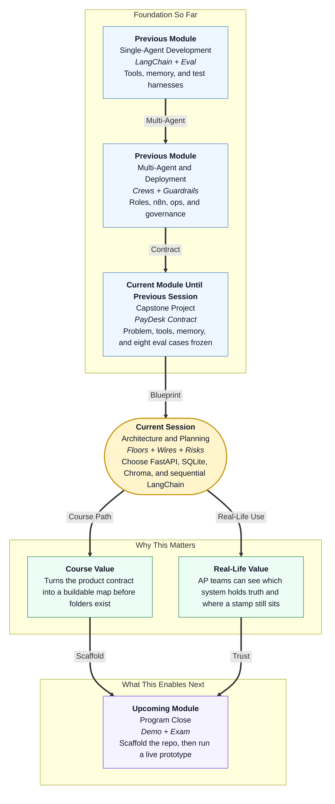

```mermaid
%%{init: {'flowchart': {'nodeSpacing': 55, 'rankSpacing': 70, 'diagramPadding': 20}} }%%
flowchart TB
    subgraph Foundation["Foundation So Far"]
        M3["<b>Previous Module</b><br/>Single-Agent Development<br/><i>LangChain + Eval</i><br/>Tools, memory, and test harnesses"]
        M4["<b>Previous Module</b><br/>Multi-Agent and Deployment<br/><i>Crews + Guardrails</i><br/>Roles, n8n, ops, and governance"]
        CM["<b>Current Module Until Previous Session</b><br/>Capstone Project<br/><i>PayDesk Contract</i><br/>Problem, tools, memory, and eight eval cases frozen"]
    end

    CS(["<b>Current Session</b><br/>Architecture and Planning<br/><i>Floors + Wires + Risks</i><br/>Choose FastAPI, SQLite, Chroma, and sequential LangChain"])

    subgraph Value["Why This Matters"]
        CV["<b>Course Value</b><br/>Turns the product contract into a buildable map before folders exist"]
        RV["<b>Real-Life Value</b><br/>AP teams can see which system holds truth and where a stamp still sits"]
    end

    subgraph Future["What This Enables Next"]
        U1["<b>Upcoming Module</b><br/>Program Close<br/><i>Demo + Exam</i><br/>Scaffold the repo, then run a live prototype"]
    end

    M3 ==>|&nbsp;Multi-Agent&nbsp;| M4
    M4 ==>|&nbsp;Contract&nbsp;| CM
    CM ==>|&nbsp;Blueprint&nbsp;| CS
    CS ==>|&nbsp;Course&nbsp;Path&nbsp;| CV
    CS ==>|&nbsp;Real-Life&nbsp;Use&nbsp;| RV
    CV ==>|&nbsp;Scaffold&nbsp;| U1
    RV ==>|&nbsp;Trust&nbsp;| U1

    classDef previous fill:#eef6ff,stroke:#4b83c4,color:#111827;
    classDef current fill:#fff4cc,stroke:#c79200,color:#111827,stroke-width:2px;
    classDef value fill:#ecfdf5,stroke:#2f855a,color:#111827;
    classDef future fill:#f5f3ff,stroke:#7c3aed,color:#111827;

    class M3,M4,CM previous;
    class CS current;
    class CV,RV value;
    class U1 future;
    linkStyle default stroke-width:3px;
```
