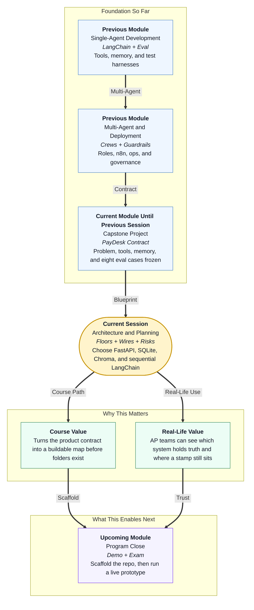

# Pre-read: Architecture and Planning

## Context of This Session in the Course

---

## A Contract Without a Building

You already know **Nimbus PayDesk** as a job: cut a nine-day vendor wait without paying a wrong **GSTIN** or skipping a high-value stamp. In the **previous** session you froze who observes the bill, who thinks, who acts, which cupboard holds policy, and which exam papers the desk must sit.

That is a **contract**. A contract does not tell a carpenter where the strong-room sits.

This session answers:

> **If PayDesk is a real office, which floor is reception, which room holds the registers, which corridor the specialists walk, who knocks from outside, and which door must never exist?**

That drawing is **architecture and planning**. Until it exists, every teammate will invent a different product in a different folder.

---

## What If You Built Three Offices for One Desk?

**What if one person started a group-chat of agents, another wrapped everything in a hosted chatbot, and a third put payment inside the policy prompt — all for the same Nimbus mailbox?**

You would get three demos and zero system. When GST lookup is down, one office would guess “valid,” another would crash, and a third would still talk as if the bank had been called. The CFO cannot fund a collage of logos.

You have already used **FastAPI**, **SQLite-style registers**, **Chroma**, **LangChain**, **CrewAI roles**, **n8n**, and **guardrails**. The skill now is *selection*: one primary tool per job, and a written reason the runners-up stay on the bench.

Think of a **kirana** that runs two billing apps for the same shelf. Reconciliation becomes the full-time job. PayDesk cannot afford two brains for GST.

A noisy **group debate** among agents is a poor runtime when rupees are on the counter. Roles can still look like a crew. The walk through the office should be **in order**: extract, then policy, then route — like token windows, not a shouting match.

---

## Think of It Like a Four-Storey Seva Bhavan

A useful picture is a small government **seva bhavan** — not a mall with twenty atriums.

- **Floor 1 — reception** — People and couriers knock on labelled windows. Health check, ingest a bill, read a ticket, human stamp, weekly counts. A courier automation (**n8n**) may knock on ingest. It does not sit inside and rewrite rules.
- **Floor 2 — specialist offices** — Extract, policy, and routing happen **in order**. The supervisor does not rewrite the numbers on the slip.
- **Floor 3 — the workshop** — GST check, purchase-order book, policy binder search, audit log. Tools read or write. They do not “have opinions” that override a rupee gate.
- **Floor 4 — the strong-room** — Tickets, vendors, POs, and events in a file database; policy paragraphs in a meaning search. The language model’s memory is **not** the strong-room.

There is **no basement bank**. The cashier still signs **NEFT** in the finance office down the road. If your plan grows a pay-vendor window, the architecture has already failed.

When the GST helpdesk is closed, a good clerk **fails closed** — parks the file — rather than writing “probably fine.” Architecture must say the same for a down tool or an empty policy shelf. A clean-looking ₹18,600 bill with an empty handbook must still stop.

Risks are the rain plan on a wedding card: wrong GSTIN, skipped ₹50,000 stamp, the same bill ingested twice because a webhook retried, PAN leaking into a chat, a secret key committed to GitHub. Each risk needs a lock you can point to on the floor plan, not a hope that the model will “be careful.”

You will also freeze **doors** so the courier and the exam papers knock in the same place: health, ingest, fetch ticket, stamp, report. If those names keep changing, automation and tests both break.

---

## In this pre-read, you'll discover:

- **Why** a product contract still needs a **floor plan** before anyone creates folders
- **How** to **select** one component per job — API, database, retrieval, orchestration, trigger — without collecting every framework you ever met
- **What** **integration** means when n8n knocks, tools fail, and a human still stamps
- **How** a short **risk register** stops the repo from growing a payout door

---

## After This Session, You Will Be Able To

- **Sketch** PayDesk as four floors: interface, orchestration, tools, data
- **Defend** FastAPI, SQLite, Chroma, sequential LangChain, and an n8n webhook as the locked set
- **Name** who calls whom, and what “fail closed” does when a lookup is down
- **List** money, privacy, retry, and cost risks with a control already on the plan
- **Hand** scaffolding a folder map and a door list that match the building

Upcoming work **creates the rooms**: virtual environment, files, schema, a health window that returns ok. Do not reopen the bank debate while making folders.

---

## Interesting Questions We'll Solve Together

Bring your curiosity to these live challenges:

1. **The Group Chat Temptation** — Three agents can talk until they agree. Why is that a poor **runtime** for an amount gate, even if the *roles* still look like a crew?

2. **The Empty Binder** — Policy retrieval returns nothing because the handbook was never loaded. Should a clean-looking ₹18,600 bill go to “ready to pay”? What does fail closed look like on the floor plan?

3. **The Extra File** — A teammate adds a pay-vendor script “only for the demo.” Which floor did they invent, and how would you explain the refusal to a CFO in four sentences?

Imagine walking a vendor bill from the reception window to the strong-room without ever opening a bank vault. That walk is the architecture we will freeze so the next session can put files on disk.
