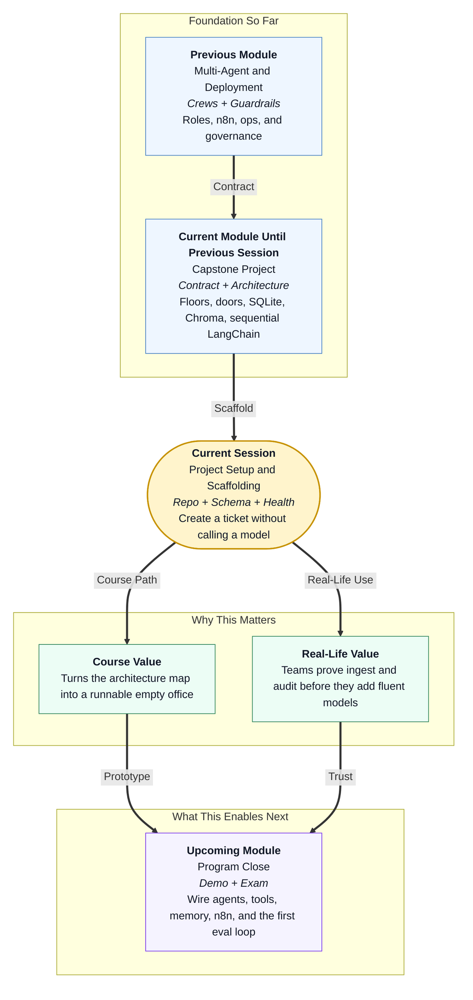

```mermaid
%%{init: {'flowchart': {'nodeSpacing': 55, 'rankSpacing': 70, 'diagramPadding': 20}} }%%
flowchart TB
    subgraph Foundation["Foundation So Far"]
        M4["<b>Previous Module</b><br/>Multi-Agent and Deployment<br/><i>Crews + Guardrails</i><br/>Roles, n8n, ops, and governance"]
        CM["<b>Current Module Until Previous Session</b><br/>Capstone Project<br/><i>Contract + Architecture</i><br/>Floors, doors, SQLite, Chroma, sequential LangChain"]
    end

    CS(["<b>Current Session</b><br/>Project Setup and Scaffolding<br/><i>Repo + Schema + Health</i><br/>Create a ticket without calling a model"])

    subgraph Value["Why This Matters"]
        CV["<b>Course Value</b><br/>Turns the architecture map into a runnable empty office"]
        RV["<b>Real-Life Value</b><br/>Teams prove ingest and audit before they add fluent models"]
    end

    subgraph Future["What This Enables Next"]
        U1["<b>Upcoming Module</b><br/>Program Close<br/><i>Demo + Exam</i><br/>Wire agents, tools, memory, n8n, and the first eval loop"]
    end

    M4 ==>|&nbsp;Contract&nbsp;| CM
    CM ==>|&nbsp;Scaffold&nbsp;| CS
    CS ==>|&nbsp;Course&nbsp;Path&nbsp;| CV
    CS ==>|&nbsp;Real-Life&nbsp;Use&nbsp;| RV
    CV ==>|&nbsp;Prototype&nbsp;| U1
    RV ==>|&nbsp;Trust&nbsp;| U1

    classDef previous fill:#eef6ff,stroke:#4b83c4,color:#111827;
    classDef current fill:#fff4cc,stroke:#c79200,color:#111827,stroke-width:2px;
    classDef value fill:#ecfdf5,stroke:#2f855a,color:#111827;
    classDef future fill:#f5f3ff,stroke:#7c3aed,color:#111827;

    class M4,CM previous;
    class CS current;
    class CV,RV value;
    class U1 future;
    linkStyle default stroke-width:3px;
```
