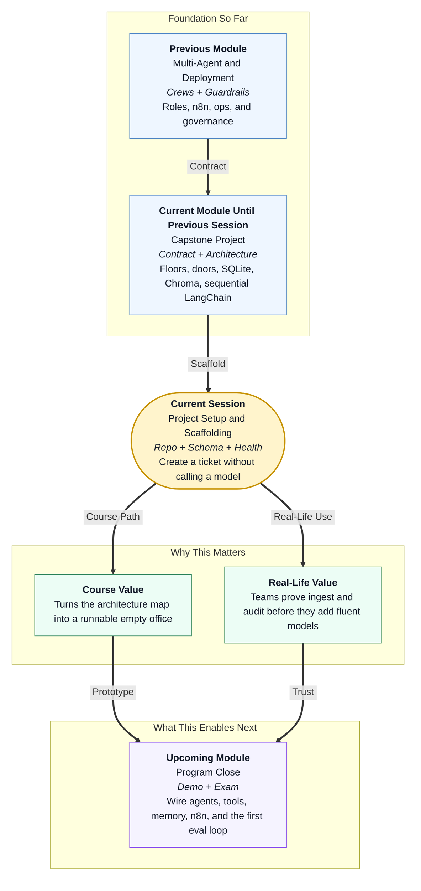

# Pre-read: Project Setup and Scaffolding

## Context of This Session in the Course

---

## Opening Day Without the Printer

Imagine a **passport seva** counter that insists on installing the colour printer before it has tokens, files, or a register. Citizens arrive. Staff talk fluently about passports. Nobody can find yesterday’s token number after lunch.

**Nimbus PayDesk** is at that same risk. You already froze the **contract** (problem, tools, memory, exams) and the **architecture** (four floors, five doors, no bank). None of that exists on disk yet.

This session answers:

> **What is the smallest office we can open today — folders, lock combination, register book, and a reception window — so a vendor bill becomes a ticket that still exists after we restart the laptop?**

That skeleton is **project setup and scaffolding**. Success is deliberately boring: health says ok, ingest writes a row, fetch reads it back. No model required.

---

## What If the First Commit Was a Chat Window?

**What if you started the capstone by pasting invoices into a notebook chat, got a fluent “ready to pay,” and only then asked where the file was saved?**

You would have a demo you cannot audit. Restart the kernel and the nine-day problem is back, plus a new problem: nobody can prove a human stamped ₹90,000. The CFO cannot fund a disappearing desk.

You have already built **FastAPI** apps, **Pydantic** packets, and **SQLite-style** access. Scaffolding is those skills aimed at PayDesk doors: health, ingest, get ticket. Extract, policy, and routing stay as labelled empty rooms so you do not secretly invent a payout script while making folders.

Secrets belong in a local environment file that git ignores. The committed file is a **blank form**. Copying a live key into GitHub is the digital version of photocopying a PAN card onto a notice board.

Connecting **SQL** today is not “database class.” It is the strong-room waking up. Tickets, events, vendors, and purchase orders must live in tables before any specialist talks. If ingest only prints a reply in memory, a restart wipes the audit.

---

## Think of It Like Labelling Rooms Before Furniture

A useful picture is moving into a small office:

- **The keys** — a virtual environment so course libraries do not fight with other projects; a git ignore list so the desk database and secrets never travel to GitHub.
- **The nameplates** — an app room for code, a data room for the handbook and sample bills, an eval room for exam papers. An empty pipeline file is a locked specialist office, not a junk drawer.
- **The register** — four tables: tickets, events, vendors, purchase orders. Vendors **Kaveri** and **Nilgiri** with dummy GST numbers. Purchase orders **PO-7781** and **PO-8802**. Unknown GSTIN `99INVALID` must *not* be in the book — otherwise the tax gate can never fire.
- **The reception window** — FastAPI docs. You post a labelled slip (`Vendor: …`). You get a ticket id with status **ingested**. You fetch it after restart. That is the **system of record** waking up.
- **The handbook on the shelf** — a short policy file that still sits as a document. Meaning search comes next. Putting it in the repo today means retrieval has something honest to index.

Labelled sample invoices are not a cheat. They are like a clerk’s typing for the lab so exams stay stable. Production extract will read messier prose. Today we do not block opening day on a model key.

If a teammate adds a pay-vendor file “just to complete the folders,” they have built a basement the architecture banned. Delete it. The cashier still sits in finance, not in this repo.

A second ingest of the same ticket id should update the row, not crash. That is how a courier retry and a re-run of an exam stay honest.

---

## In this pre-read, you'll discover:

- **Why** the first runnable PayDesk must **write a ticket** before it talks like an agent
- **How** a **virtual environment**, **secret file**, and **gitignore** keep keys and desk data off GitHub
- **What** belongs in **SQL** on opening day versus what waits in empty pipeline files
- **How** you will **prove** the office is open with health, ingest, and a restart test

---

## After This Session, You Will Be Able To

- **Create** the PayDesk repo layout that matches the architecture folder map
- **Load** dependencies without committing secrets or the desk database
- **Store** an ingested bill as a row with an audit event
- **Seed** the vendor and PO registers the policy tools will later read
- **Show** health and docs as the reception desk

Upcoming work **hires the clerks**: GST and PO tools, policy retrieval, sequential LangChain, a human stamp door, three live exam cases, then a courier workflow. They should walk into rooms that already exist.

---

## Interesting Questions We'll Solve Together

Bring your curiosity to these live challenges:

1. **The Disappearing Ticket** — Ingest works in a notebook variable but fetch after restart is empty. Which floor did you skip, and what proves the register is real?

2. **The Friendly Seed** — A teammate inserts `99INVALID` into the vendor table “so demos never fail.” Which exam case becomes impossible, and why is that a safety bug rather than a convenience?

3. **The Extra Dependency** — Someone adds a bank library on scaffolding day. How do you refuse it using the architecture decision record, in four sentences a CFO would accept?

Walk in ready to type. We will open a quiet office: keys, rooms, register, reception lamp. The talking specialists arrive in the next session — into a building that already keeps files.
