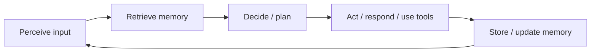

# Introduction to Memory in AI Agents

Picture an assistant who answers one question beautifully—and then **forgets you exist**. You spell your goal again, re-upload the same constraints, and watch the same mistake creep back because nothing from the last ten minutes “counts.” That frustration is not a small UX annoyance; it is a **design** signal. The models behind many agents can be extraordinarily capable in a single slice of text, yet the **system around** them decides whether intelligence **accumulates** or **resets**. This session starts at the hinge point: **memory**—what it is for agents, why it changes what “smart” feels like, and how teams think about it without drowning in jargon.

If you have ever abandoned a long chat because the thread “lost the plot,” you already know why this topic earns its own introduction. Join us to trade that vague annoyance for a **shared vocabulary**—stateless versus stateful, working memory versus long-term memory, external stores versus what lives in the prompt—and to see how memory threads through the **whole life** of an agent: not a side feature bolted on at the end, but part of **perceive, decide, act, remember**. You will leave with mental models you can use in the next conversation about agents, whether you are building, evaluating, or simply choosing tools for a team.

---

## Agents, goals, and why “memory” is not optional

In this course, an **AI agent** is more than a chat box that emits text. It is a loop: **take in** signals about the task or environment, **reason** about what to do next (sometimes calling tools, APIs, or search), and **act**—then loop again toward an outcome. The emphasis on **goals carried across steps** is deliberate. A one-shot Q&A can hide missing memory if the user packs everything into one message. Real workflows rarely look like that. They look like: “here is our codebase,” “ignore module A,” “that approach failed—try another,” “remember I am on a deadline.” Each line depends on **prior lines having counted**.

**Memory** is the system’s ability to **retain** information that may matter later and to **retrieve** it when it should influence the next move. It is not mysticism; it is the difference between treating each request as an isolated island versus building a **trail** the agent can walk. Memory feeds **context awareness** (what situation we are in), **continuity** (what we already agreed or decided), and **stronger decisions** (what failed, what we should not repeat, what the user cares about). Without any designed memory, the loop still runs—but it behaves like **groundhog day**: fresh, blind, and costly for the human operator.

---

## Why agents need memory in the wild

Most valuable tasks are **extended** in time. You might be co-authoring a spec, walking through a customer ticket, planning travel with evolving constraints, or narrowing down a research question across several clarifications. In each case, users implicitly assume a **thread of meaning**: names, preferences, intermediate conclusions, and open edges (what is still unknown) should **carry**. When that thread snaps, the cognitive load jumps back to the user—they become the sole **backup memory** for the system.

Memory is also how agents get closer to **judgment** rather than **parroting**. If the agent never persists anything, it cannot systematically learn from **what just happened** inside the session (e.g., “the user rejected that format twice”). The best single reply is not enough when the task is **sequential** or **corrective**. So memory is one of the bridges between a polished demo and something you would actually trust for ongoing work. Our discussion will connect these needs to how products are built: what gets stored automatically, what is opt-in, how summaries replace raw logs, and where **human trust** intersects **technical storage**—without requiring you to know a specific vendor stack upfront.

---

## Stateless agents: power with amnesia

A **stateless** agent, in the sense we use here, does **not** reliably keep usable **state** between turns unless the user re-supplies it in the current input. Sometimes every scrap of context must be squeezed into the next prompt because **nothing official** was saved from before. The underlying model might still be large and trained on vast data—but **your** conversation is not automatically part of that inheritance.

Statelessness is not “dumb.” It can simplify operations: deterministic testing, fewer moving parts, and a crisper story about what data exists at rest. But it surfaces sharp **limitations** in real settings:

- **Repetition fatigue.** Users restate goals, names, file paths, and bans (“do not mention X”) over and over.  
- **Broken multi-step work.** Sub-results from step two vanish by step five unless manually pasted back in.  
- **Corrections that evaporate.** A preference like “use metric units” or “my brand voice is formal” does not **latch** unless repeated or engineered elsewhere.  
- **Weaker accountability.** Without a stored trace of decisions, reconstructing “why did it do that?” is harder for users and auditors.

Recognizing these gaps is the first step toward asking what minimal memory would cost—and what it would buy. In session we will make this concrete with behaviors you can recognize instantly, even if you never peek under the hood.

---

## Stateful agents: continuity as a design choice

A **stateful** agent **maintains** information across interactions so later steps can build on earlier ones—through explicit storage, structured summaries, user profiles, vector stores, or other patterns. “Stateful” does **not** mean “remember absolutely everything forever.” It means someone decided **what** is worth persisting, **how** it is keyed and retrieved, and **when** it should decay or be corrected.

That shift unlocks recognizable wins:

- **Reuse** of context and partial plans without forcing the user to become a human clipboard.  
- **Repair that sticks:** misunderstandings can be corrected once and reflected downstream.  
- **Longer arcs** of work—drafts, revisions, branching alternatives—without the dialogue constantly snapping back to zero.

Stateful design introduces real questions we will air honestly: stale memories that argue with fresh facts, privacy and consent (who owns what is stored?), and “memory bugs” where the wrong snippet is retrieved and steers the model confidently wrong. The point of the session is not to pretend memory is free—it is to show **why** teams adopt it despite the trade-offs, and **how** the lifecycle of store / retrieve / use keeps those trade-offs visible.

---

## Types of agent memory: a practical mental map

Systems vary in naming, but three layers appear again and again. Treat them as **lenses**, not mandatory checkboxes on a single product.

**Short-term or working memory** is what sits in the **active window**: recent turns, the current plan, scratch notes from the last few actions. It shapes the **immediate** next step. Think of it as the desk surface—easy to reach, easy to knock over if the window is too short or too noisy.

**Long-term memory** is what can survive **sessions, days, or accounts**: durable preferences, stable facts the user asked to retain, consolidated summaries of a project. It usually demands explicit rules for **write**, **update**, and **forget**, because indiscriminate accumulation turns into baggage and risk.

**External memory** is information **outside** the model’s weights and often outside the raw chat log: structured databases, document collections, calendars, CRM rows, code repositories. The agent **queries** or **reads** slices of it when needed. This is how agents avoid pretending the whole world fits in one prompt—and how organizations connect agents to **systems of record** rather than only to chat text.

Together, these types explain why “memory” in product announcements can mean three different things at once. Our session will tie each type to familiar patterns (summarization, retrieval, tool-mediated reads) so you can listen to architecture discussions with confidence.

---

## Memory in the agent lifecycle: store, retrieve, use

Memory is easiest to misunderstand when imagined as a static vault. In practice it is **cyclical**. After the agent **perceives** new input and **acts**, some outcomes merit **writing** to storage—a turn, a structured fact, a compressed summary, an embedding for search. Before the next **decision**, relevant traces are **read back**—recent dialogue, profile fields, search hits from a store. Those retrieved pieces **shape** reasoning and tool choice: what to verify, what to avoid redoing, what question to ask next.

Seeing the loop makes two things obvious. First, memory is co-equal with **planning** and **action**, not an afterthought. Second, product choices (what shows up as “saved,” what users can delete, what never leaves the device) sit on the same path as engineering choices (where vectors live, how summaries are refreshed). Bringing both into one picture is exactly what makes this introduction worth showing up for—you stop treating “memory” as a mystical upgrade and start seeing it as **design all the way down**.

---

By the time we are in the room together, the vocabulary should feel **earned**, not memorized: **agent** as a perceive–decide–act loop that can carry goals; **memory** as the machinery that keeps context, continuity, and better decisions from collapsing back into isolated answers; **stateless** setups that force humans to be the backup brain; **stateful** setups that buy continuity at the price of design discipline; **short-term**, **long-term**, and **external** memory as three ways “remembering” actually happens in products. Bring one story from your own use—a moment when forgetting felt absurd, or when remembering **too much** felt wrong. Those stories are what turn diagrams into live debate, and they are welcome fuel from the first minute.
