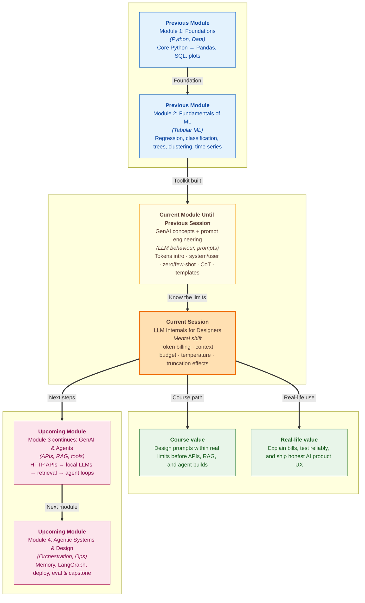

# Pre-read: LLM Internals for Designers

Your team ships a **campus library FAQ bot**. Week one, the bill is ₹800. Week four, after a viral exam-season spike, the invoice hits ₹42,000. The product manager asks: *"Did we get hacked — or did we just not know how the thing is priced?"*

Meanwhile, a student opens the same bot on Friday and asks about **Sunday hours** — the answer is perfect. On Monday, after forty messages in the same chat, they ask about **late fines**. The bot replies cheerfully about **hostel curfew rules** — a topic it was told to refuse on day one. Nothing was "broken." The **early instructions silently fell out of memory**.

Same model. Same system prompt file. Two failures that **prompt wording alone** cannot explain — one is **money**, one is **memory limits**.

In the **previous session**, you learned **prompt engineering** — how **system** and **user** roles split stable rules from live questions, how **zero-shot** and **few-shot** examples lock format, how **chain-of-thought** steps guide multi-step reasoning, and how **reusable templates** keep beginner agents consistent. That tells you *what to write*. This session tells you *what the model can actually hold, what it costs, and why two test runs differ* — the **internals every designer must respect** before building agents at scale.

---

## Context of This Session in the Course

---

## What if your AI assistant had a fuel tank — but nobody told you the size?

Picture a **Zomato delivery app**. The product team does not cook biryani — but they must know restaurant prep time, rider capacity, and peak-hour delays to show an **honest ETA**. If they guess, customers lose trust even when the app looks polished.

An **LLM-powered feature** works the same way. You do not train the model — but you must know its **fuel tank size** (**context window**), **meter reading** (**token count**), and **accelerator sensitivity** (**temperature**). Providers bill and limit by **tokens**, not by sentences you typed or pages you pasted. A Hindi–English mixed message often costs **more tokens than it looks**. A JSON payload or code snippet splits into many small pieces. Judging prompt size by **word count** is how surprise invoices happen.

Every agent packs **system rules + few-shot examples + retrieved documents + chat history + user input + reply** into **one shared window**. Overspending any layer breaks the others — a long system prompt with ten examples may leave no room for message thirty, and the model **drops the oldest turns first**, including early user instructions that never lived in the system slot.

> **Think of it like a fixed-size tiffin box.** System rules, examples, history, documents, and the reply **share the same box**. A **NEET aspirant** during a timed test can only reference the **last ten pages** of their notebook — not because they forgot page one, but because the **window** is full.

---

## The spice dial that changes every test run

You write two prompt variants and run each three times. Variant A always returns the same JSON keys. Variant B sometimes says `"status": "approved"` and sometimes `"status": "pending"` — with **identical prompts**. Your manager asks which wording is better. You cannot answer if **randomness** was not controlled.

**Temperature** is the **spice dial on chai** — low heat gives nearly the same taste every time; high heat changes the flavour batch to batch. Near **zero**, the model picks the most predictable next word — ideal for fee amounts, classification labels, and JSON extraction. Around **0.7**, wording shifts slightly — fine for FAQ tone tests. Above **1.0**, creativity rises — useful for taglines, risky for compliance answers. Some providers offer a **seed** to fix the random draw for debugging; when seed is unavailable, use **low temperature** and compare **structure**, not exact words.

Three forces pull in different directions when you design LLM features:

| Force | What increases it | What you feel |
|---|---|---|
| **Billing** | More input tokens + longer outputs | Higher monthly API bill |
| **Latency** | More tokens to read and write | Slower response for users |
| **Quality / safety** | Rich system prompt, few-shot demos, grounding context | Better format — but heavier prompt |

Design is **budget allocation**, not "more prompt = always better."

---

In this pre-read, you'll discover:

- **Understand** why providers bill by **tokens** — not words — and how to audit a real prompt stack for **cost**, **latency**, and **length trade-offs**
- **Learn** how the **context window** shapes choices for **system prompts**, **few-shot examples**, and **conversation history** — and why critical rules must live in the system slot
- **Discover** how **temperature** and **seed** trade **creativity vs consistency** when you test prompt variants fairly
- **Predict** what users see when context is **truncated or overloaded** — forgotten instructions, tone drift, and sudden factual slips in long chats

---

## Words you will hear — explained right away

- **Token:** The smallest text unit the model processes — often a word, subword, or punctuation chunk. APIs charge and limit by tokens, not by sentences.
- **Context window:** The maximum tokens one API call can hold — your full input **plus** the model's generated reply, all in one shared limit.
- **Temperature:** A control (usually 0.0–2.0) for how random the model is when picking each next word — low for predictable answers, high for creative ones.
- **Seed:** When supported, a fixed random seed so the same prompt produces the same output — useful for debugging.
- **Truncation:** What happens when chat history or pasted documents exceed the window — oldest content drops first, often silently.
- **Token audit:** Measuring each layer of a prompt — system, examples, context, history, user message — to see where budget is spent.

---

## What's next

After this session, you should be able to:

- **Measure token counts** for a real multi-layer prompt and estimate **cost per message** and **cost at scale**
- **Allocate context budget** across system rules, few-shot examples, retrieved text, history, and reply reserve — and know what to trim first
- **Choose temperature settings** for factual tasks vs creative tasks — and run fair **A/B tests** on prompt variants
- **Diagnose long-chat failures** — scope drift, forgotten rules, tone changes — as **context overflow**, not "the model got confused"
- **Design honestly** for **bilingual or code-heavy apps** where token counts exceed what word counts suggest

The **upcoming** session connects these limits to **HTTP APIs** and **JSON** — live data that also consumes tokens when mapped into prompts. Knowing your **window and bill** first makes those integrations sane instead of expensive surprises.

---

## Questions we will unpack live

1. Your **library FAQ bot** uses a 350-token system prompt, two few-shot examples (280 tokens), a 600-token FAQ chunk, and grows chat history by ~120 tokens per turn on an **8,192-token** model. After how many turns does something get dropped — and which user-visible symptom appears when the bot suddenly answers **off-scope** questions it refused on message one?

2. Two teammates test the same refund-classification prompt. One runs at **temperature 0**, one at **temperature 1.2**. They argue about which prompt wording is better based on a single run each. What is wrong with the test design — and what settings would give a fair comparison?

3. A startup pastes a **40-page policy PDF** into every user message because their model advertises a **128k context window**. The feature works — but the bill triples and responses feel sluggish. Which internal concepts explain both problems — and what design change would you propose first?

Come ready with one prompt you wrote in the **previous session**. If you can guess its word count and its **token count**, you already have material for the live audit exercise. The shift from *"I wrote good instructions"* to *"I designed within the model's fuel tank and price meter"* is what separates demo chatbots from products you can defend in a review meeting.
