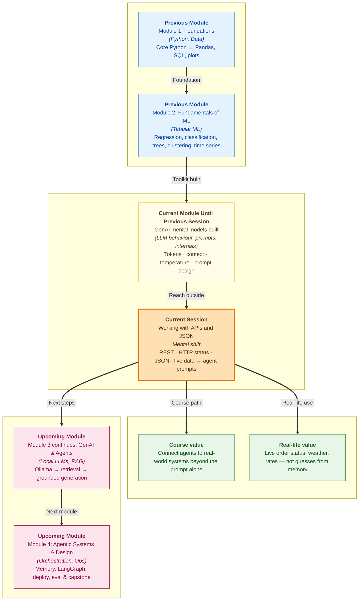

# Pre-read: Working with APIs and JSON

Your college is hosting **Tech Fest** tomorrow. The outdoor demo stage is set up. At 6 a.m. the events team opens a chat assistant and asks: *"Should we continue outdoor setup in Delhi today?"*

The assistant replies with confidence: *"Expect clear skies and around 32°C — proceed with outdoor arrangements."* By noon, rain starts. Equipment gets wet. Someone checks the actual forecast: **34°C and overcast, with rain likely by afternoon.** The assistant did not check the sky. It **guessed** — fluently, politely, and **wrong**.

In the **previous session**, you went inside the **LLM** — how **tokens** drive **billing** and **latency**, how the **context window** forces trade-offs between **system prompts**, **few-shot examples**, and **chat history**, and how **temperature** and **truncation** shape what users actually see in long chats. That knowledge helps you **design better prompts**. But no amount of prompt craft can tell a model where parcel **TRK-88421** is right now, or what the **USD–INR rate** is this hour. Those facts live **outside** the model — in other systems that change every minute.

That is the gap this session closes. **Agents** need a way to **ask the real world** and bring back **fresh answers**.

---

## Context of This Session in the Course

---

## What if every live fact had to be typed in by hand?

Imagine you run the **IRCTC** helpdesk — not the app, the actual phone line. A student calls: *"Are seats still available on train 12627 tonight?"* You cannot answer from a handbook printed last month. You must **look up live availability** on the railway server.

Now scale that to **1,000 calls per hour** — order tracking, weather checks, reimbursement status, courier locations. No human team can re-type every changing number into a chat window before each reply. The software must **reach out automatically**, get a structured answer, and pass only what matters into the assistant's briefing.

That reach-out is what an **API** (Application Programming Interface) enables. An API is a **contract** between two software systems: you send a **request** in an agreed format; the other system sends back a **response**. In simple words, it is a **fixed menu** for asking another system for work and getting a structured answer back — like the **IRCTC app** asking the railway server for live seat counts instead of storing every train on your phone.

| User question | Prompting alone? | Needs live data? |
|---|---|---|
| *"Summarise our hostel checkout policy politely"* | Yes — if policy text is in the prompt | Optional |
| *"Where is parcel TRK-88421 right now?"* | No — status changes live | **Yes** |
| *"What is the temperature in Delhi for outdoor event planning?"* | No — weather is external | **Yes** |

The common mistake is letting the **LLM guess** live numbers when an API could supply them — producing **confident hallucinations** with real-looking digits. Your token budget from the **previous session** matters here too: dumping a huge data blob into a prompt wastes **context**. The professional habit is to **extract only what you need** before prompting.

> **Think of it like a restaurant waiter.** You do not walk into the kitchen. You order from the **menu** — the contract listing what you may ask for. The waiter carries your **request** and brings **food**, or says *"that item is unavailable today."* **REST** APIs work the same way: URLs name the **thing** (orders, weather, trains), and **HTTP methods** express the **action** — **GET** to read, **POST** to create, and so on.

---

## The rhythm every API call shares — including LLM calls

Before naming every rule, lock in the rhythm. Every API conversation — whether you fetch weather or call an LLM provider — follows the same beat:

1. **You ask** — where to send the request, what action you want, and any details needed.
2. **The system replies** — first with a **status code**, then with **data** in a standard shape.

The **status code** is the server's **first answer** — *"OK"*, *"not found"*, or *"slow down."* Like a courier saying *"delivered"* versus *"wrong pin code"* — you react **before** opening the box. Only after a success signal should you trust the **body**, which almost always arrives as **JSON** — structured text built from **key–value pairs**, **lists**, and **nested objects**. If you have used Python **dictionaries**, JSON will feel familiar: a **filled form** where every field has a **label** and **value**, like a courier label showing city and pin code.

| Status range | Plain meaning | Who fixes it? |
|---|---|---|
| **2xx** | Success — proceed | You |
| **4xx** | Client mistake — wrong URL, bad key, bad params | You |
| **5xx** | Server problem — try again later | External service |

Codes you will meet often: **200** (success), **401** (invalid API key), **404** (typo in the path), **429** (rate limit — the same class of problem as **LLM provider limits** from the **previous session**), and **500** (remote service down). Checking status **before** parsing data is how you debug fast — and how you stop feeding error pages into an LLM as if they were weather facts.

---

## From raw API data to a clean agent briefing

Fetching live weather for Delhi is only half the job. An **agent** must turn API facts into **prompt instructions** — without dumping the entire response tree.

Picture a **news anchor** reporting the evening weather. They say *"34°C and overcast in Delhi"* — not the full satellite report with every numeric code and coordinate. **Field mapping** means copying only the **three lines that matter** from a long form before writing the summary: temperature, conditions in plain words, city name for traceability. Putting a raw numeric **weather code** alone into a prompt is weak; mapping it to **"overcast"** or **"light drizzle"** first gives the model language it can use safely.

That is exactly what a campus events assistant needs before advising on outdoor setup: live temperature, a human-readable condition, and a rule that says **"use only these facts — do not invent."** The **upcoming** work in this module — local models, **RAG**, and full agent loops — all assume you can **reliably fetch**, **safely check**, and **selectively map** external data first.

---

In this pre-read, you'll discover:

- **Understand** why **agents** need **APIs** alongside strong prompts — and when letting the model guess live facts creates dangerous, confident errors
- **Learn** the **request–response pattern** — URL, method, status code, and **JSON** body — and why checking status before trusting data is non-negotiable
- **Discover** how **REST** pairs resource names with **HTTP methods**, and why today's focus on **GET** means reading live data without changing server state
- **Recognise** how **JSON** structures map to familiar Python shapes — and how **field mapping** saves tokens while grounding **downstream LLM prompts** in real facts

---

## Words you will hear — explained right away

- **API:** A **contract** between two software systems — what you may request and what response you should expect back.
- **REST:** A common **style** of web API where **URLs name things** (nouns) and **HTTP methods** express actions (read, create, update, delete).
- **HTTP method:** The **action** in a request — **GET** reads data without changing the server; **POST** creates or submits new data.
- **Status code:** A **numbered signal** (like 200 or 404) summarising success or failure — always check it before reading the body.
- **JSON:** **Structured text** for data — named fields, nested groups, and lists — the language most modern APIs speak.
- **Field mapping:** Selecting specific keys from an API response and assigning them to **named variables** for a prompt template — like copying three lines from a long form.
- **Rate limit (429):** A **cap** on how many requests you can make in a short window — slow down and retry, not a syntax error in your code.

---

## What's next

After this session, you should be able to:

- **Explain** when a task needs **prompting alone** versus a **live API fetch** — and why mixing them up produces wrong answers that sound right
- **Describe** the four parts of an API **request** and what to check in the **response** before trusting any data
- **Interpret** common **HTTP status codes** — including **401**, **404**, and **429** — and know the safe action for each
- **Read and write JSON** structures in Python using built-in tools — turning wire-format text into values you can use
- **Execute a GET request** with the **requests** library, handle failures safely, and **map JSON fields** into variables that feed a downstream **LLM prompt** — the fetch-and-ground foundation for **RAG** and agent tools ahead in this module

---

## Questions we will unpack live

1. Your campus assistant receives three messages in one hour: *"What is the library fine per late day?"* (rule is in the handbook), *"Has my reimbursement request REIM-221 been approved yet?"*, and *"Will heavy rain in Mumbai affect today's outdoor tech fest setup?"* For each, would you rely on **prompting alone**, an **API call**, or **both** — and what goes wrong if you choose the wrong source?

2. You request live weather for an outdoor event. The service returns status **404** because of a typo in the API path. Should the assistant still tell the events team *"Skies look clear — proceed outdoors"* based on yesterday's general forecast? What must happen **before** any LLM generates a user-facing answer?

3. A weather API returns JSON with latitude, longitude, temperature, weather code, and ten other fields — but your event brief only needs **city**, **temperature**, and a **plain-language condition**. Why is **mapping three fields** better than pasting the entire response into the prompt — and how does that habit connect to the **token discipline** you practiced in the **previous session**?

Come ready with one question from your own life that **cannot** be answered from a static document — parcel tracking, live scores, currency rates, or today's weather. If you can name a fact that **changes every minute**, you already have the perfect scenario for the live lab. The shift from *"the model knows everything"* to *"the model asks the right system and uses only what comes back"* is what turns a chat toy into an agent you can trust on stage.
