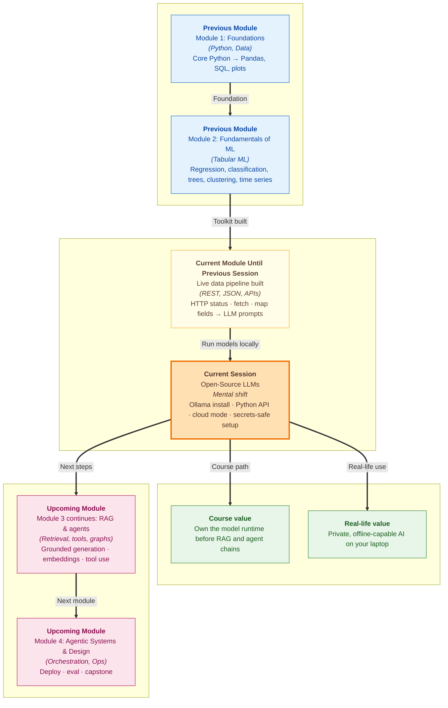

# Pre-read: Open-Source LLMs

Your college **placement cell** is building a résumé-review assistant. Every evening, fifty students upload drafts. Each file mentions course projects, internship details, and personal phone numbers. The team has been using a **cloud AI service** — fast, polished, but every résumé leaves the campus network and lands on someone else's server. The **data protection officer** asks a simple question: *"Can we run this entirely on our own machines during interview season?"*

In the **previous session**, you learned how **agents fetch live data** through **REST APIs** — **HTTP methods**, **status codes**, **JSON** parsing in Python, and **mapping API fields** into **downstream LLM prompts** (for example, campus weather for outdoor event planning). When the LLM step ran, it still used a **remote cloud provider** like **Groq** — every prompt left your machine, usage was metered, and a weak connection could stall the demo.

This session opens another path in the same module. Not a bigger prompt. Not another HTTP import. A way to run an **open-source language model on your own laptop** — or reach **Ollama Cloud** when you need more power — and call it from **Python** before you wire **RAG**, **retrieval**, and full **agent** loops. That path starts with **Ollama**.

---

## Context of This Session in the Course

---

## What if the internet failed on demo day?

Picture **Tech Fest** again. Your team built a **campus weather advisor** that **fetches live forecast data through an API**, maps only the fields it needs, and drafts setup guidance with **Groq**. Thirty minutes before the judges arrive, the campus network slows to a crawl. The **cloud model** times out. The screen shows a spinning loader while the audience waits — even though your **API data** arrived fine.

Now imagine the same demo with a **small model running on the laptop itself**. No upload queue for the inference step. No per-minute billing spike on the model call. The assistant still needs **live API facts** — skills you just built — but the **brain** sits beside the code, not three data centres away. That is not fantasy. It is how many teams prototype, test sensitive documents, and keep working on trains, in hostels with weak Wi‑Fi, or inside companies that forbid sending client data outward.

The challenge is practical: **cloud APIs** and **local models** feel like two different worlds. Different setup steps. Different speeds. Different credential rules. Without a **single, reproducible entry point**, your cohort will each debug alone, paste API keys into chat groups, and write scripts that work on one machine but fail on another.

---

## Two worlds — one front door

Until now, your agent experiments likely followed one pattern: **fetch live data with an API**, build a **grounded prompt**, then send it to a **hosted LLM provider** for the final reply. That world is excellent for speed and cutting-edge capability. But it is not the only world for the **generation step**.

**Ollama** is software that lets you **download and run open models** on your own machine — think of it as a **personal AI engine** installed like any other dev tool. You pick a **light model** sized for a normal laptop, validate that it answers sensibly, and then call it from **Python** as a **chat completion** — the same conversational shape you used with **Groq**, but the server can be **localhost**.

Ollama also offers a **cloud path** for when you want more power without managing hardware. The professional skill is not picking one forever. It is building a **dual-mode setup**: the same script, the same prompt, switched by **configuration** — run locally tonight, run in the cloud tomorrow when you need a heavier model.

| Situation | Cloud-only provider | Local Ollama on laptop |
|---|---|---|
| Sensitive hostel or company documents | Data leaves your machine | Stays on your machine |
| Weak or absent internet | Hard to demo inference | Can still run the model |
| Fast iteration while learning | Usage costs add up | Fixed hardware cost |
| Latest largest models | Often available first | Smaller tiers on laptop |

Neither row wins every time. Agents in production often **mix both**: local for development and privacy-sensitive steps, cloud for peak quality when data policy allows.

> **Think of it like cooking.** A **cloud kitchen** delivers restaurant-quality food to your door — convenient, varied, but every order goes out of the house and you pay per meal. A **home kitchen** lets you cook with your own ingredients, experiment at midnight, and never share the recipe book with a stranger. **Ollama** gives you that home kitchen for language models. The **Python API** is your standard stove connection — same knobs whether the flame is local gas or piped from the cloud.

---

## Why setup discipline matters before RAG and agents

In the **upcoming** work in this module, you will connect **retrieval**, **tools**, and **memory** into grounded agent loops. Those labs assume you already know **how to reach a model reliably** from Python — which endpoint, which model name, which credentials belong in environment variables instead of source files.

This session builds that foundation deliberately:

- **Install and validate** Ollama with a **laptop-appropriate model** — proof that your machine can host a real conversation, not just open a website.
- **Call chat completion from Python** — the same programmatic handshake your API-to-LLM pipelines will use, without a framework hiding errors.
- **Compare local versus Ollama Cloud** on the **identical prompt** — so you see speed, quality, and behaviour differences with your own eyes, not slides.
- **Handle secrets safely** — API keys and tokens live in **environment configuration**, never committed to Git, so the whole cohort can reproduce access without leaking credentials in a group chat.

Skip this layer and the first **RAG** or **agent** lab becomes guesswork: *"Is my pipeline broken, or is the model endpoint wrong?"* Nail it here and every later trace starts on solid ground.

---

In this pre-read, you'll discover:

- **Understand** why **local LLMs** matter for **privacy**, **offline demos**, and **learning without per-call billing** — and when a **cloud model** is still the better choice
- **Learn** what **Ollama** does on your machine: install, pull a **light model**, and confirm it responds before you write a retrieval or agent chain
- **Discover** how to request **chat completions from Python** so your code — not a browser tab — drives the conversation
- **Compare** **local** and **Ollama Cloud** behaviour on the same prompt using **environment-driven configuration**, and why **credential hygiene** keeps cohort projects safe and reproducible

---

## Words you will hear — explained right away

- **LLM (Large Language Model):** A system trained on huge amounts of text that reads your message and writes a reply — the **brain** behind the agents you have been building.
- **Open-source LLM:** A model whose **weights can be downloaded and run** on your own hardware — not locked behind a single vendor's closed service.
- **Ollama:** A tool that **runs language models locally** on your computer and also exposes a consistent way to reach **cloud-hosted models** when configured.
- **Local model:** A copy of the model **stored and executed on your laptop** — slower than the biggest cloud models, but private and available without internet.
- **Light model:** A **smaller** model chosen so a normal student laptop can run it without overheating or freezing — good for learning and demos, not always for every production task.
- **Chat completion:** Sending a **conversation-style request** (your message in, model reply out) — the same pattern remote APIs use, now aimed at your Ollama runtime.
- **Python API:** Calling the model **from your Python program** instead of typing in a web UI — the bridge between "it works on my screen" and "my agent script can use it."
- **Ollama Cloud:** Ollama's **hosted** option when you want cloud power while keeping a familiar interface — not the same as running on `localhost`, but related tooling.
- **Environment-driven configuration:** Storing settings like **model name**, **local vs cloud mode**, and **API keys** in **environment variables** or a `.env` file so one script works everywhere without editing code.
- **Dual-mode script:** One Python entry point that can **switch** between local and cloud execution based on configuration — no duplicate projects for each mode.
- **Credential handling:** Keeping **secrets out of Git** — keys belong in private env files or secret stores, never pasted into notebooks you push to GitHub.

---

## What's next

After this session, you should be able to:

- **Explain** when to prefer a **local Ollama model** versus a **cloud endpoint** for privacy, connectivity, and capability trade-offs
- **Install and validate** Ollama with a **suitable light model** on your own machine
- **Send chat completion requests from Python** and interpret whether the model endpoint is healthy before layering retrieval or tools on top
- **Run the same prompt** in **local** and **cloud** modes and describe practical differences you observed
- **Configure a dual-mode script** using **environment variables** so secrets never enter version control but teammates can still reproduce your setup
- **Connect** this runtime to the **RAG and agent** labs ahead — where the same Ollama binding becomes the engine inside grounded generation and tool loops

---

## Questions we will unpack live

1. Your **placement-cell résumé assistant** must review fifty files tonight. Half contain **phone numbers and internship offer details** the college cannot send to a public API. Would you run the **review step** on **local Ollama**, a **cloud provider**, or **both** for different stages — and what goes wrong if you choose the wrong mode for a sensitive file?

2. You run the **same campus weather prompt** you built when **mapping Open-Meteo JSON into a Groq request** — once with **local Ollama**, once with **Ollama Cloud**. The local reply is faster but vaguer about **rain timing**; the cloud reply is slower but more careful. How would you decide which mode your **development script** should default to — and how does **environment configuration** let you switch without rewriting the whole program?

3. A classmate shares a screenshot of their working Ollama script in the group chat — including their **API key in plain text**. Another clones the repo and accidentally pushes it to a **public GitHub** fork. What **credential-handling habit** should the cohort standardise on so everyone can run the **dual-mode script** locally without ever committing secrets — and how do you verify your own repo is clean before the **upcoming** RAG setup lab?

Come with your laptop's rough specs in mind — RAM and storage matter when picking a **light model**. If you have ever lost a demo to bad Wi‑Fi or hesitated before pasting internal notes into a web chat, you already have the perfect reason to learn this **second world of LLMs**. The shift from *"the model lives only in the cloud"* to *"I can host and call it from my own code, safely and reproducibly"* is what turns **live API data** into **fully grounded agents** you can demo anywhere.
