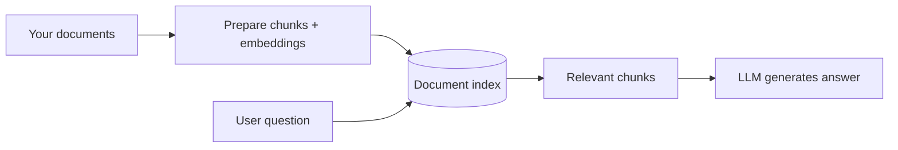

# RAG Foundations

## What We Covered So Far & What's Coming Next

In the **previous session**, you installed **Ollama**, ran a **light local model**, called it from **Python**, compared **local vs cloud LLM** behaviour, and stored secrets safely in **`.env`**. You now have a working **generator** on your laptop — the part of RAG that **writes** the final answer.

Today is an **introductory foundations** class on **Retrieval-Augmented Generation (RAG)**. You will see **why** LLMs alone fail on private or recent questions, map the **retrieve-then-generate pipeline**, learn where **chunking** and **embeddings** sit, watch a **no-code RAG demo** on a real financial PDF, and run a small **embedding** script so numbers on screen connect to the diagrams.

**In this session, you will learn:**

- Why an LLM **alone** is risky for private or up-to-date questions — and how **external knowledge** closes factual gaps
- The **retrieve-then-generate pipeline** from document store to final answer
- Where **chunking** and **embedding** sit in that pipeline before larger build sessions
- How a **minimal RAG demo** answers from a document set — first without code, then what **embeddings** look like in Python

---

## Why LLMs Alone Are Not Enough

**Official Definition:** A **Large Language Model (LLM)** is trained on huge public text up to a **knowledge cutoff**. At answer time it **predicts** likely words — it does not automatically read your private PDFs or this morning's notice unless you put that text in the prompt.

**In Simple Words:** The model is like a student who read the internet until last year. Ask about **your company's 2026 HR memo** and they may **sound confident** but still be wrong.

**Real-Life Example:** In class we opened the **Groq playground** with **Llama 3.3 70B** and asked: *"Why did Germany get eliminated against Paraguay in the FIFA 2026 World Cup?"* The model replied that its knowledge ends in **December 2023** — it cannot know a **2026** match. That is **knowledge cutoff** in action.


### Four quick problems

| Problem | In one line |
|---|---|
| **Knowledge cutoff** | New policies and products may not exist in training data |
| **No private data** | Your internal docs were never in training |
| **Hallucination** | The model fills gaps with fluent but **false** text |
| **Context window limit** | Very large documents cannot always be pasted fully into one prompt |

### Live check on Groq — private company data

We asked a second question on the same playground:

```text
What is Siemens' latest HR policy which employees are really liking?
Give me the exact details along with the latest hike percentages.
```

**What the model said:** It has **no access** to Siemens' current internal HR policies or confidential memos.

**Why:** Even if some public Siemens pages existed at training time, **internal HR mail** never entered the model weights. Without **your documents**, the LLM can be **confidently wrong**.

> **Common doubt:** *"Can't ChatGPT just know our company?"*  
> **Answer:** Only if you **give it the text** (paste, upload, or **retrieve** with RAG). Otherwise it guesses from general patterns.

**Connecting idea:** **Prompt engineering** helps you *talk* to the model. **RAG** helps you *feed* the model the right **pages** from your library before it speaks. **External knowledge** — documents outside the model's weights — is what closes those factual gaps.

---

## What Is RAG?

**Official Definition:** **Retrieval-Augmented Generation (RAG)** is a pattern where the system **searches an external knowledge base**, **retrieves** relevant text, **adds it to the prompt**, and then the LLM **generates** an answer using that material.

**In Simple Words:** **Search first, then speak.** **Open-book exam:** find the right page, then answer.

**Real-Life Example:** At a **DU photocopy shop**, the keeper **pulls the right folder** (retrieval), you **read the page** (context in prompt), then you **explain** (generation).


| Library idea | RAG part |
|---|---|
| Books on shelves | Your **documents** |
| Catalog / index | **Embeddings** + a **vector store** |
| Librarian | **Retriever** |
| Reading before answering | **Context in the prompt** |
| Your explanation | **Generator** (the LLM) |

### The open-book exam analogy (used throughout class)

| Exam role | RAG role |
|---|---|
| You — the student writing answers | **LLM (generator)** |
| Your textbooks | **Document chunks** in the library |
| The library catalog | **Embeddings + vector store** |
| The librarian who finds pages | **Retriever** |
| The question sheet plus allowed notes | **Augmented prompt** (context + question) |

When the LLM cannot answer from memory alone, it **asks the librarian**. The librarian returns **two or three relevant chunks**. Those chunks become the **revised prompt**. Now the LLM writes a **grounded** answer.

### Why enterprises use RAG

- **Privacy:** You retrieve only the relevant portions — you do not paste every private document into every prompt.
- **Cost control:** Sending a full policy book every time uses many tokens. RAG sends only the most useful chunks.
- **Fresh information:** When a policy changes, you update the document library — no need to retrain the LLM.
- **Better grounding:** The answer can be tied to retrieved context, so the model has less room to guess.

> **Why it matters for agents:** Wrong facts → wrong **actions** (wrong refund, wrong email). RAG reduces guessing on policy and product questions.

---

## The Retrieve-Then-Generate Pipeline

Every RAG tool — **LangChain**, custom Python, enterprise products — follows the same story. Learn this **once**; you will deepen each step in **later work**.

**Official Definition:** **RAG pipeline** = **Ingest** → **Prepare** → **Retrieve** → **Augment** → **Generate**.

**In Simple Words:** Bring documents in → chop and index them → find the best pieces for the question → paste into the prompt → LLM writes the answer.

| Step | What happens | What we saw today |
|---|---|---|
| **1. Ingest** | Load PDFs, Markdown, web pages, or plain text | Tesla **2023 annual report** uploaded in ChatGPT |
| **2. Prepare** | Clean text, **chunk**, build **embeddings**, store in an **index** | Explained with **100-page PDF → 100 chunks**; ChatGPT builds an **in-memory index** on upload |
| **3. Retrieve** | Find chunks closest to the user question | ChatGPT looked up chunks about **2022 revenue** |
| **4. Augment** | Put chunks + grounding rules into the prompt | Retrieved text + your question sent to the model |
| **5. Generate** | LLM produces the final answer | Answer: **$81,462 million** with **source citations** |




> **Common doubt:** *"Why not paste the whole PDF?"*  
> **Answer:** Models have a **context limit**. Retrieval sends only the **most relevant** pieces — not the entire file.

**Connecting sentence:** Steps 1–2 happen **offline** (before anyone asks a question). Steps 3–5 happen **at query time** — that is the **retrieve-then-generate** loop you traced in today's demos.

### Normal generation vs RAG

| | **Normal LLM** | **RAG** |
|---|---|---|
| Input | User question only | Question + **retrieved chunks** |
| Knowledge source | Pre-trained weights | **Your library** + weights |
| Risk on private facts | Guessing / hallucination | **Grounded** in retrieved text |
| Name breakdown | Generation only | **Retrieve** → **Augment** → **Generate** |

---

## Where Chunking and Embedding Fit

Before you build larger RAG apps, you must know **where** two prepare-step ideas sit: **chunking** and **embedding**. They are not optional extras — they are what makes search work on real documents.

### Chunking — breaking large files into searchable pieces

**Official Definition:** **Chunking** (or **text splitting**) is the process of dividing a large document into smaller segments so each piece can be indexed, embedded, and retrieved independently.

**In Simple Words:** You cannot file-search a 200-page PDF as one block. You tear it into **paragraph-sized notes** — one idea per note.

**Real-Life Example:** In class we used a **100-page company PDF**. Processing all 100 pages as one block is hard. So we split it into **100 chunks — one page per chunk** (C1, C2, … C100). Other chunking policies exist; you will tune them in **later build sessions**.

| Chunking choice | What goes wrong |
|---|---|
| **Too large** | One chunk mixes many topics — retrieval returns noise |
| **Too small** | A sentence loses context — *"48 hours"* without *"late submission"* |
| **Just right** | One policy rule or one FAQ answer per chunk |

- **Overlap** between chunks (repeating the last few words of chunk A at the start of chunk B) helps when an important sentence sits on a **boundary** — you will tune this in **later build sessions**.

### Embedding — turning text into meaning-numbers

**Official Definition:** An **embedding** is a list of numbers representing the **meaning** of text. Similar meanings → vectors that are **close** in math space. Those vectors power **semantic search**.

**In Simple Words:** Each sentence gets a **GPS pin** in "meaning land." Questions about refunds land near sentences about refunds.

**Real-Life Example:** A library sorts books by **topic**, not only by title spelling — embeddings are that sort key for **sentences**.


| Pipeline stage | Chunking role | Embedding role |
|---|---|---|
| **Prepare (offline)** | Split raw docs into chunks | Convert each chunk → vector; store in index |
| **Retrieve (online)** | — | Embed the **question** → compare to chunk vectors |
| **Augment + Generate** | Retrieved **text** of chunks goes in prompt | Vectors are not sent to the LLM — only the **words** |

- Machines do **not** understand raw text directly. Each chunk becomes **chunk embeddings** stored in a **vector database** (the **library vault**).
- At query time the user question becomes **query embeddings**. The retriever finds **top-k similar chunks** — that is **semantic search**.
- **Common mistake:** Using different embedding models for indexing vs querying — vectors will not align. Always use the **same model** for chunks and questions.

### Semantic search — the Google analogy

**In Simple Words:** Old search matched **keywords**. Modern search matches **meaning**.

**Real-Life Example:** **Google** treats each web page like a **chunk**, builds **embeddings** for pages, and when you type a query it finds pages whose embeddings are **close** to your query embedding — not just pages that share the same spelling.

That is the same idea RAG uses on **your** PDFs instead of the whole web.

---

## Retriever, Generator, and Grounding

Two jobs work together — do not blame only the LLM when RAG fails.

**Official Definition:** The **retriever** finds relevant evidence from the library. The **generator** is the LLM that writes the answer. **Grounding** means the answer should follow **supplied context**, not invent facts when the library already has the answer.

**In Simple Words:** Retriever = **finds** the notes. Generator = **writes** the answer. Grounding = **stick to the notes** on the open-book test.

**Real-Life Example:** A **railway display board** shows the platform. A grounded assistant reads the board. An ungrounded one guesses platform 5 because it "sounds right."


### The grounding rule

Add something like:

- *"Answer **only** using the Context below. If the answer is not in the Context, say you could not find it in the documents."*

**Domain mismatch example from class:** If you build RAG on **HR policy** documents and someone asks about **weather**, the system should **not** invent an answer — the fact is **not in the library**.

### If something goes wrong (one glance)

| Symptom | Likely cause |
|---|---|
| Confident wrong fact | No context or bad retrieval |
| Answer ignores your PDF | Weak grounding instruction |
| Wrong year of policy | Outdated doc in the library |

---

## Minimal RAG Demo — ChatGPT on a Financial PDF

We ran a **no-code, end-to-end RAG demo** so you could see all five pipeline steps without writing Python first.

### Setup

- **Document:** Tesla **2023 annual financial report** (~130 pages) — a realistic use case for investors and analysts who ask questions across long filings.
- **Platform:** ChatGPT with **file upload** (free tier supports this pattern).
- **Question asked:**

```text
What is the annual revenue in the year 2022?
```

### What happened behind the scenes

1. **Ingest + Prepare:** ChatGPT read the PDF, **chunked** it, and built **embeddings** into an **in-memory vector index** for **this chat session only**.
2. **Retrieve:** Your question was embedded; the system found chunks where **2022 revenue** appears (the answer existed in **multiple sections** of the report).
3. **Augment + Generate:** Only those chunks — not all 130 pages — were sent as **context**. The model returned **$81,462 million** and **cited the PDF** as the source.


| | **Plain LLM (no your PDF)** | **RAG with uploaded PDF** |
|---|---|---|
| Where the fact comes from | Model guess / training memory | **Your document** (retrieved chunks) |
| Token cost | N/A | Only **top chunks** sent — not whole PDF |
| Proof | Often none | **Citations** to the source file |
| Persistence | — | ChatGPT index is **session-only**; production RAG **saves** the vector DB |

> **Common doubt:** *"Is ChatGPT training on my upload?"*  
> **Answer:** In enterprise RAG the **vector DB stays on company servers**. The LLM **reads and retrieves** at query time — it does **not** permanently retrain on your vault. ChatGPT's upload index is a teaching shortcut; **later work** builds a **persisted** database you control.

> **[ Student Activity ]**
>
> **Reflect on the Tesla demo (10 minutes)**
>
> - Write one sentence: why sending the **whole 130-page PDF** every time would be expensive compared to retrieving **a few chunks**.  
> - Ask ChatGPT (or any upload-capable assistant) a question **not answered** in a short PDF you upload. Note whether it says **"not found"** or guesses.  
> - Check whether the reply includes a **source citation** — that is the retriever working.

---

## What Embeddings Look Like in Code

After the pipeline diagrams, we ran a **small Python demo** so embedding is not only a diagram label.

**Prerequisites:**

```bash
pip install sentence-transformers
```

Save as `embedding_demo.py`:

```python
# embedding_demo.py — see how text becomes a vector of numbers

from sentence_transformers import SentenceTransformer  # Library for local embedding models

model = SentenceTransformer("all-MiniLM-L6-v2")  # Small model — downloads once, runs locally

sentences = [  # Three example lines — two about foxes, one about Python
    "The quick brown fox jumps over the lazy dog",
    "A fast dark colored fox sleeps over a resting dog",
    "Python is a great programming language for AI",
]

embeddings = model.encode(sentences)  # Turn each sentence into a numeric vector

for i, sentence in enumerate(sentences):  # Loop and print one row per sentence
    print(f"Sentence: {sentence}")  # Show the original text
    print(f"Shape: {embeddings[i].shape}")  # How many numbers — here 384
    print(f"First 5 values: {embeddings[i][:5]}")  # Peek at the start of the vector
    print()  # Blank line between sentences
```

**How the code works:**

- `SentenceTransformer("all-MiniLM-L6-v2")` loads a **local embedding model** (~384 numbers per sentence).
- `model.encode(sentences)` converts each line into a **vector** — the same kind of object stored as **chunk embeddings** and **query embeddings** in RAG.
- Similar sentences (the two fox lines) produce vectors that are **mathematically closer** than unrelated sentences (the Python line).
- In a full RAG app you store chunk vectors in a **vector DB**, embed the user question the same way, and retrieve **nearest neighbours** — today's script shows only the **encoding** step.

> **[ Student Activity ]**
>
> **Embedding shapes (15 minutes)**
>
> - Run `embedding_demo.py` and note the **shape** printed for each sentence.  
> - Add a fourth sentence about **foxes** in your own words — predict whether its vector will be closer to sentence 1 or sentence 3.  
> - Browse the **Sentence Transformers** model hub online and name one model suited to a domain you care about (legal, code, multilingual, etc.).

---

## In-Memory RAG vs Production Vector Database

| | **ChatGPT file upload (today's demo)** | **Production RAG (later work)** |
|---|---|---|
| When index is built | When you upload in **this chat** | **Offline job** when docs change |
| Where vectors live | **In-memory** for the session | **Persisted** vector DB on disk / server |
| Re-use across users | No — new session starts fresh | Yes — one shared library |
| Typical host | Vendor cloud | Often **on-premise** for sensitive data |

**Connecting sentence:** The **logic** is identical — chunk, embed, retrieve, augment, generate. Only **storage and scale** change when you move from a classroom demo to a company vault.

---

## Privacy, Architecture, and Trade-offs

### Where components usually run

| Component | Typical placement | Why |
|---|---|---|
| **Vector DB / document vault** | **On-premise** company servers | Holds confidential PDFs and embeddings |
| **LLM (generator)** | **Cloud API** or **local open-source** | Writes the final answer |
| **Data sent to LLM** | Only **top-k retrieved chunks** | Tiny fraction of the full library |

- **Masking / redaction:** Sensitive fields in retrieved chunks can be **masked** before they reach a cloud LLM.
- **Local LLM option:** If security is paramount, run an **open-source model** on company hardware — same RAG loop, different generator host.
- **Cost trade-off:** Cloud APIs are often cheaper to **start**; owning GPU servers for local LLMs has high **upfront** cost — like **renting a co-working desk** vs buying **100 acres** on day one.

---

## When RAG Matters — Legal Domain Example

**Real-Life Example:** In **legal research**, a plain LLM may invent **case names and citations** that look real but **do not exist** — because it is a **next-token predictor**, not a verified case-law database.

**Industry note:** Companies like **Harvey** build RAG over **trusted legal corpora** so answers cite **real** sources.

**Connecting idea:** This is the same **grounding** lesson — without retrieval from **your** trusted library, the model fills gaps with fluent fiction. RAG plus strict **"answer only from context"** rules reduces that risk.

---

## From Today's Foundations to Larger RAG Apps

Today's class was **concept-first**. The same five steps will return in **later work** with code, tools, and scale:

| Topic | What comes next |
|---|---|
| **Embeddings & vector search** | Deeper vector DB usage and similarity search |
| **Chunking & document prep** | Splitters, overlap, PDF loaders |
| **Retrieval + grounded generation** | Retriever modules and prompt templates in code |
| **End-to-end integration** | Full Python RAG with **LangChain** (mentioned for upcoming demos) |


The logic does not change — only the **storage**, **tooling**, and **scale** grow.

> **[ Student Activity ]**
>
> **Pipeline map (10 minutes)**
>
> - Draw the five steps (**Ingest → Prepare → Retrieve → Augment → Generate**) from memory.  
> - Label where **chunking** and **embedding** happen (hint: **Prepare**).  
> - Write one sentence on how today's **ChatGPT demo** and tomorrow's **coded pipeline** differ only in **where the vector index is stored**.

---

## Key Takeaways

- LLMs **guess** when they lack your documents — **knowledge cutoff**, **private data gaps**, and **hallucination** are why teams add a **library** and **external knowledge** (shown live on **Groq** with recent events and **Siemens HR** questions).
- **RAG** = **ingest → prepare (chunk + embed) → retrieve → augment → generate**; the name means **retrieve** relevant chunks, **augment** the prompt, then **generate** a **grounded** answer.
- **Chunking** splits large docs (e.g. **100 pages → 100 chunks**); **embeddings** turn chunks and questions into vectors for **semantic search** — the same idea **Google** uses at web scale.
- **Retriever** finds text; **generator** writes; **grounding** means **answer from context** or say **"not found"** when the library has no evidence.
- Today's demos: **ChatGPT + Tesla PDF** for full no-code RAG, and **`embedding_demo.py`** with **Sentence Transformers** to see **384-number vectors** — **later build sessions** add persisted vector DBs, file loaders, and production tooling including **LangChain**.

---

## Important Commands, Libraries, Terminologies Used

| Term / Command | Category | Meaning |
|---|---|---|
| **RAG** | Concept | Retrieve relevant text, then generate an answer |
| **Knowledge cutoff** | Concept | Last date in training data |
| **Hallucination** | Concept | Confident but wrong model output |
| **Context window** | Concept | Maximum input size an LLM can handle in one prompt |
| **External knowledge** | Concept | Your docs outside model weights — reduces factual gaps |
| **Ingest / Prepare / Retrieve / Augment / Generate** | Pipeline | Five RAG steps |
| **Chunking** | Pipeline stage | Split large documents into searchable pieces |
| **Embedding** | Concept | Numbers representing text meaning |
| **Chunk embedding** | Concept | Vector for one document chunk stored in the index |
| **Query embedding** | Concept | Vector for the user's question at search time |
| **Semantic search** | Concept | Find text by meaning, not only keywords |
| **Retriever** | Component | Finds relevant chunks |
| **Generator** | Component | LLM that writes the answer |
| **Grounding** | Concept | Answer supported by provided context |
| **Top-k** | Parameter | Number of best chunks returned by retrieval |
| **Vector database** | Tool | Stores chunk vectors for fast similarity search |
| **In-memory RAG** | Pattern | Session-only index (e.g. ChatGPT upload) |
| **Groq playground** | Tool | Cloud LLM UI used to demo knowledge-cutoff limits |
| **ChatGPT file upload** | Demo pattern | No-code RAG on an uploaded PDF |
| `pip install sentence-transformers` | CLI | Install local embedding library |
| `SentenceTransformer` | Python class | Load an embedding model locally |
| `all-MiniLM-L6-v2` | Model | Small embedding model — 384-dim vectors |
| `model.encode()` | Python method | Turn text into embedding vectors |
| **LangChain** | Framework (later) | Tooling for RAG pipelines in upcoming labs |
| **Harvey** | Industry example | Legal-domain RAG over trusted case sources |
