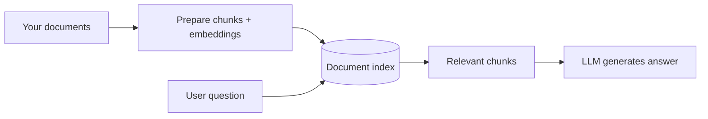
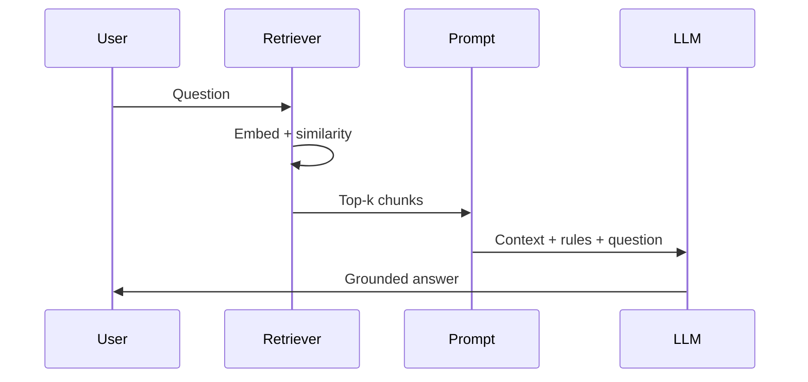

# RAG Foundations

## What We Covered So Far & What's Coming Next

In the **previous session**, you installed **Ollama**, ran a **light local model**, called it from **Python**, compared **local vs Ollama Cloud** on the same prompt, and stored secrets safely in **`.env`**. You now have a working **generator** on your laptop — the part of RAG that **writes** the final answer.

Today you learn the **full picture**: how to give AI its own **library** so answers come from **your documents**, not only from training memory. You will define **RAG**, map the **retrieve-then-generate pipeline**, see where **chunking** and **embeddings** fit, and run a **minimal RAG demo** that **embeds with Groq**, **searches** a small document set, and **generates** with **Ollama**.

**In this session, you will learn:**

- Why an LLM **alone** is risky for private or up-to-date questions — and how **external knowledge** closes factual gaps
- The **retrieve-then-generate pipeline** from document store to final answer
- Where **chunking** and **embedding** sit in that pipeline before larger build sessions
- How to run a **minimal RAG demo** that retrieves from a small library and generates a **grounded** reply

---

## Why LLMs Alone Are Not Enough

**Official Definition:** A **Large Language Model (LLM)** is trained on huge public text up to a **knowledge cutoff**. At answer time it **predicts** likely words — it does not automatically read your private PDFs or this morning's notice unless you put that text in the prompt.

**In Simple Words:** The model is like a student who read the internet until last year. Ask about **your company's 2026 refund rule** and they may **sound confident** but still be wrong.

**Real-Life Example:** You ask, *"What is the late-submission penalty for our March 2026 batch?"* If that line lives only in an internal PDF, the model might invent a generic university rule.


### Four quick problems

| Problem | In one line |
|---|---|
| **Knowledge cutoff** | New policies and products may not exist in training data |
| **No private data** | Your internal docs were never in training |
| **Hallucination** | The model fills gaps with fluent but **false** text |
| **Context window limit** | Very large documents cannot always be pasted fully into one prompt |

> **Common doubt:** *"Can't ChatGPT just know our company?"*  
> **Answer:** Only if you **give it the text** (paste, upload, or **retrieve** with RAG). Otherwise it guesses from general patterns.

**Connecting idea:** **Prompt engineering** helps you *talk* to the model. **RAG** helps you *feed* the model the right **pages** from your library before it speaks. **External knowledge** — documents outside the model's weights — is what closes those factual gaps.

---

## What Is RAG?

**Official Definition:** **Retrieval-Augmented Generation (RAG)** is a pattern where the system **searches an external knowledge base**, **retrieves** relevant text, **adds it to the prompt**, and then the LLM **generates** an answer using that material.

**In Simple Words:** **Search first, then speak.** Open-book exam: find the right page, then answer.

**Real-Life Example:** At a **DU photocopy shop**, the keeper **pulls the right folder** (retrieval), you **read the page** (context in prompt), then you **explain** (generation).


| Library idea | RAG part |
|---|---|
| Books on shelves | Your **documents** |
| Catalog / index | **Embeddings** + a **vector store** |
| Librarian | **Retriever** |
| Reading before answering | **Context in the prompt** |
| Your explanation | **Generator** (the LLM) |

### Why enterprises use RAG

- **Privacy:** You retrieve only the relevant portions — you do not paste every private document into every prompt.
- **Cost control:** Sending a full policy book every time uses many tokens. RAG sends only the most useful chunks.
- **Fresh information:** When a policy changes, you update the document library — no need to retrain the LLM.
- **Better grounding:** The answer can be tied to retrieved context, so the model has less room to guess.

> **Why it matters for agents:** Wrong facts → wrong **actions** (wrong refund, wrong email). RAG reduces guessing on policy and product questions.

---

## The Retrieve-Then-Generate Pipeline

Every RAG tool — LangChain, custom Python, enterprise products — follows the same story. Learn this **once**; you will deepen each step in **later work**.

**Official Definition:** **RAG pipeline** = **Ingest** → **Prepare** → **Retrieve** → **Augment** → **Generate**.

**In Simple Words:** Bring documents in → chop and index them → find the best pieces for the question → paste into the prompt → LLM writes the answer.

| Step | What happens | Role in today's demo |
|---|---|---|
| **1. Ingest** | Load PDFs, Markdown, web pages, or plain text into the system | Our `DOCUMENT_CHUNKS` list plays this role |
| **2. Prepare** | Clean text, **chunk**, build **embeddings**, store in an **index** | **Chunking + Groq embedding** — see next section |
| **3. Retrieve** | Find chunks closest to the user question | Cosine similarity search in `simple_rag_demo.py` |
| **4. Augment** | Put chunks + grounding rules into the prompt | `build_rag_prompt()` |
| **5. Generate** | LLM produces the final answer | `generate_answer()` via Ollama `chat()` |




> **Common doubt:** *"Why not paste the whole PDF?"*  
> **Answer:** Models have a **context limit**. Retrieval sends only the **most relevant** pieces — not the entire file.

**Connecting sentence:** Steps 1–2 happen **offline** (before anyone asks a question). Steps 3–5 happen **at query time** — that is the **retrieve-then-generate** loop you will run live today.

---

## Where Chunking and Embedding Fit

Before you build larger RAG apps, you must know **where** two prepare-step ideas sit: **chunking** and **embedding**. They are not optional extras — they are what makes search work on real documents.

### Chunking — breaking large files into searchable pieces

**Official Definition:** **Chunking** (or **text splitting**) is the process of dividing a large document into smaller segments so each piece can be indexed, embedded, and retrieved independently.

**In Simple Words:** You cannot file-search a 200-page PDF as one block. You tear it into **paragraph-sized notes** — one idea per note.

**Real-Life Example:** A **coaching centre** handbook has one page on refunds and another on attendance. Chunking keeps those topics in **separate searchable pieces** so a refund question does not always drag in attendance text.

| Chunking choice | What goes wrong |
|---|---|
| **Too large** | One chunk mixes many topics — retrieval returns noise |
| **Too small** | A sentence loses context — *"48 hours"* without *"late submission"* |
| **Just right** | One policy rule or one FAQ answer per chunk |

- In today's demo, each item in `DOCUMENT_CHUNKS` is already one chunk — production code uses a **splitter** on PDFs and Markdown files.
- **Overlap** between chunks (repeating the last few words of chunk A at the start of chunk B) helps when an important sentence sits on a **boundary** — you will tune this in **later build sessions**.

### Embedding — turning text into meaning-numbers

**Official Definition:** An **embedding** is a list of numbers representing the **meaning** of text. Similar meanings → vectors that are **close** in math space. Those vectors power **semantic search**.

**In Simple Words:** Each sentence gets a **GPS pin** in "meaning land." Questions about refunds land near sentences about refunds.

**Real-Life Example:** A library sorts books by **topic**, not only by title spelling — embeddings are that sort key for **sentences**.


| Pipeline stage | Chunking role | Embedding role |
|---|---|---|
| **Prepare (offline)** | Split raw docs into chunks | Convert each chunk → vector; store in index |
| **Retrieve (online)** | — | Embed the **question** → compare to chunk vectors |
| **Augment + Generate** | Retrieved **text** of chunks goes in prompt | Vectors are not sent to the LLM — only the **words** |

- **Common mistake:** Using different embedding models for indexing vs querying — vectors will not align. Today's demo uses **`nomic-embed-text-v1.5`** on **Groq** for both document chunks and the user question.
- **Later work** stores millions of vectors in a **vector database** (Chroma, FAISS) for fast search. Today we keep vectors **in memory** to see the logic clearly.

---

## Retriever, Generator, and Grounding

Two jobs work together — do not blame only the LLM when RAG fails.

**Official Definition:** The **retriever** finds relevant evidence from the library. The **generator** is the LLM that writes the answer. **Grounding** means the answer should follow **supplied context**, not invent facts when the library already has the answer.

**In Simple Words:** Retriever = **finds** the notes. Generator = **writes** the answer. Grounding = **stick to the notes** on the open-book test.

**Real-Life Example:** A **railway display board** shows the platform. A grounded assistant reads the board. An ungrounded one guesses platform 5 because it "sounds right."


### One prompt rule to remember

Add something like:

- *"Answer **only** using the Context below. If the answer is not in the Context, say you could not find it in the documents."*

### If something goes wrong (one glance)

| Symptom | Likely cause |
|---|---|
| Confident wrong fact | No context or bad retrieval |
| Answer ignores your PDF | Weak grounding instruction |
| Wrong year of policy | Outdated doc in the library |

---

## Without Context vs With Context — Quick Comparison

We prove the **idea** before we automate it. First compare **manual** context paste; then the full demo **automates** retrieval.

**Sample fact (only in our handbook, not guaranteed in training):**  
*"For the March 2026 cohort, late submissions are accepted up to 48 hours with a 10% penalty per day after the deadline."*

### Step 1 — Ask Ollama with no extra text

Use your **Ollama** setup from the **previous session**. Ask only:

```text
What is the late submission rule for the March 2026 cohort?
```

**What you often see:** A generic or invented rule — sounds professional, may be **wrong**.

### Step 2 — Same question, paste the handbook line

```text
Answer ONLY using the Context below.

Context:
For the March 2026 cohort, late submissions are accepted up to 48 hours
with a 10% penalty per day after the deadline.

Question:
What is the late submission rule for the March 2026 cohort?
```

**What you should see:** **48 hours** and **10% per day** — grounded in the text you supplied.


| | **No context** | **With context (manual)** | **With RAG (automated)** |
|---|---|---|---|
| Where the fact comes from | Model guess | **Your document** (you pasted it) | **Your document** (retriever found it) |
| Who finds the right paragraph | Nobody | **You** | **Retriever** |

**Connecting sentence:** Steps 1–2 show **why** grounding matters. The demo below makes the **librarian** step automatic: **embed** → **search** → **paste** → **generate**.

> **[ Student Activity ]**
>
> **Two-Question Compare (10 minutes)**
>
> - Run Step 1 and Step 2 with Ollama on the same machine.  
> - Write one sentence: what changed between the two answers?  
> - Try a question **not** in the handbook and check if the model says *"not in context."*

---

## Minimal RAG Demo — End to End

You now run a **complete but small** RAG program: **Groq** turns text into **embeddings** for search; **Ollama** from the **previous session** **generates** the final answer.

### Prerequisites

- **Groq API key** in **`.env`** as `GROQ_API_KEY` (same pattern as earlier **Groq** labs — key stays out of Git)
- Ollama running locally (`ollama serve` if needed)
- `ollama pull qwen2.5:0.5b` (or another small chat model you already use)
- `pip install groq ollama python-dotenv`

Create **`.env`** in the same folder as the script:

```bash
GROQ_API_KEY=your-key-here
```

Save as `simple_rag_demo.py`:

```python
# simple_rag_demo.py — minimal RAG: Groq embed, retrieve, augment, Ollama generate

import math  # Square root for cosine similarity calculation
import os  # Read GROQ_API_KEY from the environment
from dotenv import load_dotenv  # Load secrets from .env safely
from groq import Groq  # Groq client for embedding API calls
from ollama import chat  # Ollama Python helper for local generation

load_dotenv()  # Read GROQ_API_KEY from .env before any API call
groq_client = Groq(api_key=os.environ.get("GROQ_API_KEY"))  # Authenticate with Groq

# ----- 1. OUR "LIBRARY" (in real apps: load from files / database) -----

DOCUMENT_CHUNKS = [  # Each dict is one searchable chunk with an id and text
    {
        "id": "policy-late",  # Unique label for the late-submission policy chunk
        "text": (
            "For the March 2026 cohort, assignment late submissions are accepted "
            "up to 48 hours with a 10% penalty per day after the deadline."
        ),  # The fact we want RAG to find for late-submission questions
    },
    {
        "id": "policy-contact",  # Unique label for the support contact chunk
        "text": (
            "Course support email is agentic-help@example.edu. "
            "Replies are sent within 2 business days."
        ),  # Contact info for support-related questions
    },
    {
        "id": "policy-exam",  # Unique label for the capstone viva chunk
        "text": (
            "The Module 3 capstone viva is scheduled in week 12. "
            "Students must submit the GitHub repo link 24 hours before the viva."
        ),  # Exam scheduling rule for viva-related questions
    },
]

EMBED_MODEL = "nomic-embed-text-v1.5"  # Groq-hosted embedding model for semantic search
CHAT_MODEL = "qwen2.5:0.5b"  # Local Ollama chat model — run: ollama pull qwen2.5:0.5b
TOP_K = 2  # How many top chunks to send to the LLM
USER_QUESTION = "What is the late submission rule for the March 2026 cohort?"  # Test question


def cosine_similarity(vector_a, vector_b):
    """Return similarity score between two vectors (higher = more similar)."""
    dot_product = sum(a * b for a, b in zip(vector_a, vector_b))  # Multiply and sum matching positions
    magnitude_a = math.sqrt(sum(a * a for a in vector_a))  # Length of vector A
    magnitude_b = math.sqrt(sum(b * b for b in vector_b))  # Length of vector B
    if magnitude_a == 0 or magnitude_b == 0:  # Avoid division by zero
        return 0.0
    return dot_product / (magnitude_a * magnitude_b)  # Cosine similarity formula


def embed_text(text):
    """Turn one string into an embedding vector using Groq."""
    response = groq_client.embeddings.create(  # Call Groq embeddings API
        input=text,  # Single string to embed
        model=EMBED_MODEL,  # Must match model used for all chunks and queries
        encoding_format="float",  # Return vectors as plain float lists
    )
    return response.data[0].embedding  # First (and only) vector for one input string


def retrieve_top_chunks(question, chunks, top_k):
    """Find the top_k chunks most similar to the question."""
    question_vector = embed_text(question)  # Embed the user question once
    scored_chunks = []  # List to store (score, chunk) pairs
    for chunk in chunks:  # Loop over every document chunk in the library
        chunk_vector = embed_text(chunk["text"])  # Embed this chunk's text
        score = cosine_similarity(question_vector, chunk_vector)  # Score similarity
        scored_chunks.append((score, chunk))  # Save score with chunk for sorting
    scored_chunks.sort(key=lambda pair: pair[0], reverse=True)  # Highest score first
    top_results = scored_chunks[:top_k]  # Keep only the top_k results
    return [chunk for score, chunk in top_results]  # Return chunks without scores


def build_rag_prompt(question, retrieved_chunks):
    """Build a single prompt string with context + grounding rules."""
    lines = [  # Start with strict grounding instructions
        "You are a helpful course assistant.",
        "Answer ONLY using the Context below.",
        "If the answer is not in the Context, say: I could not find this in the provided documents.",
        "",
        "=== Context ===",
    ]
    for index, chunk in enumerate(retrieved_chunks, start=1):  # Add each retrieved chunk with a label
        lines.append(f"[Source {index} | id={chunk['id']}]")
        lines.append(chunk["text"])
        lines.append("")
    lines.append("=== Question ===")  # Close context block and add the user question
    lines.append(question)
    return "\n".join(lines)  # Join all lines into one string for the user message


def generate_answer(rag_prompt):
    """Call the LLM with the augmented prompt and return text."""
    response = chat(  # Send one user message containing context + question
        model=CHAT_MODEL,
        messages=[{"role": "user", "content": rag_prompt}],
    )
    return response["message"]["content"]  # Extract assistant reply text


def generate_without_rag(question):
    """Ask the LLM with NO retrieved context — shows hallucination risk."""
    response = chat(  # Plain question only — no handbook text
        model=CHAT_MODEL,
        messages=[{"role": "user", "content": question}],
    )
    return response["message"]["content"]  # Return assistant message text


def main():
    """Run full RAG pipeline and print each step for learning."""
    print("=== RAG Demo: Step-by-step trace ===\n")
    print("1) User question:")  # Step 1 — show the question
    print("  ", USER_QUESTION)
    print()
    print("2) Retrieving top chunks (embedding + similarity)...")  # Step 2 — retrieve
    retrieved = retrieve_top_chunks(USER_QUESTION, DOCUMENT_CHUNKS, TOP_K)
    for chunk in retrieved:
        print(f"   - {chunk['id']}: {chunk['text'][:80]}...")
    print()
    print("3) Building augmented prompt with grounding rules...")  # Step 3 — build prompt
    rag_prompt = build_rag_prompt(USER_QUESTION, retrieved)
    print()
    print("4) Calling LLM generator...")  # Step 4 — generate
    answer = generate_answer(rag_prompt)
    print()
    print("5) Final grounded answer:")  # Step 5 — final output
    print(answer)
    print()
    print("=== Compare: same question WITHOUT retrieval ===")
    print(generate_without_rag(USER_QUESTION))  # Side-by-side contrast with no RAG
    print()
    print("=== Try a question NOT in the library ===")
    print("Example: 'What is the dress code for convocation?'")


if __name__ == "__main__":
    main()  # Standard entry point — run main when file is executed directly
```

**How the code works:**

- `load_dotenv()` + `Groq(...)` — loads your **Groq API key** from **`.env`** for embedding calls.
- `DOCUMENT_CHUNKS` — plays the **library**; each row is one **chunk** ready for embedding.
- `embed_text` — calls **Groq** `embeddings.create()` with **`nomic-embed-text-v1.5`** to turn text into vectors (for both chunks and the user question).
- `retrieve_top_chunks` — embeds the question and each chunk, scores with **cosine similarity**, keeps **top-k** — the **retrieve** step.
- `build_rag_prompt` — **augments** the prompt with grounding rules and labeled sources.
- `generate_answer` — **generator** step via Ollama `chat()` on your local model.
- `generate_without_rag` — same question with **no** retrieval so you can hear the difference live.
- `main()` — prints a **trace** so you can teach each stage on screen.

### Run the demo

```text
python simple_rag_demo.py
```

**Expected behaviour:**

- For the **late submission** question, retrieved `id=policy-late` should appear.
- Final answer should mention **48 hours** and **10% penalty per day**.
- The **without RAG** line below may invent a generic rule — compare aloud.
- For an **out-of-library** question, change `USER_QUESTION` to convocation dress code — retrieval misses and the model should refuse if it follows instructions.

> **Common mistakes:**
> - Missing or wrong **`GROQ_API_KEY`** → embedding step fails before retrieval runs.
> - Ollama not running → connection error on `chat` during generation.
> - Forgot `ollama pull qwen2.5:0.5b` → chat model not found locally.
> - `TOP_K` too high with tiny unrelated chunks → irrelevant context in the prompt.

---

## Tracing User Query → Retrieval → Final Response

Use this checklist while running the demo on screen:

| Step | Code location | What happens |
|---|---|---|
| **User query** | `USER_QUESTION` | The question a student types in the app |
| **Query embedding** | `embed_text(question)` | Question becomes numbers for meaning-search |
| **Search** | `retrieve_top_chunks` | Librarian picks the closest chunks |
| **Context injection** | `build_rag_prompt` | Only those chunks go into the exam paper |
| **Generation** | `generate_answer` | LLM writes the answer — open-book style |
| **Grounding check** | Compare answer to chunk text | Every fact should point back to Source 1 or 2 |



> **[ Student Activity ]**
>
> **Trace the Pipeline (20 minutes)**
>
> - Run `simple_rag_demo.py` and note the **retrieved chunk ids** in the terminal.  
> - Change `USER_QUESTION` to the support **email** question — verify `policy-contact` is retrieved.  
> - Change to a **convocation dress code** question — note retrieval misses and whether the model says **not found**.  
> - Lower `TOP_K` to `1` and see if quality improves or breaks for one question.

---

## From Today's Demo to Larger RAG Apps

Today's script keeps everything **in memory** with three chunks. **Later work** scales the same five steps:

- Load real **PDF and Markdown** files instead of a Python list.
- Store embeddings in a **vector database** (Chroma, FAISS) for fast search on thousands of chunks.
- Wrap the loop in **LangChain** or an **agent** that calls retrieval as a **tool**.


The logic does not change — only the **storage** and **scale** grow.

---

## Key Takeaways

- LLMs **guess** when they lack your documents — **knowledge cutoff**, **context window limits**, and **hallucination** are why teams add a **library** and **external knowledge**.
- **RAG** = **ingest → prepare (chunk + embed) → retrieve → augment → generate**; you ran the **retrieve-then-generate** loop live today.
- **Chunking** splits large docs into searchable pieces; **embeddings** turn those pieces into vectors so **semantic search** finds the right text.
- **Retriever** finds text; **generator** writes; **grounding** means **answer from context** when the fact is there.
- **`simple_rag_demo.py`** proves the full pipeline on a small document set — **Groq** for embeddings, **Ollama** for generation; **later build sessions** add file loaders, vector databases, and production tooling.

---

## Important Commands, Libraries, Terminologies Used

| Term / Command | Category | Meaning |
|---|---|---|
| **RAG** | Concept | Retrieve relevant text, then generate an answer |
| **Knowledge cutoff** | Concept | Last date in training data |
| **Hallucination** | Concept | Confident but wrong model output |
| **Context window** | Concept | Maximum input size an LLM can handle in one prompt |
| **External knowledge** | Concept | Your docs outside model weights — reduces factual gaps |
| **Ingest / Prepare / Retrieve / Augment / Generate** | Pipeline | Five RAG steps |
| **Chunking** | Pipeline stage | Split large documents into searchable pieces |
| **Embedding** | Concept | Numbers representing text meaning |
| **Retriever** | Component | Finds relevant chunks |
| **Generator** | Component | LLM that writes the answer |
| **Grounding** | Concept | Answer supported by provided context |
| **Cosine similarity** | Math | Score for how alike two embedding vectors are |
| **Top-k** | Parameter | Number of best chunks returned by retrieval |
| `nomic-embed-text-v1.5` | Groq model | Hosted embedding model for semantic search |
| `client.embeddings.create()` | Groq API | Turn text into embedding vectors |
| `GROQ_API_KEY` | Env var | Secret for Groq API — store in `.env` |
| `pip install groq python-dotenv` | CLI | Install Groq client and `.env` loader |
| `ollama pull qwen2.5:0.5b` | CLI | Example small local chat model for generation |
| `from ollama import chat` | Python | Generate answers after retrieval |
| `simple_rag_demo.py` | Demo file | End-to-end minimal RAG script |
| **Vector database** | Tool (later) | Stores vectors for fast search (Chroma, FAISS) |
