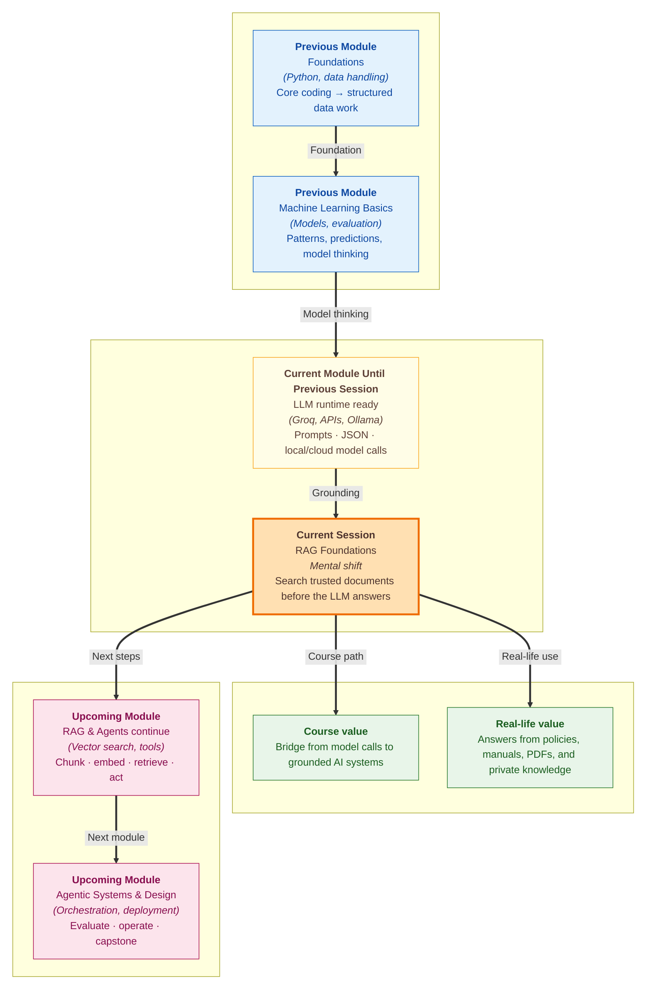

# Pre-read: RAG Foundations

## Context of This Session in the Course

---

Imagine your college has a **student helpdesk assistant**. A student asks, *"What is the late-submission rule for our current cohort?"* The assistant replies confidently: *"Late submissions are accepted for 24 hours with a small penalty."*

The answer sounds polished. It even sounds official. But what if the actual handbook says **48 hours** and **10% penalty per day**?

This is the exact danger with normal AI answers. A **Large Language Model**, or **LLM**, is very good at writing fluent English, but it does not automatically open your college handbook, company policy PDF, product manual, or latest notice. If the required fact is not already in the prompt, the model may still give a confident answer based on general patterns.

That confidence is the tricky part. A wrong answer written in poor English is easy to doubt. A wrong answer written like a professional policy note can quietly create real damage — wrong refunds, wrong attendance advice, wrong customer promises, or wrong action by an agent.

In the **previous session**, you made models easier to access. You worked with **Ollama**, local model calls, cloud behaviour, and safe configuration through environment variables. That gave your code a working **generator** — the part that can write a final reply.

Now the next challenge is simple to say but powerful in practice: **Can we make the model read the right page before it answers?**

---

## The Real Problem: AI That Sounds Right But Has Not Checked the File

Think about a customer-support executive in an e-commerce company. A customer asks, *"Can I return opened earphones?"* A careless executive answers from memory. A careful executive opens the official returns policy, reads the exact clause, and then replies.

For serious AI systems, we want the careful executive behaviour.

A plain LLM is like a smart person answering from memory. It may know many common things, but it usually does not know:

- your private company documents,
- this week's updated policy,
- your course handbook,
- your internal product manual,
- or the exact small document your team just created.

This creates **factual gaps**. A factual gap means the model is missing the real information needed for the question. If the model still answers, it may **hallucinate** — which means it creates a fluent but unsupported answer.

In simple terms, hallucination is not magic. It is the model filling an empty space with something that sounds likely.

---

## Search First, Then Answer

This session introduces **Retrieval-Augmented Generation**, usually called **RAG**.

**RAG** means the system first **retrieves** relevant text from an external knowledge source, then gives that text to the LLM, and only then asks the LLM to generate the answer. In simple words: **search first, then speak**.

The daily-life analogy is an **open-book exam**. A student who answers only from memory may forget the exact rule. A student who first opens the correct page, reads the line, and then writes the answer has a much better chance of being accurate.

RAG makes the AI behave like that open-book student.

Your documents become the **book**. The retriever becomes the **student finding the page**. The prompt becomes the **answer sheet with the relevant paragraph pasted in**. The LLM becomes the **writer** who explains the answer clearly.

This is why RAG is so important in companies. It lets teams build assistants that answer from **trusted documents**, not only from the model's old training memory.

---

## The Pipeline You Will Learn

RAG may sound advanced, but the basic flow is easy to understand:

1. **Ingest:** Bring documents into the system. These may be PDFs, Markdown files, helpdesk articles, policy notes, or small text records.
2. **Prepare:** Break the documents into smaller pieces called **chunks** and turn those chunks into **embeddings**.
3. **Retrieve:** When a user asks a question, find the chunks that are most related to that question.
4. **Augment:** Add those retrieved chunks into the prompt as context.
5. **Generate:** Ask the LLM to answer using only that context.

A **chunk** is just a small piece of a large document. Instead of feeding a 200-page PDF to the model, we split it into smaller searchable parts. This is like marking important paragraphs in a textbook before an exam.

An **embedding** is a list of numbers that represents the meaning of text. Do not worry about the math yet. Think of it like a **location pin in meaning-space**: refund-related sentences sit closer to refund questions, and exam-related sentences sit closer to exam questions.

In this session's demo, **Groq** will create embeddings for search, and **Ollama** will generate the final answer. This is a useful professional pattern: one tool can help find the right information, and another tool can write the answer.

---

In this pre-read, you'll discover:

- **Understand** why an LLM alone can sound correct but still miss private or latest facts.
- **Learn** how **RAG** reduces factual gaps by bringing external knowledge into the prompt.
- **Discover** the retrieve-then-generate pipeline from document store to final answer.
- **Understand** where **chunking** and **embeddings** fit before you build larger RAG applications.

---

## Words You Will Hear

- **LLM:** A language model that writes answers by predicting likely text from its training and prompt.
- **External knowledge:** Documents outside the model, such as PDFs, manuals, policies, and notes.
- **RAG:** A method where the system searches trusted documents first and then asks the LLM to answer.
- **Retriever:** The part that finds the most relevant chunks for a user question.
- **Generator:** The LLM that writes the final response.
- **Context injection:** Adding retrieved text into the prompt so the LLM has facts to use.
- **Grounding:** Making sure the answer is supported by the provided context instead of invented from memory.
- **Chunking:** Splitting large documents into smaller searchable pieces.
- **Embedding:** Turning text into meaning-based numbers so similar ideas can be searched.

---

## What's Next

After this session, you should be able to:

- **Explain** why private or updated documents cannot be trusted to model memory alone.
- **Describe** the full RAG flow from documents to final answer.
- **Identify** the roles of chunking, embeddings, retrieval, context, and generation.
- **Run** a minimal RAG demo on a small document set and inspect which chunks were retrieved.
- **Discuss** why grounded answers are safer for real agents than confident guesses.

---

## Questions We Will Unpack Live

1. A student asks about a late-submission rule that exists only in a private handbook. Why might a normal LLM give the wrong answer even if its English sounds perfect?

2. If a document has refund rules, support email, and exam schedule in one place, how should we split it so the system can find the right information quickly?

3. When the user asks a question that is **not** present in the documents, what should a grounded RAG system do — guess politely or admit that the answer was not found?

4. In a small RAG demo, how can we check whether the system actually retrieved the right source before generating the final answer?

Come ready to think like a careful librarian, not only like a prompt writer. The main shift in this session is from *"Can the model answer?"* to *"Did the model first read the right evidence?"* That shift is the foundation for reliable RAG systems and safer agents.
