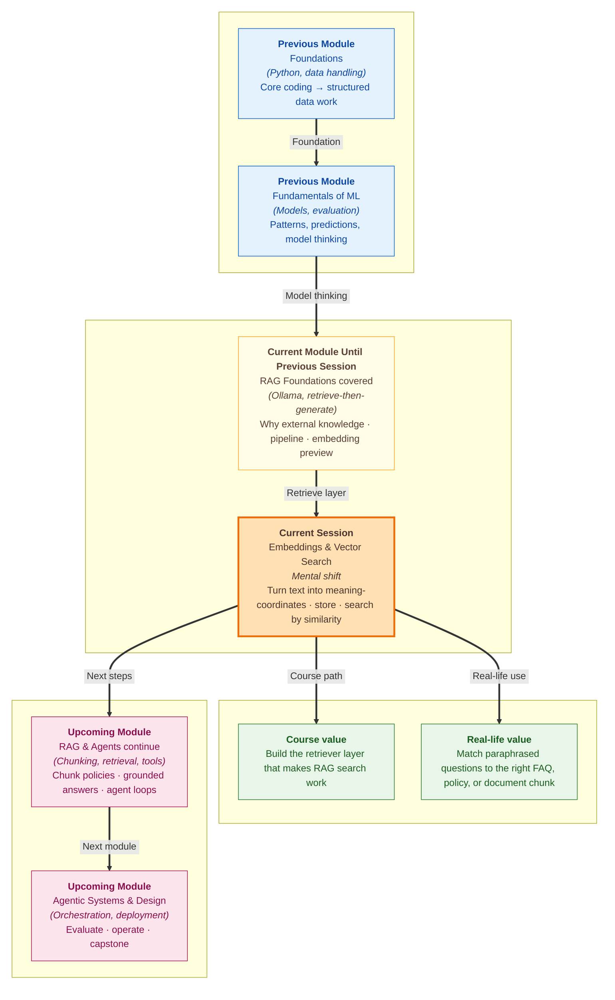

```mermaid
%%{init: {'flowchart': {'nodeSpacing': 45, 'rankSpacing': 55, 'diagramPadding': 20}}}%%
flowchart TB
  subgraph foundation[" "]
    direction TB
    M1["<b>Previous Module</b><br/>Foundations<br/><i>(Python, data handling)</i><br/>Core coding → structured data work"]
    M2["<b>Previous Module</b><br/>Fundamentals of ML<br/><i>(Models, evaluation)</i><br/>Patterns, predictions, model thinking"]
  end

  subgraph path[" "]
    direction TB
    M3U["<b>Current Module Until Previous Session</b><br/>RAG Foundations covered<br/><i>(Ollama, retrieve-then-generate)</i><br/>Why external knowledge · pipeline · embedding preview"]
    CUR["<b>Current Session</b><br/>Embeddings &amp; Vector Search<br/><i>Mental shift</i><br/>Turn text into meaning-coordinates · store · search by similarity"]
  end

  subgraph value[" "]
    direction LR
    CV["<b>Course value</b><br/>Build the retriever layer that makes RAG search work"]
    RL["<b>Real-life value</b><br/>Match paraphrased questions to the right FAQ, policy, or document chunk"]
  end

  subgraph future[" "]
    direction TB
    M3R["<b>Upcoming Module</b><br/>RAG &amp; Agents continue<br/><i>(Chunking, retrieval, tools)</i><br/>Chunk policies · grounded answers · agent loops"]
    M4["<b>Upcoming Module</b><br/>Agentic Systems &amp; Design<br/><i>(Orchestration, deployment)</i><br/>Evaluate · operate · capstone"]
  end

  M1 ==>|&nbsp;Foundation&nbsp;| M2
  M2 ==>|&nbsp;Model thinking&nbsp;| M3U
  M3U ==>|&nbsp;Retrieve layer&nbsp;| CUR
  CUR ==>|&nbsp;Course path&nbsp;| CV
  CUR ==>|&nbsp;Real-life use&nbsp;| RL
  CUR ==>|&nbsp;Next steps&nbsp;| M3R
  M3R ==>|&nbsp;Next module&nbsp;| M4

  classDef prev fill:#e3f2fd,stroke:#1565c0,color:#0d47a1
  classDef currMod fill:#fffde7,stroke:#f9a825,color:#5d4037
  classDef currSes fill:#ffe0b2,stroke:#ef6c00,color:#4e342e,stroke-width:3px
  classDef val fill:#e8f5e9,stroke:#2e7d32,color:#1b5e20
  classDef fut fill:#fce4ec,stroke:#ad1457,color:#880e4f

  class M1,M2 prev
  class M3U currMod
  class CUR currSes
  class CV,RL val
  class M3R,M4 fut

  linkStyle default stroke-width:3px
```
