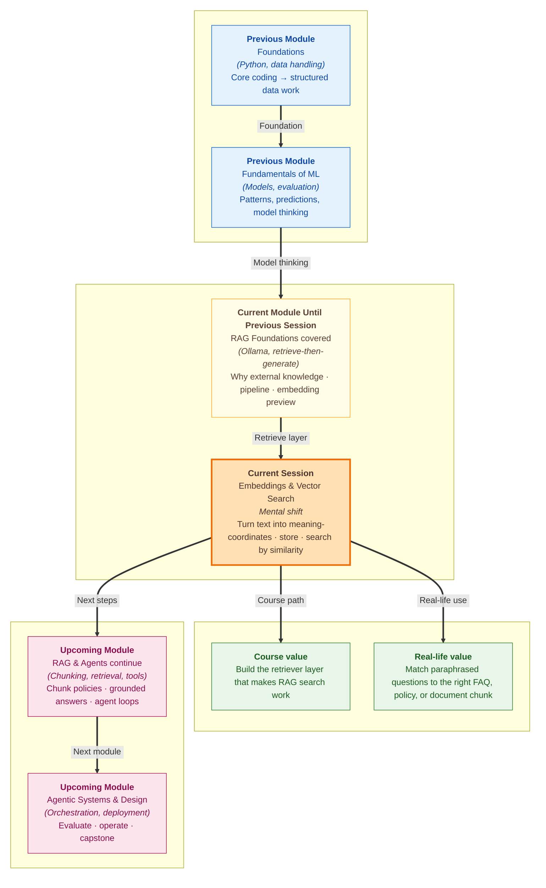

# Pre-read: Embeddings & Vector Search

## Context of This Session in the Course

---

Imagine you open a shopping app and type, **"I want my money back for returned shoes."** You may not use the word **refund**, but the app should still connect your sentence to the refund policy.

This is the challenge many modern AI systems face. People ask questions in natural language, while documents, FAQs, policies, and notes may use different words for the same idea.

That is where **embeddings** and **vector search** become important.

In the **previous session**, you learned the foundation of **RAG** — why an AI system first retrieves useful information from an external source and then uses that information to answer. You saw the retrieve-then-generate pipeline and a preview of how text can be turned into numbers with **Ollama**. This session focuses on the retrieval engine itself: how text is converted into numbers, stored, compared, and searched by **meaning**.

---

## Why Meaning-Based Search Matters

Let us take a simple example from daily life. Suppose you run an e-commerce support desk with FAQ lines about returns, refunds, shipping, passwords, and delivery. Now a customer asks, **"I returned my shoes. When will I get my money back?"**

The customer did not use the exact phrase **"refunds are processed"**, but any human can understand that the refund FAQ is the best match. The computer needs a way to reach the same conclusion. It needs to compare **meaning**, not just spelling.

**Keyword search** looks for exact words or filters — useful for IDs, dates, and statuses. **Semantic search** looks for what the user **meant**, even when the wording is different. Both have a place in real systems, but RAG retrieval depends heavily on semantic search.

An **embedding** is a list of numbers that represents the meaning of a piece of text. In simple words, it is like a **meaning fingerprint**. Similar meanings get similar number patterns, while unrelated meanings stay far apart.

---

## The Map Analogy

Think of embeddings like locations on a map. Nearby locations are easy to compare because their coordinates are close. In the same way, sentences about refunds sit near other refund-related sentences, while sentences about password reset sit near account-access sentences.

The computer does this using **vectors**, which are ordered lists of numbers. You do not manually create these numbers. A trained **embedding model** takes text and returns a vector that can be stored, compared, or searched.

If you use one model to store your FAQ lines and a different model to encode the user's question, the comparison may not make sense. It is like using two maps with different coordinate systems. The **same embedding model** must be used for both stored content and user questions.

---

## From Text to Searchable Meaning

The journey is simple. First, normal text such as an FAQ sentence is converted into a vector. Then the vector is stored along with the original text. When a user asks a question, the same model converts that question into another vector, and the system searches for stored vectors that are closest in meaning.

This is the core idea behind **semantic search**. The word **semantic** means related to meaning. Semantic search looks for what the user means, not only the exact words they typed.

At a small scale — say five FAQ lines — you could compare vectors one by one in a loop. At real-world scale, with thousands or lakhs of chunks from PDFs, support articles, policies, and manuals, you need a **vector database**.

A vector database stores the original text, a unique ID, metadata such as category or source, and the embedding vector used for meaning-based search.

In this session, the main tool is **Chroma**. The workflow is the same wherever you build: **embed, store, search, inspect**.

Think of Chroma like a library catalogue sorted by meaning. A normal catalogue may search by title, author, or keyword. A vector database can find content close to the user's question even when the wording is different.

---

## Understanding Similarity Scores

When the system searches, it does not simply say **"match"** or **"no match."** It gives a ranked list of results. If a user asks about money back after returning shoes, Rank 1 may be the refund policy and Rank 2 may be the return window.

Many vector search tools also show a **distance** or similarity value. In distance-based results, a **smaller distance usually means** the stored text is closer to the user question in meaning.

But these scores are not exam marks. **Rank 1 is not automatically correct.** You still need to inspect the returned text and check whether it answers the user's need.

If your knowledge base does not contain any payment FAQ, and a user asks, **"Can I pay with UPI?"**, the system may still return the closest available result. That does not mean the answer is correct. It means the database found the nearest meaning among the limited content it had.

Good search depends on good data. Returning the top **k** matches — for example, the best three — gives you more options to inspect before feeding text into a final AI answer.

---

In this pre-read, you'll discover:

- How **embeddings** turn text into meaning-based number representations.
- How **vectors** help compare sentences that use different words but share similar meaning.
- Why a **vector database** like **Chroma** is useful for storing and searching vectors at scale.
- How **top-k semantic search** returns the best few matches instead of only one answer.

---

## What's Next

After this session, you should be able to:

- **Explain** embeddings using a simple real-life analogy.
- **Describe** why semantic search is different from keyword search.
- **Read** top-k results and judge whether the retrieved chunks are relevant.
- **Connect** vector search to the larger RAG pipeline you started in the previous session.

Later work will **chunk real documents** (size, overlap, and file/page labels), persist them with the same **Chroma** pattern, wire retrieval into prompts, and build toward full grounded answers and agent systems.

---

## Questions to Think About Before Class

1. If two people ask the same question using totally different words, how can a computer know both questions mean the same thing?

2. What should happen when the best available result is still not good enough to answer the user's question?

3. If a support system returns three possible FAQ matches, how would you decide which one should be used in a final AI answer?

Keep these questions in mind. The session will turn this idea of **searching by meaning** into a working retrieval flow you can run yourself.
