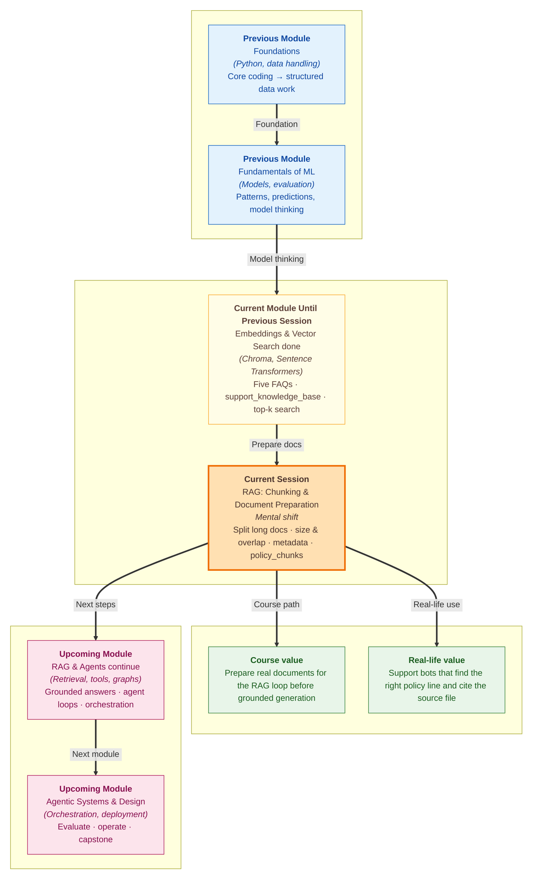

# Pre-read: RAG — Chunking & Document Preparation

## Context of This Session in the Course

---

You order a phone cover from an online shop. Two days later it arrives in the wrong colour. You open the app and type: **"Can I send this back and get a refund?"**

The support team does not read the entire **40-page policy booklet** from cover to cover for every message. They pull **one highlighted section** — the return window, the packaging rule, or the refund timeline — and answer from that. The page number is written on the slip so anyone can verify the rule later.

That everyday habit — **small, labelled pieces instead of one giant document** — is exactly what this session is about.

In the **previous session**, you stored **five FAQ lines** in **Chroma** (`support_knowledge_base`), embedded them with **Sentence Transformers** (`all-MiniLM-L6-v2`), and ran **top-k semantic search**. Each FAQ was already one small piece, with a simple **`category`** tag. Real company policies are not that neat. They are long, mixed, and spread across files. Before search can work well, someone has to **prepare** those files.

---

## When One Big File Is the Wrong Answer

We continue the **e-commerce support** theme from the previous lab — returns, refunds, shipping, and the **499-rupee free shipping** rule. Call the brand **ShopEasy**. It now has longer write-ups for **returns**, **shipping**, and **warranty** — some as plain text, some as PDFs. A customer asks: **"How many days do I have to return a product?"** That answer should come from the **returns** policy, not from a paragraph about express delivery in Mumbai.

In the previous session, each FAQ was already one line — easy to store and search in `support_knowledge_base`. Now imagine stuffing an entire policy PDF into the system as **one single entry**. The computer turns that whole file into **one meaning fingerprint** (an **embedding** — a list of numbers that captures what the text is about). Returns, shipping, and warranty all get **averaged together**. A question about refunds might accidentally match text about **delivery time**, because everything lived in one blurry bundle.

That is the core problem **document preparation** solves. **Document preparation** is the step where you split long text into **chunks** (small segments), label each chunk, and only then send them for embedding and storage. In simple words: cut long policies into **small labelled cards**, then put each card in the library.

---

## The Challenge We Will Tackle

What if your support bot had to search through **three full policy documents** every time a user typed one short question — and still returned a **wall of text** instead of the exact rule?

What if the best match said *"within 30 days"* but never mentioned **returns**, because the sentence was **cut in half** at a bad boundary?

What if a manager asked **"Which file did this answer come from?"** and the system could only reply **"some text"** — with no file name and no page number?

These are not rare edge cases. They show up the moment you move from five neat FAQ lines to **real company documents**. The live session focuses on three skills that fix this: **how to split**, **how to label**, and **how to store** — using the same **Chroma** path you already practised (`PersistentClient` → `encode` → `upsert` → `query`), but with many more rows, a new collection (`policy_chunks`), and richer labels (`source_id`, `page`).

---

## Size, Overlap, and the Labels on Every Card

**Chunking** means splitting long text into segments sized for search. Think of **chunk size** as the **maximum size of one search card**. Too small — a fragment like *"within 30 days"* loses the word **returns** and becomes confusing on its own. Too large — you are back to a blurry mega-chunk that mixes many topics. For policy-style text, a balanced starting point is around **500 characters** — roughly two to four short sentences, enough for **one idea** per card.

**Chunk overlap** is a **shared margin** between neighbouring cards. When you slide a window across the text, the end of one chunk repeats at the start of the next — like a newspaper repeating the **last line** at the top of the next column so you never lose a sentence split across the break. A common rule is overlap around **10–20%** of chunk size (for example, **75 characters** when the chunk is **500**). Overlap costs a few extra rows in storage, but it saves answers that would otherwise be torn apart at the edges.

**Metadata** is the **label on the folder**, not the paragraph itself. Every chunk needs at least **`source_id`** (which file it came from, such as `returns_policy.txt`) and **`page`** (which page in a PDF — use **0** for plain text files). When search returns a result, you read these tags and can say *"According to returns_policy.txt…"* instead of *"According to some text…"*. Only the chunk **text** becomes the embedding; metadata stays attached for **citation and debugging**.

---

## The Samosa and the Photocopy Shop

Two analogies capture the logic quickly.

**Chunk size** is like cutting a **samosa**. Too small and you lose the filling; too large and it is no longer a bite-sized snack. Each piece should be small enough to eat comfortably but big enough to taste what is inside.

**Document preparation** is like a **coaching institute** handling doubts. Nobody photocopies an entire **40-page module** for one question. They pull **one highlighted section** with the **page number** written on it. Your chunks are those highlighted sections; metadata is the page number on the slip.

---

In this pre-read, you'll discover:

- **Why** embedding an entire PDF as one piece leads to vague, mixed-up search results — and how **chunking** turns long policies into searchable cards
- **How** to choose **chunk size** and **overlap** so each card holds roughly **one idea** without losing sentences at the edges
- **Why** **metadata** (`source_id`, `page`) matters for traceability — so every answer can point back to a real file
- **How** prepared chunks flow into the same **Chroma** pattern from the previous lab — more rows, richer labels, the **same-model rule**, and meaning-based search

---

## Words You Will Hear

- **Chunk:** A small segment of a longer document, stored and searched as its own unit.
- **Fixed-size splitter with overlap:** The most common starter approach — slide a window of fixed length across the text, stepping forward by *size minus overlap*.
- **Vector store:** A database that keeps embeddings and finds the closest matches when a user asks a question — you used **Chroma** (`support_knowledge_base`) in the previous session.
- **Corpus:** The collection of source documents (in memory or loaded from disk) before they are split into chunks.
- **Same model rule:** Use one embedding model for every stored chunk and every user question — you practised this with `all-MiniLM-L6-v2`.
- **Traceability:** The ability to show which file and page supported an answer — essential for trust in support and compliance settings.

Loading plain-text and PDF files into a uniform corpus is part of the bigger picture, but the **main skill** in this session is splitting and tagging well — not building the perfect file loader.

---

## What's Next

By the end of the session, you should be able to:

- **Compare** different chunk size and overlap settings and justify a choice for policy-style documents
- **Attach** `source_id`, `page`, and chunk order labels to every segment before storage
- **Persist** chunked rows in a dedicated collection and run semantic search against them
- **Inspect** top search results and read metadata to verify the answer came from the right policy file
- **Recognise** when a bad match is a **chunking or labelling** problem — not automatically a database failure

Prompt assembly and a full RAG chatbot that writes final answers come in **later work** on the same track. This session masters the **prepare** step so retrieval has clean fuel.

---

## Questions to Think About Before Class

1. A user asks **"How many days do I have to return a product?"** Search returns a chunk that only says *"Items must be in original packaging"* — with no mention of **30 days**. Would you fix this by changing **chunk size**, **overlap**, or something else first — and why?

2. Two chunks both mention **free shipping**, but one is from the **shipping** policy and one from a **promotional banner** stored in the same index. How would **`source_id`** in metadata help you trust Rank 1 before quoting it to a customer?

3. You run the same ShopEasy corpus with **chunk size 300** versus **800** and count how many chunks are created. What trade-off would you expect between **more chunks with sharper meaning** and **fewer chunks with blurrier meaning** — and which setting would you pick for a returns FAQ?

Keep these questions in mind. The session turns **one FAQ line at a time** into **real, traceable policy search** — the bridge between meaning-based lookup and grounded answers in the work ahead.
