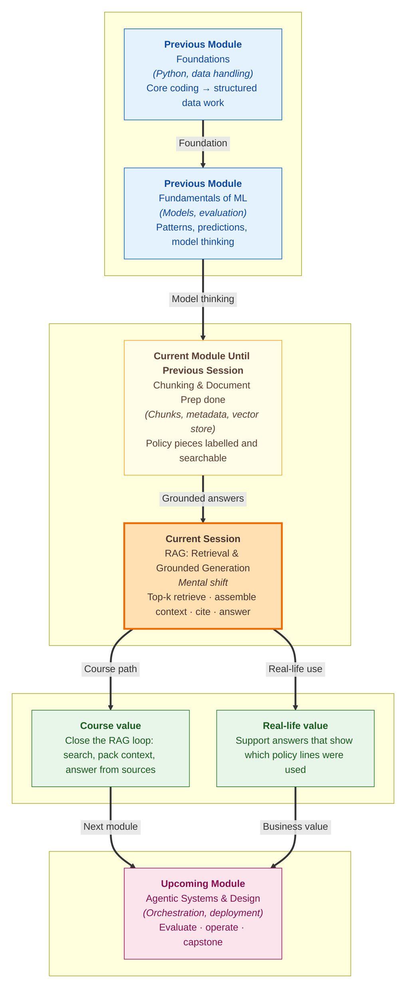

# Pre-read: RAG — Retrieval & Grounded Generation

## Context of This Session in the Course

---

You message ShopEasy support: **"I ordered a phone cover in blue. It arrived in black. Can I return it within 10 days and get a refund?"**

A careful human agent does not invent a rule from memory. They open the returns policy, find the relevant lines, answer from those lines, and can point to the source if a supervisor asks. That habit — **find first, then answer** — is the heart of this session.

In the previous session, you prepared real documents: split policies into **chunks**, added **metadata** such as source and page, and stored them in a **vector index**. Search became possible. Now the missing half appears: take the best matches, pack them into a prompt, and generate an answer that stays faithful to those matches.

That full loop is **RAG** — **Retrieval-Augmented Generation**. In simple Indian English: the AI first collects useful notes from your library, then writes the reply using those notes.

---

## When Fluent Answers Still Feel Untrustworthy

ShopEasy now has a searchable library of return, shipping, and warranty chunks. A customer asks about the return window. The system can find promising pieces. But two new risks appear immediately.

First risk: the model answers from **general knowledge** and ignores the retrieved policy. The reply sounds confident. The policy on file may say something different.

Second risk: the model mixes three chunks into one paragraph and never shows **which chunk supported which claim**. A manager cannot verify the answer. A trainee cannot learn from it. A wrong line cannot be fixed quickly.

So the challenge is bigger than "search worked." The challenge is: **What if you had to retrieve the top matching chunks, assemble them into a clear context block, generate an answer that stays grounded in that context, and still show which pieces supported the reply?**

That is what this session builds — a small end-to-end RAG flow: ingest is already done, then retrieve, then answer.

---

## The Four Moves of Grounded RAG

Think of the workflow as four connected moves.

### 1. Top-k retrieval

**Top-k retrieval** means: for one question, bring back the **k** most similar chunks from the prepared vector index. If **k = 3**, you get the three best matches, not the whole library.

Why not always fetch twenty chunks? Too much context creates noise, cost, and confusion. Why not fetch only one? A single chunk may miss a needed sentence. Top-k is the practical middle path. You will configure it against the index prepared earlier in this module.

### 2. Context assembly

Retrieval alone is not enough. The selected chunks must be packed into a **prompt context block** the model can read clearly.

**Context assembly** means arranging those chunks with **clear delimiters** — visible separators so the model can tell where one source ends and the next begins. In simple words: do not dump text into one messy paragraph. Give the model labelled notes, like:

- Chunk 1 from returns policy
- Chunk 2 from refund timeline
- Chunk 3 from packaging rules

Good assembly reduces mixing and makes citation easier later.

### 3. Grounded generation

**Grounded generation** means the answer should come from the retrieved context, not from unchecked guesswork.

A grounded answer can say: returns are allowed within the stated window **because Chunk 1 says so**. An ungrounded answer invents a number that never appeared in the notes.

In this session, you will practise an **informal grounding check**: after the answer is written, ask which chunks supported each claim. If a claim has no supporting chunk, it is a warning sign.

### 4. Mini RAG app

Finally, you connect the pieces into a small end-to-end script: question in → retrieve top-k → assemble context → generate answer → show support. That is the first version of a real RAG assistant, not just isolated search demos.

---

## Think of It Like an Open-Book Exam

A helpful analogy is an open-book college exam.

The question paper is the **user question**. The allowed textbook pages are your **retrieved chunks**. The way you arrange those pages on the desk is **context assembly**. Writing the answer while looking only at those pages is **grounded generation**. Writing from memory while the book sits closed is **ungrounded** behaviour — even if the handwriting looks excellent.

Top-k is like the invigilator allowing you to open only the most relevant **k** pages, not the entire library shelf at once. Citations are like writing "as per page 12 of the returns chapter" beside each important claim so the teacher can verify quickly.

When you see RAG this way, the goal becomes clear: not "make the AI sound smart," but "make the AI answer like a student who used the book honestly."

---

## Why Citations Turn Answers into Evidence

A support lead at ShopEasy does not only ask, "Was the customer happy?" They ask, "Which policy line did we use?"

That is why this session emphasises answers that **cite which chunks supported each claim**. Even an informal citation habit changes quality:

- It helps you spot invented details.
- It helps teammates audit the bot.
- It helps you decide whether a failure came from retrieval or from generation.

If the right chunk was never retrieved, improve search. If the right chunk was retrieved and the model still invented a rule, improve the grounded prompt and checks. Separating those cases is a professional RAG skill.

---

## Why This Matters for Your Career and the Course

Companies deploy RAG because customers expect answers that match **their** documents — policies, manuals, handbooks — not generic internet style advice.

In this module, you already learnt what RAG is, how embeddings power semantic search, and how chunking prepares documents. This session closes the beginner loop: **retrieve → assemble → generate → cite**. That loop becomes the backbone for later agent work, where retrieval is one tool among others, and for Module 4 work on stronger grounding and evaluation.

You will also practise thinking in systems: a mini RAG app is only trustworthy when each stage is intentional. Search quality, context packing, and grounded answering all matter together.

---

## In this pre-read, you'll discover:

- **Understand** how top-k retrieval selects a small set of useful chunks for one question.
- **Discover** why retrieved chunks must be assembled into a prompt context block with clear delimiters.
- **Learn** what grounded generation means and how informal citation checks catch unsupported claims.
- **Understand** how a small end-to-end RAG flow connects ingest, retrieve, and answer into one usable path.

## What You Will Be Able to Talk About After This Session

After this session, you should be able to explain a RAG answer path in plain language: the question comes in, top-k chunks are retrieved from the vector index, context is assembled, and the model answers from that context with visible support.

You will also be able to discuss trust more carefully. Instead of saying "the bot was wrong," you will ask whether retrieval failed, whether context was messy, or whether generation ignored the notes.

Most importantly, you will start treating RAG as an evidence habit: find the lines, pack them clearly, answer from them, and show which lines did the work.

## Interesting Questions for the Live Session

- For a ShopEasy return question, how do you choose a sensible **top-k** so the context is enough without becoming noisy?
- When you assemble retrieved chunks into a prompt, what **delimiters** and labels help the model keep sources separate?
- If the final answer mentions "15 days" but no retrieved chunk contains that number, is the problem more likely in retrieval or in generation — and what would you check first?
- In a mini end-to-end RAG run, what should the output show so a teammate can verify which chunks supported the reply?

By the end, RAG should feel less like a buzzword and more like a disciplined open-book method: retrieve the right notes, assemble them clearly, generate from those notes, and keep the evidence visible.
