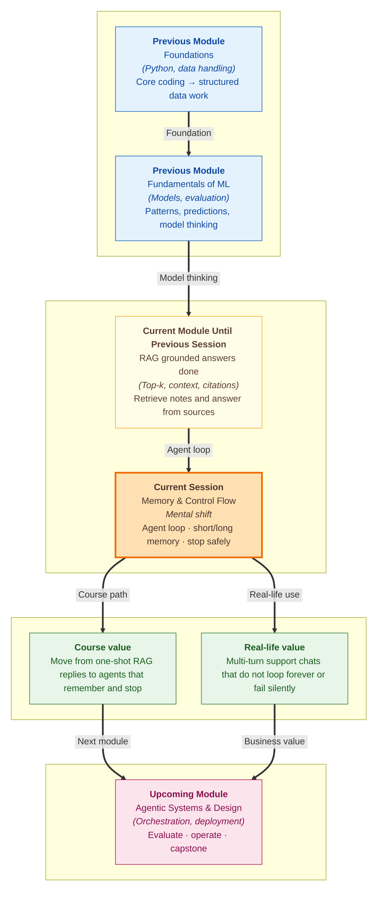

# Pre-read: Memory & Control Flow

## Context of This Session in the Course

---

A ShopEasy customer opens chat and says: **"I want to return my phone cover."**

Two minutes later they add: **"It was the wrong colour."** Then: **"Do I still have time?"** Then: **"Also remind me what you said about packaging."**

A helpful human agent does not treat each line as a brand-new stranger. They remember the earlier turns, check the policy, and continue the conversation. They also know when to stop asking the same thing again, and what to say if the system is temporarily down.

That everyday skill — **remember across turns, decide the next action, and stop safely** — is what this session is about.

In the previous session, you closed the beginner **RAG** loop: retrieve useful chunks, assemble context, and generate grounded answers. That is powerful for one question. Real products need something more: an **agent** that can work across multiple turns without forgetting, looping forever, or failing in silence.

---

## When One Smart Reply Is Not Enough

Imagine building a ShopEasy helper that only answers one message at a time and then forgets everything.

The customer says "wrong colour cover." The bot answers about returns. The customer asks "how many days?" The bot asks "which product?" again. The customer gets irritated. The company looks careless.

Or imagine the opposite problem: the helper keeps "thinking" in a loop — check, rethink, check again — and never returns a final message. Or an API call fails and the screen shows nothing useful.

So the challenge becomes: **What if you had to design a simple agent that remembers the chat so far, continues a safe loop of perceive–reason–act, knows when to stop, and shows a clear message when a tool or API error happens?**

That is the focus of **memory and control flow**.

---

## What an AI Agent Actually Is

In this course, an **AI agent** is not "a chatbot with a fancy name."

An **AI agent** is a system that:

1. **Perceives** — reads the latest user message and relevant context
2. **Reasons** — decides what to do next
3. **Acts** — uses tools, retrieval, or a final reply
4. Uses **memory** — keeps useful information across steps or turns

In simple Indian English: an agent is like a junior support executive with a notebook. It listens, thinks, does the next useful action, and writes down what matters for later.

This definition matters because memory and control flow only make sense once you see the agent as a **looping system**, not a one-line answer machine.

---

## Short-Term Memory vs Long-Term Memory

**Short-term memory** is the recent conversation history — what was said in this chat so far. It helps the agent connect "wrong colour" with "phone cover" and "return window" without forcing the user to repeat everything.

**Long-term memory** is information kept beyond one short chat burst — notes that can be stored and reloaded later, such as a saved preference or a previous case summary.

In simple words:

- Short-term memory is the **sticky notes on today's desk**
- Long-term memory is the **file kept in the cabinet for next week**

This session emphasises practical short-term behaviour first: **persist and reload conversation history across turns** in a script or notebook. That means when turn 2 starts, turn 1 is still available. When you reload the notebook flow, the history can come back instead of vanishing.

Without that, every turn feels like meeting a customer for the first time.

---

## Control Flow: The Rules of the Loop

**Control flow** means the rules that decide how the agent loop runs — what happens next, and when it must stop.

Two control ideas are especially important here:

### Loop termination

**Loop termination** means clear stop conditions so the agent does not run forever.

Examples of healthy stops:

- The user goal is complete
- A maximum number of iterations is reached
- The agent is blocked and must ask the user for missing information

Without termination rules, systems can burn time, money, and patience in **runaway iterations** — repeating work with no useful ending.

### Basic error handling

APIs fail. Tools fail. Networks lag. Beginners often hide these failures or crash with confusing technical text.

This session focuses on **predictable errors** and **user-visible messages**. If a lookup fails, the user should see something honest and useful, such as "I could not fetch the return policy right now. Please try again in a minute," instead of silence or a raw error dump.

Good control flow is not only about success paths. It is also about failing clearly.

---

## Think of It Like a Cricket Over with a Scorecard

A useful analogy is a cricket over.

Each ball is one turn in the agent loop. The batter perceives the ball, reasons about the shot, and acts. The scorecard is **memory** — runs, wickets, and what happened earlier in the innings. Without the scorecard, every ball feels disconnected.

**Control flow** is the rulebook:

- An over ends after the allowed balls (**loop termination**)
- A no-ball or interruption is signalled clearly (**error handling**)
- The match does not continue endlessly because nobody remembered the rules

Your agent needs the same discipline. Memory keeps the story coherent. Control flow keeps the process safe, finite, and understandable.

---

## Why This Matters for Your Career and the Course

Users judge assistants on multi-turn behaviour. They notice when a bot forgets context. They notice when it loops. They notice when errors are hidden.

In this module, you have already built prompting, APIs, RAG foundations, embeddings, chunking, and grounded generation. Memory and control flow turn those skills into an **agent loop** you can trust for more than one message. This also prepares you for tool use next, where the agent must remember what it already tried and stop when the task is done.

Professionally, this is the difference between a demo reply and a small system that can hold a conversation without chaos.

---

## In this pre-read, you'll discover:

- **Understand** an AI agent as a system that perceives, reasons, and acts with tools and memory.
- **Discover** the difference between short-term chat history and longer-term stored notes.
- **Learn** why conversation history must be persisted and reloaded across turns.
- **Understand** how loop termination and clear error messages keep an agent safe and usable.

## What You Will Be Able to Talk About After This Session

After this session, you should be able to explain why a one-shot RAG answer is not yet a full agent. You will be able to describe short-term memory, why history must survive across turns, and how stop conditions prevent runaway loops.

You will also be able to discuss failures more professionally. Instead of saying "the bot broke," you will ask whether memory was missing, whether the loop never terminated, or whether an API error was hidden from the user.

Most importantly, you will start designing agent behaviour like an operations process: remember what matters, continue only while useful, and communicate clearly when something goes wrong.

## Interesting Questions for the Live Session

- In a ShopEasy return chat, which details belong in **short-term memory**, and what might be worth saving as longer-term notes?
- If conversation history is not persisted between turns, what confusing behaviour will the user see first?
- What **loop termination** conditions would you set so the agent stops after success, after a block, or after too many iterations?
- When a tool or API call fails, what kind of **user-visible message** builds trust instead of panic or silence?

By the end, memory and control flow should feel less like advanced theory and more like basic professionalism for agents: keep the notebook updated, run a bounded loop, and never leave the user guessing when something fails.
