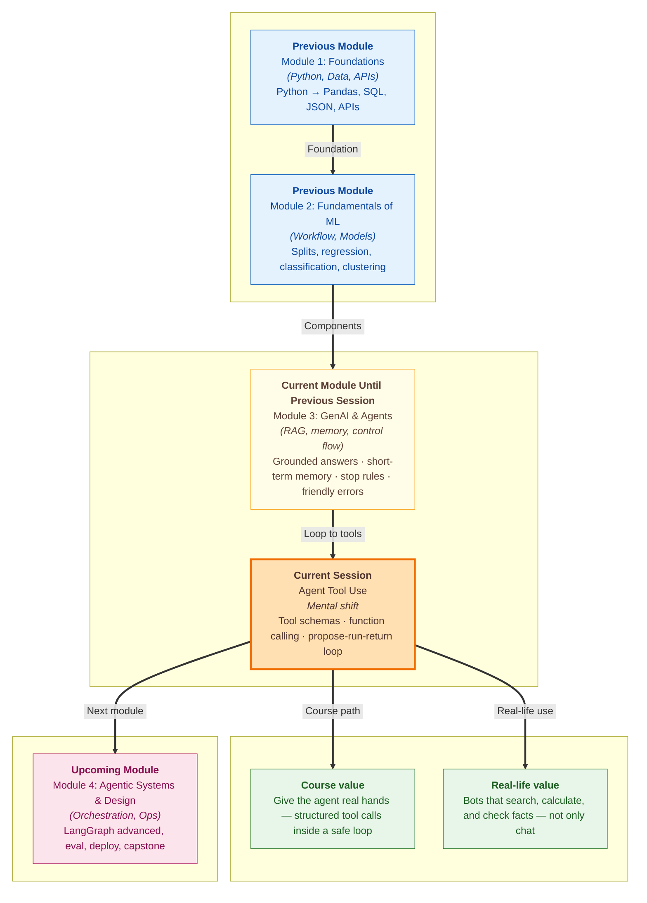

# Pre-read: Agent Tool Use

## Context of This Session in the Course

---

You are at a **ShopEasy service counter**. A customer asks: **"Is my order #48291 out for delivery today?"** The staff member at the desk is **very polite** and knows the **returns policy by heart** — but they **cannot open the warehouse system**. They guess: **"It should arrive soon!"** The customer checks the tracking app and sees **"Delayed — rescheduled for tomorrow."** Trust is gone. The person sounded confident; they simply had **no access to the right tool**.

That gap — **knowing what to say** versus **being able to look something up for real** — is exactly what today's topic closes.

In the **previous** session you built an **agent loop** with **short-term memory** (the running chat history), **stop rules** so the loop does not run forever, and **clear error messages** when things break. Your ShopEasy helper could follow up on *"What about pickup?"* because it **remembered** earlier turns. What it still lacked was **hands**: a structured way to **call real capabilities** — search the live web, run exact math, look up an order — and **read the result** before speaking again.

Today you learn **function calling** (the model **chooses a named action** with **filled-in arguments** instead of only writing text) and the full **model–tool loop**: **propose → run → return → reason again**.

---

## When a fluent speaker still cannot help

Imagine your **ShopEasy support agent** again. A user asks: **"How many days left to return order #48291?"** The bot **remembers** the order number from the last message — memory works. It **retrieves** the returns policy from your **vector index** and finds **"30 days from delivery."** Good so far.

But the user follows up: **"When was it delivered?"** Without a **tool** that reads **order records**, the model must **guess a date** or **dodge the question**. It might reply **"around two weeks ago"** — plausible, wrong, and dangerous for a real business.

Or consider questions that leave the policy folder entirely: **"What is Nvidia's stock price right now?"** or **"If ₹450 grows to ₹630 in 6 years, what will it be in 2 years?"** A PDF cannot hold today's market price. Large language models are also **not perfect calculators**. Text generation alone cannot reliably **search live data** or **multiply carefully**. You need the agent to **request an action** — in a format your program can **execute** — then **feed the result back** so the model answers with **evidence**, not imagination.

That is **tool use**: the language model **plans**; your code **acts**; the model **speaks** only after seeing what actually happened.

---

## The challenge we will tackle

What if you had **useful capabilities** ready — **web search**, **a Python calculator**, **policy search**, **order lookup** — but the model had **no menu** describing what each one needs as input?

What if the model **said** it checked the price, but your program **never ran** any function — so the reply was **pure fiction**?

What if a tool **did run** and returned a real number, but that result **never reached** the model's next thinking step — so the final answer still ignored the evidence?

What if the model called a lookup with **`order_id: "forty-eight thousand"`** instead of **`48291`** — and the warehouse API returned nonsense?

These are everyday **agent tool** problems. The live session shows how to **describe tools in schema form** (a structured list of **name**, **purpose**, and **required inputs**), **register** them with the agent, run the **propose → execute → return** cycle, and **verify** that tool output is visible before the next reasoning step.

---

## The floor manager and the kitchen chit

Picture a **restaurant floor manager** who **never enters the kitchen** but runs the dining room smoothly.

On the table is a **fixed menu of actions** the back office allows: **"Check stock for dish X"**, **"Fire order for table 5"**, **"Ask chef for allergen list."** Each action has a **standard chit format** — table number, dish code, special notes — so the kitchen never receives a vague **"make something nice."**

When a guest asks **"Is the paneer tikka still available?"**, the manager does **not** shout a guess across the room. They **fill a chit**: action **`check_stock`**, item **`paneer_tikka`**. A runner takes it to the kitchen. The kitchen **executes** and sends back **`in_stock: true`**. Only **then** does the manager tell the guest **"Yes, we can serve it."**

That chit is a **tool schema** — the contract that says **what the tool is called**, **what it is for**, and **which fields must be filled**. **Function calling** is the manager **writing the chit** in a machine-readable way. **Your Python code** is the kitchen — it **runs the real function** and returns a result. **Feeding the result back** is the runner **bringing the answer to the manager's notepad** before the next reply to the customer.

You will also hear a related picture in class: the model as a **branch manager**, and each tool as a **worker** with a clear **biodata** (description). Vague biodata means the wrong worker gets the job.

Without the chit system, you have a charming talker. With it, you have someone who **can actually get things done**.

---

## How the model–tool loop fits your agent

You already have an **agent loop** from the **previous** session: read context, decide, act, remember, check whether to stop. **Tool use** upgrades the **act** step.

In class you will often **see** this loop as **Thought → Action → Observation → Final Answer** (the **ReAct** pattern). That is the same idea as **propose → run → return → reason again**, written in a way you can read step by step in the notebook.

| Step | What happens |
|---|---|
| **1. Propose** | The model reads the user message and history, then requests a **tool call** — which tool and with which arguments — instead of (or before) a final answer |
| **2. Run** | Your program **finds the registered function**, checks the arguments, and **executes** it — search, calculator, mock order API |
| **3. Return** | The **tool result** (success data or a clear error) is appended so the model can read it — as an **Observation** or a **tool message** |
| **4. Reason again** | The model sees the result and either **calls another tool**, **asks a clarifying question**, or **writes the final user-facing reply** |
| **5. Stop** | Your existing **termination rules** still apply — max steps, task complete, user-visible errors |

**Registering a tool** means telling the agent: **"Here is a callable function; here is its schema; you may offer it to the model."** **Binding** connects that registration to the loop so proposed calls actually **dispatch** to your code.

**Tool result handling** is non-negotiable: if the delivery date or stock price never appears in what the model reads next, the agent **might as well not have called the tool**. The session includes checks that **outputs are fed back correctly** before the next reasoning step — the same discipline as **grounding** in RAG, but for **live actions**.

---

In this pre-read, you'll discover:

- **Why** an agent with memory and RAG can still **fail** on live prices, exact math, or order-specific questions — and how **tools** bridge the gap between **talking** and **doing**
- **How** to **describe tools in schema form** so the model can **pick the right action** and **fill in structured arguments**
- **How** the **model–tool loop** works: **propose a call → run the function → return the result → reason again** (and how that shows up as **Thought / Action / Observation**)
- **How** to **register and bind** at least one callable tool and **verify** results reach the model before the next step

---

## Words you will hear — explained right away

- **Function calling:** The model outputs a **structured request** to run a named function with specific arguments — not just free-form text.
- **Tool:** A **real capability** your code exposes to the agent — web search, Python calculator, look up an order, search policy.
- **Tool schema:** A **description** of the tool — its name, what it does, and which **parameters** (inputs) it expects — so the model knows how to call it correctly.
- **Register / bind:** **Attach** a tool to the agent so when the model proposes that tool, your program **knows which function to run**.
- **Propose → run → return:** The core cycle — model **requests** a tool, code **executes** it, result **goes back** for the next model turn.
- **Observation / tool result:** The **payload** returned after execution — success data or an error — that the model must read before answering the user.
- **ReAct:** A beginner-friendly pattern of **Thought**, **Action**, and **Observation** so you can **see** the agent working instead of treating the final answer as magic.
- **Agent executor:** The part of your program that **orchestrates** the loop — sends prompts to the model, runs tools, updates the scratchpad, checks stop conditions.

---

## What's next

By the end of the session, you should be able to:

- **Describe** at least one tool **in schema form** — name, purpose, required inputs — so the model can select and parameterize it
- **Register and bind** a callable tool to your agent or executor so proposed calls **dispatch to real code**
- **Execute** the full **model–tool loop**: propose call, run function, return result, reason again
- **Verify** that tool outputs appear **before** the model's next reasoning step — and explain why skipping that step causes **hallucinated actions**
- **Connect** tool use to your existing **memory**, **stop rules**, and **RAG search** as different workers inside one agent
- **Read** a verbose agent trace and spot when **search** vs **calculation** should run first

Workflow **graphs**, **structured JSON outputs**, and **production guardrails** build on this pattern in **upcoming** sessions. Today your agent gains **hands** — the same idea behind assistants that book cabs, check bank balances, or pull live inventory instead of pretending they did.

---

## Questions to think about before class

1. A user asks **"When was order #48291 delivered?"** Your agent has **RAG policy search** but **no order lookup tool**. It replies **"It was likely delivered within the standard window."** What is wrong with this answer, and **which single tool** would you add first — with what **schema fields** (for example order ID)?

2. The model proposes a search, your program runs it successfully, but the **tool result never gets fed back** before the next reasoning step. The final answer still cites a number confidently. Did the tool call **help**? How would you **detect** this wiring bug while reading a verbose trace?

3. The model needs **today's Nvidia price** and then a **return calculation** on **$100**. Which tool should run **first**, which **second**, and what belongs in the **Final Answer** that should **not** appear in the first Observation alone? What **stop rule** from the **previous** session still protects you inside a multi-tool loop?

Keep these questions in mind. The session turns your **remembering, stopping agent** into one that **does real work** — one kitchen chit at a time.
