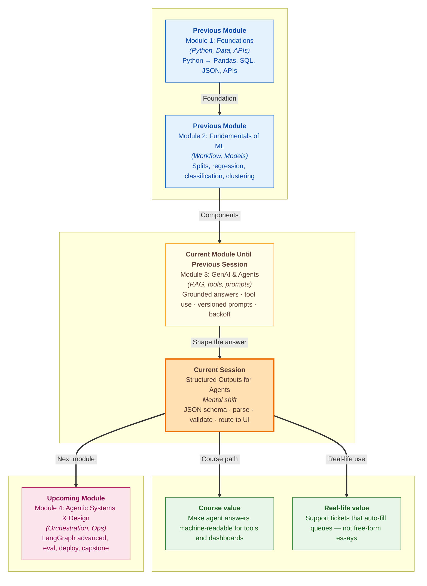

# Pre-read: Structured Outputs for Agents

## Context of This Session in the Course

---

Your **ShopEasy** support dashboard looks polished. Category chips, priority badges, draft replies — everything is ready. Then the first real customer message arrives: *"Where is order 4412? It should have come yesterday."*

The agent replies in beautiful English: *"Looks like a shipping delay — maybe medium urgency? Someone should check."* The dashboard freezes. No **category** dropdown fills. No red **high** badge appears. The next tool in the chain — auto-routing to the shipping team — never fires. The answer was *helpful to a human*. It was *useless to the software*.

**IRCTC** does not accept *"I think you want Mumbai next week."* It needs clear fields: from station, to station, class. Your agent is entering the same world. Once another system must **consume** the result — a table, a queue, a tool — free-form prose is no longer enough.

In the **previous** session you learned to **version prompts** and call APIs with **retries** and **backoff**. Those habits keep instructions reproducible. Today you close the next gap: making the model's answer a **predictable form** your code can trust.

---

## When the fact is right but the shape is wrong

What if a medical notes app must store **age**, **weight**, and **smoking** as clean columns — but the model keeps writing *"80 KGs"* and *"current smoker"* instead of a number and a yes/no?

What if a RAG answer correctly says revenue was *"84 billion dollars"* one run and *"$84B"* the next — while your chart expects a fixed key like revenue in billions?

What if ShopEasy needs every ticket to include **category**, **priority**, **summary**, **needs_human**, and **suggested_reply** — and one missing key crashes the UI?

Doing this with fragile text-matching is painful. The professional path is **structured output**: the model returns **JSON** (labelled boxes of data) that programs can **parse**, **validate**, and **route** without guessing.

Think of a **filled government form**, not a handwritten essay. Or a **passport application** with red asterisks on required fields. The model fills the boxes; your application owns the blueprint.

---

## The contract: schema, then prompt, then checks

A **JSON Schema** is that blueprint. It declares which keys are **required**, which **types** are allowed, and which **enums** (fixed menus) are legal — for example priority must be `low`, `medium`, or `high`, not `"super urgent!!!"`.

You work **backwards** from the UI or tool you already designed:

1. List the fields the dashboard or next tool needs  
2. Write them into a schema file (the contract)  
3. Mirror those same fields in the system prompt (the instructions)  
4. Ask the model for **one JSON object only** — no markdown story around it  

**Structured generation** is the act of constraining the chef: *"Serve only in the standard steel tiffin, compartments labelled."* API options like JSON mode help with **syntax**. Your validator still checks **meaning** — required keys, enums, and types.

---

## Parsing is not validation — and validation is the bouncer

Models sometimes wrap JSON in code fences, add *"Here is the classification:"*, or cut off mid-brace. **Defensive parsing** cleans that mess the way you check a **SIM card** is seated before blaming the network — strip wrappers, find the `{...}` block, convert text to a dictionary, fail with a clear message instead of a white-screen crash (think of a failed **UPI** payment that says *could not read bank response*).

Parsing only proves the text is valid JSON. **Validation** proves it is **usable**. Like a **bouncer checking ID**, or an **Aadhaar** form that will not submit with an empty PIN: missing summary, wrong priority case (`HIGH` instead of `high`), or a non-boolean `needs_human` must be blocked **before** the ticket hits the UI or a refund tool.

The full pipeline you will practise is simple to remember:

**Customer message → structured generation → safe parse → validate required fields → route to UI or tools**

If any step fails, stop. Never let half-trusted data trigger side effects.

---

In this pre-read, you'll discover:

- **Why** agent answers must become **machine-readable forms** when dashboards, databases, or tools consume them  
- **How** a **JSON schema** acts as an application contract — required keys, types, and fixed menus  
- **What** **structured generation**, **defensive parsing**, and **validation** each protect — and why parsing alone is not enough  
- **How** ShopEasy-style tickets can auto-fill category, priority, and draft reply only after checks pass  

---

## Words you will hear — explained right away

- **Structured output:** A model reply shaped as strict JSON so programs can read it without guessing from prose.  
- **JSON Schema:** The blueprint that lists properties, types, required keys, and allowed values.  
- **Required fields:** Keys that must appear in every valid response — omit one and validation fails.  
- **Enum:** A fixed menu of allowed strings (for example only `billing`, `shipping`, `product`, `other`).  
- **Structured generation:** Guiding the model — with prompt rules and API format settings — to emit that shape.  
- **Defensive parsing:** Cleaning messy model text, then converting it to a dictionary with clear errors on failure.  
- **Validation:** Checking keys, types, and enums **before** UI updates or tool calls.  
- **Route to UI:** Mapping a trusted dictionary onto dashboard fields — title, badge, team, draft reply.  

---

## What's next

By the end of the session, you should be able to:

- **Define** a JSON schema for an agent response your application actually needs  
- **Prompt** the model so output matches that schema — listing every required key and enum  
- **Parse** raw model text into Python objects and handle malformed JSON without crashing  
- **Validate** required fields and enums before results reach tools or UI components  
- **Explain** why grounded RAG facts can still break pipelines when the **output shape** drifts  
- **Walk** the full classify → parse → validate → route path on ShopEasy-style messages  

These habits unlock every agent that must hand results to **code**, not only to a chatting human. **Upcoming** work builds larger systems on top of answers you can already trust as data.

---

## Questions to think about before class

1. A customer writes: *"I was charged twice for order 8821. Please refund."* Your schema needs `category`, `priority`, `summary`, `needs_human`, and `suggested_reply`. Which values would you expect — and why might `needs_human: true` with an empty suggested reply be safer than a confident auto-refund draft?

2. The model returns correct JSON **syntax**, but `priority` is `"HIGH"` and `summary` is only `"Hi"`. Parsing succeeds. Should the dashboard update? What two validation rules would catch this before routing?

3. A hospital notes extractor sometimes outputs weight as `"80 KGs"` and smoking as `"current smoker"`. How would a schema with **integer** weight and **yes/no** smoking reduce database insert failures — even when the English meaning looks right?

Bring these questions to class. The session turns fluent agent prose into **contracts your software can board with confidence** — schema first, then generate, parse, validate, and only then act.
