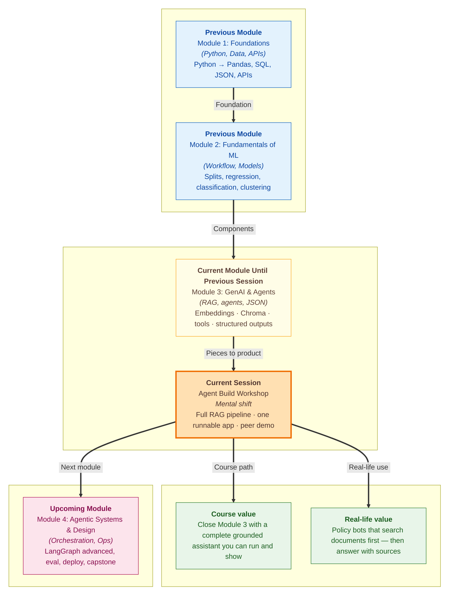

# Pre-read: Agent Build Workshop

## Context of This Session in the Course

---

Imagine you run a busy **ShopEasy help desk** during a festival sale. Customers ask the same questions every few minutes: *How many days to return a phone?* *Is shipping free on a ₹600 order?* *Does the warranty cover a cracked screen?*

Your team already printed three short policy notes — **returns**, **shipping**, and **warranty**. A new intern sits at the counter with a **powerful phone** that can write beautiful English. When a customer asks about returns, the intern **does not open any note**. They answer from memory: *"Usually fifteen days, I think."* Another customer asks about **UPI payment**. The intern invents a confident rule that was **never written** anywhere. By evening, three refunds go wrong and trust is damaged.

The problem was never "not enough fluency." The problem was **answering without checking the shelf of approved documents first**.

Across this module you practised the pieces: reading documents in chunks, turning meaning into searchable coordinates, storing them, retrieving the best paragraphs, and asking a language model to write **only from what was found**. In the **previous** session you also learned to shape answers so programs can read them cleanly. Today is the **module workshop** — you connect those pieces into **one complete ShopEasy-style assistant** you can run and **demo to a peer**.

---

## When polite guesses are not enough

What if you had to answer **fifty** policy questions in a row, but you were allowed to look **only** at three short files — and every answer had to name **which file** you used?

What if a customer asked something **not in those files** — like *"Can I pay with UPI?"* — and your job was to say **"I could not find this"** instead of inventing a fake rule?

What if your manager watched the screen and demanded proof: *"Show me the paragraphs you read **before** you wrote the reply"*?

Doing that by hand for every chat is slow and error-prone. A **RAG application** — **Retrieval-Augmented Generation** — is the computer version of that discipline: **search first, then write from the found text**.

Think of it as an **open-book exam**. You do not invent answers from memory. You find the right page, keep it open, and write. A **railway enquiry counter** works the same way: staff read the **live display board**, they do not guess the platform from last week.

---

## From scattered labs to one runnable product

Until now, each lab felt like a single station on a metro line. One day you practised **chunking** — cutting a long policy into smaller labelled pieces. Another day you practised **embeddings** and **vector search** — giving each piece "GPS coordinates for meaning" so similar questions find similar paragraphs. Another day you practised **grounded generation** — telling the model: *use only the pasted context*.

Today those stations become **one journey**:

1. **Choose a small document corpus** — the shelf of books the assistant may read (ShopEasy policies, or your own short texts).
2. **Ingest and chunk** — split text and keep labels like file name and page.
3. **Embed and store** — save meaning-vectors in a local store such as **Chroma**.
4. **Retrieve** — pull the top few best-matching chunks for a question.
5. **Assemble context** — wrap rules + chunks + question into one clear prompt.
6. **Generate a grounded answer** — and show a **Sources used** line.

The "hero" of this workshop is not a new buzzword. It is the **full pipeline packed as one app** you can start with a single command and walk a classmate through.

---

## The hostel notice-board analogy

Picture a **hostel notice board** with three pinned sheets: mess rules, curfew, laundry. A student asks, *"Till what time can I enter after night out?"*

A careful warden does four things:

- Looks **only** at the pinned sheets (not at random WhatsApp rumours)
- Pulls the **curfew** sheet into view
- Answers using **that** text
- If the question is about **guest Wi-Fi passwords** and no sheet mentions it, says **"Not on the board"**

Your workshop app should behave like that warden. The **corpus** is the notice board. **Retrieval** is finding the right sheet. **Grounding rules** are the instruction: *answer only from what is between these markers; if missing, refuse politely*. The **retrieval trace** is the warden pointing at the sheet **before** speaking — so a peer (or manager) can audit the evidence.

A common failure mode is skipping the board and chatting from memory. That produces a **chatbot**, not a **RAG application**. In class you will treat that contrast as part of the demo story.

---

In this pre-read, you'll discover:

- **Why** a support assistant must **search approved documents before writing** — and how that protects customers during high-pressure sale days
- **How** a small **document corpus**, **chunking**, **embeddings**, and **top-k retrieval** fit together as one open-book workflow
- **What** **context assembly** and **grounded generation** mean in everyday language — rules on top, allowed notes in the middle, question at the bottom
- **How** a **test matrix** and **peer demo checklist** prove the app is trustworthy on both in-corpus and not-in-corpus questions

---

## Words you will hear — explained right away

- **Document corpus:** The small set of source texts your app is allowed to search and cite — like three policy files on a shelf.
- **Chunking:** Cutting a long document into shorter pieces (often with a little overlap) so search can find precise paragraphs.
- **Embedding:** Turning text into a list of numbers that represent **meaning**, so "money back for shoes" can still match a returns policy.
- **Vector database / Chroma:** A storage system that finds the nearest meaning-neighbours quickly — like a map for paragraphs.
- **Top-k retrieval:** Asking the store for the **k** best-matching chunks (for example, the top three).
- **Context assembly:** Building one model input that includes grounding rules, retrieved chunks, and the user question.
- **Grounded generation:** Writing the final answer **after** reading those chunks — not from free memory alone.
- **Retrieval trace:** A printed list of which chunks were found **before** the answer appears — required for honest demos.
- **Same model rule:** Using the **same** embedding model when you store chunks and when you search with a new question.

---

## What's next

By the end of the session, you should be able to:

- **Select** a small corpus (ShopEasy policies or your own short texts) and map each file to a sample question
- **Explain** the full path from ingest → chunk → embed → store → retrieve → augment → generate
- **Run** one packaged workshop app that answers with retrieved evidence and a **Sources used** line
- **Compare** grounded answers with a "no retrieval" reply so you can show why RAG matters
- **Demo** to a peer using a checklist: retrieval trace first, facts match chunks, refusal when the answer is missing
- **Troubleshoot** common breaks — empty index, invented details, "not found" when a chunk exists — by fixing retrieval and prompts before blaming the chat model

This workshop closes the module with something you can **show**, not only describe. **Upcoming** work will push further into design, operations, and larger agent systems — but first you ship a **working open-book assistant**.

---

## Questions to think about before class

1. A peer asks your ShopEasy app: *"How many days do I have to return a product?"* Then they ask: *"Can I pay with UPI?"* What should look **different** on screen between those two answers — and why must the **retrieval trace** appear **before** the written reply in both cases?

2. You raise the number of retrieved chunks from **one** to **three** for the question *"Is delivery free on a 600 rupee order?"* When would more chunks help — and when might extra, weakly related paragraphs make the model more confused?

3. Your classmate's demo invents a **"15-day return"** rule that is **not** in any retrieved chunk. Where would you look first — the grounding rules and context markers, the retrieved text, or the chat model brand name — and what one-sentence design note would you write after fixing it?

Bring these questions to class. The session turns every separate lab skill into **one runnable ShopEasy RAG app** — and turns "trust me" answers into **traceable, source-backed support**.
