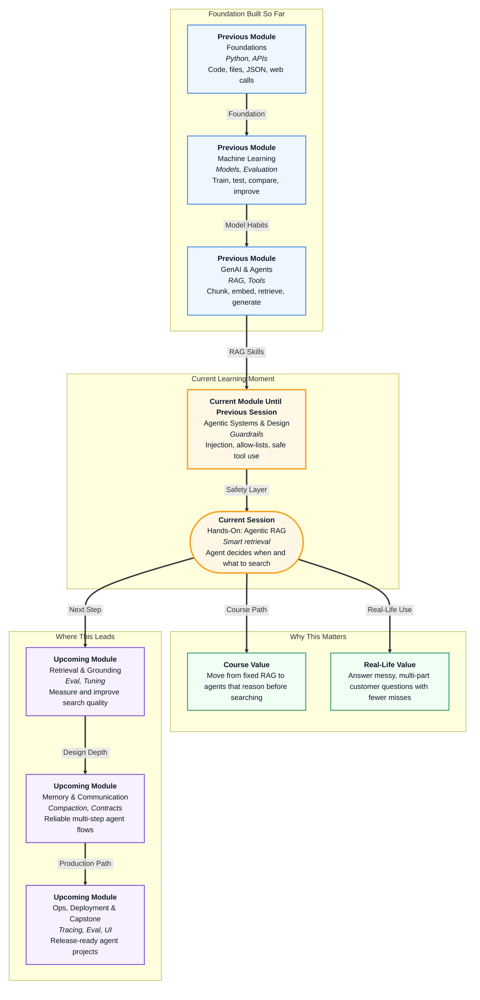

# Pre-read: Hands-On: Agentic RAG

## Context of This Session in the Course

---

You ordered a phone from **ShopEasy** last week. Today you open the support chat and type:

*"Yaar, phone abhi bhi return ho sakta hai? Aur express delivery free hai kya 499 ke upar?"*

One message. Two different topics. **Returns.** **Shipping.** Casual Hindi-English mix. No neat keywords.

If a human support agent were sitting at the counter, they would not blindly open one random folder and stop. They would think: *"This is about return window and also about express shipping."* They might check the **returns policy** first, then walk to the **shipping shelf**, and only then give a full answer.

That is the everyday problem this session solves. Not "Can AI answer from documents?" — you already learned that. The new question is: **Can the AI decide when to search, what to search, and when to stop?**

## The Real Problem With "Always Search Once"

In your earlier RAG work, you built something powerful: chunk policies, store them in a searchable library, retrieve relevant pieces, and generate grounded answers. That pattern is **static RAG** — the system **always retrieves once**, then answers.

For simple questions it works well — shipping days, return window, one clear topic. But real customers mix topics, use slang, or say *"Hi"* when no search is needed.

Imagine this failure:

1. The customer asks about **returns and express shipping** together.
2. The system searches **once** using the raw message.
3. **Returns** ranks higher; **shipping** is barely surfaced.
4. The answer sounds confident — but is **incomplete**.

The challenge is not "search better once." It is: **Should search happen at all? Should it happen again? When is enough enough?**

## The Big Idea — Agentic RAG

**Agentic RAG** is the upgrade. Instead of a fixed recipe, the agent gets **judgment** about retrieval.

- **Static RAG:** always retrieve once, then generate.
- **Agentic RAG:** the agent may retrieve **zero times**, **once**, or **several times**, depending on the question.

Three ideas make this work:

| Idea | What it means in simple words |
|---|---|
| **Query rewrite** | Turn messy chat into a short search phrase before looking in the library |
| **Retrieval as a tool** | Search becomes a button the agent presses when needed — not an automatic door that always opens |
| **Stop conditions** | Clear rules for when to stop searching and answer — like a traffic signal or school bell |

**Query rewrite** is like a pharmacist who hears casual words and checks the proper shelf label instead of scanning every box.

**Retrieval as a tool** is like a bank officer who smiles at *"Hello"* but opens the rulebook only for KYC questions.

**Stop conditions** protect you from endless searching — without them, the agent keeps looking and wastes time and money.

In the **previous** session you added **guardrails**. This session combines that safety mindset with **smarter retrieval behaviour**.

## A Simple Analogy

Think of two shop assistants at the same StoreEasy counter.

**Assistant A (static RAG)** uses a photocopier that **always** prints the first three pages from whatever folder matches your words — even if you only said hello, even if you needed a second folder for shipping rules.

**Assistant B (agentic RAG)** listens first, rewrites your question into clear search words, opens the **returns** folder, thinks *"shipping is still missing"*, opens the **shipping** folder, stops when both facts are found, and then answers.

Same store. Same policies. Very different quality on messy, multi-part questions.

That mental shift — from **fixed pipeline** to **thinking before searching** — is the heart of this session.

## In this pre-read, you'll discover:

- **Understand** the exact difference between **static RAG** and **agentic RAG** in plain language.
- **Learn** why **query rewrite** improves search before the first retrieve.
- **Discover** how **retrieval as a tool** lets an agent search zero or more times.
- **Understand** why **multi-hop retrieve → reason → retrieve** and **stop conditions** matter for real support chats.

## What You Should Notice Before Class

Next time you use a food-delivery or e-commerce chatbot, notice how it handles mixed questions — delay **and** refund, or search when you only say thanks.

Also notice how **you** naturally rewrite questions for humans. You add context and Hindi-English mix. A smart system should translate that into good search — not treat raw chat as the final search string.

Static RAG taught you **how to search a library**. Agentic RAG teaches **when to walk to which shelf — and when to stop**.

## What's Next

After the session, you should be able to explain and demo:

- When to keep **static RAG** and when to prefer **agentic RAG**.
- How **query rewrite** turns casual chat into better search text.
- Why **retrieve_policies** works better as an **allow-listed tool** than a forced pre-step.
- How a **multi-hop loop** gathers returns **and** shipping facts for one question.
- How to compare answer quality on the **same questions** using a one-shot baseline.

These skills matter beyond ShopEasy. Any agent that reads policies, HR docs, hospital FAQs, or college notices faces the same pattern: customers ask messy, multi-topic questions — and a fixed one-shot search is often not enough.

## Questions to Bring to the Live Session

Think about these before joining:

1. A customer says *"Hi"* — should the agent still search the policy library? Why or why not?
2. *"Can I return my phone and is express free above 499?"* — how many different policy topics are hidden inside this one message?
3. If the first search finds returns but not shipping, should the agent search again with a **new query** or repeat the same search?
4. What happens if there is **no stop rule** — could the agent keep searching forever?
5. On the same question, how would you decide whether **static RAG** or **agentic RAG** gave the better answer?

By the end of the session, these should feel practical — not abstract. You will move from **"My RAG searches once"** to **"My agent decides when and what to retrieve."**
