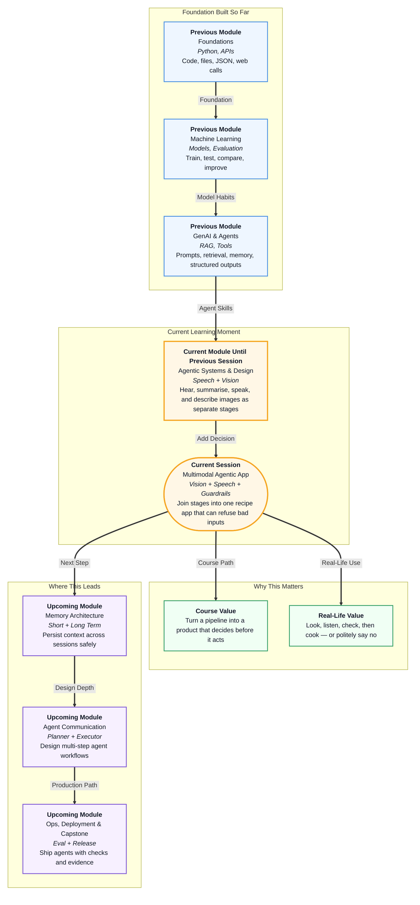

# Pre-read: Hands-On: Build a Multimodal Agentic App

## Context of This Session in the Course

---

## From a Fridge Photo to a Spoken Recipe

Sunday evening in a hostel. You open the shared fridge. There are tomatoes, onions, and a packet of rice. You are hungry, a little tired, and you do not want to scroll through ten cooking videos.

So you do what millions of people already do on WhatsApp: you **click a photo** of the shelf, and you **send a voice note** — "I have tomatoes, onions, and rice."

A helpful friend would look at the photo, listen to the voice note, and only then tell you what to cook. If you accidentally sent a **railway platform selfie** from last week's train, that friend would not invent a "train curry". They would say: send a kitchen photo, then I can help.

In the previous session you practised those skills as **separate stages**: turning speech into writing, looking at an image, and speaking text aloud. Those were like three kitchen tools still sitting on different shelves.

This session puts them into **one small cooking assistant**. The app looks, listens, **checks**, and then either writes a recipe and reads it aloud — or **politely refuses**.

## When Photos and Voice Notes Do Not Belong Together

Imagine you are the "recipe friend" for an entire hostel floor. Every evening people send a photo they *think* shows their ingredients, plus a voice note listing what they *think* they have. Your job is a **short recipe** they can listen to while they cook.

What if you tried this by hand?

You would open each photo, play each voice note, and compare: does this picture match this list? Then you would write a title, ingredients, and numbered steps — and read the whole thing aloud.

For one matching request — tomatoes, onions, rice — you can manage. For fifty requests, some people will send a **railway** photo with a kitchen voice note, a kitchen photo with a voice note about **cement, bricks, and steel rods**, or a tomato photo while the voice says fish and coconut.

If you still invent a recipe every time, you are not being helpful. You are being **dangerous or silly**. A real product must know when to **stop**.

What if a system could look at both inputs, decide "same cooking story" or "not the same story", and only then cook — or refuse with a clear "try again" message?

That **decision in the middle** is the new skill of this session.

## One Mini-App, One Decision

A pipeline of stages is useful. A **product** is a pipeline plus a **decision**.

You already know **Speech-to-Text** — the computer listens and types what you said, like WhatsApp voice-to-text. Here that typed list is **shown** and **stored**, so the later check uses the same words the user actually spoke.

You already know **vision** — the computer looks at a photo and writes what it sees, like a grocery-app camera listing "tomato, onion, rice". If the photo is not food, vision should give a short **scene label** — "train on a platform" — instead of inventing vegetables.

You already know **Text-to-Speech** — the computer reads text aloud, like Google Maps giving directions. Here it reads the **recipe**, not the original voice note.

The missing piece is the **checker**. An **alignment check** asks: do the photo story and the spoken list belong together? A **guardrail** is the rule that **blocks** the rest of the work when they do not.

If they agree, the app writes a **structured recipe** — a cooking card with a **title**, **ingredients**, and numbered **steps** — then speaks it. If they do not, there is **no recipe** and **no audio**. Only a calm message: new photo, new voice note, or both.

That journey is a **multimodal agentic app**: more than one input type (image + speech), an agent that **decides**, then either finishes the task or **refuses**.

## Like a Roommate Who Will Not Cook Nonsense

Think of a roommate who cooks only when the request makes sense.

You show them the fridge photo. You tell them what you have. They glance at both.

- Tomatoes, onions, rice in the photo **and** in the voice note → they write **Tomato Onion Rice** and read the steps while you chop.
- A **railway platform** photo + you still say tomatoes → they do not invent a dish. They say, "That photo is not food."
- A kitchen photo + you say **cement and bricks** → they still refuse. Construction material is not dinner.

A canteen cook works the same way. They will not follow "make tomato rice" if you handed them a train photo. Your app must behave like that cook — **helpful when inputs match, honest when they do not**.

Lock this flow in your mind before the live build:

1. **Upload** a food or ingredients photo.
2. **Dictate** ingredients → Speech-to-Text → show and **store** the text.
3. **Vision** reads the photo (edible items, or a short scene if it is not food).
4. The agent **checks alignment** and safety.
5. If OK → create the recipe; if not → refuse with retry guidance.
6. **Text-to-Speech** → an audio file of the recipe.
7. Optional: a **dish preview** picture if a separate image-making service is available.

Image generation is a stretch. The core path is look + listen + check + cook + speak.

## What You Will Discover

In this pre-read, you'll discover:

- **Understand** why a pipeline of separate demos is not yet a **product** — a product also **decides** when to stop.
- **Learn** how **Speech-to-Text** and **vision** become two lists the agent can compare.
- **Discover** what **alignment** and **guardrails** mean in daily life: same cooking story, or refuse.
- **Understand** how a passed check becomes a **recipe card** plus **spoken audio**, and a failed check becomes a clear retry — with no fake dish.

## Why Saying "No" Is Part of the Product

A language model can invent a recipe from almost anything — including a train photo. That is not a feature for a cooking app. That is a **failure of judgement**.

Treat the guardrail as a **required** step, not an extra:

| Situation | Photo | Spoken list | What should happen |
|---|---|---|---|
| **Happy path** | Kitchen: tomatoes, onions, rice | Same items | Recipe + audio |
| **Irrelevant image** | Railway platform | Kitchen speech | Refuse — photo is not food |
| **Nonsense speech** | Kitchen | Cement, bricks, steel | Refuse — not edible |
| **Ingredient mismatch** | Only tomatoes and onions | Fish, prawns, coconut | Refuse — lists do not match |

On failure, the user should see a **polite retry message**. They should not receive a leftover recipe from an earlier successful run and think the fail case "worked".

You will walk through **both** kinds of run: one clean kitchen path, and at least one refusal (railway photo or cement dictation). Guardrails you never test are not guardrails.

Keep the recipe **simple**: pantry items plus the aligned ingredients. Do not add meat, alcohol, or extra spices that were never in the inputs.

Heavy looking, listening, and deciding still happen in the **cloud**. Your laptop holds the sample photo and voice clip, sends them, and shows the result. **One cloud key** can power Speech-to-Text, vision, and the text agent. Speaking the recipe uses the same lightweight speech service you used previously. Skip a generated dish picture if you only have that one key.

Use the **course sample files first** so everyone tests the same happy path and the same refusal. Your own fridge photo can wait until the checker works.

## What You Will Be Able to Do After This

After the session, you will be able to:

- Explain a **multimodal agentic app** as look + listen + **decide** + cook or refuse — not four disconnected demos.
- Capture a spoken ingredient list, **display** it, and **store** it for the agent.
- Run **vision** on a photo and get either ingredients or a scene label.
- **Refuse** mismatches, irrelevant images, and unsafe requests **gracefully** — no recipe, no audio.
- Generate a **structured recipe** and a **spoken audio file** only after a pass.
- Walk through one **happy path** and one **guardrail failure**.

These habits travel into later agent work, where systems must still **refuse** unsafe requests instead of completing every prompt.

## Interesting Questions for the Live Session

Keep these questions in mind:

- If someone sends a **railway** selfie and says "tomatoes, onions, and rice", should the app still invent a recipe? Why or why not?
- A kitchen photo is correct, but the voice note says **cement, bricks, and steel rods**. What should the user see — and what files should **not** be created?
- Why must the agent **store** the spoken text and the vision text before it decides, instead of guessing a second time?
- When is a generated **dish preview** picture allowed, and when should you skip it?

By the end, you will see this mini-app not as magic cooking, but as a **clear sequence with a conscience**: look, listen, check, then either help — or say no.
