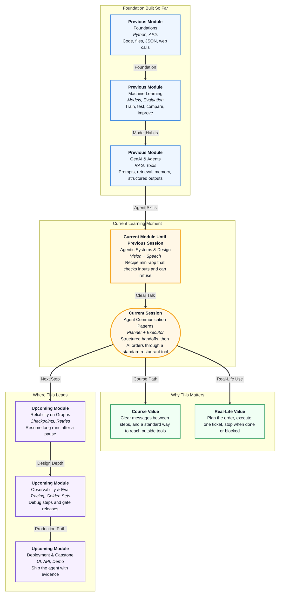

# Pre-read: Agent Communication Patterns

## Context of This Session in the Course

---

## From a Hungry Message to a Real Kitchen Ticket

It is 9.40 pm in a hostel. Someone types a single line: **"Order 2 Masala Dosa for Asha."**

In real life, that message is not a poem. It is a **work order**. The canteen needs a dish name, a quantity, a customer name, and later a bill. If the kitchen invents a dish that is not on the board, Asha does not get dinner — she gets confusion.

Zomato, Swiggy, and IRCTC already work this way. You do not shout randomly at a screen. You pick from a **menu**, place an **order**, and receive a **ticket number**. If the item is missing, the app **stops** and tells you. It does not print a fake PNR.

In the **previous** session your recipe mini-app **looked**, **listened**, and **refused** when the photo and the voice note did not match. That was a decision: cook or stop. This session asks a different question: once the task is allowed, **how do the steps talk to each other** so nobody invents the next ticket?

## When Every App Speaks a Private Kitchen Language

Imagine three campus products all need the same canteen:

- a **WhatsApp** food bot for the hostel floor
- a **website** chatbot for late-night orders
- an **editor assistant** that places a group order while you finish an assignment

What if each team invented its own private way to “get the menu” and “place the order”? A price change in the canteen would break three wrappers. A renamed dish would break three more. You would spend the semester translating, not serving food.

What if the assistant is fluent but **undisciplined**? It might confirm “Order id MM9999, Pizza for Asha, ₹40” when Pizza is not on the board and MM9999 was never issued. That is the same failure as a clerk writing a railway ticket by imagination.

Doing this by hand for one order is easy. Doing it for a whole floor, every night, with three apps, is not. You need two habits:

1. **Inside one task** — split the goal into ordered steps, pass **structured messages**, and **stop** when the job is complete or blocked.
2. **Outside the app** — talk to the canteen through **one shared plug**, so many AI apps can reuse the same kitchen without rewriting it.

That is the problem this session is built to solve.

## Planner, Executor, and a Message That Cannot Be Vague

A **planner–executor** split is how a busy kitchen already runs.

The **planner** writes the checklist: check the board, then place the order. The **executor** completes **one ticket at a time**. Nobody holds a meeting about who speaks next. There is no second manager arguing in the doorway. The list runs in **sequence**.

The tickets themselves must be **structured**. In software we often call that structured text **JSON** — think of a printed slip with **fixed blanks**: action, dish, quantity, name. Not a paragraph. Not “do the usual”.

Three families of slip are enough for one business task:

- **Input** — what the executor must do next
- **Output (ok)** — what came back, including a real order id and total
- **Error** — why the work **stopped**, in a sentence a human can read

A **stop condition** is the moment the loop is allowed to end. Order placed → **complete**. Dish missing, or quantity less than one → **blocked**. Guessing a dish to “be helpful” is not a stop condition. It is a lie.

You will see this as one food-order goal: check menu, then place order, then finish — or halt with a clear reason.

## USB-C for the Canteen, Not a New Cable Every Week

Even a perfect checklist is useless if every AI host needs a custom cable into the same kitchen.

**Model Context Protocol (MCP)** is an open standard for how AI apps connect to outside tools and context. In simple words: **USB-C for AI tools**. Write the canteen service once. Many hosts can plug in.

Three roles stay distinct:

- **Host** — the app the hungry student sees
- **Client** — the adapter inside that app
- **Server** — the programme that actually exposes “view menu” and “place order”

A normal restaurant website API still matters. Your browser already knows the address. MCP does not always replace that. It gives **AI hosts** a shared way to **discover** tools and **call** them, instead of hiding a unique plugin inside every chatbot.

In class, that kitchen is **MasaiMato** — a mini Zomato-style service. The model should read the real menu and place a real order. It should not invent dishes, prices, or order ids.

The same sequential idea continues: discover, act, stop. The planner is now the **model**. The executor is the **official tool call**, not a paragraph of imagination.

## Like Kitchen Tickets, Not a Group Argument

Think of a small dosa stall at 9.40 pm.

The owner writes two tickets: **see the board**, then **make Asha’s two Masala Dosas**. The cook reads ticket one, then ticket two. If the board has no Pizza, the cook does not debate the owner in front of the queue. They send the ticket back: **not on menu**. The stall **stops** that order.

USB-C is the second picture. Your phone, laptop, and power bank share one plug shape. You do not carry three kitchen cables. MasaiMato is that one plug for food tools.

Keep this flow in mind before the live session:

1. Take one user goal and **decompose** it for planner and executor.
2. Agree the **message shapes** — input, ok, error.
3. Run the steps **in order**, with no extra agents arguing.
4. **Stop** on complete or blocked.
5. Connect the AI to MasaiMato so it **looks up** and **orders**, instead of inventing.

You will use **one** cloud key for the main ordering demo. Another provider can wait. The point is the **contract**, not a tour of every model brand.

## What You Will Discover

In this pre-read, you'll discover:

- **Understand** why a fluent answer is not enough — a food order needs a **checklist** and a **ticket**, like a real canteen.
- **Learn** how a **planner** writes ordered subtasks and an **executor** finishes them one by one.
- **Discover** why **structured messages** (ok vs error) and **stop conditions** prevent fake dishes and fake ids.
- **Understand** why a **standard plug** (MCP) lets many AI apps reuse one kitchen instead of rewriting plugins.

## What You Will Be Able to Do After This

After the session, you will be able to:

- Split one business goal into planner and executor work without a group-chat argument.
- Read an input slip, an ok slip, and an error slip, and say whether the task should **continue** or **stop**.
- Explain host, client, and server in one hungry-student story.
- Contrast a normal website API with an AI host that **lists tools** and then **calls** them.
- Watch an assistant confirm a MasaiMato order from **tool results**, not from imagination.
- Predict what should happen if someone asks for Pizza when Pizza is not on the board.

These habits travel into later workflow maps, where you will decide *when* steps run. Tonight you decide *how* they **talk**.

## Interesting Questions for the Live Session

Keep these questions in mind:

- If the executor returns “dish not on menu”, should the next step still run? What should the **stop** be called — complete or blocked?
- Why should the assistant **read the menu** before it places Asha’s order, instead of remembering prices from training?
- Your browser loads a menu page from a normal website address. Is that the same thing as an AI **discovering** kitchen tools? When would you need **both**?
- If Pizza is not on MasaiMato, who is allowed to invent an order id — the model, the kitchen, or nobody?

By the end, you will see agent communication not as a debate club, but as a **canteen discipline**: plan the tickets, fill the blanks, stop when the kitchen says stop — then let the model press only the buttons you published.
