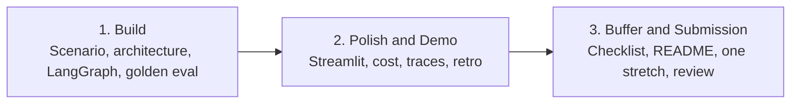

# Nimbus PayDesk — Three-Session Capstone Flow (IITR-AS-2603)

This sheet is the map for the whole capstone. Keep it beside you in every live session.

**Product:** Nimbus PayDesk — an Accounts Payable desk for **Nimbus Retail** (40-store Indian chain).  
**Job:** Cut a nine-day vendor-invoice wait without paying a wrong **GSTIN** or skipping a high-value stamp.  
**Hard rule:** The desk **recommends** `ready_to_pay`. It never sends **NEFT**.

This batch already built a **campus parcel desk**. Capstone is a **new product**. Reuse skills. Do not paste parcel FAQs into PayDesk.

```text
Freeze + draw + hire clerks  →  Polish the counter and demo  →  Pack the file and submit
        (Build)                         (Polish & Demo)              (Buffer & Submission)
```



**Stack this batch already knows (core path only — no new libraries):**

| Job | This batch (use) | Do not add in capstone |
|---|---|---|
| Orchestration | **LangGraph** nodes and state | A new crew framework |
| RAG | **Chroma** over `data/policy.md` (all-MiniLM-L6-v2) | Keyword-only grep or a fake chunk list on the packet |
| Memory | Graph state + **`sqlite3`** | SQLAlchemy |
| UI | **Streamlit** | A second HTTP API framework |
| Model | **Groq** only as optional stretch extract | Unversioned notebook chat as the desk |
| Proof | Golden set + **JSONL traces** + token note | “It worked once” |

Core `requirements.txt`: `langgraph`, `streamlit`, `chromadb`, `sentence-transformers`, `python-dotenv`. `sqlite3` is built into Python.

---

## Capstone Session 1 — Build

**Need to do:** Choose PayDesk, draw one page, run extract → policy → route, sit the golden paper.

| You will | Done when |
|---|---|
| Select scenario, users, data, success | One sentence a CFO accepts; **no live NEFT**; seeds Kaveri / Nilgiri; **do not seed** `99INVALID` |
| One-page architecture | RAG, tools, memory, **LangGraph**, deploy path = **Streamlit** next |
| Implement core flows with versioned prompts | `extract → policy → route` on `InvoicePacket`; Python amount/GST gates; `seed_policy()` into Chroma |
| Run golden set and fix a blocking defect | **G01 CLEAN** → `ready_to_pay`; **G02 HIGH** → `amount_gate`; **G03 BADGST** → `gst_mismatch` |

**Carry forward:** running graph, sqlite3 tickets, Chroma handbook (`seed_policy()`), `eval/run_golden.py`, JSONL traces.

**Do not do yet:** Streamlit polish, demo script, README, payout tool, a new API app.

**Live order:** freeze contract → draw stations → seed registers + **Chroma from policy.md** → run CLEAN, then HIGH, then BADGST → fix **one** class (usually empty Chroma) → re-run.

**Eval must not paste handbook lines into state.** Retrieve queries Chroma.

---

## Capstone Session 2 — Polish & Demo

**Need to do:** Make a stakeholder window, count tokens, tell the story with traces.

| You will | Done when |
|---|---|
| Improve UI from the CLI | Streamlit: paste bill, status, sources, foldable **trace** |
| Verify token/cost for a demo path | CLEAN vs HIGH on a small receipt; cache must **not** skip gates |
| Deliver a short live demo with evidence | One bill passes, one bill stops; open the JSONL / expander |
| Retrospect | Written “if we had more time” list — **no** SLI/SLO theatre |

**Carry forward:** demoable UI, cost note, demo script.

**Do not do yet:** submission zip, stretch, bank.

---

## Capstone Session 3 — Buffer & Submission

**Need to do:** Pack what a reviewer can run without you in the room.

| You will | Done when |
|---|---|
| Submission checklist | Code, prompt files, golden set, traces sample, demo recording if required |
| README | Setup, optional `GROQ_API_KEY`, how to run evals, what the desk will **not** do |
| One stretch if core is stable | Groq messy extract, **or** LangGraph checkpoint + human stamp, **or** GST cache (never cache `ready_to_pay`) |
| Cross-team review | Partner runs G01–G03 from README only |

**Leave for support week:** remaining golden cards (duplicate, tool-down, blurry bill), richer UI. Still **no payout tool**.

---

## One-page contract (all three sessions honour this)

- Harm type is **money**
- `ready_to_pay` is a recommendation, not a bank call
- Amount ≥ **₹50,000** and unknown GSTIN must stop
- Gates live in **Python**, not only in Groq
- Retrieved handbook lines are **evidence**, not a licence to skip a gate
- Golden eval invokes the **same graph** the demo uses — no cheat fields
- Cache (from ops) may reuse **handbook retrieve**; it must not photocopy a HIGH bill into “ready”
- Dummy GSTINs for seeds: `29AAAAA0000A1Z5` (Kaveri) and `29BBBBB0000B1Z3` (Nilgiri) — not real firms
