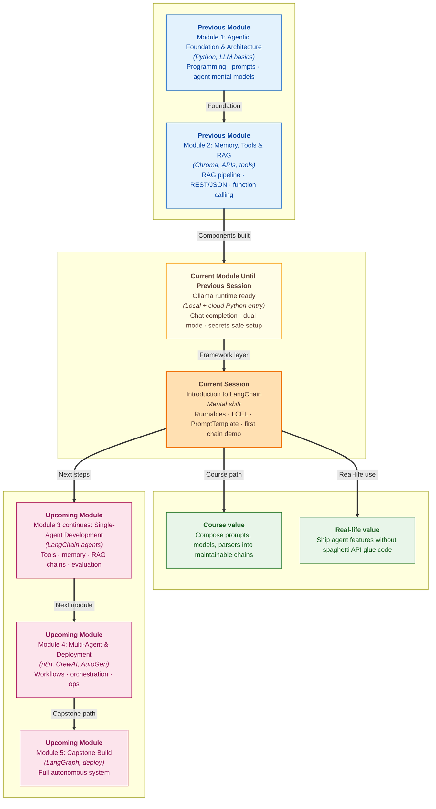

```mermaid
%%{init: {'flowchart': {'nodeSpacing': 45, 'rankSpacing': 55, 'padding': 20}}}%%
flowchart TB
  subgraph foundation[" "]
    direction TB
    M1["<b>Previous Module</b><br/>Module 1: Agentic Foundation &amp; Architecture<br/><i>(Python, LLM basics)</i><br/>Programming · prompts · agent mental models"]
    M2["<b>Previous Module</b><br/>Module 2: Memory, Tools &amp; RAG<br/><i>(Chroma, APIs, tools)</i><br/>RAG pipeline · REST/JSON · function calling"]
  end

  subgraph path[" "]
    direction TB
    M3U["<b>Current Module Until Previous Session</b><br/>Ollama runtime ready<br/><i>(Local + cloud Python entry)</i><br/>Chat completion · dual-mode · secrets-safe setup"]
    CUR["<b>Current Session</b><br/>Introduction to LangChain<br/><i>Mental shift</i><br/>Runnables · LCEL · PromptTemplate · first chain demo"]
  end

  subgraph value[" "]
    direction LR
    CV["<b>Course value</b><br/>Compose prompts, models, parsers into maintainable chains"]
    RL["<b>Real-life value</b><br/>Ship agent features without spaghetti API glue code"]
  end

  subgraph future[" "]
    direction TB
    M3R["<b>Upcoming Module</b><br/>Module 3 continues: Single-Agent Development<br/><i>(LangChain agents)</i><br/>Tools · memory · RAG chains · evaluation"]
    M4["<b>Upcoming Module</b><br/>Module 4: Multi-Agent &amp; Deployment<br/><i>(n8n, CrewAI, AutoGen)</i><br/>Workflows · orchestration · ops"]
    M5["<b>Upcoming Module</b><br/>Module 5: Capstone Build<br/><i>(LangGraph, deploy)</i><br/>Full autonomous system"]
  end

  M1 ==>|&nbsp;Foundation&nbsp;| M2
  M2 ==>|&nbsp;Components built&nbsp;| M3U
  M3U ==>|&nbsp;Framework layer&nbsp;| CUR
  CUR ==>|&nbsp;Course path&nbsp;| CV
  CUR ==>|&nbsp;Real-life use&nbsp;| RL
  CUR ==>|&nbsp;Next steps&nbsp;| M3R
  M3R ==>|&nbsp;Next module&nbsp;| M4
  M4 ==>|&nbsp;Capstone path&nbsp;| M5

  classDef prev fill:#e3f2fd,stroke:#1565c0,color:#0d47a1
  classDef currMod fill:#fffde7,stroke:#f9a825,color:#5d4037
  classDef currSes fill:#ffe0b2,stroke:#ef6c00,color:#4e342e,stroke-width:3px
  classDef val fill:#e8f5e9,stroke:#2e7d32,color:#1b5e20
  classDef fut fill:#fce4ec,stroke:#ad1457,color:#880e4f

  class M1,M2 prev
  class M3U currMod
  class CUR currSes
  class CV,RL val
  class M3R,M4,M5 fut

  linkStyle default stroke-width:3px
```
