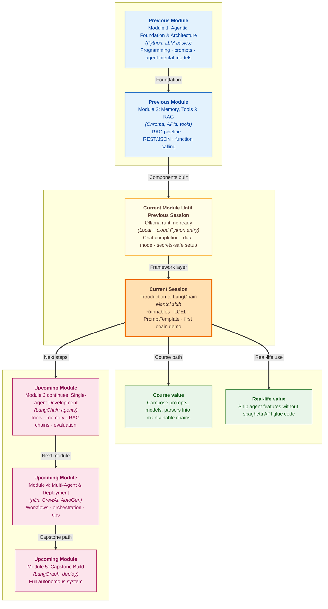

# Pre-read: Introduction to LangChain: Concepts Architecture and First Demo

Your college **placement cell** just launched a **hostel FAQ assistant**. Week one, it answers *"What is the guest-entry timing?"* beautifully. Week three, the team adds **live mess-menu lookup** through an API. Week five, they bolt on **RAG** over a fifty-page handbook. Week seven, someone wants **conversation memory** so students do not repeat their hostel block on every message.

Each feature works — in isolation. But the codebase is now a maze: one script formats prompts by hand, another copies the same **Ollama** call three times with tiny edits, a third parses model output with fragile string slicing, and nobody is sure which version the demo actually runs. The **previous session** gave you a reliable way to **reach a model from Python** — local or cloud, secrets kept safe. That solved *where the brain lives*. It did not solve *how to wire the brain to everything else without the project falling apart*.

That wiring problem is exactly what **LangChain** was built for.

---

## Context of This Session in the Course

---

## What if every new feature meant rewriting the same five steps?

Imagine you are the **only developer** on that hostel assistant. Every user-facing feature follows the same rhythm:

1. Fill a **prompt template** with the student's question and any retrieved facts.
2. Send the finished prompt to the **language model** — your **Ollama** runtime or a cloud endpoint.
3. Receive a reply that might be plain text, bullet points, or half-structured JSON.
4. **Parse** the reply so the next step — a database update, a UI card, or a tool call — gets predictable input.
5. Repeat when you add **memory**, **retrieval**, or **tools**.

Doing that once is fine. Doing it **twelve times** across twelve files is how student projects become unmaintainable: one teammate changes the prompt wording in one place but forgets the other two; a parser breaks when the model adds a polite greeting; the demo script and the production script silently diverge.

Raw **LLM API calls** are powerful — you proved that in **Module 2** with **RAG**, **tools**, and **ShopKart-style** loops. But ad hoc scripts scale poorly. What you need is a **framework layer** that sits **between** your application logic (the hostel rules, the UI, the business rules) and the **model providers** (Ollama, OpenAI, and others). That layer standardises how pieces **connect**, **reuse**, and **swap** without rewriting the whole flow.

**LangChain** is that layer for **agentic applications** — systems where a model does not just chat, but participates in a longer workflow with prompts, tools, memory, and retrieval.

| Approach | Good for | Pain when you grow |
|---|---|---|
| One-off API script | Quick experiments | Copy-paste prompts everywhere |
| Framework (LangChain) | Composable agents | Learning curve upfront — pays back fast |
| Giant monolith file | Demos only | Nobody can debug it |

---

## Where LangChain sits in the stack

Picture a **three-storey building**:

- **Ground floor — Model providers:** Ollama on your laptop, cloud APIs, whatever engine produces text.
- **Middle floor — LangChain:** Reusable **prompt templates**, **chains**, **agents**, **tools**, **memory**, and **retrievers** that snap together.
- **Top floor — Your application:** Hostel policy rules, placement-cell workflows, the actual product your user sees.

LangChain does **not** replace the model. It does **not** replace your business logic. It gives you a **common language** for the middle floor so when you swap from a local **light model** to a cloud model for a demo, you change **one binding** — not every prompt string in the project.

The framework's **modular surface** maps cleanly to what you already built conceptually in **Module 2**:

| LangChain module | Agent idea you already know |
|---|---|
| **Chains** | Fixed steps in order — prompt, then model, then parse |
| **Agents** | Model chooses **tools** based on the question |
| **Tools** | External actions — APIs, calculators, search |
| **Memory** | Short-term chat history across turns |
| **Retrievers** | **RAG** — fetch relevant chunks before answering |

Today's session is the **map of that building**, not the full furniture move. You will understand **why** the rooms exist before you furnish them in the labs ahead.

---

## The Runnable idea — and why the pipe feels familiar

At the heart of modern LangChain is a simple contract: a **Runnable** is anything that accepts an input, does work, and produces an output — and can be **chained** to the next step.

You do not need to memorise every class name yet. Hold this picture: **prompt template → model → output parser** is one **chain**. Each box is a Runnable. Data flows **out of one, into the next**, like stations on the **Delhi Metro** — you board at **Rajiv Chowk**, interchange at **Kashmere Gate**, exit at **Vishwavidyalaya**. You do not rebuild the track for every trip; you follow the **line** you designed.

**LCEL** (LangChain Expression Language) is how you declare that line. The **pipe operator** — written as a vertical bar in code you will see in the live demo — means *"send the output of this step as input to the next."* That is the composition mechanism for your **first chain**: a **PromptTemplate** (or **ChatPromptTemplate** for conversational messages) feeds the **LLM**, and an **output parser** turns the model's reply into clean text your app can trust.

**PromptTemplate** matters because prompts should not be scattered as f-strings. You define **slots** — `{question}`, `{context}`, `{student_name}` — once, and reuse the same template across tests, demos, and production. Change the wording in **one place**; every chain that uses it updates together.

**Output parsers** matter because models are chatty. A parser strips the fluff and gives downstream steps a **predictable string** (or structured shape in later sessions) — so your UI does not break when the model adds *"Certainly! Here is your answer:"* before the actual fact.

> **Think of it like a dosa counter at Saravana Bhavan.** The **template** is the standard order form — *"one masala dosa, less oil."* The **cook** is the model. The **parser** is the server who plates it consistently so the billing counter always sees the same dish shape. Without the form and the plating rule, every order is a shouted guess across a noisy kitchen.

---

## Core versus Community — what to install when

LangChain splits into packages on purpose:

- **LangChain Core** — the stable building blocks: Runnables, LCEL, base abstractions. Think of it as the **engine and chassis**.
- **LangChain Community** — integrations with specific models, vector stores, loaders, and third-party tools. Think of it as **optional accessories** — Ollama bindings, Chroma connectors, document loaders.

For a typical cohort project you need **both**, but you should know **which box** a import comes from when debugging. Core stays relatively steady; Community grows as new integrations appear. That split is a **maintainability** choice — not bureaucracy.

---

In this pre-read, you'll discover:

- **Understand** what **LangChain** is for in **agentic applications** — and why a **framework** beats repeating raw API glue as your assistant grows
- **Learn** where LangChain sits **between model providers and your app**, and how **chains, agents, tools, memory, and retrievers** fit one coherent single-agent workflow
- **Discover** the **Runnable** mental model, **PromptTemplate** reuse, **LCEL** composition, and **output parsers** for predictable results
- **Recognise** the difference between **LangChain Core** and **Community** packages — and what you will watch in the **first end-to-end chain demo**

---

## Words you will hear — explained right away

- **LangChain:** A **Python framework** for building applications where language models connect to prompts, tools, memory, and retrieval in reusable, composable steps.
- **Framework:** Shared structure and conventions so many developers solve the same wiring problems once — like using **Django** for web apps instead of writing HTTP handling from scratch every time.
- **Runnable:** Any LangChain component that takes input, returns output, and can be **linked** to another component — the universal "plug" shape.
- **Chain:** A **fixed sequence** of steps — commonly prompt, then model, then parse — declared as one pipeline.
- **LCEL:** LangChain Expression Language — the style of building chains by **piping** Runnables together instead of nesting manual function calls.
- **PromptTemplate:** A **reusable prompt pattern** with named placeholders filled in at run time — keeps wording consistent across your project.
- **ChatPromptTemplate:** A template shaped for **multi-message chats** (system, human, assistant roles) rather than one flat string.
- **Output parser:** A step that converts the model's raw reply into a **clean, predictable form** for the next part of your application.
- **LangChain Core:** The **central package** with base abstractions and composition tools.
- **LangChain Community:** **Integration packages** connecting LangChain to specific models, databases, and tools — including **Ollama** bindings you will use soon.

---

## What's next

After this session, you should be able to:

- **Explain** why **agentic projects** benefit from LangChain over scattered **ad hoc API scripts** — in terms of **composability** and **maintainability**
- **Describe** LangChain's place in the stack **above model providers** and **below application logic**
- **Map** the modules — **chains, agents, tools, memory, retrievers** — to a single-agent workflow you could sketch on a whiteboard
- **Interpret** how **Runnables**, **LCEL**, and the **pipe operator** compose a minimal **PromptTemplate → LLM → parser** chain
- **Distinguish** **Core** from **Community** when choosing dependencies for the **upcoming** hands-on environment setup lab
- **Follow** an instructor walkthrough of a **first chain** end-to-end — the pattern every later tool, memory, and **RAG** lab will extend

---

## Questions we will unpack live

1. Your **hostel FAQ assistant** currently has three separate Python files: one hard-codes a prompt string for policy questions, one calls **Ollama** for mess-menu summaries, and one slices model output with a brittle `split()` when the reply format drifts. A teammate wants to add **RAG** next week. Would you keep bolting on scripts, or introduce **LangChain** now — and which pain points (prompt reuse, parsing, swapping models) does the framework address first?

2. You run the same student question through two setups: **raw Ollama API** with a manually built prompt string, versus a **LangChain chain** with **PromptTemplate**, **ChatOllama**, and **StrOutputParser**. The answers look similar to the user. Why might the second setup still be **worth the extra structure** when you add a fourth step — say, logging or a retrieval hook — in the **next** lab?

3. A classmate installs every LangChain-related package they find online and imports a **Community** vector-store helper for a chain that only needs **prompt + model + parser** today. The environment conflicts with yours. How would you decide what belongs in **Core** versus **Community** for this week's minimal chain — and what goes wrong when integrations are pulled in before they are needed?

Come ready with one feature you would add to a campus assistant — **memory**, a **weather tool**, or **handbook RAG**. You already built those ideas in **Module 2**; this session shows the **framework shelf** where they will live in **Module 3**. The shift from *"I can call a model from Python"* to *"I can compose model workflows that survive the next feature"* is what turns a working demo into something you can actually maintain through placement season.
