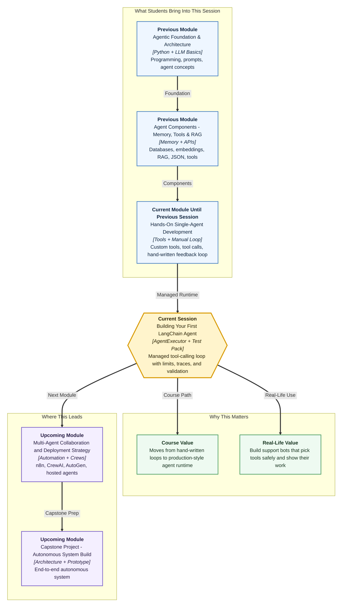

# Pre-read: Building Your First LangChain Agent

## Context of This Session in the Course

---

## When One Question Needs Three Different Desks

Picture a customer messaging an online shopping support team late at night.

The message says: *"For order ORD102, tell me the current status, when it will arrive, and whether I can get a refund."*

That is not one simple lookup. It touches **three different jobs**:

- **Order status** — where is the parcel right now?
- **Delivery estimate** — how many days remain?
- **Refund check** — is this order eligible for money back?

A human support agent would not guess all three answers from memory. They would open the order system, check policy rules, and maybe read the shipping tracker — one step at a time — before writing a clear reply.

In the previous session, you already built the beginner version of this behaviour: custom **tools**, structured **tool calls**, and a **manual feedback loop** where your own code decided when to run a tool, send the result back, and ask the model for a final answer. You also added a safety limit so the loop could not run forever, and you learned to treat tool failures as recoverable signals instead of crashes.

That manual loop is excellent for learning because you see every step. But real support bots, HR assistants, and finance helpers repeat the same pattern hundreds of times. They also need **retry limits**, **error recovery**, and **step-by-step traces** so a developer can debug what went wrong.

This session is about handing the repetitive orchestration to LangChain's **agent runtime** — while you stay in control through clear configuration.

## The Challenge: Who Runs the Loop?

Imagine you are the developer of that shopping support assistant.

You have three well-defined tools: one for status, one for refund logic, one for delivery timeline. The model knows how to request them. Your manual loop works for one query.

Then the product team asks for more:

- Show **which tool ran** and with **what input**, for every customer complaint.
- Stop the bot if it keeps retrying the wrong tool — no infinite loops on a Friday night.
- Handle messy model output without the whole app breaking.
- Prove the agent behaves correctly on **single-tool**, **multi-tool**, and **no-tool** questions before going live.

Writing all of that by hand every time is possible. But it spreads the same boilerplate across every project — logging here, retry counting there, parsing fixes somewhere else.

What if a built-in **operations manager** could run the standard tool-calling loop for you, with settings you control?

That operations manager is the idea behind **`AgentExecutor`** — a LangChain runtime that executes the agent, runs tools, applies safety controls, and returns transparent traces.

## From Manual Loop to Managed Agent

The control flow you practised manually still applies. Only the manager changes.

1. The user sends a question.
2. The language model reads it and decides whether a tool is needed.
3. If no tool is needed, the model answers directly — for example, when someone asks to book a flight but no flight tool exists.
4. If a tool is needed, the selected tool runs with the arguments the model provided.
5. The tool's output goes back to the model.
6. The model turns everything into a user-friendly final reply.

In the previous learning flow, **you** wrote the code for running tools and sending results back. In this session, **`create_tool_calling_agent`** builds the decision layer, and **`AgentExecutor`** runs the loop with settings you choose.

Think of it like upgrading from a shop where the owner personally runs every counter, to a shop with a **floor supervisor** who tracks which counter was visited, what answer came back, and when to stop trying.

## A Simple Analogy: The Call-Centre Supervisor

In a busy call centre, the customer speaks to one front agent. But behind the scenes, a **supervisor** watches the process:

- Which internal desk was contacted?
- What information was requested?
- What reply came back?
- Should we try again, or stop after two failed attempts?

Without that supervisor, small mistakes pile up. The front agent may retry the wrong desk endlessly. A formatting error may crash the whole call. Nobody can later explain why the customer received a wrong refund answer.

An **`AgentExecutor`** plays a similar role for your LangChain agent:

- It runs the tool-calling process safely.
- It respects a **maximum iteration limit** — the managed version of the `max_steps` safety cap you used before.
- It can **handle parsing errors** gracefully instead of failing silently.
- It can return **intermediate steps** — structured traces showing tool name, input, and output at each step.

You still design good tools with clear descriptions. The runtime handles the repetitive orchestration.

## What Makes a Tool-Calling Agent Trustworthy

Professional agents are judged on more than a polished final sentence. Teams ask: **did it take the right path?**

### Bounded retries

**Max iterations** sets an upper limit on how many action loops the agent can perform — typically a small number like three. This protects your app from runaway tool-calling when the model keeps picking the wrong action.

### Recoverable parsing issues

Sometimes model output does not parse cleanly. **`handle_parsing_errors`** lets the loop recover instead of crashing immediately — continuing the recoverable-error habit from the manual loop.

### Transparent traces

**Intermediate steps** are like a debug diary for one request: step number, tool selected, arguments passed, observation returned. Combined with verbose logging, they replace the print statements you used while diagnosing tool-selection faults.

### The agent scratchpad

Multi-step tool use needs short-term working memory inside one request — a notepad where reasoning and tool results for the **current run** are kept. Without that scratchpad, a multi-tool question like the ORD102 example would lose context halfway through.

## Three Query Types You Will Validate

Not every user message needs a tool. A strong agent must behave differently depending on the question class.

| Query type | Example shape | Expected behaviour |
|---|---|---|
| **Single-tool** | "What is the status of order ORD101?" | One tool runs — status lookup only |
| **Multi-tool** | "For ORD102, check status, delivery, and refund" | Several tools run across steps |
| **No-tool** | "Can you book a flight from Delhi to Mumbai?" | No tool runs; direct fallback reply |

The agent should not pretend it can book flights if you never gave it a flight tool. Tool boundaries protect system scope and user trust.

A **cohort test pack** is a small, fixed set of representative queries — like an exam paper for your agent — used to check behaviour again and again. For each case, you compare **expected tools** against **actual tools** from intermediate steps. That validates the decision path, not only the final wording.

This is the managed-agent version of the controlled query set you used earlier for diagnosis.

## What You Will Discover

In this pre-read, you'll discover:

- **Understand** why **`AgentExecutor`** is needed once tool-calling loops grow beyond a learning exercise.
- **Learn** how **`create_tool_calling_agent`** and a managed executor fit together in one e-commerce support workflow.
- **Discover** how **max iterations**, **parsing-error handling**, and **intermediate steps** make agents safer and easier to debug.
- **Understand** how a **cohort test pack** validates single-tool, multi-tool, and no-tool behaviour with pass/fail clarity.

## E-Commerce Support: The Demo Mindset

Throughout the session, you will work with a simple order-support scenario — fake order records with status, city, amount, and delivery days. Three focused tools mirror real business desks:

- **Get order status** — current state of one order ID
- **Calculate refund amount** — policy-aware refund messaging
- **Estimate delivery timeline** — ETA or "already delivered" responses

Each tool does **one clear job**, with descriptions precise enough for the model to route correctly — the same discipline you built when authoring `@tool` functions in the previous session.

The prompt also sets behaviour boundaries: be helpful, but use tools **only when required**. That single instruction reduces unnecessary tool calls on simple greetings or out-of-scope requests.

## Manual Loop vs Managed Executor

You now carry two mental models — and both remain valuable.

| Approach | Who manages the loop | Best when |
|---|---|---|
| **Manual tool-feedback loop** | Your Python code | You need deep custom control and learning visibility |
| **`AgentExecutor`** | LangChain runtime | The standard pattern is enough and you want safe defaults quickly |

Use the manual loop when teaching yourself or building unusual control flow. Use the executor when the pattern is familiar and you want production-style limits and traces without rewriting the same loop every time.

In **both** cases, clear tool descriptions, iteration limits, and observability stay non-negotiable.

## What You Will Be Able to Do After This

After the session, you will be able to:

- Build a **tool-calling agent** with **`create_tool_calling_agent`** and run it through **`AgentExecutor`**.
- Configure **max iterations** and **parsing-error handling** so loops stay bounded and recoverable.
- Read **intermediate steps** to see which tool ran, with what input, and what output returned.
- Validate behaviour across **single-tool**, **multi-tool**, and **no-tool** queries using the cohort test pack.
- Relate observed traces to expected control flow — and spot whether a failure is a tool-selection issue or a tool-implementation issue.

That is the shift from "I wired tools manually" to "I run a managed agent I can test like a professional."

## Interesting Questions for the Live Session

Keep these questions in mind:

- When a multi-tool query runs, how can intermediate steps show whether the agent visited **all three desks** — status, delivery, and refund — or stopped too early?
- What happens if you lower **max iterations** to one for a question that genuinely needs three tool calls?
- If the final answer sounds correct but the **wrong tool** appears in the trace, is that a pass or a fail — and why does that distinction matter before production?
- How should the agent respond when someone asks for a refund but forgets to mention an **order ID** — call a tool anyway, or ask a follow-up question?

By the end, building your first LangChain agent should feel less like trusting a black box and more like running a **supervised, testable support desk** — one where you can always see which internal counter was opened, and whether that matches what the customer actually needed.
