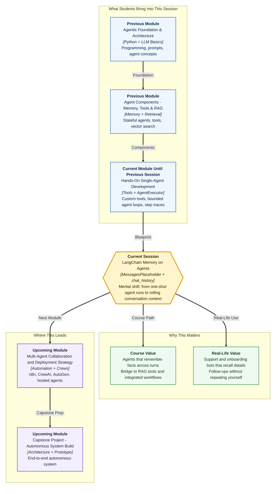

```mermaid
%%{init: {"flowchart": {"nodeSpacing": 70, "rankSpacing": 90, "diagramPadding": 24}} }%%
flowchart TB
  subgraph Foundation["What Students Bring Into This Session"]
    M1["<b>Previous Module</b><br/>Agentic Foundation & Architecture<br/><i>[Python + LLM Basics]</i><br/>Programming, prompts, agent concepts"]
    M2["<b>Previous Module</b><br/>Agent Components - Memory, Tools & RAG<br/><i>[Memory + Retrieval]</i><br/>Stateful agents, tools, vector search"]
    CM["<b>Current Module Until Previous Session</b><br/>Hands-On Single-Agent Development<br/><i>[Tools + AgentExecutor]</i><br/>Custom tools, bounded agent loops, step traces"]
  end

  CS{{"<b>Current Session</b><br/>LangChain Memory on Agents<br/><i>[MessagesPlaceholder + chat_history]</i><br/>Mental shift: from one-shot agent runs to rolling conversation context"}}

  subgraph Value["Why This Matters"]
    CV["<b>Course Value</b><br/>Agents that remember facts across turns<br/>Bridge to RAG tools and integrated workflows"]
    RV["<b>Real-Life Value</b><br/>Support and onboarding bots that recall details<br/>Follow-ups without repeating yourself"]
  end

  subgraph Future["Where This Leads"]
    F4["<b>Upcoming Module</b><br/>Multi-Agent Collaboration and Deployment Strategy<br/><i>[Automation + Crews]</i><br/>n8n, CrewAI, AutoGen, hosted agents"]
    F5["<b>Upcoming Module</b><br/>Capstone Project - Autonomous System Build<br/><i>[Architecture + Prototype]</i><br/>End-to-end autonomous system"]
  end

  M1 ==>|&nbsp;Foundation&nbsp;| M2
  M2 ==>|&nbsp;Components&nbsp;| CM
  CM ==>|&nbsp;Blueprint&nbsp;| CS
  CS ==>|&nbsp;Course Path&nbsp;| CV
  CS ==>|&nbsp;Real-Life Use&nbsp;| RV
  CS ==>|&nbsp;Next Module&nbsp;| F4
  F4 ==>|&nbsp;Capstone Prep&nbsp;| F5

  classDef previous fill:#eef6ff,stroke:#4b83c3,stroke-width:2px,color:#0f2540;
  classDef current fill:#fff4cc,stroke:#d99a00,stroke-width:3px,color:#2d2100;
  classDef value fill:#eefaf1,stroke:#4c9f63,stroke-width:2px,color:#16351f;
  classDef future fill:#f4efff,stroke:#7b61c8,stroke-width:2px,color:#261c45;

  class M1,M2,CM previous;
  class CS current;
  class CV,RV value;
  class F4,F5 future;
  linkStyle default stroke-width:3px;
```
