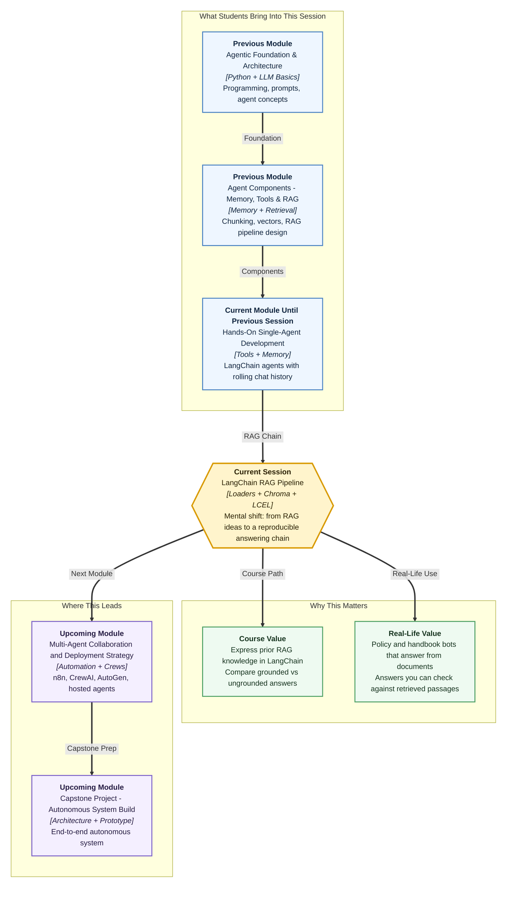

# Pre-read: LangChain RAG Pipeline

## Context of This Session in the Course

---

A new joiner in HR asks the company assistant: *"How many casual leaves can I take in my first six months?"*

The assistant should not invent a number from general internet knowledge. It should open the leave policy, find the relevant passage, and answer from that passage. If a manager later asks, *"Where did that come from?"* the team should be able to point to the retrieved lines — not shrug and say, *"The model sounded confident."*

In the previous module, you already learnt the **RAG** idea: retrieve useful document pieces first, then generate. You also practised corpus design — how documents are loaded, chunked, and stored for search. In this module, you have been building **LangChain** skills: chains, tools, agents, and rolling memory.

This session connects those worlds. The question is no longer only *"Do I understand RAG?"* It becomes: **Can I express that RAG knowledge as a LangChain pipeline that retrieves, answers, and lets me judge grounding quality?**

---

## When Memory Alone Cannot Save the Answer

In the previous session, you attached **conversation history** so an agent could remember facts across turns. That solves forgetfulness inside a chat.

It does not solve a different failure: answering company-specific questions without company documents.

Imagine this exchange:

- User: *"What is the notice period for probation employees?"*
- Bot with memory but no retrieval: gives a fluent general answer that may be wrong for this company
- Bot with RAG: finds the probation section, then answers from that section

Memory keeps the conversation coherent. **Retrieval** keeps the answer tied to your knowledge base. You need both skills in a serious assistant — and this session focuses on wiring the retrieval side inside LangChain.

The challenge sounds simple and is easy to underestimate: **What if you had to ingest a document corpus, store it so search works the same way every run, build a chain that answers only after retrieving passages, and then compare those answers against the same questions asked without retrieval?**

That comparison is how you *see* grounding, not just hope for it.

---

## The Pipeline Pieces You Will Connect

Think of the LangChain RAG pipeline as four connected stations.

### 1. Loaders and chunking

**Loaders** bring documents into the pipeline from files or folders. **Chunking** splits long text into searchable pieces, aligned with the corpus design habits you built earlier in the course.

In simple Indian English: first you bring the policy books into the system, then you cut them into labelled pages the search engine can handle.

### 2. Chroma through LangChain

Those chunks are turned into embeddings and stored in **Chroma**, a vector store. Doing this through LangChain helps keep the path **reproducible** — run again tomorrow, and retrieval still works against the same persisted collection instead of a one-time demo that disappears.

### 3. Retriever

A **retriever** is the component that, for a user question, returns the most relevant passages. In simple words: it is the librarian who brings the best matching pages to the desk before anyone writes the answer.

### 4. LCEL RAG chain

**LCEL** means LangChain Expression Language — a clean way to connect steps into one runnable chain. An **LCEL RAG chain** conditions generation on retrieved passages. The model does not answer from a blank mind. It answers with the retrieved context in front of it.

Together, these pieces turn prior RAG knowledge into a practical LangChain answering pipeline.

---

## Grounding Comparison: The Habit That Makes RAG Real

Building the chain is only half the lesson. The other half is **critique**.

You will contrast outputs **with retrieval** versus **without retrieval** on the same representative queries, using clear comparison criteria from the instructor.

That contrast usually makes the value obvious:

| Situation | What you often see |
|---|---|
| Without retrieval | Fluent answer, weak link to company documents |
| With retrieval | Answer shaped by retrieved passages, easier to check |
| Weak retrieval | Right-sounding reply from the wrong page — still a failure |
| Strong retrieval + grounded generation | Claims you can map back to passages |

**Grounding** means the answer depends on the retrieved context. In simple words: the model is writing an open-book answer, not a memory-test guess.

Learning to critique grounding quality prepares you for later evaluation work — and for the next step of combining RAG with tools inside one agent.

---

## Think of It Like a Court Clerk Preparing a Brief

A useful analogy is a court clerk preparing notes for a judge.

The case file is your **document corpus**. The clerk uses a filing system — your **loaders, chunking, and Chroma store** — so papers can be found again tomorrow, not only today. When a question arrives, the clerk pulls the relevant pages — the **retriever**. The judge then writes an opinion based on those pages — the **RAG chain**.

If the judge writes without the clerk’s pages, the opinion may still sound elegant. It may also be legally wrong for *this* case file. That is generation without retrieval.

If the clerk brings the wrong pages, the judge can still err. That is why grounding critique matters: you check whether the final text is actually supported by what was retrieved.

LangChain, in this session, is the organised clerk’s desk: same filing habits, same retrieval path, same answering chain — reusable and inspectable.

---

## Why This Matters for Your Career and the Course

Companies do not pay only for agents that chat smoothly. They pay for assistants that answer from **their** handbooks, policies, and product docs — and that can be checked when something looks wrong.

You already know RAG conceptually from earlier work. This session is the bridge into **framework fluency**: loaders, Chroma, retriever, LCEL chain, and a deliberate with/without retrieval comparison. That pipeline becomes a building block for integrated agents next, and later for multi-agent and deployment work where retrieval quality still decides trust.

Professionally, the winning habit is simple: do not celebrate a fluent answer until you have asked what evidence it stood on.

---

## In this pre-read, you'll discover:

- **Understand** how LangChain loaders and chunking turn a document corpus into retrieval-ready pieces.
- **Discover** why persisting vectors in Chroma makes retrieval reproducible across runs.
- **Learn** how an LCEL RAG chain conditions generation on retrieved passages.
- **Understand** how comparing answers with versus without retrieval reveals grounding quality.

## What You Will Be Able to Talk About After This Session

After this session, you should be able to explain a LangChain RAG pipeline in plain language: documents are loaded and segmented, vectors are stored, a retriever fetches passages, and a chain answers using that context.

You will also be able to discuss grounding more sharply. Instead of saying *"the RAG bot is better,"* you will point to concrete differences between retrieved and non-retrieved answers on the same questions.

Most importantly, you will start treating RAG as an evaluable pipeline — not a magic setting — and that mindset carries directly into richer agent workflows.

## Interesting Questions for the Live Session

- If two runs of the same question return different supporting passages, what would you check first in loaders, chunking, or the Chroma setup?
- In an LCEL RAG chain, what should happen when retrieval returns weak or empty passages — and how would that appear in the final answer?
- For a representative policy question, what differences do you expect between answers **with retrieval** and **without retrieval**, using the instructor’s comparison criteria?
- How would you explain to a non-technical manager that a fluent answer can still be poorly grounded?

By the end, LangChain RAG should feel less like a new buzzword stack and more like a disciplined desk process: file the corpus, retrieve the right pages, answer from those pages, and judge the result by evidence — not by style alone.
