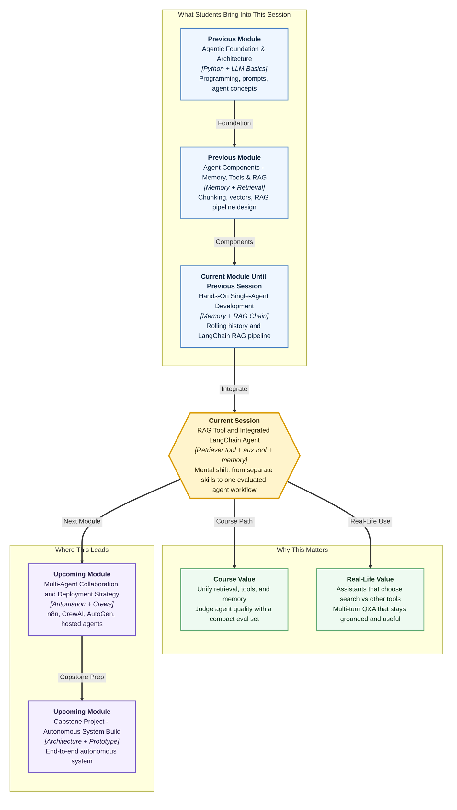

# Pre-read: RAG Tool and Integrated LangChain Agent

## Context of This Session in the Course

---

An HR helpdesk assistant faces three very different requests in one afternoon:

1. *"What is the probation notice period according to our handbook?"*
2. *"Convert 12 June to a weekday name for my leave form."*
3. Follow-up: *"And does that notice period change after confirmation — using what we already discussed?"*

Request 1 needs **document retrieval**. Request 2 needs a **different tool**, not a policy search. Request 3 needs **memory** of the earlier turn plus retrieval again.

If your system only has a RAG chain, it will try to search documents for everything. If it only has memory, it may chat smoothly but invent policy. If it only has separate demos, nobody can trust the full workflow.

This session is about putting those pieces into **one LangChain agent**: a retriever-backed tool, at least one auxiliary tool, conversational memory, and a compact way to evaluate whether the agent chooses and behaves correctly.

---

## The Challenge: Many Skills, One Workflow

So far in this module you have practised important parts in stages:

- Tools and a bounded agent loop
- Rolling conversational memory
- A LangChain **RAG pipeline** that retrieves passages and generates grounded answers

Those skills are valuable alone. Real products ask for something harder: **What if one agent had to decide when to search documents, when to use another tool, how to remember earlier user facts, and still pass a small evaluation set covering in-domain, out-of-domain, and tool-first questions?**

That is the integration challenge.

Without careful design, common failures appear quickly:

- The agent searches the handbook for a calculator-style question (**wrong tool**)
- It picks retrieval but brings weak passages (**weak retrieval**)
- It refuses even when the documents clearly support an answer (**over-refusal**)
- It answers fluently while ignoring both tools and evidence

This session trains you to notice those **failure signatures** early enough to prioritise fixes.

---

## Retriever Tool + Second Tool: Why Arbitration Matters

A **retriever-backed tool** wraps document search as something the agent can call — often created in LangChain through patterns like `create_retriever_tool`. In simple Indian English: the agent gets a labelled "search the knowledge base" button, not only a hidden pipeline behind the scenes.

You will also attach a **second tool** — an auxiliary capability that is not retrieval. That second tool forces a real decision. The agent must **arbitrate**: which tool fits this user goal?

Good tool contracts make arbitration easier. A clear description tells the model:

- when to use the retriever tool
- when to use the other tool
- what inputs each tool expects
- what kind of result comes back

If both tools sound vague, the agent guesses. If contracts are sharp, tool choice becomes much more reliable.

---

## Multi-Turn Document Q&A with Memory

Integration is not only "two tools in one agent."

Users ask follow-ups. *"What about after confirmation?"* only makes sense if the agent still holds the earlier probation discussion **and** can retrieve the right passage again.

So this session demonstrates **multi-turn document Q&A** that combines:

- **Conversational memory** — continuity across turns
- **Retrieval-backed answers** — evidence from the corpus when the question is document-grounded

Memory without retrieval forgets the handbook. Retrieval without memory forgets the user. Together, they support assistants people can actually talk to.

---

## A Compact Eval Pack Before You Celebrate

Building the integrated agent is exciting. Judging it is what makes it professional.

You will appraise behaviour against a **compact evaluation set** spanning three scenario types:

| Scenario type | What it checks |
|---|---|
| **In-domain** | Questions the documents should support |
| **Out-of-domain** | Questions outside the corpus — where refusal or honest limits matter |
| **Tool-first** | Questions that should prefer the auxiliary tool, not retrieval |

This is **bounded evaluation** — small enough to run in class, serious enough to expose wrong-tool, weak-retrieval, and over-refusal patterns.

You do not need a giant enterprise test lab yet. You do need the habit: define expected behaviour, run the cases, read the failure signatures, and decide what to fix first.

---

## Think of It Like a Smart Hospital Front Desk

A helpful analogy is a hospital front desk with three resources:

1. A **policy binder** for official rules — your retriever tool
2. A **utility desk** for simple non-policy jobs — your second tool
3. A **visitor card** that remembers the conversation so far — your memory

A good receptionist does not open the binder for "what time is it." They do not invent discharge rules from memory when the binder exists. They also do not ask the visitor to repeat their name every thirty seconds.

When something goes wrong, a supervisor looks for patterns:

- Opened the wrong resource → **wrong tool**
- Opened the binder but pulled the wrong page → **weak retrieval**
- Refused to help even though the binder had a clear answer → **over-refusal**

Your integrated LangChain agent is that front desk. This session is where you staff it, give it clear job cards for each tool, keep the visitor card updated, and run a short checklist before calling the desk "ready."

---

## Why This Matters for Your Career and the Course

Employers rarely ask whether you can demo retrieval once and tools once. They ask whether you can ship an assistant that **chooses correctly under mixed questions** and can be tested in a disciplined way.

This session is a turning point in the module: separate LangChain skills become one workflow. It also prepares you for deeper evaluation and debugging next — where logging, scoring, and remediation become more formal.

In simple terms, you move from "I built the parts" to "I can judge the whole agent."

---

## In this pre-read, you'll discover:

- **Understand** why a retriever tool needs a clear contract so it can work beside non-retrieval tools.
- **Discover** how multi-turn document Q&A depends on both conversational memory and retrieval-backed answers.
- **Learn** what a compact eval pack checks across in-domain, out-of-domain, and tool-first scenarios.
- **Understand** how failure signatures like wrong tool, weak retrieval, and over-refusal help you prioritise fixes.

## What You Will Be Able to Talk About After This Session

After this session, you should be able to explain an integrated LangChain agent in plain language: it remembers the chat, can search documents through a retriever tool, can use another tool when search is the wrong move, and can be checked with a small evaluation set.

You will also be able to discuss failures more usefully. Instead of saying *"the agent is bad,"* you will classify whether the issue was tool choice, retrieval quality, or refusal behaviour — and that classification decides the next fix.

Most importantly, you will start treating agent building as an integration and evaluation craft, not a pile of disconnected demos.

## Interesting Questions for the Live Session

- If a user asks a date-format question and a policy question in the same chat, how should tool contracts guide the agent toward the right tool each time?
- In a multi-turn handbook conversation, what breaks first if memory is missing — and what breaks first if retrieval is missing?
- For your compact eval pack, what is one good example each of an in-domain, out-of-domain, and tool-first case?
- When you see wrong-tool, weak-retrieval, and over-refusal failures, which one would you prioritise fixing first for a helpdesk demo — and why?

By the end, the "RAG tool + integrated agent" idea should feel practical: one workflow that can search, act, remember, and be judged — with clear failure signatures instead of vague disappointment.
